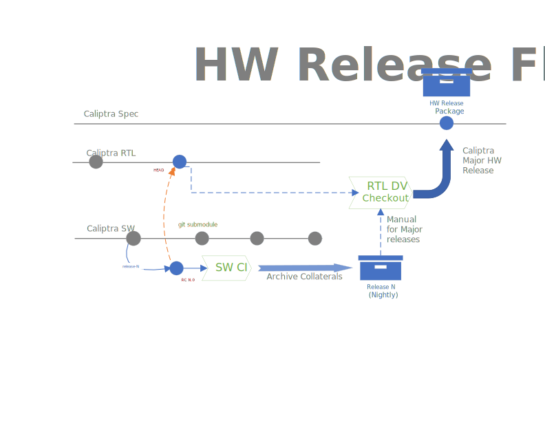

# HW Release process

## Nightly

1. When a new release is triggered, the **RTL Submodule Pointer Update** flow is called
2. The **nightly-verilator** smoke test regression test will be executed against the HEAD of the **main** branch
    -  If the the test passes a **release collateral** archive will be generated and pushed as a Github Artifact
    -  Repo tag will be added as well in the form "release_v#yyyy#mm#dd_#n"

## RTL Submodule Pointer Update

1. The RTL submodule pointer is compared against the of **main** of the **caliptra RTL** repo
    - In case they both point to the same **SHA commit** the rest of the flow is skipped 
2. A new commit will update the RTL submodule pointer to point to the HEAD of the main branch, and update the registers RDL
3. A new **nightly release** branch will be created from the HEAD of the **main** branch in the **caliptra-sw** repo
   - Naming of the branch will indicate it is a nightly release and will have a target point release date (ci_rtl_#yyyy#mm#dd_#n)
4. The branch will be triggered as a PR, therefore all the CI tests required to submit a PR will be executed
5. Upon succesfully completion of the CI tests, the branch will be merged and deleted

## Major Releases

1. The **release collateral** will be manually handed over the RTL team to be verified in the DV environment
2. Upon success of the DV verification a new release will be made on the **caliptra** repo
    -  A ZIP file containing the release collateral will be included as part of the release.
4. The **caliptra-rtl** and **caliptra-sw** repos will be tagged with a **release** version tag.

## Fail Case

1. Failure in caliptra-sw repo
    1. Manual intervention required. Create a new issue into the SW Repo. The fix will be made on the **main** branch.
    2. The next **nightly release** workflow will generate the release
2. Failure in RTL Repo
    1. Manual intervention required. Create a new issue into the RTL Repo. Nightly releases are gated to become major until a fix is merged to main.
    2. While HW fix requires longer time to be submitted, it is acceptable to temporarly diverging from the main branch.
        - A dev branch will be created from the tip of the RTL main branch, and WA fixes will be applied as individual commits
        - The RTL Sumbodule pointer in the **caliptra sw** repo will maunally be updated to point to the dev branch.
        - The nightly release workflow will generate all individual patches as part of the collateral archive and list them in the release notes.
    4. Once the issue is fixed, the RTL dev branch will be deleted and the RTL submodule pointer will be repositioned to the HEAD of the RTL main branch.

## Release Collateral

- Release ZIP File
  - RTL SRC
  - ROM binary files (BIN ,ELF, and HEX)
  - Additional Documentation
  - All specs?
  - Register Documentation (External)
  - Header files with:
    - Register definitions.
    - Reference code for mailbox, etc.
  - Release notes TXT file
  - Which tests were run and which ones passed/failed?
  - All relevant Git commit hashes from both repos
- Separate Supporting ZIP File (due to size concerns)
  - FPGA Bitstream file
  - C HW model
    - Headers and static library
  - Firmware signed (development key) binary files (BIN, ELF)
  - Integrator Test Checklist
    - Fuse Matrix
    - Test List
    - Development Key

## Release Rules/Opens

- All releases will come from the main branch with nightly cadence.
- Once a release is made the **nightly release branch** SHALL be deleted.

  *Caliptra Release Flow*

