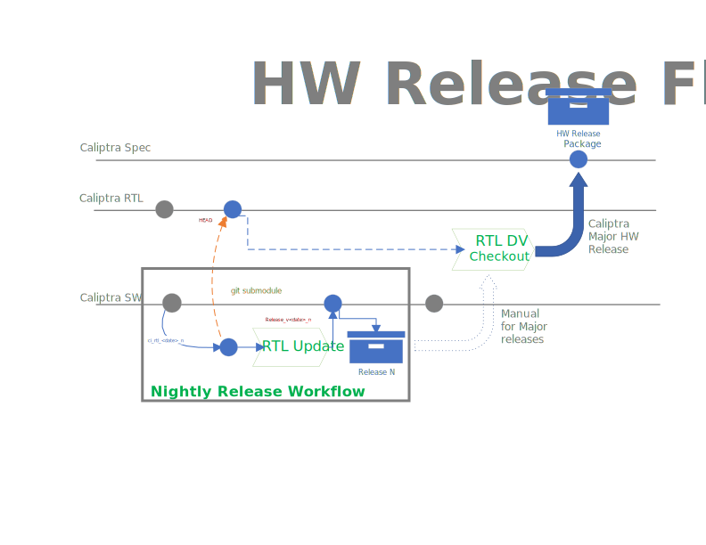

# HW Release process

## Nightly

1. When a new release is triggered a new **nightly release** branch will be created from the HEAD of the **main** branch in the **caliptra-sw** repo.
    - Naming of the branch will indicate it is a nightly release and will have a target point release version (ex. release_"date")
2. A new commit will update the RTL submodule pointer to point to the new RTL release candidate branch creates in Step #1, and update the registers RDL
3. If all the caliptra-sw repo CI tests pass:
    1. A **release collateral** archive will be generated and pushed as a Github Artifact
    2. If the RTL submodule pointer has been updated (and no other changes were required to be cherry-picked), **nightly release * will turn into a PR into main

## Major Releases

1. The **release collateral** will be manually used for a RTL DV Checkout
2. If the RTL Regression passes a new release will be made on the **caliptra** repo and a ZIP file containing the release collateral will be included as part of the release.
3. The **caliptra-rtl** and **caliptra-sw** repos will be tagged with a **release** version tag.

## Fail Case

1. Failure in caliptra-sw repo
    1. Manual intervention required. Create a new issue into the SW Repo. The fix will be made on the **main** branch.
    2. The next **nightly release** workflow will generate the release
2. Failure in RTL Repo
    1. Manual intervention required. Create a new issue into the RTL Repo. Nightly releases are gated until fix.
    2. Once the issue is fixed, the next **nightly release** workflow will generate the release.

## Release Collateral

- Release ZIP File
  - RTL SRC
  - ROM binary files (BIN ,ELF, and HEX)
  - Additional Documentation
  - All specs?
  - Register Documentation (External)
  - Header files with:
    - Register definitions.
    - Reference code for mailbox, etc.
  - Release notes TXT file
  - Which tests were run and which ones passed/failed?
  - All relevant Git commit hashes from both repos
- Separate Supporting ZIP File (due to size concerns)
  - FPGA Bitstream file
  - C HW model
    - Headers and static library
  - Firmware signed (development key) binary files (BIN, ELF)
  - Integrator Test Checklist
    - Fuse Matrix
    - Test List
    - Development Key

## Release Rules/Opens

- All releases will come from the main branch with nightly cadence.
- Once a release is made the **nightly release branch** SHALL be deleted.

  *Caliptra Release Flow*

