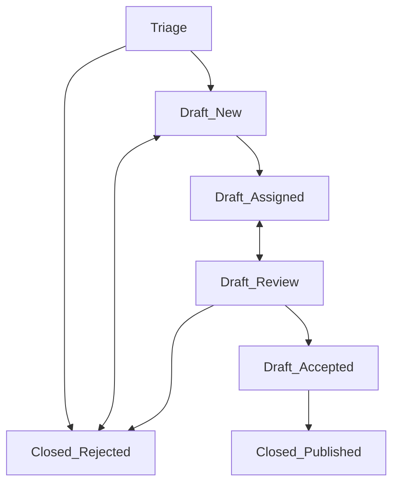

# Caliptra Project Security Incident Response

## Security communication

Security information about each release is included in the release notes of each of the
[Caliptra releases](https://github.com/chipsalliance/Caliptra/releases) on GitHub.

A summary of the known security vulnerabilities for Caliptra ingredient repositories are listed at the links below:

| Repository         | Advisory Page                                                                                                                            |
| ------------------ | ---------------------------------------------------------------------------------------------------------------------------------------- |
| Primary repository | [https://github.com/chipsalliance/Caliptra/security/advisories](https://github.com/chipsalliance/Caliptra/security/advisories)           |
| Caliptra RTL       | [https://github.com/chipsalliance/caliptra-rtl/security/advisories](https://github.com/chipsalliance/caliptra-rtl/security/advisories)   |
| Caliptra software  | [https://github.com/chipsalliance/caliptra-sw/security/advisories](https://github.com/chipsalliance/caliptra-sw/security/advisories)     |
| Caliptra DPE       | [https://github.com/chipsalliance/caliptra-dpe/security/advisories](https://github.com/chipsalliance/caliptra-dpe/security/advisories)   |
| Caliptra U-Reg     | [https://github.com/chipsalliance/caliptra-ureg/security/advisories](https://github.com/chipsalliance/caliptra-ureg/security/advisories) |

Vulnerability notifications pre-release or during embargo periods are available to product creators that have registered through the
[Product creator notification process](#product-creator-notification-process).

## Report a vulnerability

We’re extremely grateful for our silicon integrators, contributors and security researchers that report vulnerabilities to the Caliptra Project
and raise its assurance bar.

If you believe you have found a security vulnerability in any Caliptra repository, please report it to us through coordinated disclosure.

Please do not report security vulnerabilities through public GitHub issues, discussions, or pull requests.

All reports are thoroughly investigated by the Caliptra Technical Committee (TC) members who form the Caliptra Project Security Incident Response Team (Caliptra
PSIRT) and may get assigned a Common Vulnerabilities and Exposures number (CVE) if appropriate.

The Caliptra project is a listed [CVE Numbering Authority (CNA) with MITRE](https://cve.mitre.org/cve/request_id.html). **TODO: fix link after CNA onboarding**

Vulnerabities can be reported by the following two approaches:

1. Using ["Report a Vulnerability"](https://docs.github.com/en/code-security/security-advisories/guidance-on-reporting-and-writing-information-about-vulnerabilities/privately-reporting-a-security-vulnerability#privately-reporting-a-security-vulnerabilityfeature) capability in GitHub for each repository directly OR
2. Using email: [Vulnerabilities.caliptra-wg@lists.chipsalliance.org](mailto:Vulnerabilities.caliptra-wg@lists.chipsalliance.org).

| Repository         | Report Vulnerability                                                                      | Description                                                                         |
| ------------------ | ----------------------------------------------------------------------------------------- | ----------------------------------------------------------------------------------- |
| Primary repository | [Security advisories](https://github.com/chipsalliance/caliptra/security/advisories)      | Report general Caliptra vulnerabilities, or vulnerabilities where source is unknown |
| Caliptra RTL       | [Security advisories](https://github.com/chipsalliance/caliptra-rtl/security/advisories)  | Report vulnerabilities in Caliptra's RTL                                            |
| Caliptra software  | [Security advisories](https://github.com/chipsalliance/caliptra-sw/security/advisories)   | Report vulnerabilities in Caliptra's ROM, FMC, runtime firmware                     |
| Caliptra DPE       | [Security advisories](https://github.com/chipsalliance/caliptra-dpe/security/advisories)  | Report vulnerabilities in Caliptra's TCG DICE Protection Environment profile        |
| Caliptra U-Reg     | [Security advisories](https://github.com/chipsalliance/caliptra-ureg/security/advisories) | Report vulnerabilities in Caliptra's general-purpose libraries and tools            |

More details of how vulnerabilities are handled can be found in the section
[Security vulnerability response](#security-vulnerability-response).

### When should I report a vulnerability?

- You think you discovered a potential security vulnerability in Caliptra.
- You are unsure how a vulnerability affects Caliptra.
- You think you discovered a vulnerability in another project that Caliptra depends upon.
  - For projects with their own vulnerability reporting and disclosure process, please report it directly there.

### When should I *NOT* report a vulnerability?

- You need help tuning Caliptra components for security.
  - Instead, file an Issue labeled as "feature request".
- You need help with a previously announced Caliptra Security Advisory.
  - Instead, file an Issue labeled as "question"".
- Your issue is not security related. Instead, file an issue as appropriate.

Issues can be filed at the following locations:

- [Caliptra General Issues](https://github.com/chipsalliance/Caliptra/issues)
- [Caliptra RTL Issues](https://github.com/chipsalliance/caliptra-rtl/issues)
- [Caliptra ROM or FW Issues](https://github.com/chipsalliance/caliptra-sw/issues)
- [Caliptra DPE Issues](https://github.com/chipsalliance/caliptra-dpe/issues)
- [Caliptra U-Reg Issues](https://github.com/chipsalliance/caliptra-ureg/issues)

## Security vulnerability response

Each report is acknowledged and analyzed by Caliptra Project Security Incident Response Team members within 7 working days. This will trigger the
[Security incident management process](#security-incident-management-process) outlined below.

Any vulnerability information shared with the Caliptra Technical Committee stays within the Caliptra project and will not be disseminated to other projects
unless it is necessary to get the issue fixed.

As the security issue moves from triage, to identified fix, to release planning, we will keep the reporter updated.

## Embargo policy

The information members receive during embargo periods may be received from the Caliptra Vulnerability Alerts mailing list:
[Vulnerability-Alerts.caliptra-wg@lists.chipsalliance.org](mailto:Vulnerability-Alerts.caliptra-wg@lists.chipsalliance.org). To sign up, visit
[lists.chipsalliance.org/g/Vulnerability-Alerts.caliptra-wg](https://lists.chipsalliance.org/g/Vulnerability-Alerts.caliptra-wg). Any
information regarding embargoed vulnerabilities must not be made public, shared, nor even hinted at anywhere beyond the need-to-know within your specific team
except with the list’s explicit approval. This holds true until the public disclosure date/time that was agreed upon by the list. Members of the list and others
may not use the information for anything other than getting the issue fixed for your respective product’s users.

Before any embargoed information from the list is shared with respective members of your team required to fix said issue, they must agree to the same terms and
only find out information on a need-to-know basis.

In the unfortunate event that a member shares the information beyond what is allowed by this policy, that member ***must*** urgently inform the Caliptra
workgroup at the [Vulnerabilities.caliptra-wg@lists.chipsalliance.org](mailto:Vulnerabilities.caliptra-wg@lists.chipsalliance.org) mailing list of
exactly what information leaked and to whom. A retrospective will take place after the leak so we can assess how to not make the same mistake in the future.

If the member continues to leak information and break this policy, the member will be removed from the list.

More details of how vulnerabilities are handled can be found in our [Security incident management process](#security-incident-management-process)
section.

## Product creator notification process

Product creators who are not already members of the Caliptra project may be eligible to participate in the
[Vulnerability-Alerts.caliptra-wg@lists.chipsalliance.org](mailto:Vulnerability-Alerts.caliptra-wg@lists.chipsalliance.org) mail list and receive
advanced notification of the vulnerabilities and mitigations before public disclosure by applying to participate. For more information, refer to the
[Vulnerability notification process](#vulnerability-notification-process) section of this document.

Criteria for participation includes:

1. Register as a [Product creator](https://github.com/chipsalliance/Caliptra/blob/main/README.md#product-creator-registration).
1. Have a contact who will respond to emails within a week and understands how Caliptra is being used in the product.
1. Have a publicly listed product based on some release of Caliptra.
1. Have an actively monitored security email alias.
1. Accept the Caliptra Embargo Policy that is outlined above.

Removal:

1. If a member stops adhering to these criteria after joining the list, then the member will be unsubscribed.

## Security incident management process

Issues within this bug tracking system will transition through a number of states according to this diagram:

- **Triage:** This state represents new reports that have been entered directly by a reporter. The security team will triage these reports and move them to
either *Draft_New* or *Closed_Rejected*. When reports are entered by the security team in response to an email, the issue shall be transitioned directly to
*Draft_New*.

- **Draft_New:** This issue is awaiting disposition by the security team. The security team will analyze the issue, determine a responsible entity, assign
it to that individual, and move the issue to the *Draft_Assigned* state. Part of triage will be to set the issue’s priority.

- **Draft_Assigned:** The issue has been assigned, and is awaiting a fix by the assignee.

- **Draft_Review:** Once there is a Caliptra pull request for the issue, the PR link will be added to a comment in the issue, and the issue moved to the
*Draft_Review* state.

- **Draft_Accepted:** Indicates that this issue has been merged into the appropriate branch within Caliptra.

- **Closed_Published:** The embargo period has ended. The issue will be made publicly visible, the associated CVE updated, and the vulnerabilities page in the
docs updated to include the detailed information.

- **Closed_Rejected:** The Caliptra PSIRT has rejected the reported security vulnerability. It may have been deemed a non-issue, or it may have been converted
to a standard Github Issue report. The PSIRT may also re-open the issue from here.

The security advisories created are kept private, due to the sensitive nature of security reports. The issues are only visible to certain parties:

- Members of the PSIRT mailing list
- The reporter
- Others, as proposed and ratified by the Caliptra PSIRT. In the general case, this will include:
  - The code owner responsible for the fix.
  - The Caliptra release owners for the relevant releases affected by this vulnerability.

The Caliptra TC shall review the reported vulnerabilities during any meeting with more than three people in attendance. During this review, they
shall determine if new issues need to be embargoed.

The guideline for embargo will be based on:

1. Severity of the issue, and
2. Exploitability of the issue.

Issues that the Caliptra TC decides do not need an embargo will be reproduced in the regular Caliptra project bug tracking system.

Security sensitive vulnerabilities shall be made public after an embargo period of at most 90 days. The intent is to allow 30 days within the
Caliptra project to fix the issues, and 60 days for product creators building products using Caliptra to be able to apply and distribute these
fixes.

Fixes to the code shall be made through pull requests (PRs) in the Caliptra project GitHub. Developers shall make an attempt to not reveal the
sensitive nature of what is being fixed, and shall not refer to CVE numbers that have been assigned to the issue. The developer instead should
merely describe what has been fixed.

The Caliptra TC shall maintain information that maps embargoed CVEs to these PRs (this information is within the Github security advisories), and
produce regular reports of the state of security issues.

Each issue that is considered a security vulnerability shall be assigned a CVE number. As fixes are created, it may be necessary to allocate
additional CVE numbers, or to retire numbers that were assigned.

## Vulnerability notification process

Each Caliptra release shall contain a report of CVEs that were fixed in that release. Because of the sensitive nature of these vulnerabilities,
the release shall merely include a list of CVEs that have been fixed. After the embargo period, the vulnerabilities page shall be updated to include
additional details of these vulnerabilities. The vulnerability page shall give credit to the reporter(s) unless a reporter specifically requests
anonymity.

The Caliptra project shall maintain a vulnerability-alerts mailing list. This list will be seeded initially with a contact from each project member.

Additional parties can request to join this list by visiting
[lists.chipsalliance.org/g/Vulnerability-Alerts.caliptra-wg](https://lists.chipsalliance.org/g/Vulnerability-Alerts.caliptra-wg). These parties will be vetted by the Caliptra PSIRT to
determine that they have a legitimate interest in knowing about security vulnerabilities during the embargo period.

Periodically, the Caliptra PSIRT will send information to this mailing list describing known embargoed issues and their backport status within the
project. This information is intended to allow them to determine if they need to backport these changes to any internal trees.

When issues have been triaged, this list will be informed of:

- The Caliptra Project security advisory link (GitHub).
- The CVE number assigned.
- The subsystem involved.
- The severity of the issue.

After acceptance of a PR fixing the issue (merged), in addition to the above, the list will be informed of:

- The association between the CVE number and the PR fixing it.
- Backport plans within the Caliptra project.

## Backporting of security vulnerabilities

Each security issue fixed within Caliptra Firmware shall be backported to the following releases:

- The current Long Term Stable (LTS) release.
- The most recent two releases.

Backports will be tracked on the security advisory.

## Need to know

Due to the sensitive nature of security vulnerabilities, it is important to share details and fixes only with those parties that have a need to
know. The following parties will need to know details about security vulnerabilities before the embargo period ends:

- Maintainers will have access to all information within their domain area only.
- The current release manager, and the release manager for historical releases affected by the vulnerability (see backporting above).
- The Project Security Incident Response Team will have full access to information.
- The PSIRT is made up of representatives from Caliptra integrators and contributors.
- As needed, release managers and maintainers may be invited to attend additional security meetings to discuss vulnerabilities.
