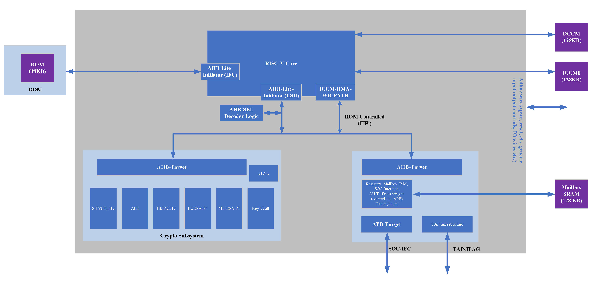
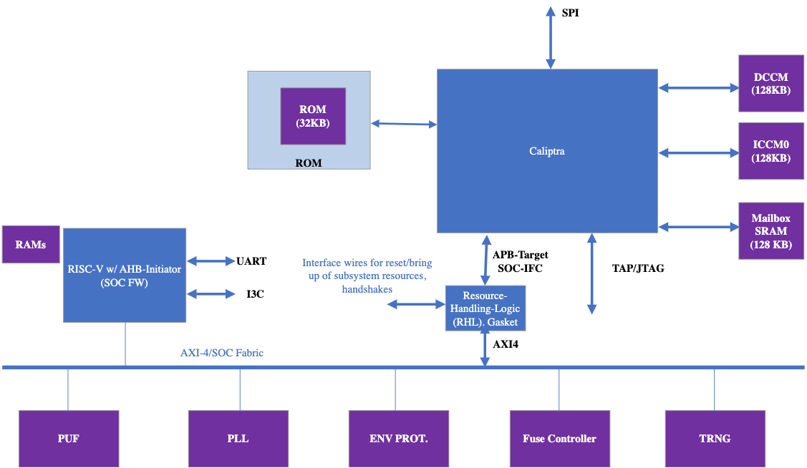
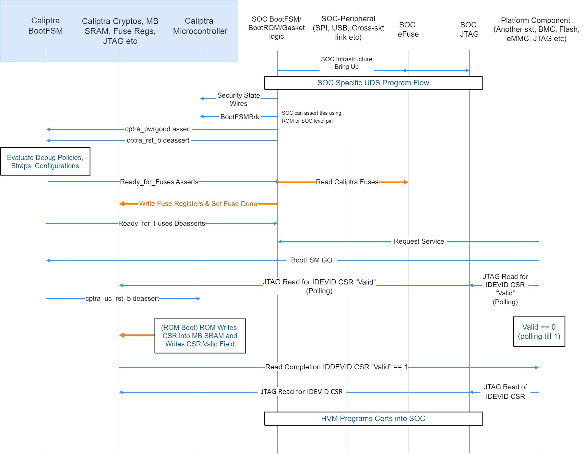
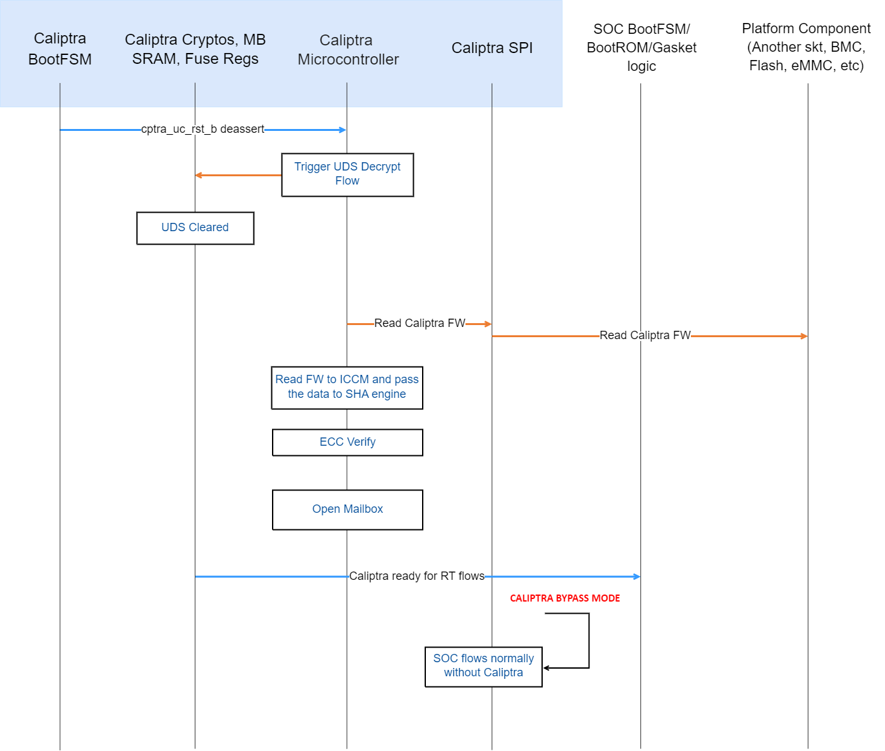
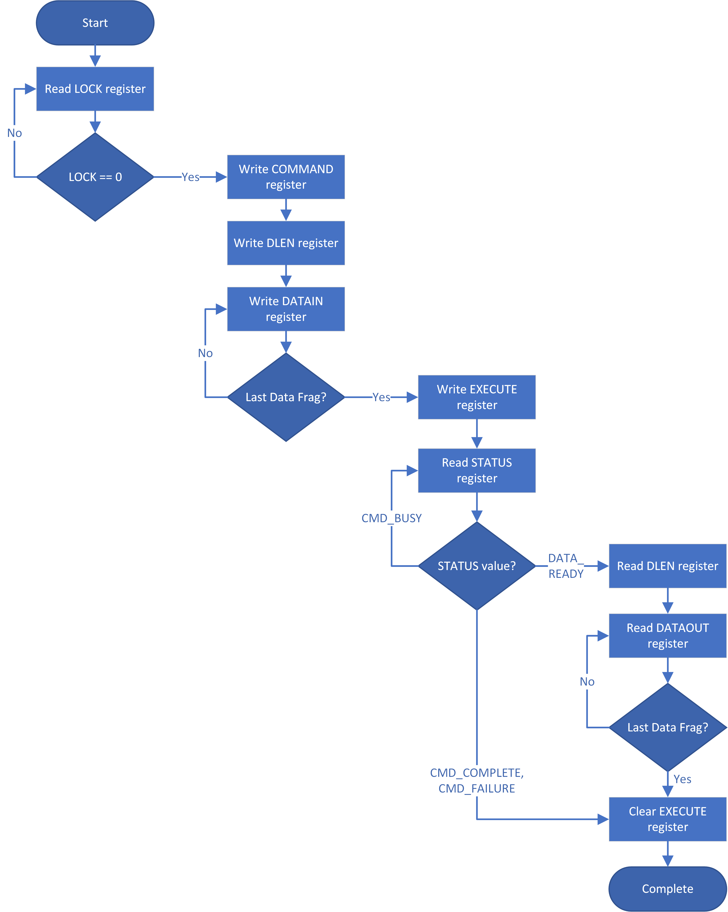

Caliptra: A Datacenter System on a Chip (SOC) Root of Trust (RoT)

Revision 1.0

Version 0.7

# Foreword

Caliptra[^1] was originally created as part of the Open Compute Project ([OCP](https://www.opencompute.org/)). The major revisions of the Caliptra specifications are published at OCP. The evolving source code and documentation for Caliptra live in this repository within the [CHIPS Alliance Project](https://chipsalliance.org/), a Series of LF Projects, LLC.

## Acknowledgments

The Caliptra Workgroup acknowledges the following individuals for their contributions to this specification:

**CONTRIBUTORS:**

* Andrés Lagar-Cavilla (Google)
* Anjana Parthasarathy (Microsoft)
* Bharat Pillilli (Microsoft)
* Bryan Kelly (Microsoft)
* Ishwar Agarwal (Microsoft)
* James Zhang (NVIDIA)
* Jeff Andersen (Google)
* John Traver (AMD)
* Jordan Hand (Google)
* Kor Nielsen (Google)
* Louis Ferraro (AMD)
* Marius Schilder (Google)
* Nathan Nadarajah (AMD)
* Paul Chou (NVIDIA)
* Piotr Kwidzinski (AMD)
* Prabhu Jayana (AMD)
* Rob Strong (AMD)
* Sudhir Mathane (AMD)
* Varun Sampath (NVIDIA)
* Vishal Soni (Microsoft)
* Steven Bellock (NVIDIA)

**Revision Table**

|**Date**|**Revision #**|**Author**|**Description**|
| - | - | - | - |
|February 2022|0.2|Prabhu Jayana (AMD)
 Bryan Kelly (Microsoft)
 Andrés Lagar-Cavilla (Google)
 Jeff Andersen (Google)
 | Initial proposal draft |
|March 2022|0.4| Rob Strong (AMD)
 Prabhu Jayana (AMD)
| Migrated to OCP template
Edits to clarify language use and added sections related LifeCycle support, fuse, crypto requirements, Kat support, etc.
 |
|April 12, 2022|0.5|Rob Strong (AMD)|Various edits and formatting modifications to get to v.5|
|June 2022|0.51|Rob Strong (AMD)|Updated the FW Signing/Verification Algorithms section - added references to OCP Secure Boot specification.
Updated Physical Attack Countermeasures - updated the section to reference NiST paper ([[7](#ref-7)]) that discusses SCA as well as their countermeasures.|
|June 2022|0.52|Nathan Nadarajah (AMD) Sudhir Mathane (AMD)|Added Threat Model section and initial content |
|July 2022|0.53|Louis Ferraro (AMD)|Added Device Resilience chapter and updated related text.|
|August 2022|0.54|Rob Strong (AMD)|Updated with OCP template and feedback. Added License and Appendix sections.|
|September 2022|0.55|Bharat S Pillilli (Microsoft)|Caliptra TRNG view, Caliptra Subsystem View, RAS/Error information, Fuse updates|
|October 2022|0.56|Bharat S Pillilli (Microsoft)|SHA384 acceleration HW API, Mailbox commands table added, Added flows on the usage of SHA384 acceleration HW API|
|November 2022|0.57|Jeff Andersen|Mailbox Command Table with encodings|
|November 2022|0.58|Rob Strong (AMD)|In section ‘Caliptra RTM hitless update’, added a definition for ‘hitless’.|
|January 2023|0.59|Jeff Andersen|Added commentary on LDevID and field entropy; added owner authz fuse details.|
|January 2023|0.60|Jeff Andersen|Added additional details on hitless update attestation.|
|January 2023|0.61|Jeff Andersen|Removed KEY MANIFEST SVN from specification.|
|February 2023|0.62|Piotr Kwidzinski|Moved specification to Caliptra GitHub repo.|
|February 2023|0.62|Piotr Kwidzinski|Moved specification to Caliptra GitHub repo.|
|May 2023|0.63|Caleb Whitehead|Updated Error Reporting and Handling HW Error Table.|
|June 2023|0.64|Varun Sampath (NVIDIA)|Warm reset and journey measurement handling.|
|August 2023|0.7|Piotr Kwidzinski|Cleanup references, links and figures. Minor edits|

# Acronyms and Abbreviations

For the purposes of this document, the following abbreviations apply:

| Abbreviation | Description |
|:-------------|:------------|
| **BMC**       | Baseboard Management Controller                |
| **CA**         | Certification Authority                        |
| **CDI**       | Compound Device Identifier                     |
| **CPU**       | Central Processing Unit                        |
| **CRL**       | Certificate Revocation List                    |
| **CSR**       | Certificate Signing Request                    |
| **CSP**       | Cloud Service Provider                         |
| **DICE**     | Device Identifier Composition Engine           |
| **DRBG**     | Deterministic Random Bit Generator             |
| **ECDSA**   | Elliptic Curve Digital Signature Algorithm     |
| **FMC**       | First Mutable Code                             |
| **GPU**       | Graphics Processing Unit                       |
| **IDevId** | Initial Device Identifier                      |
| **iRoT**     | Internal Root of Trust                         |
| **KAT**       | Known Answer Test                              |
| **LDevId** | Locally Significant Device Identifier          |
| **NIC**       | Network Interface Card                         |
| **NIST**     | National Institute of Standards and technology |
| **OCP**       | Open Compute Project                           |
| **OTP**       | One-time programmable                          |
| **PKI**       | Public Key infrastructure                      |
| **P-TRNG**  | Parallel True Random Number Generator          |
| **PUF**       | Physically unclonable function                 |
| **RoT**       | Root of Trust                                  |
| **RTI**       | RoT for Identity                               |
| **RTM**       | RoT for Measurement                            |
| **RTR**       | RoT for Reporting                              |
| **SoC**       | System on Chip                                 |
| **SPDM**     | Security Protocol and Data Model               |
| **SSD**       | Solid State Drive                              |
| **TCB**       | Trusted Computing Base                         |
| **TCG**       | Trusted Computing Group                        |
| **TEE**       | Trusted Execution Environment                  |
| **TRNG**     | True Random Number Generator                   |

# Requirements Terminology

The key words "MUST", "MUST NOT", "REQUIRED", "SHALL", "SHALL NOT", "SHOULD", "SHOULD NOT", "RECOMMENDED", "NOT RECOMMENDED", "MAY", and "OPTIONAL" in this document are to be interpreted as described in [[BCP 14](https://tools.ietf.org/html/bcp14)] [[RFC2119](https://tools.ietf.org/html/rfc2119)] [[RFC8174](https://tools.ietf.org/html/rfc8174)] when, and only when, they appear in all capitals, as shown here.

# References

1. NIST Special Publication 800-193 Platform Firmware Resiliency Guidelines
2. Global Platform Technology Root of Trust Definitions and Requirements Version 1.1 Public
3. [Open Compute Project Secure Boot Specification](https://www.opencompute.org/documents/secure-boot-2-pdf)
4. TCG DICE Layering Architecture Version 1.0 Revision 0.19 July 23, 2020
5. TCG DICE Attestation Architecture Version 1.00 Revision 0.23 March 1, 2021
6. TCG Hardware Requirements for a Device Identifier Composition Engine Family “2.0” Level
7. [Side-Channel Attacks: Ten Years After Its Publication and the Impacts on Cryptographic Module Security Testing](https://csrc.nist.gov/csrc/media/events/physical-security-testing-workshop/documents/papers/physecpaper19.pdf)
8. [Attestation V1.0 White Paper](https://www.opencompute.org/documents/attestation-v1-0-20201104-pdf)
9. [Attestation of System Components v1.0 Requirements and Recommendations](https://www.opencompute.org/documents/attestation-v1-0-20201104-pdf)
10. OCP Security WG: Ownership Transfer
11. Ownership and Control of Firmware in Open Compute Project Devices (Open Compute Project, Security WG)

# Theory of Operation

Establishing a core root of trust along with a chain of trust that attests to the integrity of configuration and mutable code is fundamental to the overall security posture of silicon devices.

Traditional RoT architectures have offered a multitude of intrinsic security services and hosted security applications on a trusted execution environment (TEE)  that consist of (but not limited to) hardware capabilities (cryptographic and microprocessor), ROM, Firmware and API infrastructure. These solutions have been instantiated in discrete or integrated forms in various platform and component architectures.

Some of these solutions are either proprietary or aligned to specific parts of an industry standards/consortium/association specifications (e.g.,National Institutes of Standards and technology (NIST), Open Compute Project (OCP), Trusted Computing Group (TCG), Distributed Management Task Force (DMTF), Institute of Electrical and Electronics Engineers (IEEE), etc.) and may be certified to various conformance standards (e.g., NIST cryptographic algorithm Validation program (CAVP), etc.).

Establishing a consistent root of trust on very different hardware configurations while maintaining configuration and deployment flexibility is challenging.  There is no uniform configuration across Cloud Service Providers. Example:  A system with host processors, has very different firmware security measures when compared to systems without head-nodes or host processors.

The OCP Security WG specifications are making progress towards establishing the platform and peripheral security architecture [recommendations](https://docs.google.com/document/d/1-bfAF86cEKcn1guF-Qj2C2HhMM2oJ2njNGdHxZeetR0/edit#heading=h.pdkwdxyrhnco) necessary to attain the desired consistency in platform security orchestration.

The objective of this specification is to define core RoT capabilities that must be implemented in the SoC or ASIC of any device in a cloud platform. The collection of these RoT capabilities is referred to as the ***Silicon RoT Services (Silicon RoT).***

## Silicon RoT Goals

The scope of a Caliptra Silicon RoT is deliberately minimalistic in nature to drive agility of specification definition, to maximize applicability, and to drive industry alignment, consistency and faster adoption of foundational device security primitives. A well and narrowly defined specification maximizes architectural composability, reusability across CSPs, products and vendors, and feasibility of open sourcing.

Enhancements, advanced use cases and applications are outside the scope of this specification and may be developed in the form of a roadmap for the Silicon RoT and community engagement.

Caliptra defines a design standard for a Silicon internal RoT baseline. The standard satisfies a Root of Trust for Measurement (RTM) role. The open-source implementation of Caliptra drives transparency into the RTM and measurement mechanism that anchors hardware attestation. The Caliptra Silicon RoT must boot the SoC, measure the mutable code it loads, and measure and control mutation of non-volatile configuration bits in the SoC. The Caliptra Silicon RoT reports these measurements with signed attestations rooted in unique per-asset cryptographic entropy. As such, the Caliptra Silicon RoT serves as a Root of Trust for Identity for the SoC.

No other capabilities are part of this specification, to satisfy the criteria for success outlined above, and to decouple platform integrity capabilities that can be enforced and evolve independently via other platform devices or services – such as Update, Protection and Recovery.

Within this scope, the goals for a Caliptra 1.0 specification include:

* Definition and design of the standard silicon internal RoT baseline:
  * Reference functional specification:
    * Scope including RTM and RTI capabilities
    * Control over SoC non-volatile state, including per asset entropy
  * Reference APIs:
    * Attestation APIs
    * Internal SoC services
  * Reference implementation
  * Open Source Reference ( including RTL and firmware reference code):
    * For implementation consistency, leverage open source dynamics to avoid pitfalls and common mistakes
    * For accelerated adoption (e.g., so that future products can leverage existing designs and avoid having to start the design process from scratch)
    * For greater transparency, to avoid fragmentation in the implementation space
  * Firmware and RTL logical design are open, managed by consortium.
* Consistency - across the industry in the internal RoT (iRoT) architecture and implementation
  * DICE Identity, Measurement and Recovery
* The silicon iRoT scope includes all datacenter-focused server class SoC / ASIC (datacenter focused) devices (SSD - DC, NIC, CPU, GPU - DC):
  * Critical priority are devices with the ability to handle user plain text data
    * Top priority are CPU SoCs
    * Other examples include SmartNIC and accelerators
  * Over time scope includes further data center devices
    * SSD, HDD, BMC, DIMM

Explicitly out of scope is how silicon integration into backend work is performed such as:

* Foundry IP integration
* Physical design countermeasures
* Analog IPs
* Post manufacture test and initialization (OSAT)
* Certification

## Use Cases

The Silicon RoT use cases can be supported through the adoption of specific industry standards and association/consortium specifications. Refer to specific documents in [References](#References).

In this version, Caliptra Silicon RoT desired capabilities address the basics of supply chain security use cases.

### Supply Chain Security

* **Mutable Code Integrity:** The objective here is to prove the device is running genuine firmware that the device manufacturer can vouch for its authenticity and integrity, and the device owner can ensure only authorized updates are applied to the device. This flow is aligned with [Reference 10](#ref-10) and can be achieved with dual signature verification of equal imposition.
* **Configuration and Lifecycle Management**: allow the platform owner to securely configure the RoT capabilities, and enable/authorize lifecycle state transitions of the SoC.

### DICE Protection Environment

A Caliptra RTM implements the DPE API, allowing Caliptra to derive and wield a DICE identity on behalf of other elements within the SoC. Use-cases for this API includes serving as a signing oracle for an SPDM responder executing in the SoC Application Processor, as well as authentication to a discrete TPM device.

# Industry Standards and Association / Consortium Specifications

This specification follows the industry standards and specifications listed in [References](#References).

## NIST SP800-193 Platform Firmware Resiliency

Per [Reference 1](#ref-1), RoT subsystems are required to fulfill three principles: *Protection, Detection* and *Recovery*. The associated RoT services are referred to as:

* **The Root of Trust for Update (RTU)** is responsible for authenticating firmware updates and critical data changes to support platform protection capabilities.
* **The Root of Trust for Detection (RTD)** is responsible for firmware and critical data corruption detection capabilities.
* **The Root of Trust for Recovery (RTRec)** is responsible for recovery of firmware and critical data when corruption is detected, or when instructed by an administrator.

These RoT services can be hosted by a complex RoT as a whole or it can be spread across one or more components within a platform. This determination has a basis in physical risk. Physical adversaries with reasonable skill can bypass a discrete RoT’s detection capabilities, for example, with SPI interposers.

However, an RoT embedded within an SoC or ASIC represents a much higher detection bar for a physical adversary to defeat. For this reason, a Caliptra Silicon RoT shall deliver the **Detection** (or Measurement) capability.

With the objectives of minimalistic scope for Silicon RoT and maximizing applicability and adoption of this specification, **Update** and **Recovery** are decoupled from Caliptra and are expected to be provided by an external RoT subsystem such as a discrete RoT board element on a datacenter platform. Because a physical adversary can trivially nullify any Recovery or Update capabilities, no matter where implemented, decoupling represents no regression in a security posture, while enabling simplicity and applicability for the internal SoC silicon RoT.

Detection of corrupted critical code and data (configuration) requires strong end to end cryptographic integrity verification. To meet the RTD requirements, Silicon RoT shall:

* Cryptographically measure its code and configuration
* Sign these measurements with a unique attestation key
* Report measurements to a host and/or external entity, which can further verify the authenticity and integrity of the device (a.k.a Attestation)

**Measurements** include **Code** and **Configuration**. Configuration includes invasive capabilities that impact the user service level agreement (SLA) on Confidentiality -- for example, the enablement of debug capabilities that grant an operator access to raw, unencrypted registers for any tenant context. In order to measure and attest Configuration, the Silicon RoT must be in control of the Configuration.

As an extension to controlling Configuration, the Silicon RoT must control the security states (refer to *[Caliptra Security States](#caliptra-security-states)*). Certain security states by design grant full invasive capabilities to an external operator, for debug or field analysis.

Measurements must be uniquely bound to the device and its manufacturer to a minimum. This establishes the need for **Identity** services in the Silicon RoT, that serves as the basis for key derivation and attestation authenticity.

For further details about how Caliptra addresses NIST SP800-193, refer to [Device Resilience](#device-resilience).

## Trusted Computing Group (TCG) DICE Attestation

In accordance with OCP Attestation specification [Reference 9](#ref-9), devices must have a Cryptographic Identity for the endorsement of attestation quotes. The RTM implementation follows TCG DICE (refer to [Reference 4](#ref-4), [Reference 5](#ref-5), and [Reference 6](#ref-6)). One of the benefits of TCG DICE device identities is having renewable security. This renewability complements ownership transfer and circular economy. The new owner is not burdened with the identity of the previous owner, nor is the new owner burdened with trusting an irrevocable hardware identity certificate. This benefits the transferee, as their identities can be revoked through standard PKI mechanisms. DICE based certificates are fully compatible with Public Key Infrastructure (PKI), including full life cycle management and PKI Certificate Revocation List (CRL).

Operational security during the manufacture process is critical, to ensure the DICE entropy is securely initialized, certified, and registered, avoiding any pilfering of this asset by eavesdroppers. Operational security is outside the scope of this specification.

# Threat Model

This section describes the Caliptra RoT threat model in terms of the profile of the attacks and the attackers that the Caliptra RoT is expected to defend against.

Threat model as described here takes into account attacker profile, assets and attack surfaces or paths to these assets based on attacker profiles. Subsequent subsections delve into each of these topics.

Threat scenarios as comprehended by assets and possible attack paths are as complete as possible but focus on the worst case scenarios. Thus not every attack path to asset is captured in this threat model.

## Attacker Profiles

Attacker profile is the outcome of following factors like tools accessible to the attacker, level of access to the target of evaluation and expertise of the attacker to use these methods. Next level of details of these capabilities scoped for this discussion are as follows.

*Table 1: Tools Accessible to Attacker*

| **Attack Tools** | **Type of Attack** | **Purpose/Usage** |
| :--------- | :--------- | :--------- |
| <ul><li>Debuggers</li><li>Fuzzing devices</li><li>Image reverse engineering tools</li><li>Software payloads</li></ul>| Logical Fault Injection | Find logical and functional vulnerabilities and exploit those to achieve unauthorized operations |
| <ul><li>Clock fault injectors</li><li>Voltage fault injectors</li><li>Electromagnetic fault injectors</li><li>Optical fault injectors</li><li>Micro probing</li></ul> | Environmental Fault Injection | Alter execution flow of the critical decision points, especially in the early execution |
| <ul><li>Power analyzers</li><li>Timing analyzers (Scopes etc)</li><li>Low speed bus analyzers</li><li>Optical emission analyzers</li></ul>| Side Channel Analysis | Infer security sensitive information by analyzing various operational conditions |
| <ul><li>Microscopic imaging</li><li>Reverse engineering</li><li>Scanning electron microscope imaging</li><li>Focussed ion beam (FIB)</li></ul> | Chip Invasive Attacks| Decapsulation, Depackaging, rebonding to probe internals of the chip |

*Table 2: Level of Access to TOE*

| **Type of Access** | **Levels of Access** | **Attack Paths Available** |
| :--------- | :--------- | :--------- |
| Physical Access | Unrestricted access for physical and logical attacks |
Chip invasive

Chip non invasive
 |
| Remote Access | Limited access for attacks with both privileged and unprivileged access rights | 
Chip non invasive attacks

Network attacks
 |

*Table 3: Definition of Expertise (JIL)*

|**Proficiency level**|**Definition**|**Detailed definition**|
| :--------- | :--------- | :--------- |
| **Expert** | 
Can use chip invasive, fault injections, side channel and logical tools

Understands HW and SW in depth

Familiar with implementation

<ul><li>Algorithms</li><li>Protocols</li><li>HW structures</li><li>Principle and security concepts</li></ul>
 | <ul><li>Familiar with developers knowledge namely algorithms, protocols, hardware structure, principles</li><li>Techniques and tools for attacks</li></ul> |
| **Proficient** |
Can use fault injections, side channel and logical tools

Understands HW and SW in reasonably

Familiar with security behavior
 | Familiar with security behavior, classical attacks |
| **Laymen** | No particular expertise | No particular expertise |

## Types of Attacks

### Physical Attacks

A physical attacker has full access to the electrical and physical components and interfaces/connectors/ports of the SoC/ASIC in which the Caliptra RoT is integrated without restriction.

Invasive attacks involving depackaging/delayering of the SoC/ASIC is out-of-scope. Non-Invasive attacks are in-scope.

* Fault Injection attacks
  * *Counter measurements - as strong recommendation*
* Power and Electromagnetic analysis attacks
  * *Counter measurements - as strong recommendation*

*Table 4: Attack Types*

| **Attack** |  **Description** | **Threat Model Scope** |
| :--------- | :--------- | :--------- |
| Electromagnetic – Passive | Attacker observes the electromagnetic power spectrum and signals radiated from the product. | 
Includes all attacks at all frequency ranges, including radio frequencies, infrared, optical, and ultraviolet.

Excludes attacks requiring removing the package lid.
 |
| Electromagnetic – Active  | Attacker directs electromagnetic radiation at the product or portions of the product. | 
Includes all attacks at all frequency ranges, including radio frequencies, infrared, optical, and ultraviolet.

Excludes attacks requiring removing the package lid.
 |
| Electric – Passive    | Attacker probes the external pins of the package and observes electrical signals and characteristics including capacitance, current, and voltage signal. | 
Includes both analog attacks and digital signal attacks.

Excludes attacks requiring removing the package lid.
 |
| Electric – Active     | Attacker alters the electrical signal or characteristics of external pins. | 
Includes both analog attacks and digital signal attacks.

Excludes attacks requiring removing the package lid.
 |
| Temperature – Passive | Attacker observes the temperature of the product or portions of the product.| Excludes attacks requiring removing the package lid. |
| Temperature – Active  | Attacker applies external heat sources or sinks to alter the temperature of the product, possibly in a rapid fashion. | 
Includes all temperature ranges (e.g. pouring liquid nitrogen over the package or heating the package to above 100C)

Excludes attacks requiring removing the package lid.
|
| Sound - Passive | Attacker observes the sounds emitted by the product. | 
Includes all frequencies.

Excludes attacks requiring removing the package lid.
 |

*Table 5: Logical Attacks*

| **Attack** | **Description** | **Included / Excluded** |
| :--------- | :--------- | :--------- |
| Debug/Register Interfaces | Manipulation of externally accessible registers of the Caliptra RoT|Includes all buses accessible to components external to Caliptra RoT including JTAG.|
| Software Interfaces       | Attacker invokes software interfaces exposed by the Caliptra RoT to external components. | 
Includes all externally exposed software interfaces from both non-RoT firmware as well as interfaces accessed by external IP blocks.

Includes exploiting both design and implementation flaws.

For High Value Assets only (see next subsection), the attacker is assumed to fully control all mutable code of the SoC, including privileged Caliptra RoT mutable code.
 |
|Side channel - Timing|Attacker observes the elapsed time of different sensitive operations.|Includes attacks where the attacker actively stimulates the sensitive operations while timing.|
|Cryptographic Analysis|Attacker observes plaintext, ciphertext, related data, or immediate values in cryptography to overcome cryptographic controls|
Includes all practical cryptanalysis attacks.

Assumes NIST-unapproved algorithms provide no security. (e.g. SHA-1, Single DES, ChaCha20)

Assumes any cryptographic algorithm that provides less than 128 bits of security (as determined by NIST SP 800-57) provides no security.

Excludes quantum computer attacks. This exclusion will be removed soon.
|

### Trust Boundaries

Following diagram establishes trust boundaries for the discussion of threat modeling. Caliptra based SoCs are expected to have Caliptra as silicon RoT, platform or SoC security engine to orchestrate SoC security needs and rest of the SoC.

Trust levels of Caliptra and the SoC security engine are not hierarchical. These two entities are responsible for different security aspects of the chip.

*Figure 1: Caliptra Trust Boundaries*

### Caliptra Interactions

The “Caliptra Core” blocks consume the Tcc and Tcw Trust level components.  This boundary includes crypto accelerators, hardware key sequencer, key vault, Caliptra microcontroller, ROM and subsystem interconnects.  The Caliptra Core provides deterministic Caliptra behavior.  The Caliptra Subsystem includes the Tc, Tcw, Tse and Trs, this subsystem extends Trust level into the SoC subsystem and allows for customization of the SoC initialization.  For information on Caliptra Core and Caliptra Subsystem, see section: [Caliptra Profiles](#caliptra-profiles)

### Caliptra Assets and Threats

Assets are defined to be secrets or abilities that must be protected by an owner or user of the asset.  Ownership means that the owner has the responsibility to protect these assets and must only make them available based on a defined mechanism while protecting all other assets.

An example of when an owner must protect assets would be moving from secure mode to unsecure.  Another example would be moving from one owner to another.  Before moving through these transitions, the owner will need to ensure all assets are removed, disabled or protected based on use-case definition.

*Table 6: Assets*

<table>
<thead>
  <tr>
    <th>Asset Category</th>
    <th>Asset</th>
    <th>Security Property</th>
    <th>Attack Profile</th>
    <th>Attack Path</th>
    <th>Mitigation</th>
  </tr>
</thead>
<tbody>
  <tr>
    <td rowspan="11">Fuse/OTP high value secrets</td>
    <td rowspan="4">UDS Seed</td>
    <td rowspan="4">Confidentiality and Integrity</td>
    <td rowspan="4">Expert</td>
    <td>Malicious manufacturing spoofing on UDSseeds</td>
    <td>UDS obfuscation/encryption with class RTL key</td>
  </tr>
  <tr>
    <td>Invasive attack (fuse analysis)</td>
    <td>Shield fuse IP</td>
  </tr>
  <tr>
    <td>Boot path tampering while retrieving UDS values</td>
    <td>UDS obfuscation/encryption with class RTL key</td>
  </tr>
  <tr>
    <td>Attempting to derive die specific keys by knowing UDS, KDF</td>
    <td>Confine unobfuscated UDS &amp; subsequent derivations to key vault</td>
  </tr>
  <tr>
    <td rowspan="4">Field Entropy</td>
    <td rowspan="4">Confidentiality and Integrity</td>
    <td rowspan="4">Expert</td>
    <td>Malicious manufacturing spoofing on field entropy</td>
    <td>Field entropy obfuscation/encryption with class RTL key</td>
  </tr>
  <tr>
    <td>Invasive attack (fuse analysis)</td>
    <td>Shield fuse IP</td>
  </tr>
  <tr>
    <td>Boot path tampering while retrieving field entropy values</td>
    <td>Field entropy obfuscation/encryption with class RTL key</td>
  </tr>
  <tr>
    <td>Attempting to derive die specific keys by knowing field entropy, KDF</td>
    <td>Confine field entropy &amp; subsequent derivations to key vault</td>
  </tr>
  <tr>
    <td>FW authentication keys</td>
    <td>Integrity</td>
    <td>Proficient</td>
    <td>Glitching</td>
    <td>1. Redundant decision making on critical code execution 2. Error check before consuming values from fuse 3. Environmental monitoring &amp; protection </td>
  </tr>
  <tr>
    <td>Versioning information from fuses</td>
    <td>Integrity</td>
    <td>Proficient</td>
    <td>Glitching</td>
    <td>Environmental monitoring &amp; protection</td>
  </tr>
  <tr>
    <td>IDEVID CERT chain</td>
    <td>Integrity</td>
    <td>Proficient</td>
    <td>Glitching</td>
    <td>1. Environmental monitoring &amp; protection 2. Error check before consuming values from fuse various ways</td>
  </tr>
  <tr>
    <td rowspan="7">Die unique assets</td>
    <td>UDS (802.1AR Unique Device Secret)</td>
    <td rowspan="7">Confidentiality and Integrity</td>
    <td rowspan="7">Proficient</td>
    <td rowspan="7">1. Software reading actual secrets 2. Side channel attack to infer secret</td>
    <td rowspan="7">1. Secrets locked in key vault, not readable by SW 2. SCA Protections</td>
  </tr>
  <tr>
    <td>CDIn (DICE compound device identifier for Layer n)</td>
  </tr>
  <tr>
    <td>IDevIDPriv</td>
  </tr>
  <tr>
    <td>LDevIDPriv</td>
  </tr>
  <tr>
    <td>Obfuscation Key</td>
  </tr>
  <tr>
    <td>AliasFMC_KeyPriv</td>
  </tr>
  <tr>
    <td>AliasRT_KeyPriv</td>
  </tr>
  <tr>
    <td rowspan="5">Root of trust execution</td>
    <td>ROM FW</td>
    <td>Integrity</td>
    <td>Proficient</td>
    <td>Glitching</td>
    <td>1. Redundant decision making on critical code execution 2. Environmental monitoring &amp; protection</td>
  </tr>
  <tr>
    <td>Execution unauthorized runtime FW</td>
    <td>Authenticity &amp; Integrity</td>
    <td>Proficient</td>
    <td>Modify boot media</td>
    <td>Authenticity &amp; integrity check using PKI DSA upon power on</td>
  </tr>
  <tr>
    <td>Execution unauthorized runtime FW</td>
    <td>Authenticity &amp; Integrity</td>
    <td>Proficient</td>
    <td>Arbitrary payload pushed into execution</td>
    <td>Authenticity &amp; integrity check using PKI DSA during software updates &amp; power on</td>
  </tr>
  <tr>
    <td>Rollback Attack</td>
    <td>Versioning</td>
    <td>Proficient</td>
    <td>1. Modify boot media to host older versions 2. Bypass version check during boot</td>
    <td>1. Authenticity &amp; integrity check using PKI DSA upon power on 2. Failproof, audited boot code implementation responsible to load images</td>
  </tr>
  <tr>
    <td>Control flow</td>
    <td>Integrity &amp; Confidentiality if applicable</td>
    <td>Proficient</td>
    <td>1. Return &amp; jump addresses manipulation 2. Return values, errors tampering  3. Stack overflow  4. Buffer overflows  5. Privilege escalations &amp; hijacking</td>
    <td>Various control flow integrity measures Secure coding practices and auditing implementation</td>
  </tr>
  <tr>
    <td>Boot measurements protected by Caliptra</td>
    <td>Boot Measurements that Caliptra as RTM gathers, stores and reports</td>
    <td>Integrity</td>
    <td>Expert</td>
    <td>1. Manipulate measurements AiTM while in transit to Caliptra  2. SoC sends manipulated measurements to Caliptra</td>
    <td></td>
  </tr>
  <tr>
    <td>Caliptra inputs</td>
    <td>Security state</td>
    <td>Integrity</td>
    <td>Proficient</td>
    <td>Glitching</td>
    <td>Environmental monitoring &amp; protection</td>
  </tr>
  <tr>
    <td></td>
    <td>Mode selection (Boot Media Integrated and dependent selections)</td>
    <td>Integrity</td>
    <td>Proficient</td>
    <td>Glitching</td>
    <td>Environmental monitoring &amp; protection</td>
  </tr>
  <tr>
    <td></td>
    <td>Pauser Attribute</td>
    <td>Integrity</td>
    <td>Proficient</td>
    <td>Glitching</td>
    <td>Environmental monitoring &amp; protection</td>
  </tr>
  <tr>
    <td></td>
    <td>JTAG debug</td>
    <td>Integrity</td>
    <td>Proficient</td>
    <td>1. Attempt to manipulate RoT execution via JTAG to non POR flows  2. Attempt to retrieve device secrets via JTAG when product is field-deployed 3. Attempt to retrieve device secrets via JTAG when product is under development/debug</td>
    <td>Implement security mode management within Caliptra</td>
  </tr>
</tbody>
</table>

# High Level Architecture

A Caliptra RTM subsystem has the following basic, high-level blocks:

*Figure 2: Caliptra High Level Blocks*

See [HW Section](#hardware-section) for a detailed discussion.

## Caliptra Profiles

Caliptra supports two physical modes of instantiation, the Caliptra Core and the Caliptra Subsystem.  Within Caliptra Core there are two modes of integration with different security postures and firmware loading techniques.

1. Boot Media Integrated (BMI) Profile: Caliptra loads its firmware directly from SPI boot media. SoC boot cannot proceed through any other boot media.
2. Boot Media Dependent (BMD) Profile: Caliptra receives its firmware from SoC actors with access to the boot media.

In both Profiles, Caliptra is among the first uncore microcontrollers taken out of reset by the power-on reset logic. The difference is in the TCB for integrity of the Core Root of Trust for Measurement. In the BMI Profile, this TCB is the Caliptra Core. In the BMD Profile, this TCB additionally includes the immutable element of the SoC ROM. The BMD Profile trades increased TCB for lower integration cost. BMD Profile does not put Caliptra firmware in the performance-critical or recovery-critical code paths of the SoC boot process.

Caliptra 1.0 will only support the BMD Profile.

### Caliptra Core - Boot Media Integrated (BMI)

In the Boot Media Integrated Profile, Caliptra unilaterally starts the firmware chain-of-trust. The boot process is as follows:

1. Hardware executes SoC power-on reset logic. This logic starts the execution of Caliptra ROM.
2. Caliptra ROM fetches the Caliptra firmware from SPI boot media.
3. Caliptra ROM authenticates/measures/loads/executes Caliptra firmware. Refer to [Error Reporting and Handling](#error-reporting-and-handling) for details regarding FMC verification failures.
4. Caliptra firmware copies the SoC First Mutable Code (FMC) into the Caliptra mailbox and measures it.
5. Caliptra firmware signals to SoC ROM to continue the boot process by fetching the firmware from Caliptra's mailbox.
6. SoC FMC continues the boot process, forming a boot firmware chain-of-trust: each firmware fetches/authenticates/measures/executes the next firmware needed to establish the device operating environment. Each firmware deposits the next firmware's measurements into Caliptra prior to execution.
7. Caliptra firmware presents attestation APIs using the deposited measurements.

*Figure 3: Boot Media Integrated Boot Flow*

In the Boot Media Integrated profile, the Caliptra Trusted Computing Base (TCB) for integrity of Core Root of Trust measurement is the Caliptra Core.  The verification of measurement includes:

1. The SoC design ingests firmware through Caliptra
2. Caliptra IP, Caliptra ROM, and Caliptra Firmware

### Caliptra Core - Boot Media Dependent (BMD)

In the Boot Media Dependent Profile, Caliptra coordinates the start of the firmware chain-of-trust with the immutable component of the SoC ROM. Once the Caliptra ROM has completed initialization, it provides a "stash measurement" API and callback signals for the SoC ROM to proceed with the boot process. Caliptra ROM supports stashing of at most eight measurements prior to the boot of Caliptra firmware. The SoC then may choose to boot Caliptra firmware. Any security-sensitive code or configuration loaded by the SoC prior to Caliptra firmware boot must be stashed within Caliptra. If the SoC exceeds Caliptra ROM's measurement stash capacity, attestation must be disabled until next cold reset. The boot process is as follows:

1. Hardware executes SoC power-on reset logic. This logic starts the execution of SoC ROM and Caliptra ROM.
2. SoC ROM waits for the ready_for_fw signal from Caliptra ROM.
3. SoC ROM fetches the First Mutable Code.
    1. If the FMC is Caliptra firmware:
        1. SoC ROM loads the Caliptra firmware into the Caliptra mailbox and issues the Caliptra "firmware load" command.
        2. Caliptra ROM authenticates/measures/starts the Caliptra firmware.
    2. If the FMC is not Caliptra firmware:
        1. SoC ROM authenticates and measures that firmware as the SoC FMC, and issues the Caliptra "stash measurement" command prior to executing SoC FMC.
4. SoC ROM executes SoC FMC.
5. As in #6 from the BMI flow, SoC FMC continues the boot process, forming a boot firmware chain-of-trust: each firmware fetches/authenticates/measures/executes the next firmware needed to establish the device operating environment. Each firmware deposits the next firmware's measurements into Caliptra prior to execution. The exception is Caliptra's firmware: SoC firmware shall delegate the measurement and execution of Caliptra's firmware to Caliptra ROM.
6. Upon eventual initialization, Caliptra firmware presents attestation APIs using the deposited measurements.

Refer to [Error Reporting and Handling](#error-reporting-and-handling) for details regarding Caliptra and SoC firmware load and verification error handling.

*Figure 4: Boot Media Dependent Boot Flow*

## Caliptra Security Subsystem

In order to enable a transparent and reusable security subsystem Caliptra solution, this specification provides for a full security subsystem solution that is a combination of fully open source digital logic and licensable analog components that are technology dependent such as TRNG analog sources  or technology dependent fuse controllers.

* SoC Controller has configurable SRAMs to allow per SoC firmware customization
* SoC reference ROM allows for configurable initialization
* RHL (Resource handling logic) is used to bring up subsystem components such as PUF, PLL, Fuse controller, \[P-\]TRNG etc. all and process requests from Caliptra to the outside components (e.g., P-TRNG request input to Caliptra’s internal TRNG)
* Some of the analog components are licensable IPs that are used to build the subsystem (e.g., PUF, PLL)

*Figure 5: Caliptra Security Subsystem*

The Caliptra subsystem offers a complete Root of Trust subsystem, with open source programmable components for customization of SoC boot flows.

## Identity

A Caliptra RTM must provide its runtime code with a cryptographic identity in accordance with the TCG DICE specification. This identity must be rooted in ROM, and provides an attestation over the security state of the RTM as well as the code that the RTM booted.

*Figure 6: DICE Cert/Key Generation*

### UDS

A combination of mask ROM and HW macros must implement the DICE key derivation and power-on latch, hiding the UDS and only making the CDI-derived signing key visible to firmware.

The Caliptra UDS is stored in fuses, and is encrypted at rest by an obfuscation secret[^2] known only to the Caliptra ROM. Once read by Caliptra ROM at boot, the UDS is then used to derive the IDevID identity.

### IDevID key

A Caliptra RTM's IDevID key is a hardware identity generated by Caliptra ROM during manufacturing. This key must be solely wielded by Caliptra ROM, and shall never be exposed externally at any phase of the Caliptra life cycle. IDevID is used to endorse LDevID. The IDevID certificate is endorsed by the vendor’s provisioning CA (pCA) implemented via a HSM appliance connected to High Volume Manufacturing flows (see provisioning CA in [Reference 9](#ref-9)).

There are likely multiple networked components between a Caliptra ROM execution supplying an IDevID CSR and the HSM appliance consuming that CSR to endorse with pCA. To mitigate man-in-the-middle attacks, Caliptra ROM shall sign the IDevID CSR with a “CSR envelope” private key. The CSR envelope private key is an ECDSA-P384 private key that is a chip-class secret provisioned by the vendor. The vendor should provision the CSR envelope public key to their HSM appliance, enabling them to authenticate the CSR prior to endorsement.

See [Provisioning IDevID During Manufacturing](#provisioning-idevid-during-manufacturing) for further details on IDevID provisioning.

### LDevID key

While it is recommended that implementations of Caliptra add physical attack countermeasures to protect fuses from imagery SDC attacks, SoC fuses generally have varying levels of resistance to physical attackers.  While it is important to protect device security assets with physical attack countermeasures, a good design principle is to assume compromise. Renewable security, often referred to as trusted computing base recovery, is a base design principle in the Caliptra RTM.  To mitigate the risk of UDS compromise for devices that may have been exposed to sustained physical attack in the supply chain, Caliptra RTMs shall support field-programmable entropy which factors into the device's LDevId identity.  The LDevId identity is endorsed by IDevID and in turn endorses the FMC alias key.

Caliptra's field-programmable entropy shall consist of four 32-byte slots. All slots are used to derive LDevID. An owner may decide to program as few or as many slots as they wish. Upon programming new entropy, on next reset the device will begin wielding its fresh LDevID. Owners will need to validate the new LDevID by way of IDevID.

TODO: detail how field entropy does not need to be fuses necessarily. Could be zeroes, OTP, or persistent storage from somewhere else.

### Commentary: threat analysis

Field entropy is a limited resource, consisting of only four 32-byte slots of one-time programmable fuses. It is not generally expected that a second-hand purchaser will be able to program all or even any of these slots. Caliptra's DICE identity remains usable even after all field entropy slots are programmed, so this feature does not preclude a circular economy. Field entropy is a feature primarily designed for users who purchase new parts.

Field entropy and LDevID are intended to hedge against attackers with the following abilities:

* Can obtain UDS before the part first arrives at the owner's facility.
* Can wield that stolen UDS to impersonate the part after it has been deployed within the owner's facility.
  * The attacker can derive and wield IDevID to mint an attacker-controlled DICE hierarchy, e.g. LDevID, FMC alias key, or Runtime firmware alias key.
* Cannot fully impersonate the part during initial onboarding within the owner's facility.
* Cannot extract field entropy after initial onboarding.

During initial onboarding, the owner is expected to instruct the device to program field entropy. Upon device reset, this will result in a fresh LDevID. Attackers that have previously obtained UDS will not be able to derive this LDevID. The owner is expected to register the new LDevID and subsequently validate all future DICE keys for the device against that LDevID.

When registering LDevID during device onboarding, the owner is expected to rely on IDevID as an authenticity signal over LDevID. It is assumed that the attacker has obtained UDS at this point, and therefore can themselves wield IDevID. Therefore, the authenticity signal granted by IDevID cannot be the only signal used to determine LDevID's trustworthiness. The owner's device onboarding flow must be resistant to remote MITM attackers that may attempt to use a previously-exfiltrated UDS to register a forged LDevID.

Once an owner has registered a device's LDevID as part of their device onboarding flow, and unless the device again passes through the owner's device onboarding flow, the owner should not trust IDevID to endorse any other LDevIDs.

This scheme does not defend against supply-chain attackers that obtain fuse data for devices that enter the supply chain *after* their field entropy has been programmed, such as during RMA flows.

## FMC alias key

The LDevID CDI is mixed with a hash of FMC, as well as the security state of the device, via a FIPS-compliant HMAC, to produce CDIFMC . ROM uses CDIFMC to derive the AliasFMC keypair. ROM wields LDevID to issue a certificate for Alias . The AliasFMC certificate includes measurements of the security state and FMC. ROM makes CDIFMC , AliasFMC , and its certificate, available to FMC.

FMC wields AliasFMC to issue a CSR for AliasFMC. FMC then mixes CDIFMC with a hash of runtime firmware to produce CDRT. FMC uses CDIRT to derive the AliasRT alias keypair. FMC wields AliasFMC to issue a certificate for AliasRT. This alias certificate includes measurements of runtime firmware. FMC makes CDIRT , AliasRT , its certificate, available to application firmware, while withholding CDIFMC and AliasFMC .

### Security state

Devices may support features like debug unlock or JTAG. These features, when enabled, significantly alter the security state of the device. The configuration of these features shall be captured in the device's DICE identity. The security state shall be captured as an input to the FMC's CDI, and represented within the FMC's alias certificate.

### Owner authorization

Caliptra RTM firmware shall be signed by the vendor. In addition, this firmware may also be signed by the owner when ownership control is enforced. If a second signature is present for ownership authorization, Caliptra must extract the owner's public key from the firmware image during cold boot, and latch the owner key into Caliptra's RAM for the remainder of its uptime[^3]. Caliptra will then use both the vendor key and owner key to verify hitless firmware updates.

Caliptra shall attest to the value of the owner key, enabling external verifiers to ensure that the correct owner key has been provisioned into the device. Caliptra shall do so by including the owner key as an input to the FMC's CDI (as part of "other attributes" from Figure 6 above), and represent it within the FMC's alias certificate.

The SoC may support a fuse bank for representing the hash of the owner's public key. If the SoC reports this value to Caliptra, Caliptra will refuse to boot firmware unless it has been dual-signed by the key reported by SoC ROM's fuse registers.

Note that the owner key, when represented in fuses or in the FMC's alias certificate, is a SHA-384 hash of a structure containing a list of owner public keys, to support key rotation.

## Provisioning IDevID During Manufacturing

*Figure 7: Device Manufacturing Identity Flow*

1. High Volume Manufacturing (HVM) programs NIST compliant UDS into fuses using SOC specific fuse programming flow. Note that this UDS goes through an obfuscation function within Caliptra IP. Hence it is fine for HVM to generate the UDS.
2. SOC will drive the security state indicating that its a manufacturing flow. Refer to *[Caliptra Security States](#caliptra-security-states)*) for encodings.
3. SOC (using a GPIO pin or SOC ROM) will drive BootFSMBrk (this is also used for debug cases). This can be driven at any time before cptra\_rst\_b is deasserted.
4. SOC will follow the boot flow as defined in Caliptra IP HW boot flow to assert cptra\_pwrgood and deassert cptra\_rst\_b, followed by writing to the fuse registers.
5. HVM through JTAG or using Caliptra SOC interface writes to “CPTRA\_DBG\_MANUF\_SERVICE\_REG” requesting for a CSR (refer to the [Caliptra ROM specification](https://github.com/chipsalliance/caliptra-sw/blob/main/rom/dev/README.md) for bit definitions)
6. HVM through JTAG or using Caliptra SOC interface writes to “CPTRA\_BOOTFSM\_GO” to allow Caliptra’s internal BootFSM to continue to bring up uController out of reset
7. ROM will look at the manufacturing state encoding, “CPTRA\_DBG\_MANUF\_SERVICE\_REG” and populates the Caliptra internal SRAM \[MB SRAM hardware structure is reused\] with the CSR and CSR envelope signature and write to Caliptra internal register to indicate CSR is valid (refer to [Caliptra ROM specification](https://github.com/chipsalliance/caliptra-sw/blob/main/rom/dev/README.md) and [Identity](#identity) section in this document on the ROM steps to generate the CSR)
8. HVM through JTAG or using SOC interface polls for “requested service\[s\]” bit\[s\] available in “CPTRA\_BOOT\_STATUS” register.
9. HVM through JTAG reads mbox\_status\[3:0\] to check if the data is ready to be read (DATA\_READY encoding).
10. HVM must write a bit in CPTRA\_DBG\_MANUF\_SERVICE\_REG over JTAG that it has completed reading CSR
11. Caliptra IP HW will now open up the Caliptra Mailbox for SOC usages such as FW loading (if required in some HVM flows)
    1. Note that until the above write is complete, SOC will not get a grant/lock of the APB-exposed mailbox interface.

## Certificate Format

Device Identity Certificates follow the X.509 v3 format described in RFC 5280.  The values in the X.509 certificate shall follow the DICE TCBInfo fields, as defined in [Reference 5](#ref-5).  The owner public key shall be extended into VendorInfo, with the security operational state reflecting the flags of DICE TCBInfo.  Additional fields may be extended into VendorInfo.

[**TODO for 0.8 release**: The x509 owner key, JTAG state, public key used to verify firmware should be extended in the Cert. ]

## Caliptra Security States

*Figure 8: Caliptra Security States*

**Definitions**

* **Non-Debug:** Caliptra JTAG is NOT open for uController and HW debug
* **Debug:** Caliptra JTAG is open for uController and HW debug
* **Unprovisioned:** Blank/unprogrammed fuse part
* **Manufacturing:** Device is going through manufacturing flow where High-Volume-Manufacturing (HVM) Caliptra fuses are being programmed
* **Production:** All Caliptra’s HVM Fuses are programmed.

**Notes:**

* Caliptra’s security state is determined by the SOC’s security state and SOC device lifecycle state.
* Caliptra’s state is considered a mode of operation.
  * Caliptra security state is defined by the uppermost bit of the encoding below; 1=DebugLocked and 0=DebugUnlocked
  * Lower 2 bits are mapped to device lifecycle (Unprovisioned, Manufacturing, Production)
* SOC’s security state may also be influenced by its own device life cycle.
* Caliptra’s security state determines Caliptra’s debug state and the state of its security assets.
* In general, if Caliptra is in unsecure state, all keys, assets are ‘zeroized’. Zeroized may mean switching to all 0s or 1s or debug keys based on the key. Refer to [Caliptra Assets](#assets) for a description of Caliptra assets.

*Table 7: Security States*

| {Security State, Device Life Cycle State[2:0]} | State                         | Definition                                                                                                                                                                                                                                                                                                                                                                                                                                                                                                                                                                                                                                                                                                                                                                                                                                                                              | State Transition Requirement                                                |
|------------------------------------------------|-------------------------------|---------------------------------------------------------------------------------------------------------------------------------------------------------------------------------------------------------------------------------------------------------------------------------------------------------------------------------------------------------------------------------------------------------------------------------------------------------------------------------------------------------------------------------------------------------------------------------------------------------------------------------------------------------------------------------------------------------------------------------------------------------------------------------------------------------------------------------------------------------------------------------------- | --------------------------------------------------------------------------- |
| 000b                                           | DebugUnlocked and Unprovisioned | This is Caliptra’s default state; it is used for development and early Caliptra bring up. This state is not used to provision the Caliptra assets. In this state: <ul><li>UDS and all other identity critical assets shall not be not programmed in fuses. Un-programmed Fuse bits shall be read as 0s (zero).<ul><li>The debug UDS shall be obfuscated and de-obfuscated using the debug obfuscation key.</li></ul></li><li>Obfuscation key: The debug obfuscation key shall be used</li><li>Caliptra JTAG is unlocked and allows microcontroller debug</li><li>Caliptra JTAG can access IP internal registers through FW</li></ul>                                                                                                                                                                                                                                                    | Unprovisioned to any other state requires cold boot cycle of Caliptra and SOC |
| 100b                                           | DebugLocked and Manufacturing   | Caliptra is commanded to enter this state during the secure High-Volume-Manufacturing (HVM) process. In this state: <ul><li>UDS and other identity critical assets shall be programmed into Fuses. They are written into Caliptra fuse registers, similar to the ‘Secure’ state.</li><li>All security assets shall be in production mode (production UDS and obfuscation shall be used)</li><li>Caliptra JTAG shall be locked – microcontroller debug shall be disabled</li><li>Caliptra microcontroller can be interrupted through JTAG mailbox</ul>                                                                                                                                                                                                                                                                                                                                   | Manufacturing -> Unsecure State transition possible without power cycle and Caliptra will clear all the security critical assets/registers before JTAG is opened  Manufacturing -> Secured state possible ONLY with a power cycle  Refer to [Provisioning During Manufacturing](#provisioning-idevid-during-manufacturing) for details on manufacturing and provisioning details. |
| 101b                                           | DebugLocked and Production      | All security assets are in production mode. In this state: <ul><li>Production UDS and obfuscation key shall be used.</li><li>CPU execution shall be enabled</li><li>All ‘backdoor’ functionality shall be disabled (e.g., developer functions/functionality that could reveal sensitive information or result in escalation of privileges, etc.)</li><li>Debug functions shall be disabled<ul><li>Caliptra JTAG is locked – microcontroller debug shall be disabled</li><li>Caliptra microcontroller shall not be interruptible through JTAG mailbox</li></ul></li><li>DFT functions shall be disabled</li></ul>                                                                                                                                                                                                                                                                        | DebugLocked -> Debug Unlocked possible without power cycle and Caliptra will clear all the security critical assets/registers before JTAG is opened |
| 001b                                           | DebugUnlocked and Production    | This state is used when debugging of Caliptra RTM is required. When in this state: <ul><li>UDS and other identity critical assets are programmed into Fuses. They may not have been written into Caliptra fuse registers if the unsecure state entered before Caliptra is out of reset. If unsecure state transition happened after fuses are written to Caliptra, they are cleared on seeing the security state transition from secure/manufacturing -> unsecure</li><li>Caliptra state: All security assets are in debug mode (UDS and Obfuscation key are in production state)<ul><li>UDS: Reverts to a ‘well-known’ debug value</li><li>Obfuscation key: Switched to debug key</li><li>Key Vault is also cleared</li><li>Caliptra JTAG is unlocked and allows microcontroller debug</li><li>Caliptra JTAG can access IP internal registers through FW or directly</li></ul></li></ul> | Debug Unlocked -> Debug Locked possible ONLY with a power cycle.            |

**Note:** End of life state is owned by SOC. In end-of-life device life cycle state, Caliptra shall not not be brought out of reset.

**Note:** Other encodings are reserved and always assumed to be in a secure state.

Each of these security states may be mapped to different SOC level debug and security states. SOC’s requirement is that if the SOC enters a debug state, then Caliptra must also be in Unsecured state where all assets are cleared.

## Service Surface

The service surface of a Caliptra RTM has multiple vectors. All use cases are control plane services, useful to power on a system or start a task. Supporting line rate high performance IO cryptography or any other data path capability is not required.

* **Logic IOs:** required to indicate status of the IP, availability of a message through APB, and to enable/disable certain debug capabilities (like JTAG enable/disable)
* **Command mailbox**: Caliptra shall offer services to other parts of the SoC:
  * **Loading firmware**: Caliptra firmware is loaded via the mailbox at cold-boot. In addition, Caliptra firmware can be loaded at runtime to support hitless/impactless updates.
  * **DICE-as-a-Service**: A Caliptra RTM shall expose a "DICE-as-a-Service" API, allowing Caliptra to derive and wield a DICE identity on behalf of other elements within the SoC.
  * A potential use case includes serving as a signing oracle for an SPDM responder executing in the SoC Application Processor.

## Device Resilience

As noted earlier in this document, Caliptra has a role to play in maintaining the resilience posture of the SoC as defined by NIST SP800-193 Platform Firmware Resiliency Guidelines refer to [Reference 1](#ref-1). As the Silicon RTM, Caliptra is either responsible for, or participates in, various Protection and Detection requirements described in the NIST publication.

Table 8: NIST SP800-193 Requirements describes the NIST SP800-193 requirements that Caliptra shall meet, either on its own or in conjunction with other components within the SoC or Platform. Requirements not listed should be assumed not covered and out-of-scope for Caliptra. In particular, most requirements related to firmware update and recovery are out-of-scope and must be handled by other components of the system.

*Table 8: NIST SP800-193 Requirements*

<table>
    <thead>
        <tr>
            <th><b>NIST SP800-193 Chapter</b></th>
            <th><b>Requirement</b></th>
            <th><b>Caliptra Responsibility</b></th>
        </tr>
    </thead>
    <tbody>
        <tr>
            <td rowspan=7>4.1.1</td>
            <td>All security mechanisms and functions shall be founded to Roots of Trust.</td>
            <td>Caliptra forms the basis for all trust in the SoC starting from execution of its immutable ROM. See chapter on Secure Boot Flow.</td>
        </tr>
        <tr>
            <td>If Chains of Trust (CoT) are used, RoT shall serve as the anchor for the CoT.</td>
            <td>All other firmware shall be authenticated and executed as part of a Chain of Trust extended from the Caliptra ROM. See chapter on Secure Boot Flow.</td>
        </tr>
        <tr>
            <td>All RoTs and CoTs shall either be immutable or protected using mechanisms which ensure all RoTs and CoTs remain in a state of integrity.</td>
            <td>All other firmware is authenticated and executed as part of a Chain of Trust extended from the Caliptra ROM. See chapter on Secure Boot Flow.</td>
        </tr>
        <tr>
            <td>All elements of the Chains of Trust for Update, Detection and Recovery in non-volatile storage shall be implemented in platform firmware.</td>
            <td>Caliptra forms the basis for Root of Trust for Measurement (or Detection). All other silicon RoT capabilities are extended by additional firmware loaded in the SoC and anchored by the Caliptra RTM.</td>
        </tr>
        <tr>
            <td>The functions of the RoTs or CoTs shall be resistant to any tampering attempted by software running under, or as part of, the operating system on the host processor.</td>
            <td>Caliptra shall run on a dedicated microcontroller, isolated physically from access by other components in the system.</td>
        <tr>
            <td>Information transferred from the software on the host processor to the platform firmware shall be treated as untrusted.</td>
            <td>Caliptra shall verify the authenticity of its firmware using an approved digital signature verification mechanism.</td>
        </tr>
        <tr>
            <td>CoTs may be extended to include elements that are not from non-volatile storage. Before use, those elements shall be cryptographically verified by an earlier element of the CoT.</td>
            <td>Caliptra shall verify the authenticity of its firmware using an approved digital signature verification mechanism. Caliptra shall also measure the SoC Security Processor FMC code before it is verified and executed by the SoC.</td>
        </tr>
        <tr>
            <td>4.1.2</td>
            <td>If the key store is updateable, then the key store shall be updated using an authenticated update mechanism, absent unambiguous physical presence through a secure local update.</td>
            <td>Hashes for the keys used to authenticate Caliptra FW are programmed into fuses during manufacturing. If a key is deemed to be compromised, that key may be revoked and the next key used instead. See chapter on Fuse/OTP Requirements.</td>
        </tr>
        <tr>
            <td rowspan=2>4.1.3</td>
            <td>Each platform device which implements a detection capability shall rely on either a Root of Trust for Detection (RTD), or a Chain of Trust for Detection (CTD) which is anchored by an RTD, for its detection.</td>
            <td>Caliptra forms the basis for all trust in the SoC starting from execution of its immutable ROM. All other firmware shall be authenticated and executed as part of a Chain of Trust extended from the Caliptra ROM. See chapter on Secure Boot Flow.</td>
        </tr>
        <tr>
            <td>The RTD or CTD shall include or have access to information necessary to detect corruption of firmware code and critical data.</td>
            <td>Caliptra relies on hashes of authorized keys stored in fuses. Those hashes are then checked against public keys found in firmware headers to authenticate Caliptra’s runtime firmware. Caliptra relies on redundancy in the fuses to protect the key and configuration data. See chapter on Fuse/OTP Requirements</td>
        </tr>
        <tr>
            <td rowspan=3>4.2.3</td>
            <td>If Critical Platform Firmware code in non-volatile memory is copied into RAM to be executed (for performance, or for other reasons) then the firmware program in RAM shall be protected from modification by software or shall complete its function before software starts.</td>
            <td>Caliptra shall run on a dedicated microcontroller, isolated physically from access by other components in the system.</td>
        </tr>
        <tr>
            <td>If Critical Platform Firmware uses RAM for temporary data storage, then this memory shall be protected from software running on the Platform until the data’s use is complete.</td>
            <td>Caliptra shall run on a dedicated microcontroller, isolated physically from access by other components in the system.</td>
        </tr>
        <tr>
            <td>Software shall not be able to interfere with the intended function of Critical Platform Firmware. For example, by denying execution, modifying the processor mode, or polluting caches.</td>
            <td>Caliptra shall run on a dedicated microcontroller, isolated physically from access by other components in the system. In addition, the Caliptra subsystem begins execution before other firmware is allowed to run.</td>
        </tr>
        <tr>
            <td>4.2.4</td>
            <td>Critical data shall be modifiable only through the device itself or defined interfaces provided by device firmware. Examples of defined interfaces include proprietary or public application programming interfaces (APIs) used by the device’s firmware, or standards-based interfaces. Symbiont devices may rely on their host devices to meet this requirement.</td>
            <td>Caliptra receives firmware and configuration input only via defined interfaces within the SoC. See chapter on Mailboxes.</td>
        </tr>
        <tr>
            <td>4.2.1.3</td>
            <td>The authenticated update mechanism shall be capable of preventing unauthorized updates of the device firmware to an earlier authentic version that has a security weakness or would enable updates to a version with a known security weakness.</td>
            <td>Caliptra supports a mechanism for detecting and preventing execution of a prior firmware image that is no longer authorized. See chapter on Anti-rollback Support.</td>
        </tr>
        <tr>
            <td rowspan=5>4.3.1</td>
            <td>A successful attack which corrupts the active critical data or the firmware image, or subverts their protection mechanisms, shall not in and of itself result in a successful attack on the RTD or the information necessary to detect corruption of the firmware image.</td>
            <td>Caliptra shall verify the signature of any firmware it loads during each boot. If the signature verification fails, Caliptra shall notify the SoC that firmware recovery must be performed. Refer to [Error Reporting and Handling](#error-reporting-and-handling).</td>
        </tr>
        <tr>
            <td>Verify integrity, using an approved digital signature algorithm or cryptographic hash, of device firmware code prior to execution of code outside the RTD.</td>
            <td>Caliptra shall perform digital signature verification of its FMC code, as well as that of the SoC Security Processor FMC before they are allowed to execute.</td>
        </tr>
        <tr>
            <td>If firmware corruption is detected, the RTD or CTD should be capable of starting a recovery process to restore the device firmware code back to an authentic version.</td>
            <td>Caliptra shall notify the SoC via the Mailbox interface to initiate the recovery process.</td>
        </tr>
        <tr>
            <td>The detection mechanism should be capable of creating notifications of firmware corruption.</td>
            <td>Caliptra shall notify the SoC via the Mailbox interface to initiate the recovery process.</td>
        </tr>
        <tr>
            <td>The detection mechanism should be capable of logging events when firmware corruption is detected.</td>
            <td>It is the responsibility of the SoC to log any corruption events upon notification by Caliptra.</td>
        </tr>
        <tr>
            <td rowspan=3>4.3.2</td>
            <td>The RTD or CTD shall perform integrity checks on the critical data prior to use. Integrity checks may take the form, for example, of validating the data against known valid values or verifying the hash of the data storage.</td>
            <td>Caliptra relies on redundant fuses to store its configuration data, which is owned and passed to Caliptra through the Mailbox.</td>
        </tr>
        <tr>
            <td>The RTD or CTD should be capable of creating notifications of data corruption.</td>
            <td>Refer to [Error Reporting and Handling](#error-reporting-and-handling).</td>
        </tr>
        <tr>
            <td>The detection mechanism should be capable of logging events when data corruption is detected.</td>
            <td>It is the responsibility of the SoC to log any corruption events upon notification by Caliptra.</td>
        </tr>
    </tbody>
</table>

## Secure Boot Flow

A Caliptra RTM shall follow/implement the secure boot guidelines as described in [Reference 3](#ref-3).

Detailed flow described in [HW Section](#hardware-section).

## Hitless Update

A ‘hitless’ (aka ‘impactless’) update occurs when an update is applied to the Caliptra’s executing firmware without requiring a SoC/machine reboot. A hitless update allows Caliptra FW[^4] to remain up to date with FW security and/or functional patches while preventing/reducing machine downtime. Hitless update shall take effect immediately upon application (post-cryptographic verification). Updates to the machine’s persistent storage is still required as this will ensure that Caliptra will reboot to the latest FW if the system requires a re-start/re-boot.

Caliptra contains multiple hardware isolated registers for Platform Configuration Registers (PCR).  These PCRs serve as volatile storage for concise cryptographic measurement of security state, including Caliptra’s own firmware.

Why journey measurements matter: hitless updates present a challenge for devices that only capture their current firmware version and state, particularly where the previous state may have impacted the current state of dependent components within the SoC.  For example, a device might move from firmware version A to firmware version B without assuming a clean start to flush state. Vulnerabilities in firmware version A, might impact version B.  Preserving a device boot measurement and currently running measurement can highlight differences, but it cannot distinguish between transitional states whereby intermediate updates have the potential to expose the device to vulnerabilities.  For example, a device may move from firmware version A, to B, then to C without a restart, whereas another device of the same type might transition from A to C without transitioning through B.  If tracking only boot and current firmware version, should a vulnerability be found in version B, it would be impossible to identify which devices transitioned through B compared to devices that transitioned from A to C directly.

To capture all firmware and configuration changes, Caliptra tracks and attests to both current measurements and cumulative measurement PCR banks.  The current measurement is a snapshot of the currently running firmware and configuration.  This provides easy reference for the current version.  If current and cumulative measurements are different, it can safely be assumed the device has undergone some update.  The cumulative measurement captures all the firmware and state transitions from a clean cold boot to the current version.  The cumulative measurement must be accompanied by a log structure that describes the path from boot to current measurement using hash extensions.  A verifier can understand a device’s path to its current state by replaying log entries to reconstruct the cumulative measurement.

The log and cumulative measurement mechanism is similar to that used in TPM.  In this model, Caliptra only needs to securely manage the measurements; the log does not need to be secured or maintained by Caliptra or the SoC.  The construction of measurements through cryptographic hash extensions means the log must provide the exact order and evidence needed to reconstruct the measurement.  As such, the log is tamper evident by design and does not need to be kept secure.

Caliptra contains 32 PCR 384 banks that are extendable by the SHA engine, and readable by Caliptra firmware.  The usage of the PCR Banks is as follows:

*Table 9: PCR Bank Usage*

|**PCR Number**|**Type**|**Extend Ctrl**|**Description**|
| - | - | - | - |
|PCR0|Cumulative|ROM|Holds Caliptra's FMC firmware update journey; including state and FMC, and measurements extended by ROM.|
|PCR1|Current|ROM|Caliptra’s boot FMC, and and state. This is a snapshot of the current state.|
|PCR2|Cumulative|FMC|Holds Caliptra's runtime firmware update journey; including state and FMC, and measurements extended by FMC.|
|PCR3|Current|FMC|Caliptra’s boot and runtime firmware measurement and state.  This is a snapshot of the current state.|
|PCR4|Cumulative|RT - PA1||
|PCR5|Current|RT - PA1||
|PCR6|Cumulative|RT - PA2||
|PCR7|Current|RT - PA3||
|PCR8|Cumulative|RT - PA3||
|…|-|-||

### Attestation of Caliptra's update journey

The Caliptra hardware ROM will extend Caliptra's FMC measurement and security state into the cumulative and current PCR banks (0 and 1 respectively).  The FMC captures the current measurement of Caliptra's Runtime Firmware upon every cold boot and hitless update. These measurements are used to derive a CDI and an alias key given to runtime firmware. FMC places runtime firmware's measurements into runtime firmware's alias key certificate, and signs that certificate with FMC's alias key.

FMC will also extend Runtime Firmware's measurements into PCR0, prior to launching Runtime Firmware.

When runtime firmware boots following a hitless update, it will have access to the following pieces of data:

* Its CDI, derived by FMC
* Its alias key, generated by FMC
* Its alias certificate, signed by FMC
* PCR\[0\], extended by FMC
* SRAM state, established by the prior runtime firmware image

SRAM state will consist of measurements captured by prior runtime firmware image(s), and will not contain secrets or executable data[^5]. Therefore, the trustworthiness of runtime firmware will be reflected in the measurements captured by FMC and evident in runtime firmware's alias certificate.

Caliptra firmware will attest to PCR\[0\] by including it as an input in all DPE leaf key derivations and as evidence in all DPE leaf key certificates.

Commentary: recovery from a bad hitless update Suppose the following Caliptra firmware images exist:

* Version A: presumed-good
* Version B: known-bad
* Version C: presumed-good

A remote verifier wishes to confirm that a given Caliptra device has not run version B since cold-boot. The remote verifier can challenge the SoC with a freshness nonce; higher-layer software will pass that freshness nonce as a request to Caliptra's DPE for signing. The remote verifier receives the following pieces of evidence:

1. An endorsement over LDevID, which may take a number of forms, including:
    1. Caliptra's vendor-signed certificate over IDevID, and an IDevID-signed certificate over LDevID.
    2. An owner-signed certificate over IDevID, and an IDevID-signed certificate over LDevID.
    3. An owner-signed certificate over LDevID.
2. An LDevID-signed certificate over AliasFMC, which includes FMC's measurements as captured by ROM.
3. An AliasFMC-signed certificate over AliasRT, which includes runtime firmware's measurements as captured by FMC.
4. An AliasRT-signed certificate over a leaf DPE key, which includes PCR0 as read by runtime firmware, along with other measurements previously stashed in SRAM.
5. A log structure[^6] that represents the measurements that have been extended into PCR0.
6. A leaf-DPE-signed blob[^7] containing the freshness nonce.

The remote verifier will evaluate (1) according to ownership policies to determine whether the Caliptra device is trustworthy, before proceeding to verify the rest of the attestation response.

Thus satisfied in the trustworthiness of the Caliptra device, the remote verifier can then evaluate the trustworthiness of FMC by inspecting the measurements in (2), AliasFMC's certificate. The verifier can reject the attestation if those measurements do not conform to a known-good value.

Thus satisfied in the trustworthiness of FMC, the remote verifier can then evaluate the trustworthiness of runtime firmware by inspecting the measurements in (3), AliasRT's certificate. If version A or C is running, then the PCR0 measurement present in (4), the leaf DPE key certificate, is presumed to be an honest reflection of the hardware register as read by runtime firmware. The verifier can reject the attestation if AliasRT's certificate indicates that version B is currently running.

Thus satisfied that version B is not currently running and that PCR0 is an accurate reflection of the hardware register, the remote verifier can then compare the log in (5) to PCR0 in (4) to confirm its authenticity, then walk the log to confirm that FMC never launched version B since cold-boot. If version B did run, that firmware could have maliciously modified DPE measurements stashed in SRAM, but could not have modified the contents of PCR0 to erase the evidence that version B ran at all, and could not have influenced the behavior of firmware versions A or C to prevent them from accurately reporting the contents of PCR0.

Thus satisfied that version B has never run since power-on, the verifier can also optionally inspect other measurements in (4) to evaluate the journey of other SoC components, whose measurements were previously stored within Caliptra's SRAM.

Finally, the verifier can confirm freshness by comparing the nonce in (6) to the one emitted in the original challenge. As DPE will only allow a derived leaf key to be used if the measurements present in its leaf certificate are a reflection of the current state, the fact that the freshness nonce was signed by DPE is evidence that the measurements in (4) are fresh.

#### Commentary: maintaining sealed secrets across a power cycle

Caliptra does not seal secrets directly. However, Caliptra does implement DPE, which allows secrets to be sealed to an external sealer such as a TPM, with a policy that only allows those secrets to be unsealed if Caliptra allows the host to wield a particular leaf DPE key. This leaf DPE key is permuted based on the hitless update journey of the various components whose measurements are stored within Caliptra.

This poses a challenge for maintaining sealed secrets across a power cycle. Suppose the SoC cold-booted CPU microcode A, then hitlessly updated to B, then to C. The measurements stored within Caliptra's SRAM will represent the \[A->B->C\] update journey, and DPE's leaf key will be derived based on this journey.

Let us assume that upon each hitless update, the firmware update is also written to persistent storage, such that on next cold-boot the new firmware will run. Thus, on next boot the SoC's microcode update journey will simply be \[C\]. This is a different journey than \[A->B->C\], and so DPE's leaf key will differ. The old secret sealed to the old DPE leaf key will no longer be accessible to the SoC.

To anticipate this eventuality, before a power cycle the SoC can instruct DPE to predict what the DPE leaf public key will be if the microcode journey is simply \[C\], using DPE's simulation context. The SoC can then re-seal secrets to the external sealer with a policy that can be satisfied if the computed public key is used.

Note: as all DPE leaf keys are derived using Caliptra runtime firmware's CDI, a DPE simulation context cannot predict the leaf key that would be available if a different Caliptra firmware image were to boot (as one Caliptra firmware image does not have access to a different image's CDI). Therefore, if a different Caliptra firmware image is staged to persistent storage, Caliptra must first be hitlessly updated to that image before a simulation context can be used to predict public keys that will be available to that image on next cold-boot.

### Attestation of SoC update journey

Caliptra shall also attest to the journeys of SoC components. A SoC component's journey may change independently of other components. For example, SoC components may implement partial resets or hitless updates that cause the component's firmware or configuration to reload.

Caliptra shall maintain a reboot counter for each component. Caliptra shall increment the reboot counter and update the journey measurement for calls that indicate that the component's state changed. Caliptra  shall attest the journey measurement and report the counter value on-demand. The verifier is assumed to have knowledge of update events at an associated reboot counter (via an event log) but not have knowledge of reset events. The verifier can compute the journey measurement via multiplicatively extending the current measurement by the reset counter. For example:

1. Upon cold boot, SoC component boots firmware A. Reboot counter is 0. The tuple of (0,A) is in the event log.
2. SoC component is partial reset once. Reboot counter is 1.
3. SoC component is hitlessly updated to firmware B. Reboot counter is 2. The tuple of (2,B) is in the event log.
4. SoC component is partial reset twice. Reboot counter is 4.

The corresponding journey measurement computation is the chained extension of \[A->A->B->B->B\]. The verifier can ascertain this through the two event log entries.

## Anti-rollback Support

A Caliptra RTM shall provide Fuse banks (refer to *Table 13: Caliptra Secret Fuse Descriptor Table*) that are used for storing monotonic counters to provide anti-rollback enforcement for Caliptra mutable firmware. Each distinctly-signed boot stage shall be associated with its own anti-rollback Fuse field. Together with the vendor, a Caliptra RTM allows owners to enforce strong anti-rollback requirements, in addition to supporting rollback to a previous firmware version – this is a critical capability for hyper scalar owners.

Every mutable Caliptra RTM boot layer shall include a SVN value in the signed header. If a layer's signed SVN value is less than the current counter value for that layer's fuse bank, the Caliptra RTM shall refuse to boot that layer, regardless of whether the signature is valid.

Each signed boot layer shall also include a MIN\_SVN value in the signed header. Upon successful validation of a signed boot layer, if the layer's signed MIN\_SVN value is greater than the current counter value for that layer's fuse bank, Caliptra shall increment that fuse bank counter until it equals MIN\_SVN.

Vendors shall issue security-critical fixes requiring anti-rollback protection in sets of two signed firmware:

* Version number (X+1) which carries the security fix, with an incremented SVN and an unchanged MIN\_SVN, as compared to version (X).
* Version number (X+2), identical to (X+1) except its MIN\_SVN value has been incremented.

Owners may upgrade their fleet in two stages: first from (X) to (X+1), and then from (X+1) to (X+2).

If an owner does not require the ability to roll back during qualification, they can choose to perform a single upgrade of their fleet, from (X) to (X+2), skipping over the intermediate (X+1).

Each of Caliptra's internal anti-rollback fuse banks shall support a minimum counter value of 64. This feature is expected to be used sparingly.

If a given firmware image's SVN is less than its MIN\_SVN value, that image shall be considered invalid.

Alternatively, platform vendors may prefer to manage firmware storage and rollback protection in a different manner, such as through a dedicated Platform RoT. In such cases, the vendor may wish to disable anti-rollback support from Caliptra entirely. This disable is available via an OTP/fuse setting.

**Informative comment: Example**

The following is an example of how the anti-roll back mechanism may be used to revoke a signed image while supporting rollback to the prior image.

* Assuming Caliptra is in the following state:
* Currently running firmware version: 4.2
* Caliptra firmware's signed SVN value: 1
* Caliptra firmware's signed MIN\_SVN value: 1
* Caliptra's firmware anti-rollback fuse bank counter value: 1

A vulnerability is discovered in firmware version 4.2. The vendor issues a fix in firmware version 4.3. However, owners may still wish to roll back to firmware version 4.2, while version 4.3 is being qualified in their fleet. Updating to firmware version 4.3 will place the Calipra RTM in the following state:

* Currently running firmware version: 4.3
* Caliptra firmware's signed SVN value: 2
* Caliptra firmware's signed MIN\_SVN value: 1
* Caliptra's firmware anti-rollback fuse bank counter value: 1

In this state, since the anti-rollback fuse bank counter has not yet been incremented, the Caliptra RTM will still allow the firmware to roll back to version 4.2.

Once firmware version 4.3 is fully qualified, the owner will wish to revoke version 4.2. The vendor will issue a follow-up firmware version 4.4, which will place the Calipra RTM in the following state:

* Currently running firmware version: 4.4
* Caliptra firmware's signed SVN value: 2
* Caliptra firmware's signed MIN\_SVN value: 2
* Caliptra's firmware anti-rollback fuse bank counter value: 2

Upon validating firmware version 4.4, the Caliptra RTM will note that that firmware's signed MIN\_SVN value is 2, and will increment its internal fuse bank counter to match. Once a chip has received firmware version 4.4, it will no longer be able to roll back to version 4.2. However, it *will* continue to be able to roll back to version 4.3.

## Physical Attack Countermeasures

A Caliptra RTM shall implement counter measures designed to deter both glitching (also referred to fault-injection (FI) and side-channel attacks (simple power analysis (SPA) and differential power analysis (DPA)).

The Caliptra threat model guides the priority of which physical countermeasures are based on a specific physical implementation.

From the top, an adversary in the supply chain has essentially unlimited time to glitch the chip and make it reveal any private key material or symmetric secrets. [One Glitch To Rule Them All ](https://arxiv.org/abs/2108.04575)is one example with recency bias. The most critical counter-measures must prevent non-destructive extraction of those secrets. Otherwise, an adversary succeeding may be able to silently impersonate production serving assets at a later time.

General protection of the embedded microprocessor while running arbitrary firmware is required to protect the UDS or other private entropy from logical and physical attacks, including firmware running within the Caliptra itself. Control flow integrity, analog reference voltage and clock sources, as well as defensive programming are encouraged.  Likewise, pointer authentication, encryption, separate code vs data stacks, and memory tagging are all encouraged.

Randomly generated per part entropy is subject to physical inspection attacks in the supply chain, as well. The Fuses storing the UDS entropy shall be protected to a degree that forces an attacker to perform a destructive operation to read their values. Decapping and fibbing attacks should at least penetrate enough layers and metal shielding to render the part useless, if not being outright impossible to carry out. Entropy tied to a damaged asset typically requires injection of counterfeit devices in the supply chain, which is a very powerful adversary model.

Another way to obtain access to secret entropy with “unlimited supply chain time” is to observe side channels while the SoC is executing. Because a Caliptra RTM is expected to be a <1 mm2 fraction of a large SoC, side-channel mitigation is required only against extremely resourceful attackers that can wade and discern through a large number of confounding signals and power profiles. With that priority in mind, DPA and DMA attacks should be mitigated via decoy value generation.

Any private key material or symmetric key material embedded in the RTL (and therefore “global”) must be treated as having low value, reaching zero value in a number of quarters. A supply chain attacker can destructively obtain the key material, and loss of one part is not going to trigger any alarms.

Mitigation against SCA is not necessarily trivial and may be implemented in a variety of ways. [[Reference 7](#ref-7)] provides a comprehensive overview of methods and techniques used in various SCA as well as recommendations for countermeasures against such attacks (including feasibility and applicability). Additionally, there are many academic papers available from NIST and other resources that discuss SCA and their countermeasures.

## Compliance and Certification Requirements

Due to the Identity service surface offered to other SoC subsystems, a Caliptra RTM may fall under the ToE (Target of Evaluation) of an application that wishes to attain a specific compliance level for business reasons.

It is important to highlight it’s not necessary for the RTM itself to unilaterally attain e.g. FIPS 140-3 L3. It is only relevant insofar the RTM is included in the “bag” that wants to obtain a compliance certification. For example, if a cloud provider wants to FIPS-certify PCIe link encryption in transit rooted to an ASIC identity emanating from a Caliptra RTM.

Refer to [Reference 8](#ref-8) for requirements related to Keys, Entropy, and Random Bits and cryptographic modules and algorithms.

### Known Answer Test (KAT) Support

In order to certify a cryptographic module, pre-operational self-tests must be performed when the system is booted. Implementation of KATs are required for FIPS certification. However, regardless of FIPS certification, it is considered a security best practice to ensure that the supported cryptographic algorithms are functioning properly so as to guarantee correct security posture.

KAT execution are described as two types

* Pre-operational Self-Test (POST)
* Conditional Algorithm Self-Test (CAST)

A detailed description of the POST and CAST KATs can be found at csrc.nist.gov.

*Table 10: KAT Failure Mitigations*

|KAT Type|If fails|
| - | - |
|POST|Failure of a POST KAT (e.g., ECDSA) shall result in Caliptra RTM ***boot failure***. A reset may or may not result in successful POST completion.|
|CAST|Failure of a CAST KAT shall cause Caliptra RTM to fail any operation that has a dependency on the associated cryptographic algorithm.|

*Table 11: POST/CAST Usage*

| **Crypto Algorithm** | **Caliptra Boot ROM** | **Caliptra FMC** | **Caliptra Runtime FW**
| -------------------- | --------------------- | ---------------- | -----------------------
| ECDSA[^8]            | Yes                   | Yes              | Yes
| AES                  | Yes                   | No               | No
| SHA[^9]              | Yes                   | Yes              | Yes
| DRBG                 | No                    | No               | No
| HMAC                 | Yes (CDI generation)  | No               | No
| KDF                  | Yes                   | Yes              | No

As shown in Table 11: POST/CAST Usage, since the cryptographic algorithms required by the Caliptra RTM Boot ROM are considered POSTs and those same algorithms are used by Caliptra FMC and FW (green boxes), there is no requirement that FMC and Runtime FW implement CASTs for those algorithms.

## FW Signing/Verification Algorithms

Caliptra firmware is composed of multiple layers: an FMC and an application firmware image. Each layer is signed individually by ECDSA P384 keys.

Each layer is signed by a vendor-controlled key. In addition, each layer may also be signed by an owner-controlled key. The image header contains both the owner public key as well as the signature using that key.

During boot, Caliptra ROM shall verify the vendor signature over FMC before allowing that FMC to run.

See the [Owner endorsement](#owner-authorization) section for how the owner key is used.

Caliptra RTM FW signature generation and verification shall follow the requirements described in [Reference 3](#ref-3).

### Post-Quantum Cryptography (PQC) Requirements

As NIST publishes new standards with PQC resilience, algorithms applicable to Caliptra will be described in this document.

### Key Rotation

Firmware signing key rotation shall follow the requirements described in [Reference 3](#ref-3).

# Hardware Section

Caliptra Core Block Diagram

*Figure 9: Core Block Diagram*

* SRAM requirements:
  * 128 KiB of ICCM0
  * 128 KiB for Mailbox as a staged SRAM (for FW staging of impactless updates to do authentication checks on the FW before moving to ICCM)
  * 128 KiB for DCCM and 32 KiB for ROM
* Crypto requirements
  * SHA256 SHA384, SHA512
  * ECC Secp384r1 w/ HMAC-DRBG - Key Generation, Sign and Verification
  * HMAC SHA384
  * AES256-ECB, CBC, GCM
* Chips Alliance is used for RISC-V
* APB is the choice of SOC facing interface
* JTAG is exported at the IP interface
* TRNG is the digital logic and algorithms required for random number generation. It requires a physical entropy source input. Refer to the Caliptra IP specification and integration specification for more information.
  * For SOCs that want to use their own legacy TRNG, Caliptra provides a HW API to push the random number on request/response handshake. Refer to the ase see Caliptra IP specification and integration specification for more information.

Caliptra IP HW Boot Flow

*Figure 10: Hardware Boot Flow*

1. As a part of SOC boot flow, SOC may have a bunch of infrastructure and other entities that boot. That part of the flow is outside the scope of this document. If SOC chooses to bypass Caliptra, then it should have a capability to bypass the Caliptra entirely through its proprietary flow. This may be needed for A0 power on and other early validation.
2. Cptra\_pwrgood is asserted to the Caliptra IP block.
3. Cptra\_rst\_b is deasserted to the Caliptra IP block. Refer to the integration specification for guidelines on the minimum number of cycles b/w these two signals
4. Caliptra IP will now evaluate the strap settings driven through various interface wires (eg. BMD vs BMI mode, security/debug state of the SOC etc)
5. If SOC is in a debug mode, then security assets are cleared/switched to debug mode
6. Caliptra IP will assert Ready\_For\_Fuse wire to the SOC
7. SOC will populate the fuse registers, the internal TRNG configuration registers, and the ROM WDT cycle count, then set the CPTRA\_FUSE\_WR\_DONE bit. Note that Caliptra HW drops writes to any registers that cannot be changed unless there is a power cycle (eg. UDS). So SOC is free to write all the registers.
8. Caliptra IP will deassert Ready\_for\_Fuse wire as soon as the fuse write done register is written.
9. Caliptra IP moves security critical assets in fuse registers (eg. UDS) to Key Vault.

## Boot Media Dependent Flows

### Caliptra FW Push Flow

*Figure 11: FW Push Flow*

1. Once Caliptra uController is out of reset, ROM starts executing and triggers the crypto block to run the UDS decrypt flow.
2. Caliptra ROM will now enable the Mailbox. (until this point any accidental/non-accidental writes that target the mailbox are dropped by the hardware)
3. Caliptra ROM will assert READY\_FOR\_FW wire. This is done by writing an internal register. This register is also visible to read on the APB interface. SOC can choose to poll on this bit instead of using the wire (it is SOC integration choice).
4. SOC will follow the mailbox protocol and push Caliptra FW into the mailbox
5. Caliptra’s mailbox HW will assert an interrupt to the uController once the GO is written per mailbox protocol. See [Mailbox](#mailbox) for specifics.
6. Once Caliptra’s FW is authenticated and loaded into ICCM, uController will assert READY\_FOR\_RTFLOWS wire. Refer to [Caliptra ROM specification](https://github.com/chipsalliance/caliptra-sw/blob/main/rom/dev/README.md) on next level specifics of various security flows that happen within this step (eg. DICE).

## SOC FW Authentication flows

Caliptra provides FW authentication and measurement capture service to the SOC.

1. SOC logic (ROM or HW or FW \[depending on the context of the flow\]) provides the SOC FW hash manifest for authentication. SOC hash manifest is signed using the same key as the Caliptra FW. Format of the SOC hash manifest contains global meta data of “Impactless” field, “FWID” and the “Associated Hash”. Refer to [Caliptra ROM specification](https://github.com/chipsalliance/caliptra-sw/blob/main/rom/dev/README.md) and [Caliptra Runtime specification](https://github.com/chipsalliance/caliptra-sw/blob/main/runtime/README.md) for more details.
2. For SOC FW/Configuration that requires verification, there are two options:
    1. SOC logic uses the Caliptra provided SHA384 HW API to stream the FW while copying the same to the appropriate destination; SOC logic will write the “FW ID” and send a FW authentication request mailbox command.
    2. SOC logic can directly report the measurement. SOC logic will write the “FW ID”, Measurement and send a FW measurement mailbox command.
3. Caliptra RT FW will use the FW ID and the associated hash in the SOC FW Hash Manifest. Caliptra RT FW compares them against the hash of the last streamed FW hash from the internal register when Step 2.1 was executed or the measurement reported in Step 2.2. If they match, Caliptra will capture this hash to extend the appropriate measurement/PCR and report SUCCESS of the mailbox command.
4. SOC logic will take appropriate action for the FW that was copied to the destination (eg. set execute/mark FW valid for an embedded controller to use it) etc.
5. Steps 1 through 4 can be used for the next set of FWs that would be loading.

Notes:

* Anytime a new SOC FW hash manifest gets loaded (eg. SOC impactless update flows use model), Caliptra will do the comparison against the new hash manifest.
* Since it’s only a hash comparison, this speeds up the boot flows considerably.
* It is recommended that step 2.1 is used for SOC implementations. If Step 2.2 is used, then the required ROM/FW/logic code should be made transparent through OCP required supply-chain audit channels.

## Boot Media Integrated

### Caliptra FW Load Flow

*Figure 12: FW Load Flow*

1. Once Caliptra uController is out of reset, ROM starts executing and triggers the crypto block to run the UDS decrypt flow.
2. Caliptra ROM will use the internal SPI peripheral to read from the platform's persistent storage and load the FW. Note that SPI will be operating in basic functional single-IO mode and at 20 MHz frequency.
3. Once Caliptra’s FW is authenticated and loaded into ICCM, uController will assert READY\_FOR\_RTFLOWS wire. Refer to [Caliptra ROM specification](https://github.com/chipsalliance/caliptra-sw/blob/main/rom/dev/README.md) for next level details of various security flows that happen within this step (eg. DICE).

### CPU Warm Reset or PCIe Hot Reset Flow →  Caliptra IP reset

*Figure 13: Hardware Reset Flow*

**Note:** Since Caliptra IP may be placed in a “S5” domain of the device, there may be devices where Caliptra IP may not go through reset on a device hot reset or CPU warm reset. But the flow shows what happens when such a reset happens.

1. Caliptra IP’s reset is asserted by the SOC
2. Caliptra’s internal BootFSM will reset the uController and then resets all the logic (including the SOC facing APB interface). Only registers or flops that are sitting on powergood are left to have the same value. Note that SRAMs do not have a reset.
3. Caliptra IP’s reset is de-asserted by the SOC
4. At this point the HW boot flow will be the same cold boot flow. SoC is required to configure the internal TRNG and ROM WDT and then set CPTRA\_FUSE\_WR\_DONE. This will cause Caliptra IP to deassert the Ready\_for\_Fuse wire.
5. Caliptra’s ROM reads an internal register to differentiate b/w warm vs cold vs impactless flow. If it's a warm reset flow, then it skips DICE key gen, FW load flows (because keys were already derived and FW is already present in ICCM). This is an important reset time optimization for devices that need to meet the hot reset specification time.

Given warm reset is a pin input to Caliptra, Caliptra may not be idle when a warm reset occurs. If a warm reset occurs while Caliptra ROM, FMC, or RT initialization code is executing, Caliptra may be inoperable until a subsequent cold reset. If a warm reset occurs while Caliptra runtime is servicing a request, Caliptra shall remain operable but may refuse to wield production assets for subsequent requests.

**Note:** Cold reset flow is not explicitly mentioned but it would look like cold boot flow as Caliptra IP has no state through a cold reset.

## Mailbox

The Caliptra Mailbox is a 128 KiB buffer used for exchanging data between the SoC and the Caliptra microcontroller (uC).

SoC side will communicate with the mailbox over an APB interface. This allows the SoC to identify the device using the interface to ensure that the mailbox, control registers, and fuses are read or written only by the appropriate device.

When a mailbox is populated by SoC, an interrupt to the FW to indicate that a command is available in the mailbox. The uC will be responsible for reading from and responding to the command.

When a mailbox is populated by the uC, Caliptra will send a wire indication to the SoC that a command is available in the mailbox as well as updating the MAILBOX STATUS register. The SoC will be responsible for reading from and responding to the command.

Mailboxes are generic data passing structures, the Caliptra hardware will only enforce the protocol for writing to and reading from the mailbox. How the command and data is interpreted by the FW and SoC are not enforced in this document.

### Sender Protocol

**Sending data to the mailbox:**

1. Requester queries the mailbox by reading the LOCK control register.
    1. If LOCK returns 0, LOCK is granted and will be set to 1.
    2. If LOCK returns 1, MBOX is locked for another device.
2. Requester writes the command to the COMMAND register.
3. Requester writes the data length in bytes to the DLEN register.
4. Requester writes data packets to the MBOX DATAIN register.
5. Requester writes to the EXECUTE register.
6. Requester reads the STATUS register.
    1. Status can return:
    2. DATA\_READY – Indicates the return data is in the mailbox for requested command
    3. CMD\_COMPLETE – Indicates the successful completion of the requested command
    4. CMD\_FAILURE – Indicates the requested command failed
    5. CMD\_BUSY – Indicates the requested command is still in progress

**Notes on behavior:**
Once LOCK is granted, the mailbox is locked until that device has concluded its operation. Mailbox is responsible for only accepting writes from the device that requested and locked the mailbox.

*Figure 14: Mailbox Sender Flow*

### Receiver Protocol

Upon receiving indication that the mailbox has been populated, the appropriate device can read the mailbox. This is indicated by a dedicated wire that is asserted when Caliptra populates the mailbox for SoC consumption, also by the STATUS register returning DATA\_READY

**Receiving data from the mailbox:**

1. Receiver reads the COMMAND register.
2. Receiver reads the DLEN register.
3. Receiver reads the MBOX DATAOUT register.
    1. Continue reading MBOX DATAOUT register until DLEN bytes are read.
4. Receiver resets the EXECUTE register.
    1. This releases the LOCK on the mailbox.

*Figure 15: Mailbox Receiver Flow*

### User Attributes

The PAUSER field of the APB interface will be used to encode device attributes for the requester utilizing the SoC interface. These values can be used for:

* Ensuring the device that was granted the LOCK is the one that accesses the mailbox, dlen, command, and status registers.
* Could be used to prioritize who is next granted the LOCK.

### Mailbox Commands

The Caliptra mailbox commands are specified in the runtime firmware specification: https://github.com/chipsalliance/caliptra-sw/blob/main/runtime/README.md#maibox-commands

## Caliptra firmware image format

The Caliptra firmware image format is specified in the ROM specification: https://github.com/chipsalliance/caliptra-sw/blob/main/rom/dev/README.md#8-firmware-image-bundle

### Hash Calculation HW API

Caliptra provides a HW API to do a SHA384 hash calculation. The SoC can access the accelerator through this hardware API and stream data to be hashed over the APB interface. The hash is captured into a register for SOC to use or Caliptra FW to be used for Signature Authentication API.

### JTAG/TAP Debug

*Figure 16: Debug Flow*

1. SOC will drive the security state indicating that its a debug flow. Refer to “Caliptra Security States” for encodings.
2. SOC (using a GPIO pin or SOC ROM) will drive BootFSMBrk (this is also used for debug cases). This can be driven at any time before cptra\_rst\_b is deasserted.
3. SOC will follow the boot flow as defined in Caliptra IP HW boot flow to assert cptra\_pwrgood and deassert cptra\_rst\_b, followed by writing to the fuse registers.
4. HVM through JTAG or using Caliptra SOC interface writes to “CPTRA\_DBG\_MANUF\_SERVICE\_REG” requesting for appropriate debug service (refer to the ROM/Runtime specifications for bit definitions)
5. HVM through JTAG can also inject uController TAP commands at this point following the [VeeR Specification](https://github.com/chipsalliance/Cores-VeeR-EL2)
6. HVM through JTAG or using Caliptra SOC interface writes to “CPTRA\_BOOTFSM\_GO” to allow Caliptra’s internal BootFSM to continue to bring up uController out of reset
7. uController will execute the appropriate debug service
8. Specific SOC interface registers (MBOX\_DLEN, MBOX\_DOUT, MBOX\_STATUS, CPTRA\_BOOT\_STATUS, CPTRA\_HW\_ERRROR\_ENC, CPTRA\_FW\_ERRROR\_ENC, BOOTFSM\_GO, CPTRA\_DBG\_MANUF\_SERVICE\_REG) are accessible over JTAG interface in debug (or manufacturing mode). Following are the JTAG register addresses for these registers
    1. DMI\_REG\_MBOX\_DLEN = 7'h50; (Read-only)
    2. DMI\_REG\_MBOX\_DOUT = 7'h51; (Read-only)
    3. DMI\_REG\_MBOX\_STATUS = 7'h52; (Read-only)
    4. DMI\_REG\_BOOT\_STATUS = 7'h53; (Read-only)
    5. DMI\_REG\_CPTRA\_HW\_ERRROR\_ENC = 7'h54; (Read-only)
    6. DMI\_REG\_CPTRA\_FW\_ERROR\_ENC = 7'h55; (Read-only)
    7. DMI\_REG\_CPTRA\_DBG\_MANUF\_SERVICE\_REG = 7'h60; (Read-Write)
    8. DMI\_REG\_BOOTFSM\_GO = 7'h61; (Read-Write)
    9. Note: These are injected as TAP register read/write commands as defined in [VeeR Specification](https://github.com/chipsalliance/Cores-VeeR-EL2)

Few notes:

1. Security State is latched at cptra\_rst\_b deassertion. If the Security state is unlocked at this time, only then TAP is opened.
2. Changing security state at random time cptra\_rst\_b deassertion will not unlock Caliptra JTAG.
3. Changing security state at random time after cptra\_rst\_b deassertion will flush out all internal caliptra secrets/assets/key vault/crypto intermediate state
    1. Same is true for scan\_mode assertion
4. Scan mode assertion does NOT automatically open Caliptra JTAG.

### Architectural Registers

These registers are accessible over APB to be read according to the register access permissions. The register reference manual is available at https://ereg.caliptra.org

### Fuse Requirements

* Fuse registers are programmable whenever IP goes through reset (after cptra\_rst\_b asserts and de-asserts) and before the fuse registers are locked from writes. If the lock was set, the writes will be dropped. Lock is sticky across a warm reset

To ensure that the security claims of a Caliptra RTM are achieved, specific Fuse capabilities must be supported:

* Fuses that hold Caliptra RTM secrets shall not be readable by any mutable code in the SOC
* If JTAG is enabled pre or post SoC reset, a Calpitra RTM’s dedicated Fuses shall not be accessible (shall not be readable, shall not be writable) by a Caliptra RTM or other SoC IP. This restriction shall be applicable to a Caliptra RTM’s Fuse shadow registers as well (refer to Physical Attack Countermeasures).
* SoC should ensure that the integrity of each fuse is maintained through the life of the part.  The integrity of the fuses can be maintained by fuse redundancy, ECC or other means determined sufficient by the SoC.

Note: In addition to the Fuse bits described below, Fuse bits necessary to support ownership principles as described in [Reference 11](#ref-11) shall be supported.

The following table describes a Calpitra RTM’s Fuse map:

*Table 13: Caliptra Fuse Map*

| **Name**                        | **Size (bits)** | **ACL**         | **Fuse Programming Time**                       | **Description** |
| ------------------------------- | --------------- | --------------- | ----------------------------------------------- | --------------- |
| UDS Seed (Obfuscated)           | 384             | ROM             | SOC Manufacturing                               | DICE Unique Device Secret Seed. This seed is unique per device.  The seed is scrambled using an obfuscation function. |
| Field Entropy (Obfuscated)      | 256             | ROM             | 
Device Owner

In-Field Programmable
 | Field-programmable by the owner, used to hedge against UDS disclosure in the supply chain. |
| KEY MANIFEST PK HASH            | 384             | ROM FMC RUNTIME | SOC Manufacturing                               | SHA-384 hash of hashes of the Key Manifest Signing the ECC P-384 Public Keys |
| KEY MANIFEST PK HASH MASK       | 4               | ROM FMC RUNTIME | In-Field Programmable                           | One-hot encoded list of revoked Key Manifest PK Hash |
| OWNER PK HASH                   | 384             | ROM FMC RUNTIME | In-Field Programmable                           | SHA-384 hash of hashes of the Owner Key ECC P-384 Public Keys |
| OWNER KEY MANIFEST PK HASH MASK | 4               | ROM FMC RUNTIME | In-Field Programmable                           | 
One-hot encoded list of revoked Owner Key Manifest PK Hash

**Reset:**
 |
| FMC KEY MANIFEST SVN            | 32              | ROM FMC RUNTIME | In-Field Programmable                           | FMC security version number. |
| RUNTIME SVN                     | 128             | ROM FMC RUNTIME | In-Field Programmable                           | Runtime Firmware security version number. |
| ANTI-ROLLBACK DISABLE           | 1               | ROM FMC RUNTIME | In-Field Programmable                           | 
Disables Anti-rollback support from Caliptra.

(for example if a Platform RoT is managing FW storage and anti-rollback protection external to the SoC)
 |
| IDEVID CERT IDEVID ATTR.        | 768             | ROM FMC RUNTIME | SOC Manufacturing                               | 
Manufacturer IEEE IDEVID Certificate Generation Attributes.

Refer to ROM specification for more details
 |
| IDEVID MANUF HSM IDENTIFIER     | 128             | ROM FMC RUNTIME |                                                 | 
Manufacturer IDEVID Manufacturer’s HSM identifier (this is used to find the certificate chain from the boot media)

Refer to ROM specification for more details
 |
| Life Cycle Fuses                | 2               | ROM FMC RUNTIME | SOC Manufacturing                               | 
**Caliptra Boot Media Integrated mode usage only**. SOCs that build with a Boot Media Dependent profile don’t have to account for these fuses.

‘00 - Unprovisioned or Manufacturing

‘01 - Production ‘10 - UNDEF

‘11 - End Of Life

**Reset:** Can only be reset on powergood
 |
| LMS VERIFY                      | 1               | ROM             | In-Field Programmable                           | 
0 - Verify Caliptra firmware images with ECDSA-only

1 - Verify Caliptra firmware images with both ECDSA and LMS

| LMS REVOCATION                  | 32              | ROM             | In-Field Programmable                           | Bits for revoking LMS public keys in the key manifest

## Fuse Programming

All Fuse based cryptographic keying material and seeds (e.g. UDS Seed) shall be generated (on-chip or off-chip) per requirements described in [Reference 3](#ref-3).

### Fuse Zeroing

When a cryptographic key (or their hashes) are retired/revoked, then its associated Fuse storage shall be zeroed. Since by default, unprogrammed Fuse bits are read as ‘0b’, zeroed in this context requires that all zero Fuse bits in a field be programmed to ‘1b’; Fuse bits already programmed to ‘1b’ must never be attempted to be programmed to ‘1b’. Zeroing a Fuse field is summarized as:

1. Update the associated revoked bit implemented in Fuse
2. Read the current Fuse field that requires zeroization
3. XOR the read field with a value of all 1s that is equivalent in length to the read field
4. Program the Fuse field with the XORed value

# Error Reporting and Handling

This section describes Caliptra error reporting and handling.

*Table 14: HW/FW Error Types*

| | Fatal Errors | Non-fatal Errors |
| :- | - | - |
| HW | 
- ICCM, DCCM SRAM ECC

- Second WD timer expiry (First one triggers an NMI to FW to correct the issue and clear the interrupt status bit. If the WD expires again, then it gets escalated to FATAL error
 | 
- Mailbox SRAM ECC (except initial FW load)

- Mailbox incorrect protocol/commands. E.g. Incorrect access ordering; access without Lock.
 |
| FW | 
- Boot-time FW authentication failures

- FW triggered FATAL errors. Examples: ICCM/DCCM misaligned access (potentially in the except subroutine); AHB access hangs that is triggered through WD timer expiry; AHB access outside the decoding range; stack overflow etc. Refer to the table below
 | 
- Mailbox API failures

- First WD timer expiry

- Crypto processing errors
 |

**Fatal errors**

* Fatal errors will log the FATAL ERROR reasons into an arch register that is RW from the external world. This register must be sticky (as in reset is on powergood).
* This register may be cleared at any time via register write (W1C).
* Caliptra will signal this using a cptra\_error\_fatal wire.
  * SoCs should connect this into their SoC error handling logic. Upon detection of a FATAL ERROR in Caliptra, SoC shall treat any outstanding commands with Caliptra as failed, and SoC may recover by performing a Caliptra reset using the signal `cptra_rst_b`.
  * This signal is used to prevent forward progress of the boot process if measurement submission to Caliptra fails. If SoC detects a Caliptra fatal error while the SoC is in steady state, then there is no obligation for the SoC to immediately address that error. If rebooting the SoC for such failures is deemed unacceptable to uptime, the SoC should implement the ability to trigger a Caliptra Warm Reset independently of the SoC, and may use this mechanism to recover.
  * Error Mask registers (writable only by Caliptra uC) may be used to prevent error signal assertion per-event. Mask registers only impact interrupts when set prior to the error occurrence.
  * cptra\_error\_fatal will remain asserted until Caliptra is reset. Note that, although the HW FATAL ERROR register fields may be cleared at any time, a reset is still required to clear the interrupt.
* When a fatal error occurs, all assets (UDS fuses, DEOBF\_KEK, Key Slots etc.) are cleared. Note that UDS\_FUSE, DEOBF\_KEK may have already been cleared depending on when the fatal error happened.

**Non-Fatal errors**

* Non-Fatal errors will log the NON-FATAL ERROR reasons into an arch register that is RW from the external world. This register must be sticky (as in reset is on powergood).
* This register may be cleared at any time via register write (W1C).
* Caliptra will signal this using a cptra\_error\_non\_fatal wire.
* Caliptra reset via `cptra_rst_b` or a write to clear the NON-FATAL ERROR register will cause the interrupt to deassert.
* Optional for SoCs to include this signal in their logic.

**FW Errors**

[Vishal.Soni@microsoft.com](mailto:Vishal.Soni@microsoft.com)to spec these

*Table 15: FW Errors and Remedies*

<table>
    <thead>
        <tr>
            <th><b>Condition</b></th>
            <th><b>When occurs</b></th>
            <th><b>Remediation</b></th>
        </tr>
    </thead>
    <tbody>
        <tr>
            <td>SoC FMC verification failure due to invalid digital signature invalid, invalid anti-rollback value)</td>
            <td>During boot as described in <a href="#bmi">Boot Media Integrated</a>, <a href="#bmd">Boot Media Dependent (BMD)</a>, <a href="#secure-boot-flow">Secure Boot Flow</a></td>
            <td></td>
        </tr>
        <tr>
            <td>Caliptra FMC invalid</td>
            <td>During boot as described in <a href="#bmi">Boot Media Integrated</a>, <a href="#bmd">Boot Media Dependent (BMD)</a>, <a href="#secure-boot-flow">Secure Boot Flow</a></td>
            <td></td>
        </tr>
        <tr>
            <td>Caliptra runtime FW invalid</td>
            <td>During boot as described in <a href="#bmi">Boot Media Integrated</a>, <a href="#bmd">Boot Media Dependent (BMD)</a>, <a href="#secure-boot-flow">Secure Boot Flow</a></td>
            <td></td>
        </tr>
        <tr>
            <td>Fuse programming errors</td>
            <td></td>
            <td></td>
        </tr>
    </tbody>
</table>

[^1]: *Caliptra. Spanish for “root cap” and describes the deepest part of the root*
[^2]: This obfuscation secret may be a chip-class secret, or a chip-unique PUF, with the latter preferred.
[^3]: This memory should only be volatile in the face of a power loss event. See details in [HW Section](#reset-flow).
[^4]: When a hitless update occurs, then following reset, Caliptra shall execute the updated firmware and shall maintain the measurements that it collected during boot and shall support the reporting of these measurements with signed attestations. Hitless update of Caliptra’s FMC shall not be supported as this would require the creation of a new DICE identity which would require access to IDevID and LDevID. Retention of IDevID and LDevID (privkeys), post-boot introduce a security vulnerability.
[^5]: Upon boot, firmware will defensively treat existing SRAM contents as potentially malicious, emplaced by prior firmware with a vulnerability.
[^6]: The format of this log is outside the scope of this specification.
[^7]: The format of this blob is outside the scope of this specification.
[^8]: ECDSA is used for FW verification and SPDM (signing)
[^9]: SHA is used with ECDSA, HMAC and for generating measurements
