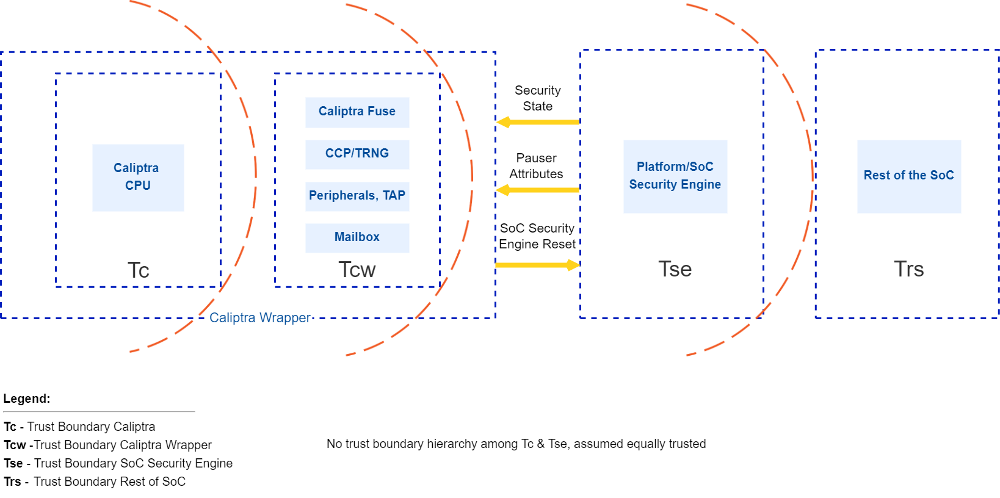
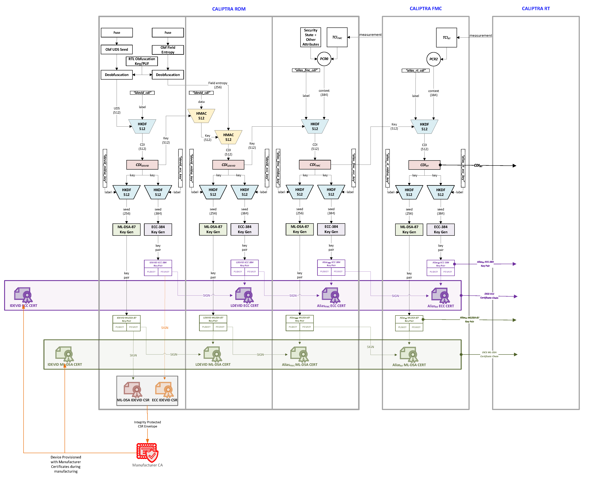
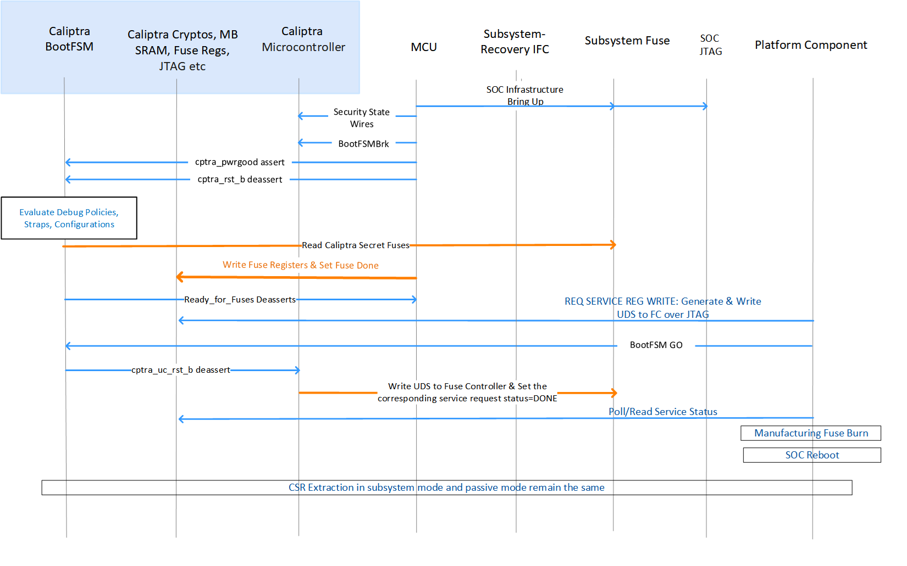
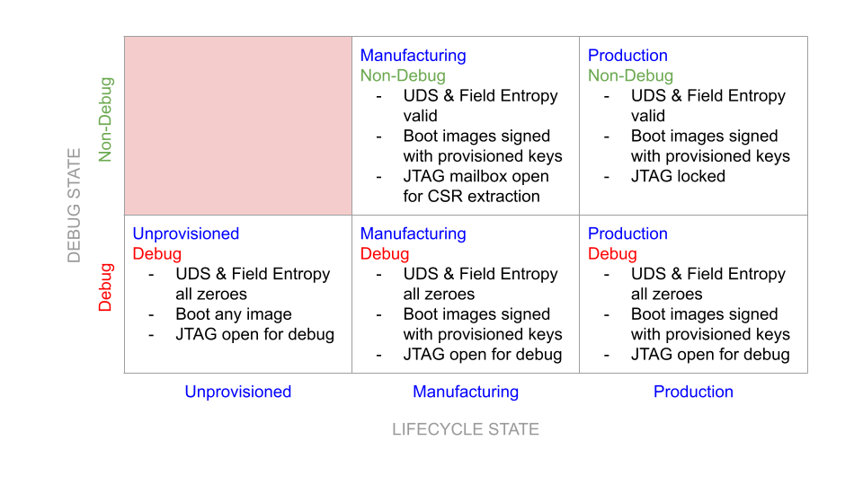
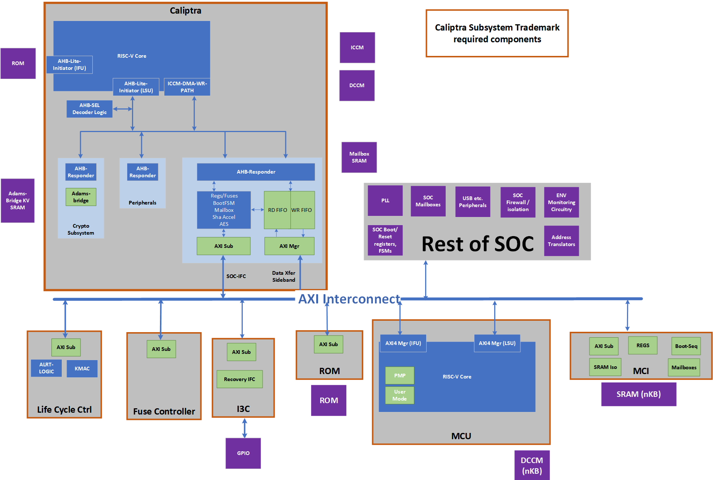

Caliptra: A Datacenter System on a Chip (SoC) Root of Trust (RoT)

Revision 2.0

Version 0.5

# Introduction

Caliptra[^1] was originally created as part of the Open Compute Project ([OCP](https://www.opencompute.org/)). The major revisions of the Caliptra specifications are published at OCP. The evolving source code and documentation for Caliptra are in this repository within the [CHIPS Alliance Project](https://chipsalliance.org/), a Series of LF Projects, LLC.

The objective of Caliptra is to define core RoT capabilities that must be implemented in the System on Chip (SoC) or ASIC of any device in a cloud platform. The collection of these RoT capabilities is referred to as the ***Silicon RoT Services (Silicon RoT).***

# Background

The overall security posture of silicon devices depends on establishing a core root of trust (RoT) and chain of trust. The core root of trust and chain of trust must attest to the integrity of configuration and mutable code.

Traditional RoT architectures offer many intrinsic security services and hosted security applications on a trusted execution environment (TEE). These architectures include (but are not limited to) hardware capabilities (cryptographic and microprocessor), ROM, firmware, and API infrastructure. These solutions are instantiated in discrete or integrated forms in various platform and component architectures.

Some of these solutions are either proprietary or aligned to specific parts of industry standards, consortium, or association specifications; for example, National Institutes of Standards and Technology (NIST), Open Compute Project (OCP), Trusted Computing Group (TCG), Distributed Management Task Force (DMTF), Institute of Electrical and Electronics Engineers (IEEE), etc. These solutions may be certified to conform to various standards; for example, the NIST cryptographic algorithm Validation program (CAVP).

Establishing a consistent RoT on very different hardware configurations while maintaining configuration and deployment flexibility is challenging. There is no uniform configuration across Cloud Service Providers (CSPs). For example, a system with host processors has very different firmware security measures when compared to a system without head-nodes or host processors.

The OCP Security WG specifications are making progress toward establishing the platform and peripheral security architecture [recommendations](https://docs.google.com/document/d/1-bfAF86cEKcn1guF-Qj2C2HhMM2oJ2njNGdHxZeetR0/edit#heading=h.pdkwdxyrhnco) that are necessary to attain the desired consistency in platform security orchestration.

## Silicon RoT goals

To drive agility of specification definition and to maximize applicability, the scope of Caliptra is deliberately minimalistic. This minimalist approach drives industry alignment, consistency, and faster adoption of foundational device security primitives. A well and narrowly defined specification maximizes architectural composability; reusability across CSPs, products, and vendors; and feasibility of open sourcing.

Enhancements and advanced use cases and applications are outside the scope of this specification and may be developed in the form of a roadmap for the Silicon RoT and community engagement.

Caliptra 2.0 defines a design standard for a Silicon internal RoT baseline. This standard satisfies a Root of Trust for Measurement (RTM) and cryptographic services for the SoC. The SoC must measure the code and configuration it boots into Caliptra in this configuration. Caliptra must store these measurements and report them with signed attestations rooted in unique per-asset cryptographic entropy. As such, Caliptra serves as a Root of Trust for Identity (RTI) for the SoC.

The Caliptra Subsystem further standardizes SoC protection mechanisms with Root of Trust for Update (RTU) and Root of Trust for Recovery (RTRec). The open-source implementation of Caliptra drives transparency and consistency into the root of trust mechanisms that anchor foundational security services for the SoC.

Within this scope, the goals for a Caliptra 2.0 specification with subsystem include:

* Definition and design of the standard silicon internal RoT baseline:
  * Reference functional specification:
    * Scope including RTM, RTU and RTRec capabilities
    * Control over SoC non-volatile state, including per asset entropy
  * Reference APIs:
    * Attestation APIs
    * Authentication APIs
    * Recovery APIs
    * Internal SoC Cryptographic services
  * Reference implementation
  * Open source reference (including RTL and firmware reference code):
    * For implementation consistency, using open source dynamics to avoid pitfalls and common mistakes
    * For accelerated adoption, so that future products can leverage existing designs and avoid having to start the design process from scratch
    * For greater transparency, to avoid fragmentation in the implementation space
  * Firmware and RTL logical design are open, managed by consortium
* Consistency - across the industry in the internal RoT (iRoT) architecture and implementation:
  * DICE identity, measurement, and recovery
* The silicon iRoT scope includes all datacenter-focused server class SoC / ASIC (datacenter focused) devices (SSD - DC, NIC, CPU, GPU - DC):
  * Critical priority are devices with the ability to handle user plain text data
    * Top priority are CPU SoCs
    * Other examples include SmartNIC and accelerators
  * 2.0 scope includes further datacenter devices such as
    * SSD, HDD, BMC, DIMM, PSU, CPLD etc.

Note that Caliptra reference code (including RTL and firmware) is intended to be adopted as-is, without modification.

Explicitly out of scope is how silicon integration into backend work is performed such as:

* Foundry IP integration
* Physical design countermeasures
* Analog IPs
* Post manufacture test and initialization (OSAT)
* Certification

## Use cases

The Silicon RoT use cases can be supported through the adoption of specific industry standards, and association and consortium specifications. For more information, see specific documents in [References](#references).

In this version of the specification, the desired capabilities address the basics of supply chain security use cases.

### Supply chain security

* **Mutable code integrity:** The objective is to prove the device is running genuine firmware such that the device manufacturer can vouch for its authenticity and integrity, and the device owner can ensure only authorized updates are applied to the device. This flow is aligned with [Reference 9](#ref-9) and can be achieved with dual signature verification of equal imposition.
* **Configuration and lifecycle management**: The objective is to allow the platform owner to securely configure the RoT capabilities, and to enable and authorize lifecycle state transitions of the SoC.

### DICE Protection Environment

Caliptra implements the DICE Protection Environment (DPE) API, allowing it to derive and wield a DICE identity on behalf of other elements within the SoC. Use cases for this API include serving as a signing oracle for a Security Protocol and Data Model (SPDM) responder that is executing in a SoC application processor (in passive mode) or in the Manufacturer Control Unit (MCU in subsystem mode), as well as authentication to a discrete TPM device.

# Industry standards and specifications

This specification follows the industry standards and specifications listed in [References](#references).

## NIST SP 800-193 Platform Firmware Resiliency

Per [Reference 1](#ref-1), RoT subsystems are required to fulfill three principles: *protection, detection* and *recovery*. The associated RoT services are referred to as:

* **The Root of Trust for Update (RTU)** is responsible for authenticating firmware updates and critical data changes to support platform protection capabilities.
* **The Root of Trust for Detection (RTD)** is responsible for firmware and critical data corruption detection capabilities.
* **The Root of Trust for Recovery (RTRec)** is responsible for recovery of firmware and critical data when corruption is detected, or when instructed by an administrator.

These RoT services can be hosted by a complex RoT as a whole or these services can be spread across one or more components within a platform. This determination has a basis in physical risk. Physical adversaries with reasonable skill can bypass a discrete RoT’s detection capabilities, for example, with SPI interposers.

However, a RoT embedded within a SoC or ASIC represents a much higher detection bar for a physical adversary to defeat. For this reason in Caliptra 2.0 Core, the cryptographic module shall deliver the **Detection** capability for itself while providing **Measurement** and **Identity** services for the rest of the SoC. The **Measurement** and **Identity** services that Caliptra provides can be used by the SoC to create **Detection** capability for the measured firmware and configuration data.

The objectives of Caliptra Core are minimalistic scope and maximum applicability. To that end, **Update** and **Recovery** are decoupled are decoupled from Caliptra Core and are expected to be provided either by Caliptra 2.0 Subsystem or are expected to be provided by an external RoT subsystem, such as a discrete RoT board element on a datacenter platform (passive mode). Because a physical adversary can trivially nullify any recovery or update capabilities, no matter where implemented, decoupling represents no regression in a security posture, while enabling simplicity and applicability for the internal SoC Silicon RoT.
 
Detection of corrupted critical code and data (configuration) requires strong end to end cryptographic integrity verification. To meet the RTD requirements, Silicon RoT shall:

* Cryptographically verify & measure its code and configuration
* Sign these measurements with a unique attestation key
* Report measurements to a host or external entity, which can further verify the authenticity and integrity of the device (also known as *attestation*)
* **Recovery** follows Open Compute Project Secure Recovery flows and Streaming Boot. (FIXME: Add links to released specs; they are in draft mode now)
  
**Measurements** and **Verification** include **Code** and **Configuration**. Configuration includes invasive capabilities that impact the user service level agreement (SLA) on confidentiality; for example, the enablement of debug capabilities that grant an operator access to raw, unencrypted registers for any tenant context. In order to measure and attest configuration, the Silicon RoT must be in control of the configuration.

As an extension to controlling configuration, the Silicon RoT must control the security states (for more information, see *[Caliptra Security States](#caliptra-security-states)*). Certain security states by design grant full invasive capabilities to an external operator, for debug or field analysis.

Measurements must be uniquely bound to the device and its manufacturer at a minimum. This establishes the need for **Identity** services in the Silicon RoT, which serve as the basis for key derivation and attestation authenticity.

For further details about how Caliptra addresses NIST SP 800-193, see [Device Resilience](#device-resilience).

## Trusted Computing Group (TCG) DICE Attestation

In accordance with OCP Attestation specification [Reference 8](#ref-8), devices must have a cryptographic identity for the endorsement of attestation quotes. The RTM implementation follows TCG DICE (for information, see [Reference 4](#ref-4), [Reference 5](#ref-5), and [Reference 6](#ref-6)). One of the benefits of TCG DICE device identities is having renewable security. This renewability complements ownership transfer and circular economy. The new owner is not burdened with the identity of the previous owner, nor is the new owner burdened with trusting an irrevocable hardware identity certificate. This benefits the transferee, as their identities can be revoked through standard PKI mechanisms. DICE based certificates are fully compatible with Public Key Infrastructure (PKI), including full lifecycle management and PKI Certificate Revocation List (CRL).

Operational security during the manufacturing process is critical, to ensure the DICE entropy is securely initialized, certified, and registered. Operational security avoids any pilfering of this asset by eavesdroppers. Operational security is outside the scope of this specification.

# Threat model

The Caliptra threat model describes attacker profiles, assets and attack surfaces, and paths to these assets based on attacker profiles. Subsections provide further details.

Threat scenarios as comprehended by assets and possible attack paths are as complete as possible but focus on the worst case scenarios. Thus not every attack path to asset is captured in this threat model.

## Attacker profiles

An attacker profile is based on factors like the tools that are accessible to the attacker, the level of access to the target of evaluation, and expertise of the attacker to use these methods. These factors are described in the following tables.

*Table 1: Tools accessible to attacker*

| **Attack tools** | **Type of attack** | **Purpose and usage** |
| :--------- | :--------- | :--------- |
| Debuggers, fuzzing devices, image reverse engineering tools, and software payloads | Logical fault injection | Find logical and functional vulnerabilities and exploit those to achieve unauthorized operations. |
| Clock fault injectors, voltage fault injectors, electromagnetic fault injectors, optical fault injectors, and micro probing | Environmental fault injection | Alter the execution flow of the critical decision points, especially in the early execution. |
| Power analyzers, timing analyzers (scopes, etc.), low speed bus analyzers, and optical emission analyzers | Side channel analysis | Infer security sensitive information by analyzing various operational conditions. |
| Microscopic imaging, reverse engineering, scanning electron microscope imaging, and focused ion beam (FIB) | Chip invasive attacks| Decapsulation, depackaging, and rebonding to probe the internals of the chip. |

*Table 2: Type of access to level of access*

| **Type of access** | **Levels of access** | **Attack paths available** |
| :--------- | :--------- | :--------- |
| Physical access | Unrestricted access for physical and logical attacks. | Chip invasive attacks and chip non-invasive attacks |
| Remote access | Limited access for attacks with both privileged and unprivileged access rights. | Chip non-invasive attacks and network attacks |

*Table 3: Definition of expertise (JIL)*

|**Proficiency level**|**Definition**|**Detailed definition**|
| :--------- | :--------- | :--------- |
| **Expert** | Can use chip invasive, fault injections, side channels, and logical tools. Understands hardware and software in depth. Familiar with implementation:  - Algorithms  - Protocols  - Hardware structures  - Principle and security concepts | Developer-level knowledge of algorithms, protocols, hardware structure, and principles. Understands techniques and tools for attacks. |
| **Proficient** | Can use fault injections, side channels, and logical tools. Has reasonable understanding of hardware and software. Familiar with security behavior. | Familiar with security behavior and classical attacks. |
| **Layperson** | No particular expertise. | No particular expertise. |

## Types of attacks

### Physical attacks

A physical attacker has full access to the electrical and physical components. This includes access to interfaces, connectors, and ports of the SoC/ASIC in which Caliptra is integrated without restriction.

Invasive attacks that involve depackaging or delayering of the SoC/ASIC are out-of-scope. Non-invasive attacks are in scope.

* Fault injection attacks
  * *Counter measurements - as strong recommendation*
* Power and electromagnetic analysis attacks
  * *Counter measurements - as strong recommendation*

*Table 4: Attack types*

| **Attack** |  **Description** | **Threat model scope** |
| :--------- | :--------- | :--------- |
| Electromagnetic – passive | Attacker observes the electromagnetic power spectrum and signals radiated from the product. | - Includes all attacks at all frequency ranges, including radio frequencies, infrared, optical, and ultraviolet.  - Excludes attacks that require removing the package lid. |
| Electromagnetic – active  | Attacker directs electromagnetic radiation at the product or portions of the product. | - Includes all attacks at all frequency ranges, including radio frequencies, infrared, optical, and ultraviolet.  - Excludes attacks that require removing the package lid. |
| Electric – passive    | Attacker probes the external pins of the package and observes electrical signals and characteristics including capacitance, current, and voltage signal. | - Includes both analog attacks and digital signal attacks.  - Excludes attacks that require removing the package lid. |
| Electric – active     | Attacker alters the electrical signal or characteristics of external pins. | - Includes both analog attacks and digital signal attacks.  - Excludes attacks that require removing the package lid. |
| Temperature – passive | Attacker observes the temperature of the product or portions of the product.| Excludes attacks that require removing the package lid. |
| Temperature – active  | Attacker applies external heat sources or sinks to alter the temperature of the product, possibly in a rapid fashion. | - Includes all temperature ranges (for example, pouring liquid nitrogen over the package or heating the package to above 100 C).  - Excludes attacks that require removing the package lid.|
| Sound - passive | Attacker observes the sounds emitted by the product. | - Includes all frequencies.  - Excludes attacks that require removing the package lid. |

*Table 5: Logical attacks*

| **Attack** | **Description** | **Threat model scope** |
| :--------- | :--------- | :--------- |
| Debug and register interfaces | Manipulation of externally accessible registers of Caliptra.|Includes all buses that are accessible to components external to Caliptra, including JTAG.|
| Software interfaces       | Attacker invokes software interfaces that are exposed by Caliptra to external components. | Includes all externally exposed software interfaces from both non-RoT firmware as well as interfaces accessed by external IP blocks. Includes exploiting both design and implementation flaws. For high value assets only (see next subsection), the attacker is assumed to fully control all mutable code of the SoC, including privileged Caliptra mutable code. |
|Side channel - timing|Attacker observes the elapsed time of different sensitive operations.|Includes attacks where the attacker actively stimulates the sensitive operations while timing.|
|Cryptographic analysis|Attacker observes plaintext, ciphertext, related data, or immediate values in cryptography to overcome cryptographic controls.| Includes all practical cryptanalysis attacks. Assumes NIST-unapproved algorithms provide no security (for example, SHA-1, Single DES, ChaCha20). Assumes any cryptographic algorithm that provides less than 128 bits of security (as determined by NIST SP 800-57) provides no security. Excludes quantum computer attacks. This exclusion will be removed soon. |

### Trust boundaries

The following figure shows trust boundaries for the discussion of threat modeling. SoCs based on Caliptra are expected to have Caliptra as silicon RoT, and are expected to have a platform or SoC security engine to orchestrate SoC security needs for the rest of the SoC.

Trust levels of Caliptra and the SoC security engine are not hierarchical. These two entities are responsible for different security aspects of the chip.

*Figure 1: Caliptra trust boundaries*

### Caliptra interactions

The Caliptra Core blocks consume the Tc and Tcw trust level components. This boundary includes crypto accelerators, hardware key sequencer, key vault, Caliptra microcontroller, ROM, and subsystem interconnects. The Caliptra Core provides deterministic Caliptra behavior. Caliptra interacts with components in the Tse and Trs trust levels.

### Caliptra assets and threats

Assets are defined to be secrets or abilities that must be protected by an owner or user of the asset. Ownership means that the owner has the responsibility to protect these assets and must only make them available based on a defined mechanism while protecting all other assets.

An example of when an owner must protect assets is moving from secure mode to insecure mode. Another example is moving from one owner to another. Before moving through these transitions, the owner must ensure all assets are removed, disabled, or protected based on how the use case is defined.

*Table 6: Assets*

| Asset category | Asset      | Security property | Attack profile | Attack path | Mitigation |
| :------------- | :--------- | :---------------- | :------------- | :---------- | :--------- |
| Fuse/OTP high value secrets | UDS Seed | Confidentiality and integrity | Expert | Malicious manufacturing spoofing of UDS Seeds | UDS obfuscation with class RTL key |
| Fuse/OTP high value secrets | UDS Seed | Confidentiality and integrity | Expert | Invasive attack (fuse analysis) | Shield fuse IP |
| Fuse/OTP high value secrets | UDS Seed | Confidentiality and integrity | Expert | Boot path tampering while retrieving UDS values | UDS obfuscation with class RTL key |
| Fuse/OTP high value secrets | UDS Seed | Confidentiality and integrity | Expert | Attempting to derive die specific keys by knowing UDS | Confine unobfuscated UDS and subsequent derivations to key vault |
| Fuse/OTP high value secrets | Field entropy | Confidentiality and integrity | Expert | Malicious manufacturing spoofing on field entropy | Field entropy obfuscation with class RTL key |
| Fuse/OTP high value secrets | Field entropy | Confidentiality and integrity | Expert | Invasive attack (fuse analysis) | Shield fuse IP |
| Fuse/OTP high value secrets | Field entropy | Confidentiality and integrity | Expert | Boot path tampering while retrieving field entropy values | Field entropy obfuscation with class RTL key |
| Fuse/OTP high value secrets | Field entropy | Confidentiality and integrity | Expert | Attempting to derive die specific keys by knowing field entropy | Confine unobfuscated field entropy and subsequent derivations to key vault |
| Fuse/OTP high value secrets | FW authentication keys | Integrity | Proficient | Glitching | 1. Redundant decision making on critical code execution 2. Error check before consuming values from fuses 3. Environmental monitoring and protection |
| Fuse/OTP high value secrets | Versioning information from fuses | Integrity | Proficient | Glitching | Environmental monitoring and protection |
| Fuse/OTP high value secrets | IDEVID CERT chain | Integrity | Proficient | Glitching | 1. Environmental monitoring and protection 2. Error check before consuming values from fuse in various ways |
| Die unique assets | UDS (802.1AR Unique Device Secret) | Confidentiality and integrity | Proficient | 1. Software reading actual secrets 2. Side channel attack to infer secret | 1. Secrets locked in key vault, not readable by software 2. SCA protections |
| Die unique assets | CDIn (DICE compound device identifier for Layer n) | Confidentiality and integrity | Proficient | 1. Software reading actual secrets 2. Side channel attack to infer secret | 1. Secrets locked in key vault, not readable by software 2. SCA protections |
| Die unique assets | IDevIDPriv | Confidentiality and integrity | Proficient | 1. Software reading actual secrets 2. Side channel attack to infer secret | 1. Secrets locked in key vault, not readable by software 2. SCA protections |
| Die unique assets | LDevIDPriv | Confidentiality and integrity | Proficient | 1. Software reading actual secrets 2. Side channel attack to infer secret | 1. Secrets locked in key vault, not readable by software 2. SCA protections |
| Die unique assets | Obfuscation key | Confidentiality and integrity | Proficient | 1. Software reading actual secrets 2. Side channel attack to infer secret | 1. Secrets locked in key vault, not readable by software 2. SCA protections |
| Die unique assets | AliasFMC_KeyPriv | Confidentiality and integrity | Proficient | 1. Software reading actual secrets 2. Side channel attack to infer secret | 1. Secrets locked in key vault, not readable by software 2. SCA protections |
| Die unique assets | AliasRT_KeyPriv | Confidentiality and integrity | Proficient | 1. Software reading actual secrets 2. Side channel attack to infer secret | 1. Secrets locked in key vault, not readable by software 2. SCA protections |
| Root of trust execution | ROM FW | Integrity | Proficient | Glitching | 1. Redundant decision making on critical code execution 2. Environmental monitoring and protection |
| Root of trust execution | Execution unauthorized runtime FW | Authenticity and integrity | Proficient | Modify boot media | Authenticity and integrity check using PKI DSA upon power on |
| Root of trust execution | Execution unauthorized runtime FW | Authenticity and integrity | Proficient | Arbitrary payload pushed into execution | Authenticity and integrity check using PKI DSA during software updates and power on |
| Root of trust execution | Rollback Attack | Versioning | Proficient | 1. Modify boot media to host older versions 2. Bypass version check during boot | 1. Authenticity and integrity check using PKI DSA upon power on 2. Failproof, audited boot code implementation responsible for loading images |
| Root of trust execution | Control flow | Integrity and confidentiality if applicable | Proficient | 1. Return and jump addresses manipulation 2. Return values and errors tampering  3. Stack overflow  4. Buffer overflows  5. Privilege escalations and hijacking | 1. Various control flow integrity measures  2. Secure coding practices and auditing implementation |
| Boot measurements protected by Caliptra | Boot measurements that Caliptra gathers, stores, and reports | Integrity | Expert | 1. Manipulate measurements AiTM while in transit to Caliptra  2. SoC sends manipulated measurements to Caliptra |  |
| Caliptra inputs | Security state | Integrity | Proficient | Glitching | Environmental monitoring and protection |
| Caliptra inputs | Mode selection (Boot Media Integrated and dependent selections) | Integrity | Proficient | Glitching | Environmental monitoring and protection |
| Caliptra inputs | PAUSER attribute | Integrity | Proficient | Glitching | Environmental monitoring and protection |
| Caliptra inputs | Design-for-Test (DFT) and Design-for-Debug (DFD) | Integrity | Proficient | 1. Attempt to manipulate RoT execution via DFT or DFD flows to flows that are not plan-of-record 2. Attempt to retrieve device secrets via DFT or DFD flows when product is field-deployed 3. Attempt to retrieve device secrets via DFT or DFD flows while the product is being developed and debugged | Implement scan mode and debug unlock management within Caliptra with the required SoC support |

# High level architecture

The following figure shows the basic high-level blocks of Caliptra.

*Figure 2: Caliptra high level blocks*

See the [hardware section](#hardware) for a detailed discussion.

From Caliptra 2.x onwards, Caliptra introduces two modes of operation. **Passive** mode which was supported in 1.x architecture and **Subsystem** mode. Fundamental difference between passive mode and subsystem mode is that in the subsystem mode Caliptra is the RoT for the SoC and provides streaming boot, secure boot and attestation. In Subsystem mode, Caliptra also provides various crypto API services such as encryption/decryption of SoC FWs, Key releases, Key wraps, hashing etc. to name a few. Please see Caliptra subsystem mode Crypto API section for more details (**FIXME**: section name & details).

**Passive Mode High Level Flow**

Caliptra is among the first microcontrollers taken out of reset by the power-on reset logic. Caliptra coordinates the start of the firmware chain-of-trust with the immutable component of the SoC ROM. After the Caliptra ROM completes initialization, it provides a "stash measurement" API and callback signals for the SoC ROM (passive mode) to proceed with the boot process. Caliptra ROM supports stashing of at most eight measurements prior to the boot of Caliptra RT firmware.  The SoC then may choose to boot Caliptra firmware. Any security-sensitive code or configuration loaded by the SoC prior to Caliptra firmware boot must be stashed within Caliptra. If the SoC exceeds Caliptra ROM's measurement stash capacity, attestation must be disabled until the next cold reset. The boot process is as follows:

1. Hardware executes SoC power-on reset logic. This logic starts the execution of SoC ROM and Caliptra ROM.
2. SoC ROM waits for the ready_for_fw signal from Caliptra ROM.
3. SoC ROM fetches the FMC.
    1. If the FMC is Caliptra firmware:
        1. SoC ROM loads the Caliptra firmware into the Caliptra mailbox and issues the Caliptra "firmware load" command.
        2. Caliptra ROM authenticates, measures, and starts the Caliptra firmware.
    2. If the FMC is not Caliptra firmware:
        1. SoC ROM measures that firmware as the SoC FMC, and issues the Caliptra "stash measurement" command prior to executing SoC FMC.
4. SoC ROM executes SoC FMC.
5. SoC FMC continues the boot process, forming a boot firmware chain-of-trust: each firmware fetches, authenticates, measures, and executes the next firmware needed to establish the device operating environment. Each firmware deposits the next firmware's measurements into Caliptra prior to execution. The exception is Caliptra's firmware: SoC firmware delegates the measurement and execution of Caliptra's firmware to Caliptra ROM.
6. Upon eventual initialization, Caliptra firmware presents attestation APIs using the deposited measurements.

See [Error Reporting and Handling](#error-reporting-and-handling) for details about Caliptra and SoC firmware load and verification error handling.

*Figure 3: Passive Caliptra boot flow*

**Subsystem Mode Boot Flow**

MCU (Manufacturer Control Unit), that is holds platform & SoC specific FW and Caliptra are among the first microcontrollers taken out of reset by the power-on reset logic. Caliptra is responsible for the start of the firmware chain-of-trust with the immutable component of the MCU ROM. After the Caliptra ROM completes initialization, it provides a "stash measurement" API and callback signals for MCU ROM (subsystem mode) to proceed with the boot process. Caliptra ROM supports stashing of at most eight measurements prior to the boot of Caliptra RT firmware.  Then Caliptra FW is loaded through OCP streaming boot flow. Any security-sensitive code (eg. PLL programming) or configuration (eg. Fuse based Patching) loaded by the MCU prior to Caliptra firmware boot must be stashed within Caliptra. If the MCU exceeds Caliptra ROM's measurement stash capacity, attestation must be disabled until the next cold reset. 

Note: This is extremely high level flow, please see the Subsystem Mode Section below for next level specifics.

The high level boot process is as follows:

1. Hardware executes SoC power-on reset logic. This logic starts the execution of MCU ROM and Caliptra ROM.
2. Recovery interface is gated until ready for recovery is written into recovery interface registers from Caliptra ROM. This happens at the same time as passive mode's ready_for_fw signal.
3. Caliptra firmware is streamed & then pulled into Caliptra MB SRAM through the OCP streaming boot aka recovery interface by a platform component (typically a BMC-like component).
        1. Caliptra ROM authenticates, measures, and activates the Caliptra firmware following OCP streaming boot protocol.
4. SoC manifest is streamed next using the streaming boot protocol, which Caliptra authenticates & measures
5. This is followed by MCU RT FW through the streaming boot protocol which Caliptra routes to MCU SRAM, authorizes and activates MCU to execute it.
6. MCU RT FW will go through MCTP enumeration and fetch the remaining SoC blobs (FW, data etc.) using DSP0267 PLDM for Firmware Update over MCTP and uses Caliptra to authorize each of them. Note that MCU may also retrieve some non-FW blobs from a NVM while using Caliptra to perform security operations like integrity verification, decryption etc.

**FIXME: ADD a pic** 

## Identity

Caliptra must provide its runtime (RT) code with a cryptographic identity in accordance with the TCG DICE specification. This identity must be rooted in ROM, and provides an attestation over the security state of the RTM as well as the code that the RTM booted.

*Figure 4: DICE Cert/Key generation*

### UDS

A combination of mask ROM and HW macros must implement the DICE key derivation and power-on latch, hiding the UDS seed and only making the CDI-derived signing key 'handle' visible to ROM. Real UDS will only be calculated during the cold boot in hardware, used for CDI derivation and immediately gets cleared.

The Caliptra UDS seed is stored as ciphertext in fuses, deobfuscated only on cold boot using a obfuscation key[^2] known only to the Caliptra Hardware. Once read by Caliptra HW at boot, the unobfuscated UDS is then used to derive the IDevID identity and immediately cleared by hardware.

### IDevID key

Caliptra's IDevID key is a hardware identity generated by Caliptra ROM during manufacturing. This key "handle" must be solely wielded by Caliptra ROM, and shall never be exposed externally at any phase of the Caliptra lifecycle. IDevID is used to endorse LDevID. The [IDevID certificate](#idevid-certificate) is endorsed by the vendor’s provisioning CA (pCA) that is implemented via a HSM appliance connected to High Volume Manufacturing (HVM) flows (see provisioning CA in [Reference 8](#ref-8)).

See [Provisioning IDevID During Manufacturing](#provisioning-idevid-during-manufacturing) for further details on IDevID provisioning.

### LDevID key

Caliptra shall support field-programmable entropy, which factors into the device's LDevID identity. The [LDevID certificate](#ldevid-certificate) is endorsed by IDevID and in turn endorses the FMC alias key.

Caliptra's field-programmable entropy shall consist of two 16-byte slots. All slots are used to derive LDevID. An owner may decide to program as few or as many slots as they wish. Upon programming new entropy, on the next reset the device begins wielding its fresh LDevID. Owners need to validate the new LDevID by using IDevID.

### Commentary: threat analysis

An ideal IDevID has the following properties:

* Cannot be altered by entities besides Caliptra in manufacturing security state.
* Cannot be impersonated by entities that are not a Caliptra instatiation for that device class.
* Cannot be cloned to additional devices of the same class.
* Private component cannot be extracted from Caliptra.

Caliptra 1.0 alone does not fully address these properties. For example, a person-in-the-middle supply chain adversary could impersonate Caliptra by submitting its own IDevID Certificate Signing Request (CSR) to the pCA. Vendors should threat model the IDevID generation and endorsement flows for their SoC. Threat actors to consider are the following:

* Components involved in UDS injection flows: can they inject the same obfuscated UDS to multiple devices, or to devices of different classes? Can they wield the obfuscation key to leak the UDS?
* Components servicing the connectivity between the Caliptra instantiation and the HSM applicance performing IDevID endorsement: can they alter or impersonate Caliptra's IDevID CSR?
* Physical attackers: see [Physical Attack Countermeasures](#physical-attack-countermeasures).

Vendors have incentives to mitigate these threats. The vendor identity chain secures RMA and confidential computing workflows.

Ultimately though, IDevID is not renewable. Renewable security, often referred to as trusted computing base recovery, is a base design principle in Caliptra. Therefore, it is a design goal to reduce the operational dependency on IDevID. Field entropy and LDevID satisfy this need.

Field entropy is a limited resource, consisting of only two 16-byte slots of one-time programmable fuses. It is not generally expected that a second-hand purchaser can program all or even any of these slots. Caliptra's DICE identity remains usable even after all field entropy slots are programmed, so this feature does not preclude a circular economy. Field entropy is a feature primarily designed for users who purchase new parts.

Field entropy and LDevID are intended to hedge against attackers with the following abilities:

* Can obtain UDS before the part first arrives at the owner's facility.
* Can wield that stolen UDS to impersonate the part after it is deployed within the owner's facility. The attacker can derive and wield IDevID to mint an attacker-controlled DICE hierarchy; for example, LDevID, FMC alias key, or Runtime firmware alias key.
* Cannot fully impersonate the part during initial onboarding within the owner's facility.
* Cannot extract field entropy after initial onboarding.

During initial onboarding, the owner is expected to instruct the device to program field entropy. Upon device reset, this results in a fresh LDevID. Attackers that have previously obtained UDS are not able to derive this LDevID. The owner is expected to register the new LDevID and subsequently validate all future DICE keys for the device against that LDevID.

When registering LDevID during device onboarding, the owner is expected to rely on IDevID as an authenticity signal over LDevID. It is assumed that the attacker has obtained UDS at this point, and therefore can themselves wield IDevID. Therefore, the authenticity signal granted by IDevID cannot be the only signal used to determine LDevID's trustworthiness. The owner's device onboarding flow must be resistant to remote person-in-the-middle attackers that may attempt to use a previously exfiltrated UDS to register a forged LDevID.

After an owner registers a device's LDevID as part of their device onboarding flow, and unless the device again passes through the owner's device onboarding flow, the owner should not trust IDevID to endorse any other LDevIDs.

This approach does not defend against supply-chain attackers that obtain fuse data for devices that enter the supply chain *after* their field entropy has been programmed, such as during RMA flows. The LDevID certificate also does not support revocation because there is no generic Caliptra OCSP service. Owners should either maintain an allowlist of LDevID certificates or revoke any of the upstream certificate authorities.

Owners are not required to program field entropy. Caliptra generates LDevID from the value of the field entropy fuses, which could be all zeroes or ones. Caliptra LDevID derivation descends from UDS so that LDevID properties are no worse than IDevID. Field entropy is expected to be stored in fuses to achieve an equivalent physical attack barrier to UDS.

It is the responsibility of the owner or the user to identify the certificate they wish to trust, and to potentially endorse with their own certificate authority: pCA, IDevID, LDevID, or AliasFMC.

### FMC alias key

The LDevID CDI is mixed with a hash of FMC, as well as the security state of the device, via a FIPS-compliant HMAC, to produce CDIFMC. ROM uses CDIFMC to derive the AliasFMC keypair. ROM wields LDevID to issue a certificate for Alias. The [AliasFMC certificate](#aliasfmc-certificate) includes measurements of the security state and FMC. ROM makes CDIFMC, AliasFMC, and its certificate, available to FMC.

FMC mixes CDIFMC with a hash of runtime firmware to produce CDIRT. FMC uses CDIRT to derive the AliasRT alias keypair. FMC wields AliasFMC to issue a certificate for AliasRT. This alias certificate includes measurements of runtime firmware. FMC makes CDIRT, AliasRT, and its certificate, available to application firmware, while withholding CDIFMC and AliasFMC.

### Security state

Devices may support features like debug unlock, DFT, or DFD flows that globally affect SoC state. These features, when enabled, significantly alter the security state of the device. The configuration of these features shall be captured in the device's DICE identity. The security state shall be captured as an input to the FMC's CDI, and represented within the FMC's alias certificate.

### Owner authorization

Caliptra firmware shall be signed by the vendor. In addition, this firmware may also be signed by the owner when ownership control is enforced. If a second signature is present for ownership authorization, Caliptra must extract the owner's public key from the firmware image during cold boot, and latch the owner key into Caliptra's RAM for the remainder of its uptime[^3]. Caliptra then uses both the vendor key and owner key to verify hitless firmware updates.

Caliptra shall attest to the value of the owner key, enabling external verifiers to ensure that the correct owner key was provisioned into the device. To perform this attestation, Caliptra includes the owner key as an input to the FMC's CDI (as part of "other attributes" from Figure 4 above), and represents it within the FMC's alias certificate.

The SoC may support a fuse bank for representing the hash of the owner's public key. If the SoC reports this value to Caliptra, Caliptra refuses to boot firmware unless the firmware was dual-signed by the key reported by SoC ROM's fuse registers.

The owner key, when represented in fuses or in the FMC's alias certificate, is a SHA384 hash of a structure that contains a list of owner public keys. This supports key rotation.

## Provisioning UDS during Manufacturing (Subsystem Mode)
**Note:** In passive mode, SoC follows the same flows/restrictions as Caliptra 1.x

*Figure 6: Subsystem Mode: UDS manufacturing flow*

There are three ways of generating a UDS_SEED
Use the internal TRNG to directly generate a 384-bit random number.
Use an entity external to Caliptra such as an HSM or SoC-specific methodology to produce UDS-seed 384-bit random number that is pushed into the fuse controller (same as Caliptra 1.0).
Combine the internal TRNG output with a Manufacturing time provided value to produce a 384-bit output.

**UDS Manufacturing – Mode A:**
1. When SoC life cycle is in MANUFACTURING MODE, manufacturing service register bit [CPTRA_DBG_MANUF_SERVICE_REG[2]] is set to request for UDS seed programming flow.
2. Caliptra ROM will sample this bit on power up; when this bit is set and Caliptra ROM rechecks that the life cycle state is manufacturing mode, it reads the iTRNG for a 384-bit value.
3. Caliptra ROM writes the 384-bit value to the address available through a register named UDS_SEED_OFFSET which is strapped by SoC at integration time by using DMA HW assist macro available at ROM’s disposal.
4. Caliptra ROM sets the corresponding status bit in CPTRA_DBG_MANUF_SERVICE_REG to indicate the flow completion.
5. Manufacturing flow will poll/read this bit and then do the fuse burning flow as specified by the fuse controller spec and SoC specific VR methodologies (eg. Fuse macro voltage elevation flows etc.).

**UDS Manufacturing – Mode B**
1. When SoC life cycle is in MANUFACTURING MODE, CPTRA_DBG_MANUF_SERVICE_REG[2] & CPTRA_DBG_MANUF_SERVICE_REG[3] are set to request for UDS seed programming flow.
2. Caliptra ROM will sample this bit on power up and also waits/consumes the FIPS compliant 384-bit entropy (the “message”) provided at the manufacturing (TBD on the mechanism for this coming over JTAG to ROM);
3. When both the bits are set, ROM rechecks that the life cycle state is manufacturing mode, it reads the iTRNG for a 384-bit value (the “key”).
4. Caliptra ROM performs an HMAC-SHA-384 using the message-key pair from steps 2 and 3 above appropriately padded for PRF usage per Caliptra 1.0.
5. Caliptra ROM writes the final 384-bit value to the address available through a register UDS_SEED_OFFSET (HW/Integration requirement: Need to add this), using DMA HW assist macro available at ROM’s disposal.
6. Manufacturing flow will poll/read this bit and then do the fuse burning flow as specified by the fuse controller spec and SoC specific methodologies (eg. Fuse macro voltage elevation flows etc.).

## Provisioning IDevID during manufacturing

*Figure 7: Passive Mode: Device manufacturing identity flow*

1. High Volume Manufacturing (HVM) programs the IDevID certificate attributes fuses. See [IDevID Certificate](#idevid-certificate) for encodings.
2. HVM programs NIST compliant UDS into fuses using SoC-specific fuse programming flow. Note that this UDS goes through an obfuscation function within Caliptra IP.
3. SoC drives the security state, which indicates that it's a manufacturing flow. See [Caliptra Security States](#caliptra-security-states) for encodings.
4. SoC (using a GPIO pin or SoC ROM) drives BootFSMBrk (this is also used for debug cases). This can be driven at any time before cptra\_rst\_b is deasserted.
5. SoC follows the boot flow as defined in Caliptra IP HW boot flow to assert cptra\_pwrgood and deassert cptra\_rst\_b, followed by writing to the fuse registers.
6. HVM, through JTAG or using the Caliptra SoC interface, sets “CPTRA\_DBG\_MANUF\_SERVICE\_REG” bit 0 to request a CSR.
7. HVM, through JTAG or using the Caliptra SoC interface, writes to “CPTRA\_BOOTFSM\_GO” to allow Caliptra’s internal BootFSM to continue to bring up microcontroller out of reset.
8. ROM reads the manufacturing state encoding from the “CPTRA\_DBG\_MANUF\_SERVICE\_REG” register, acquires the mailbox lock, and populates the Caliptra internal SRAM (the mailbox SRAM hardware structure is reused) with the CSR.
9. HVM, through JTAG or using the SoC interface, polls for the “IDevID CSR ready" bit 24 that is set in “CPTRA\_FLOW\_STATUS” register.
10. HVM reads mbox\_status\[3:0\] to check if the data is ready to be read (DATA\_READY encoding).
11. HVM must clear bit 0 of CPTRA\_DBG\_MANUF\_SERVICE\_REG, indicating that it completed reading the CSR.
12. Caliptra ROM opens the Caliptra Mailbox for SoC usages, such as FW loading (if required in some HVM flows). The SoC is only allowed to request a lock of the APB-exposed mailbox interface after this CSR operation is complete.

## Certificate format

Caliptra certificates follow the X.509 v3 format described in RFC 5280. After vendor provisioning, Caliptra's certificate chain contains the following certificates:

1. Provisioner CA (may be one or more certificates)
2. IDevID
3. LDevID
4. AliasFMC
5. AliasRT
6. DPE

After owner provisioning, an Owner CA may endorse the IDevID, LDevID, or AliasFMC public keys. Owner CA provisioning is outside the scope of this specification.

Caliptra generates the LDevID, AliasFMC, AliasRT, and DPE certificates. The vendor, and optionally the owner, generate all other certificates.

### Serial number algorithm ###

Caliptra uses certificate templates to avoid implementing fully capable X.509 v3 parsers and generators. Templates require certificates to be fixed length. This imposes constraints on the certificate serial numbers:

* Positive integer
* First octet as non-zero
* 20 octets in length

All Caliptra certificate serial numbers are generated with the following algorithm. The input is the certificate ECDSA public key in uncompressed form:

1. Convert to DER format.
2. Compute SHA256 digest.
3. AND the least-significant-byte with ~0x80.
4. OR the least-significant-byte with 0x04.
5. Perform byte-wise copies of the least-significant 20 bytes into the certificate template.

### Provisioner CA

Provisioner CA (pCA) is a set of one or more certificates issued by the vendor. The vendor is responsible for provisioning pCA to the SoC. Caliptra does not consume pCA. See [Reference 5](#ref-5) for guidance on pCA.

### IDevID certificate

The vendor issues the IDevID certificate during SoC manufacturing. As part of [provisioning IDevID during manufacturing](#provisioning-idevid-during-manufacturing), Caliptra uses the UDS to derive the IDevID key pair and generate a CSR. The vendor's pCA uses the CSR to generate and sign the IDevID certificate. The CSR uses the format defined in PKCS#10.

For IDevID to endorse LDevID, Caliptra requires the vendor to implement an X.509 v3 IDevID certificate described in RFC 5280 with the field values specified in *Table 7: IDevID certificate fields*. The vendor shall also populate all extensions from the "Requested Extensions" attribute in the CSR. It is also recommended that the vendor add the Authority Information Access (AIA) extension to the IDevID certificate and maintain an Online Certificate Status Protocol (OCSP) responder with a URL pointed to by the AIA extension.

*Table 7: IDevID certificate fields*

| Field                          | Sub field    | Value
| -------------                  | ---------    | ---------
| Version                        | v3           | 2
| Serial Number                  | -            | Generate with [serial number algorithm](#serial-number-algorithm) using IDevID public key in uncompressed form
| Validity                       | notAfter     | 99991231235959Z
| Subject Name                   | CN           | Caliptra 1.0 IDevID
|                                | serialNumber | Hex-encoded printable string of SHA256 hash of DER-formatted IDevID public key in uncompressed form
| Subject Public Key Info        | Algorithm    | ecdsa-with-SHA384
|                                | Parameters   | Named Curve = prime384v1
|                                | Public Key   | IDevID Public Key value
| Signature Algorithm Identifier | Algorithm    | ecdsa-with-SHA384
|                                | Parameters   | Named Curve = prime384v1
| Signature Value                | -            | Digital signature for the certificate
| KeyUsage                       | keyCertSign  | 1
| Basic Constraints              | CA           | TRUE
|                                | pathLen      | 5
| Subject Key Identifier         | -            | specified by IDevID attribute fuses
| tcg-dice-Ueid                  | ueid         | UEID specified by IDevID attribute fuses

Caliptra does not consume the IDevID certificate. Caliptra needs attributes of the IDevID certificate in order to generate the Authority Key Identifier extension for the LDevID and to populate the TCG Universal Entity ID (UEID) extension for Caliptra-generated certificates. The vendor must fuse these attributes into the IDevID attribute fuses for Caliptra to consume. The encoding of these attribute fuses is as follows:

* Flags (byte 0, bits [1:0]): Key ID algorithm for IDevID Subject Key Identifier.
    * 0 = SHA1 of DER-formatted IDevID public key in uncompressed form
    * 1 = First 20 bytes of SHA256 of DER-formatted IDevID public key in uncompressed form
    * 2 = First 20 bytes of SHA384 of DER-formatted IDevID public key in uncompressed form
    * 3 = raw
* Reserved (bytes 1 to 3)
* Subject Key ID (bytes 4 to 23): if Flags = 3, the IDevID Subject Key Identifier to use as the LDevID Authority Key Identifier.
* UEID type (byte 24): UEID type as defined in [IETF RATS specification](https://www.ietf.org/archive/id/draft-ietf-rats-eat-21.html#section-4.2.1.1). Used for TCG UEID extension.
* Reserved (bytes 25 to 27)
* Manufacturer Serial Number (bytes 28 to 43): the 128-bit unique serial number of the device to be used for the TCG UEID extension in the Caliptra-generated LDevID, AliasFMC, and AliasRT certificates.

The IDevID certificate is unique for each device and non-renewable. The SoC must be able to retrieve the IDevID certificate at runtime. To save flash space and aid in recoverability, it is recommended that the vendor define an IDevID certificate template such that the SoC at runtime can reconstruct the same certificate that the pCA endorsed. The SoC is recommended to store the IDevID certificate signature in fuses and the IDevID certificate template in the firmware image. Caliptra runtime firmware provides APIs to aid in reconstructing the certificate:

* GET_IDEV_INFO to return the IDevID public key.
* GET_IDEV_CERT to return the certificate given a to-be-signed (TBS) payload and the certificate signature from fuses. The TBS is the certificate template already patched with the IDevID public key, Subject Key Identifier, serial number, and any extensions that are unique to the device that the vendor may have included.

Caliptra does not allocate fuses in its fuse map for the IDevID certificate signature. Caliptra allocates "IDEVID MANUF HSM IDENTIFIER" fuses that the vendor can use to aid certificate reconstruction.

### LDevID certificate

Caliptra ROM generates the LDevID certificate and endorses it with the IDevID private key. The LDevID certificate implements the following field values:

*Table 8: LDevID certificate fields*

| Field                          | Sub field    | Value
| -------------                  | ---------    | ---------
| Version                        | v3           | 2
| Serial Number                  | -            | Generate with [serial number algorithm](#serial-number-algorithm) using LDevID public key in uncompressed form
| Issuer Name                    | CN           | Caliptra 1.0 IDevID
|                                | serialNumber | Hex-encoded printable string of SHA256 hash of DER-formatted IDevID public key in uncompressed form
| Validity                       | notBefore    | 20230101000000Z
|                                | notAfter     | 99991231235959Z
| Subject Name                   | CN           | Caliptra 1.0 LDevID
|                                | serialNumber | Hex-encoded printable string of SHA256 hash of DER-formatted LDevID public key in uncompressed form
| Subject Public Key Info        | Algorithm    | ecdsa-with-SHA384
|                                | Parameters   | Named Curve = prime384v1
|                                | Public Key   | LDevID Public Key value
| Signature Algorithm Identifier | Algorithm    | ecdsa-with-SHA384
|                                | Parameters   | Named Curve = prime384v1
| Signature Value                | -            | Digital signature for the certificate
| KeyUsage                       | keyCertSign  | 1
| Basic Constraints              | CA           | True
|                                | pathLen      | 4
| Subject Key Identifier         | -            | First 20 bytes of SHA256 hash of DER-formatted LDevID public key in uncompressed form
| Authority Key Identifier       | -            | specified by IDevID attribute fuses
| tcg-dice-Ueid                  | ueid         | UEID specified by IDevID attribute fuses

Caliptra does not generate an LDevID CSR. Owners that wish to endorse LDevID must do so with proprietary flows.

### AliasFMC certificate

Caliptra ROM generates the AliasFMC certificate and endorses it with the LDevID private key. The AliasFMC certificate implements the following field values:

*Table 9: AliasFMC certificate fields*

| Field                          | Sub field    | Value
| -------------                  | ---------    | ---------
| Version                        | v3           | 2
| Serial Number                  | -            | Generate with [serial number algorithm](#serial-number-algorithm) using FMC Alias public key in uncompressed form
| Issuer Name                    | CN           | Caliptra 1.0 LDevID
|                                | serialNumber | Hex-encoded printable string of SHA256 hash of DER-formatted LDevID public key in uncompressed form
| Validity                       | notBefore    | notBefore from firmware manifest
|                                | notAfter     | notAfter from firmware manifest
| Subject Name                   | CN           | Caliptra 1.0 FMC Alias
|                                | serialNumber | Hex-encoded printable string of SHA256 hash of DER-formatted FMC Alias public key in uncompressed form
| Subject Public Key Info        | Algorithm    | ecdsa-with-SHA384
|                                | Parameters   | Named Curve = prime384v1
|                                | Public Key   | FMC Alias Public Key value
| Signature Algorithm Identifier | Algorithm    | ecdsa-with-SHA384
|                                | Parameters   | Named Curve = prime384v1
| Signature Value                | -            | Digital signature for the certificate
| KeyUsage                       | keyCertSign  | 1
| Basic Constraints              | CA           | True
|                                | pathLen      | 3
| Subject Key Identifier         | -            | First 20 bytes of SHA256 hash of DER-formatted FMC Alias public key in uncompressed form
| Authority Key Identifier       | -            | First 20 bytes of SHA256 hash of DER-formatted LDevID public key in uncompressed form
| tcg-dice-Ueid                  | ueid         | UEID specified by IDevID attribute fuses
| tcg-dice-MultiTcbInfo          | Flags        | NOT_CONFIGURED if lifecycle is unprovisioned
|                                |              | NOT_SECURE if lifecycle is manufacturing
|                                |              | DEBUG if not debug locked
|                                | SVN          | concatenation of FMC SVN and FMC fuse SVN
|                                | FWIDs        | [0] SHA384 digest of
|                                |              | lifecycle state
|                                |              | debug locked state
|                                |              | anti-rollback disable fuse
|                                |              | ECDSA vendor public key index fuse
|                                |              | LMS vendor public key index fuse
|                                |              | LMS verification enable fuse
|                                |              | boolean indicating whether owner public key hash is in fuses
|                                |              | vendor public key hash
|                                |              | owner public key hash
|                                |              | [1] SHA384 digest of FMC

Caliptra does not generate an AliasFMC CSR. Owners that wish to endorse AliasFMC must do so with proprietary flows.

### AliasRT certificate

Caliptra FMC generates the AliasRT certificate and endorses it with the AliasFMC private key. The AliasRT certificate implements the following field values:

*Table 10: AliasRT certificate fields*

| Field                          | Sub field    | Value
| -------------                  | ---------    | ---------
| Version                        | v3           | 2
| Serial Number                  | -            | Generate with [serial number algorithm](#serial-number-algorithm) using RT Alias public key in uncompressed form
| Issuer Name                    | CN           | Caliptra 1.0 FMC Alias
|                                | serialNumber | Hex-encoded printable string of SHA256 hash of DER-formatted FMC Alias public key in uncompressed form
| Validity                       | notBefore    | notBefore from firmware manifest
|                                | notAfter     | notAfter from firmware manifest
| Subject Name                   | CN           | Caliptra 1.0 Rt Alias
|                                | serialNumber | Hex-encoded printable string of SHA256 hash of DER-formatted RT Alias public key in uncompressed form
| Subject Public Key Info        | Algorithm    | ecdsa-with-SHA384
|                                | Parameters   | Named Curve = prime384v1
|                                | Public Key   | RT Alias Public Key value
| Signature Algorithm Identifier | Algorithm    | ecdsa-with-SHA384
|                                | Parameters   | Named Curve = prime384v1
| Signature Value                | -            | Digital signature for the certificate
| KeyUsage                       | keyCertSign  | 1
| Basic Constraints              | CA           | True
|                                | pathLen      | 2
| Subject Key Identifier         | -            | First 20 bytes of SHA256 hash of DER-formatted RT Alias public key in uncompressed form
| Authority Key Identifier       | -            | First 20 bytes of SHA256 hash of DER-formatted FMC Alias public key in uncompressed form
| tcg-dice-Ueid                  | ueid         | UEID specified by IDevID attribute fuses
| tcg-dice-TcbInfo               | SVN          | RT SVN
|                                | FWIDs        | [0] SHA384 digest of RT

Caliptra does not generate an AliasRT CSR. Owners that wish to endorse AliasRT must do so with proprietary flows.

### DPE certificate

Caliptra RT generates the DPE certificate and endorses it with the AliasRT private key. The DPE certificate fields are described in the [Caliptra Runtime specification](https://github.com/chipsalliance/caliptra-sw/blob/main/runtime/README.md). DPE also supports issuance of CSRs.

## Caliptra security states

*Figure 6: Caliptra security states*

**Definitions**

* **Non-Debug:** Caliptra JTAG is not open for microcontroller and HW debug. Alias: DebugLocked
* **Debug:** Caliptra JTAG is open for microcontroller and HW debug. Alias: DebugUnlocked
* **Unprovisioned:** Blank/unprogrammed fuse part.
* **Manufacturing:** Device is in the manufacturing flow where HVM Caliptra fuses are programmed.
* **Production:** All of Caliptra’s HVM fuses are programmed.
* **Secure:** Any security state that restricts access to Caliptra from an external entity and has a known, specified function in the device lifecycle. Requires DebugLocked and either the Manufacturing or Production configuration.
* **Insecure:** Any security state other than those deemed secure. This includes all undefined states, all states with DebugUnlocked, and the Unprovisioned state. In accordance with the [threat model](#threat-model), these states are considered a potential risk due to attacks via DFT or DFD channels, exploitation of unforeseen logic issues, or undefined behavior. These insecure states necessitate flushing of Caliptra secrets.

**Notes:**

* Caliptra’s security state is determined by the SoC’s security state and the SoC device lifecycle state.
* Caliptra’s state is considered a mode of operation.
  * Caliptra security state is defined by the uppermost bit of the encoding below; 1=DebugLocked and 0=DebugUnlocked.
  * Lower 2 bits are mapped to device lifecycle (unprovisioned, manufacturing, production).
* SoC’s security state may also be influenced by its own device lifecycle. A HW state machine must drive the SoC security state.
* Caliptra’s security state determines Caliptra’s debug state and the state of its security assets.
* In general, if Caliptra is in an insecure state, all keys and assets are ‘zeroized’. Zeroized may mean switching to all 0s, 1s, or debug keys based on the key. See [Caliptra Assets](#assets) for information.

*Table 11: Security states*

|Security state, device lifecycle state [2:0]| State                         | Definition                                                                                                                                                                                                                                                                                                                                                                                                                                                                                                                                                                                                                                                                                                                                                                                                                                                                              | State transition requirement                                                |
|------------------------------------------------|-------------------------------|---------------------------------------------------------------------------------------------------------------------------------------------------------------------------------------------------------------------------------------------------------------------------------------------------------------------------------------------------------------------------------------------------------------------------------------------------------------------------------------------------------------------------------------------------------------------------------------------------------------------------------------------------------------------------------------------------------------------------------------------------------------------------------------------------------------------------------------------------------------------------------------- | --------------------------------------------------------------------------- |
| 000b                                           | DebugUnlocked and unprovisioned | This shall be the default state value for Caliptra’s security state; it is used for development and early Caliptra bring up. This state is not used to provision the Caliptra assets. In this state:  - UDS and all other identity critical assets shall not be programmed in fuses. Un-programmed fuse bits shall be read as 0s (zero). The debug UDS shall be obfuscated and de-obfuscated using the debug obfuscation key.  - Obfuscation key: The debug obfuscation key shall be used.  - Caliptra JTAG is unlocked and allows microcontroller debug.  - Caliptra JTAG can access IP internal registers through FW.                                                                                                                                                                                                                                                    | Unprovisioned to any other state requires a cold boot of Caliptra and SoC. |
| 101b                                           | DebugLocked and manufacturing   | Caliptra must be placed in this state during the secure HVM process. In this state:  - UDS and other identity critical assets shall be programmed into fuses. They are written into Caliptra fuse registers, similar to the ‘Secure’ state.  - All security assets shall be in production mode (production UDS and obfuscation shall be used).  - Upon pwrgood assertion, Caliptra JTAG shall be locked; microcontroller debug shall be disabled.  - Caliptra microcontroller can be interrupted through JTAG mailbox.                                                                                                                                                                                                                                                                                                                                   | Manufacturing -> insecure state transition is allowed with warm reset and Caliptra clears all of the security critical assets and registers before JTAG is opened.  Manufacturing -> secured state is allowed ONLY with a cold boot. See [Provisioning During Manufacturing](#provisioning-idevid-during-manufacturing) for details. |
| 111b                                           | DebugLocked and production      | All security assets are in production mode. In this state:  - Production UDS and obfuscation key shall be used.  - CPU execution shall be enabled.  - All ‘backdoor’ functionality shall be disabled (for example, developer functions and functionality that could reveal sensitive information or result in escalation of privileges).  - Debug functions shall be disabled. Caliptra JTAG is locked – microcontroller debug shall be disabled. Caliptra microcontroller shall not be interruptible through JTAG mailbox.  - DFT functions shall be disabled.                                                                                                                                                                                                                                                                        | DebugLocked -> DebugUnlocked is possible without cold boot and Caliptra clears all of the security critical assets and registers before JTAG is opened. |
| 011b                                           | DebugUnlocked and production    | This state is used when debugging of Caliptra is required. When in this state: UDS and other identity critical assets are programmed into fuses. They may not have been written into Caliptra fuse registers if the insecure state entered before Caliptra is out of reset. If the insecure state transition happened after fuses are written to Caliptra, they are cleared when the security state transitions from secure/production -> insecure.  Caliptra state: All security assets are in debug mode (UDS and obfuscation key are in production state).  - UDS: Reverts to a ‘well-known’ debug value.  - Obfuscation key: Switched to debug key.  - Key Vault is also cleared.  - Caliptra JTAG is unlocked and allows microcontroller debug.  - Caliptra JTAG can access IP internal registers through FW or directly. | DebugUnlocked -> DebugLocked is allowed ONLY with a cold boot.            |

**Notes:**

* End-of-life state is owned by SoC. In end-of-life device lifecycle state, Caliptra shall not not be brought out of reset.
* Other encodings are reserved and always assumed to be in a secure state.

Each of these security states may be mapped to different SoC level debug and security states. SoC’s requirement is that if the SoC enters a debug state, then Caliptra must also be in an unsecured state where all assets are cleared. Caliptra security state is captured by hardware on every warm reset; therefore SoC integrators enforce the security state transition policies for cold boot events. These policies are described in the preceding table.

## Service surface

The service surface of Caliptra has multiple vectors. All use cases are control plane services, useful to power on a system or start a task. Supporting line rate high performance IO cryptography or any other data path capability is not required.

* **Logic IOs:** Required to indicate status of the IP, availability of a message through APB, and to enable or disable certain debug capabilities (like JTAG enable or disable).
* **Command mailbox**: Caliptra shall offer services to other parts of the SoC. The APIs are documented in the [Caliptra Runtime specification](https://github.com/chipsalliance/caliptra-sw/blob/main/runtime/README.md) and summarized below:
  * **Loading firmware**: Caliptra firmware is loaded via the mailbox at cold boot. In addition, Caliptra firmware can be loaded at runtime to support hitless or impactless updates.
  * **DICE-as-a-Service**: Caliptra shall expose the TCG DICE Protection Environment iRoT Profile API, allowing Caliptra to derive and wield a DICE identity on behalf of other elements within the SoC. For example, Caliptra can sign messages for an SPDM responder.
  * **Measurement Vault**: Caliptra shall support stashing of measurements for the code and configuration of the SoC. Caliptra can provide these measurements via PCR Quote API or via DPE.
  * **FW Authentication**: Caliptra supports ECDSA verification for SoC firmware beyond its own. The SHA384 block exposes a HW API for hashing firmware. The runtime firmware exposes an ECDSA verification API that uses the hash computed by the SHA384 block.

## Device resilience

As noted earlier, Caliptra plays a role in maintaining the resilience posture of the SoC as defined by NIST SP 800-193 Platform Firmware Resiliency Guidelines (see [Reference 1](#ref-1)). As the Silicon RTM and RTI, Caliptra is either responsible for, or participates in, various protection and detection requirements described in the NIST publication.

The following table describes the NIST SP 800-193 requirements that Caliptra shall meet, either on its own or in conjunction with other components within the SoC or platform. Requirements not listed are assumed to be not covered and out-of-scope for Caliptra. In particular, most requirements related to firmware update and recovery are out-of-scope and must be handled by other components of the system.

*Table 12: NIST SP 800-193 requirements*

| NIST SP 800-193 Chapter | Requirement | Caliptra responsibility |
| :---------------------- | :---------- | :---------------------- |
| 4.1.1 | All security mechanisms and functions shall be founded to Roots of Trust (RoT). | Caliptra forms the basis for all trust in the SoC starting from execution of its immutable ROM. See the [Secure Boot Flow](#secure-boot-flow) section. |
| 4.1.1 | If Chains of Trust (CoT) are used, RoT shall serve as the anchor for the CoT. | Caliptra firmware shall be authenticated and executed as part of a Chain of Trust extended from the Caliptra ROM, while all other firmware shall be measured into a CoT extended from the Caliptra ROM. See the [Secure Boot Flow](#secure-boot-flow) section. |
| 4.1.1 | All RoTs and CoTs shall either be immutable or protected using mechanisms that ensure all RoTs and CoTs remain in a state of integrity. | Caliptra firmware is authenticated and executed as part of a Chain of Trust extended from the Caliptra ROM. See the [Secure Boot Flow](#secure-boot-flow) section. The SoC or platform is responsible for maintaining integrity for other elements of the CoT.|
| 4.1.1 | All elements of the CoT for update, detection, and recovery in non-volatile storage shall be implemented in platform firmware. | Caliptra forms the basis for RTM, which the SoC can use to create detection capabilities. All other silicon RoT capabilities are extended by additional firmware loaded in the SoC and anchored by Caliptra. |
| 4.1.1 | The functions of the RoTs or CoTs shall be resistant to any tampering attempted by software running under, or as part of, the operating system on the host processor. | Caliptra shall run on a dedicated microcontroller, isolated physically from access by other components in the system. |
| 4.1.1 | Information transferred from the software on the host processor to the platform firmware shall be treated as untrusted. | Caliptra shall verify the authenticity of its firmware using an approved digital signature verification mechanism. |
| 4.1.1 | CoTs may be extended to include elements that are not from non-volatile storage. Before use, those elements shall be cryptographically verified by an earlier element of the CoT. | Caliptra shall verify the authenticity of its firmware using an approved digital signature verification mechanism. Caliptra shall also collect the measurement of the SoC security processor FMC code before it is verified and executed by the SoC. |
| 4.1.2 | If the key store is updateable, then the key store shall be updated using an authenticated update mechanism, absent unambiguous physical presence through a secure local update. | Hashes for the keys used to authenticate Caliptra FW are programmed into fuses during manufacturing. If a key is deemed to be compromised, that key may be revoked and the next key used instead. |
| 4.1.3 | Each platform device that implements a detection capability shall rely on either a Root of Trust for Detection (RTD), or a Chain of Trust for Detection (CTD). The CTD is anchored by an RTD for its detection. | Caliptra forms the basis for RTM, which the SoC can use to create detection capabilities. Caliptra firmware shall be authenticated and executed as part of a Chain of Trust extended from the Caliptra ROM, while all other firmware shall be measured into a CoT extended from the Caliptra ROM. See the [Secure Boot Flow](#secure-boot-flow) section. |
| 4.1.3 | The RTD or CTD shall include or have access to information necessary to detect corruption of firmware code and critical data. | Caliptra relies on hashes of authorized keys stored in fuses. Those hashes are then checked against public keys found in firmware headers to authenticate Caliptra’s runtime firmware. Caliptra relies on redundancy in the fuses to protect the key and configuration data. |
| 4.2.3 | If critical platform firmware code in non-volatile memory is copied into RAM to be executed (for performance, or for other reasons) then the firmware program in RAM shall be protected from modification by software or shall complete its function before software starts. | Caliptra shall run on a dedicated microcontroller, isolated physically from access by other components in the system. |
| 4.2.3 | If critical platform firmware uses RAM for temporary data storage, then this memory shall be protected from software running on the platform until the data’s use is complete. | Caliptra shall run on a dedicated microcontroller, isolated physically from access by other components in the system. |
| 4.2.3 | Software shall not be able to interfere with the intended function of critical platform firmware. For example, by denying execution, modifying the processor mode, or polluting caches. | Caliptra shall run on a dedicated microcontroller, isolated physically from access by other components in the system. In addition, the Caliptra subsystem begins execution before other firmware is allowed to run. |
| 4.2.4 | Critical data shall be modifiable only through the device itself or defined interfaces provided by device firmware. Examples of defined interfaces include proprietary or public application programming interfaces (APIs) used by the device’s firmware, or standards-based interfaces. Symbiont devices may rely on their host devices to meet this requirement. | Caliptra receives firmware and configuration input only via defined interfaces within the SoC. See the [Mailbox](#mailbox) section. |
| 4.2.1.3 | The authenticated update mechanism shall be capable of preventing unauthorized updates of the device firmware to an earlier authentic version that has a security weakness or would enable updates to a version with a known security weakness. | Caliptra supports a mechanism for detecting and preventing execution of a prior firmware image that is no longer authorized. See the [Anti-rollback Support](#anti-rollback-support) section. |
| 4.3.1 | A successful attack that corrupts the active critical data or the firmware image, or subverts their protection mechanisms, shall not in and of itself result in a successful attack on the RTD or the information necessary to detect corruption of the firmware image. | Caliptra shall verify the signature of any firmware it loads during each boot. If the signature verification fails, Caliptra shall notify the SoC that firmware recovery must be performed. See the [Error Reporting and Handling](#error-reporting-and-handling) section. |
| 4.3.1 | Verify integrity, using an approved digital signature algorithm or cryptographic hash, of device firmware code prior to execution of code outside the RTD. | Caliptra shall perform digital signature verification of its firmware before it is allowed to execute. |
| 4.3.1 | If firmware corruption is detected, the RTD or CTD should be capable of starting a recovery process to restore the device firmware code back to an authentic version. | Caliptra shall notify the SoC via the Mailbox interface to initiate the recovery process. |
| 4.3.1 | The detection mechanism should be capable of creating notifications of firmware corruption. | Caliptra shall notify the SoC via the Mailbox interface to initiate the recovery process. |
| 4.3.1 | The detection mechanism should be capable of logging events when firmware corruption is detected. | It is the responsibility of the SoC to log any corruption events upon notification by Caliptra. |
| 4.3.2 | The RTD or CTD shall perform integrity checks on the critical data prior to use. Integrity checks may take the form, for example, of validating the data against known valid values or verifying the hash of the data storage. | Caliptra relies on SoC fuse integrity to store its configuration data, which is owned and passed to Caliptra through the Mailbox. |
| 4.3.2 | The RTD or CTD should be capable of creating notifications of data corruption. | See the [Error Reporting and Handling](#error-reporting-and-handling) section. |
| 4.3.2 | The detection mechanism should be capable of logging events when data corruption is detected. | It is the responsibility of the SoC to log any corruption events upon notification by Caliptra. |

## Secure boot flow

Caliptra shall follow and implement the secure boot guidelines as described in [Reference 3](#ref-3).

For the detailed flow, see the [hardware section](#hardware) and [firmware verifcation section](#firmware-verification).

## Hitless update

A ‘hitless’ (aka ‘impactless’) update occurs when an update is applied to Caliptra’s executing firmware without requiring a SoC or machine reboot. A hitless update allows Caliptra FW[^4] to remain up to date with FW security and/or functional patches while preventing or reducing machine downtime. Hitless update shall take effect immediately upon application (post-cryptographic verification). Updates to the machine’s persistent storage are still required because they ensure that Caliptra reboots to the latest FW if the system requires a restart or reboot.

Caliptra contains multiple hardware isolated registers for Platform Configuration Registers (PCR). These PCRs serve as volatile storage for concise cryptographic measurement of security state, including Caliptra’s own firmware.

Journey measurements matter because hitless updates are a challenge for devices that only capture their current firmware version and state. This is particularly true when the previous state may have impacted the current state of dependent components within the SoC. For example, a device might move from firmware version A to firmware version B without assuming a clean start to flush state. Vulnerabilities in firmware version A might impact version B. Preserving a device boot measurement and currently running measurement can highlight differences, but preserving these measurements does not distinguish between transitional states, such as when intermediate updates have the potential to expose the device to vulnerabilities. For example, a device may move from firmware version A, to B, and then to C without a restart, whereas another device of the same type might transition from A to C without transitioning through B. If tracking only the boot and current firmware version, should a vulnerability be found in version B, it is impossible to identify which devices transitioned through B compared to devices that transitioned from A to C directly.

To capture all firmware and configuration changes, Caliptra tracks and attests to both current measurements and cumulative measurement PCR banks. The current measurement is a snapshot of the currently running firmware and configuration. This provides easy reference for the current version. If the current and cumulative measurements are different, it can safely be assumed that the device has undergone some update. The cumulative measurement captures all of the firmware and state transitions from a clean cold boot to the current version. The cumulative measurement must be accompanied by a log structure that describes the path from boot to current measurement using hash extensions. A verifier can understand a device’s path to its current state by replaying log entries to reconstruct the cumulative measurement.

The log and cumulative measurement mechanism is similar to that used in TPM. In this model, Caliptra only needs to securely manage the measurements; the log does not need to be secured or maintained by Caliptra or the SoC. The construction of measurements through cryptographic hash extensions means that the log must provide the exact order and evidence needed to reconstruct the measurement. As such, the log is tamper evident by design and does not need to be kept secure.

Caliptra contains 32 384-bit PCR banks that are extendable by the SHA engine, and readable by Caliptra firmware. The usage of the PCR banks is as follows:

*Table 13: PCR bank usage*

|**PCR number**|**Type**|**Extend control**|**Description**|
| - | - | - | - |
|PCR0|Current|ROM|Holds Caliptra’s FMC measurement and ROM policy configuration.|
|PCR1|Cumulative|ROM|Holds journey of Caliptra’s FMC measurement and ROM policy configuration.|
|PCR2|Current|FMC|Holds Caliptra's runtime firmware and firmware manifest measurements.|
|PCR3|Cumulative|FMC|Holds journey of Caliptra's runtime firmware and firmware manifest measurements.|
|PCR4 to PCR30|-|RT|Holds measurements extended by EXTEND_PCR commands (serviced by RT).|
|PCR31|Cumulative|ROM|Holds measurements extended by STASH_MEASUREMENTS commands (serviced by both ROM and RT).|

For PCR0 and PCR1, ROM issues the following extend operations in order:

1. An array containing the following fields as 8-bit values:
   1. Lifecycle state
   2. Debug locked state
   3. Anti-rollback disable fuse
   4. ECDSA vendor public key index
   5. FMC SVN
   6. Effective Fuse SVN (i.e., 0 if anti-rollback disable is set)
   7. LMS vendor public key index
   8. LMS verification enable fuse
   9. Boolean indicating whether the owner public key hash is in fuses
2. Vendor public key hash
3. Owner public key hash
4. Digest of FMC

Caliptra ROM fails to boot if the following values do not remain constant across a hitless update:
* Owner public key hash
* ECDSA vendor public key index
* LMS vendor public key index
* FMC digest

### Attestation of Caliptra's update journey

Upon every cold boot and hitless update, Caliptra ROM extends Caliptra's FMC measurement and ROM policy configuration into PCR0 (current) and PCR1 (cumulative). Upon every cold boot and hitless update, Caliptra FMC extends Caliptra's runtime firmware and firmware manifest measurements into PCR2 (current) and PCR3 (cumulative). The current measurement of the FMC, ROM policy configuration, RT, and FW manifest are used to derive a CDI and an alias key given to runtime firmware. FMC places runtime firmware's measurements into runtime firmware's alias key certificate, and signs that certificate with FMC's alias key.

When runtime firmware boots following a hitless update, it will use the following pieces of data for building the DPE nodes and certificate chain:

* Its CDI, derived by FMC
* Its alias key, generated by FMC
* Its alias certificate, signed by FMC
* Its journey measurements in PCR3, extended by FMC
* SRAM state, established by the prior runtime firmware image

SRAM state consists of measurements captured by prior runtime firmware images, and does not contain secrets or executable data[^5]. Therefore, the trustworthiness of runtime firmware is reflected in the measurements captured by FMC and is evident in the runtime firmware alias certificate.

Caliptra firmware will attest to PCR3 by including it as an input in all DPE leaf key derivations and as evidence in all DPE leaf key certificates.

#### Commentary: recovery from a bad hitless update

Suppose the following Caliptra firmware images exist:

* Version A: presumed-good
* Version B: known-bad
* Version C: presumed-good

A remote verifier wishes to confirm that a given Caliptra device has not run version B since cold boot. The remote verifier can challenge the SoC with a freshness nonce; higher-layer software passes that freshness nonce as a request to Caliptra's DPE for signing. The remote verifier receives the following pieces of evidence:

1. An endorsement over LDevID, which may take a number of forms, including:
    1. Caliptra's vendor-signed certificate over IDevID, and an IDevID-signed certificate over LDevID.
    2. An owner-signed certificate over IDevID, and an IDevID-signed certificate over LDevID.
    3. An owner-signed certificate over LDevID.
2. An LDevID-signed certificate over AliasFMC, which includes FMC's measurements as captured by ROM.
3. An AliasFMC-signed certificate over AliasRT, which includes runtime firmware's measurements as captured by FMC.
4. An AliasRT-signed certificate over a leaf DPE key, which includes PCR3 as read by runtime firmware, along with other measurements previously stashed in SRAM.
5. A log structure[^6] that represents the measurements that have been extended into PCR3.
6. A leaf-DPE-signed blob[^7] containing the freshness nonce.

The remote verifier evaluates (1) according to ownership policies to determine whether the Caliptra device is trustworthy, before proceeding to verify the rest of the attestation response.

Thus satisfied in the trustworthiness of the Caliptra device, the remote verifier can then evaluate the trustworthiness of FMC by inspecting the measurements in (2), AliasFMC's certificate. The verifier can reject the attestation if those measurements do not conform to a known-good value.

Thus satisfied in the trustworthiness of FMC, the remote verifier can then evaluate the trustworthiness of runtime firmware by inspecting the measurements in (3), AliasRT's certificate. If version A or C is running, then the PCR3 measurement present in (4), the leaf DPE key certificate, is presumed to be an honest reflection of the hardware register as read by runtime firmware. The verifier can reject the attestation if AliasRT's certificate indicates that version B is currently running.

Thus satisfied that version B is not currently running and that PCR3 is an accurate reflection of the hardware register, the remote verifier can then compare the log in (5) to PCR3 in (4) to confirm its authenticity, then walk the log to confirm that FMC never launched version B since cold-boot. If version B did run, that firmware could have maliciously modified DPE measurements stashed in SRAM, but could not have modified the contents of PCR3 to erase the evidence that version B ran at all, and could not have influenced the behavior of firmware versions A or C to prevent them from accurately reporting the contents of PCR3.

Thus satisfied that version B has not run since power-on, the verifier can also optionally inspect other measurements in (4) to evaluate the journey of other SoC components, whose measurements were previously stored within Caliptra's SRAM.

Finally, the verifier can confirm freshness by comparing the nonce in (6) to the one emitted in the original challenge. Because DPE only allows a derived leaf key to be used if the measurements present in its leaf certificate are a reflection of the current state, the fact that the freshness nonce was signed by DPE is evidence that the measurements in (4) are fresh.

#### Commentary: maintaining sealed secrets across a power cycle

Caliptra does not seal secrets directly. However, Caliptra does implement DPE, which allows secrets to be sealed to an external sealer such as a TPM, with a policy that only allows those secrets to be unsealed if Caliptra allows the host to wield a particular leaf DPE key. This leaf DPE key is permuted based on the hitless update journey of the various components whose measurements are stored within Caliptra.

This poses a challenge for maintaining sealed secrets across a power cycle. Suppose the SoC cold booted CPU microcode A, then hitlessly updated to B, and then to C. The measurements stored within Caliptra's SRAM will represent the \[A->B->C\] update journey, and DPE's leaf key is derived based on this journey.

Let us assume that upon each hitless update, the firmware update is also written to persistent storage, such that on the next cold boot the new firmware will run. Thus, on the next boot, the SoC's microcode update journey is simply \[C\]. This is a different journey than \[A->B->C\], and so DPE's leaf key will differ. The old secret sealed to the old DPE leaf key is no longer accessible to the SoC.

To anticipate this eventuality, before a power cycle, the SoC can instruct DPE to predict what the DPE leaf public key will be if the microcode journey is simply \[C\], using DPE's simulation context. The SoC can then reseal secrets to the external sealer with a policy that can be satisfied if the computed public key is used.

Note: as all DPE leaf keys are derived using Caliptra runtime firmware's CDI, a DPE simulation context cannot predict the leaf key that would be available if a different Caliptra firmware image were to boot (because one Caliptra firmware image does not have access to a different image's CDI). Therefore, if a different Caliptra firmware image is staged to persistent storage, Caliptra must first be hitlessly updated to that image before a simulation context can be used to predict public keys that will be available to that image on the next cold boot.

### Attestation of SoC update journey

Caliptra shall also attest to the journeys of SoC components. A SoC component's journey may change independently of other components. For example, SoC components may implement partial resets or hitless updates that cause the component's firmware or configuration to reload.

Caliptra shall maintain a reboot counter for each component. Caliptra shall increment the reboot counter and update the journey measurement for calls that indicate that the component's state changed. Caliptra shall attest the journey measurement and report the counter value on-demand. The verifier is assumed to have knowledge of update events at an associated reboot counter (via an event log) but not have knowledge of reset events. The verifier can compute the journey measurement via multiplicatively extending the current measurement by the reset counter. For example:

1. Upon cold boot, SoC component boots firmware A. Reboot counter is 0. The tuple of (0,A) is in the event log.
2. SoC component is partial reset once. Reboot counter is 1.
3. SoC component is hitlessly updated to firmware B. Reboot counter is 2. The tuple of (2,B) is in the event log.
4. SoC component is partial reset twice. Reboot counter is 4.

The corresponding journey measurement computation is the chained extension of \[A->A->B->B->B\]. The verifier can ascertain this through the two event log entries.

## Anti-rollback support

Caliptra shall provide fuse banks (refer to *Table 19: Caliptra Fuse Map*) that are used for storing monotonic counters to provide anti-rollback enforcement for Caliptra mutable firmware. Each distinctly signed boot stage shall be associated with its own anti-rollback fuse field. Together with the vendor, Caliptra allows owners to enforce strong anti-rollback requirements, in addition to supporting rollback to a previous firmware version. This is a critical capability for hyper scalar owners.

Every mutable Caliptra boot layer shall include a SVN value in the signed header. If a layer's signed SVN value is less than the current counter value for that layer's fuse bank, Caliptra shall refuse to boot that layer, regardless of whether the signature is valid.

Alternatively, platform vendors may prefer to manage firmware storage and rollback protection in a different manner, such as through a dedicated Platform RoT. In such cases, the vendor may wish to disable anti-rollback support from Caliptra entirely. This disable support is available via an OTP/fuse setting.

Each of Caliptra's internal anti-rollback fuse banks shall support a minimum counter value of 64. This feature is expected to be used sparingly.

## Physical attack countermeasures

Caliptra shall implement countermeasures designed to deter both glitching (also referred to fault-injection (FI)) and side-channel attacks (simple power analysis (SPA) and differential power analysis (DPA)).

The Caliptra threat model guides the priority of which physical countermeasures are based on a specific physical implementation.

From the top, an adversary in the supply chain has essentially unlimited time to glitch the chip and make it reveal any private key material or symmetric secrets. [One Glitch To Rule Them All](https://arxiv.org/abs/2108.04575) is one example with recency bias. The most critical countermeasures must prevent non-destructive extraction of those secrets. Otherwise, an adversary who succeeds can silently impersonate production-serving assets at a later time.

Randomly generated per-part entropy is subject to physical inspection attacks in the supply chain as well. The fuses that store the UDS entropy shall be protected to a degree that forces an attacker to perform a destructive operation to read their values. Decapping and fibbing attacks should at least penetrate enough layers and metal shielding to render the part useless, if not being outright impossible to carry out. Entropy tied to a damaged asset typically requires injection of counterfeit devices in the supply chain, which is a very powerful adversary model.

Another way to obtain access to secret entropy with “unlimited supply chain time” is to observe side channels while the SoC is executing. Because Caliptra is expected to be a <1 mm2 fraction of a large SoC, side-channel mitigation is required only against extremely resourceful attackers that can wade through and discern a large number of confounding signals and power profiles. With that priority in mind, DPA and DMA attacks should be mitigated via decoy value generation.

Any private key material or symmetric key material embedded in the RTL (and therefore “global”) must be treated as having low value, reaching zero value in a number of quarters. A supply chain attacker can destructively obtain the key material, and loss of one part is not going to trigger any alarms.

Mitigation against SCA is not trivial and may be implemented in a variety of ways. [Reference 7](#ref-7) provides a comprehensive overview of methods and techniques used in various SCA as well as recommendations for countermeasures against such attacks (including feasibility and applicability). Additionally, there are academic papers available from NIST and other resources that discuss SCA and their countermeasures.

## Compliance and certification requirements

Due to the identity service surface offered to other SoC subsystems, Caliptra may fall under the Target of Evaluation (ToE) of an application that wishes to attain a specific compliance level for business reasons.

It is important to highlight that it’s not necessary for the RTM itself to unilaterally attain (for example, FIPS 140-3 L3). It is only relevant when the RTM is included in the “bag” that wants to obtain a compliance certification. For example, it is relevant when a cloud provider wants to FIPS-certify PCIe link encryption in transit rooted to an ASIC identity emanating from a Caliptra instance.

See [Reference 8](#ref-8) for requirements related to keys, entropy, random bits, cryptographic modules, and algorithms.

### Known Answer Test (KAT) support

To certify a cryptographic module, pre-operational self-tests must be performed when the system is booted. Implementing KATs is required for FIPS certification. However, regardless of FIPS certification, it is considered a security best practice to ensure that the supported cryptographic algorithms are functioning properly to guarantee correct security posture.

KAT execution is described as two types:

* Pre-operational Self-Test (POST)
* Conditional Algorithm Self-Test (CAST)

A detailed description of the POST and CAST KATs can be found at csrc.nist.gov.

*Table 14: KAT failure mitigations*

|KAT type|If fails|
| - | - |
|POST|Failure of a POST KAT (for example, ECDSA) shall result in Caliptra ***boot failure***. A reset may or may not result in successful POST completion.|
|CAST|Failure of a CAST KAT shall cause Caliptra to fail any operation that has a dependency on the associated cryptographic algorithm.|

*Table 15: POST/CAST usage*

| **Crypto algorithm** | **Caliptra Boot ROM** | **Caliptra FMC** | **Caliptra Runtime FW**
| -------------------- | --------------------- | ---------------- | -----------------------
| ECDSA[^8]            | Yes                   | Yes              | Yes
| AES                  | Yes                   | No               | No
| SHA[^9]              | Yes                   | Yes              | Yes
| DRBG                 | No                    | No               | No
| HMAC                 | Yes (CDI generation)  | No               | No
| KDF                  | Yes                   | Yes              | No

As shown in *Table 15: POST/CAST usage*, since the cryptographic algorithms required by the Caliptra Boot ROM are considered POSTs, and those same algorithms are used by Caliptra FMC and FW, there is no requirement that FMC and Runtime FW implement CASTs for those algorithms.

## Firmware image format and verification

Caliptra supports verifying firmware with ECDSA P384 signatures and [Leighton-Micali Hash-based Signatures (LMS)](#post-quantum-cryptography-pqc-requirements) in accordance with the requirements described in [Reference 3](#ref-3).

Caliptra firmware is composed of two images: an FMC image and an application firmware image. A single firmware manifest describes these images. The manifest consists of a preamble (*Table 16*), a header (*Table 17*), and a Table of Contents (TOC) (*Table 18*). The image layout is shown in *Figure 7: firmware image layout*.

*Figure 7: Firmware image layout*

To verify the firmware, Caliptra ROM performs the following steps:
1. Calculates the hash of the vendor public keys in the preamble and compares it against the hash in fuses (key_manifest_pk_hash). If the lifecycle is not "unprovisioned" and the hashes do not match, the boot fails.
2. Calculates the hash of the owner public keys in the preamble and compares it against the hash in fuses (owner_pk_hash). If the owner_pk_hash fuse is not zero (i.e., unprovisioned) and hashes do not match, the boot fails. See the [Owner authorization](#owner-authorization) section.
3. Ensures the vendor public key(s) selected by the preamble indices are not revoked based on fuse: key_manifest_pk_hash_mask for ECDSA public key, lms_revocation for LMS public key.
4. Calculates the hash of the first byte through the vendor data field of the header (this includes the TOC digest). This is the vendor firmware digest.
5. Calculates the hash of the first byte through the owner data field of the header (this includes the TOC digest). This is the owner firmware digest.
6. Verifies the vendor signature using the vendor firmware digest from step 4 and the vendor key(s) from step 3.
7. Verifies the owner signature using the owner firmware digest from step 5 and the owner key(s) from step 2.
8. Verifies the TOC against the TOC digest that was verified in steps 6 and 7. The TOC contains the SVNs and digests for the FMC and runtime images.
9. Verifies the FMC against the FMC digest in the TOC.
10. If Caliptra is not in "unprovisioned" lifecycle state or "anti-rollback disable" state, ROM compares the FMC SVN against FMC SVN fuse (fuse_key_manifest_svn).
11. Verifies the runtime against the runtime digest in the TOC.
12. If Caliptra is not in "unprovisioned" lifecycle state or "anti-rollback disable" state, ROM compares the runtime digest against the runtime SVN fuse (fuse_runtime_svn).

In addition to cold boot, Caliptra ROM performs firmware verification on hitless updates. See the [hitless update](#hitless-update) section for details.

*Table 16: Firmware manifest preamble*

Fields are little endian unless described otherwise.

| Field | Size (bytes) | Description|
|-------|--------|------------|
| Firmware Manifest Marker | 4 | Magic Number marking the start of the package manifest. The value must be 0x434D414E (‘CMAN’ in ASCII)|
| Firmware Manifest Size | 4 | Size of the full manifest structure |
| Vendor ECDSA Public Key 1 | 96 | ECDSA P384 public key used to verify the Firmware Manifest Header Signature.   **X-Coordinate:** Public Key X-Coordinate (48 bytes, big endian)   **Y-Coordinate:** Public Key Y-Coordinate (48 bytes, big endian) |
| Vendor ECDSA Public Key 2 | 96 | ECDSA P384 public key used to verify the Firmware Manifest Header Signature.   **X-Coordinate:** Public Key X-Coordinate (48 bytes, big endian)   **Y-Coordinate:** Public Key Y-Coordinate (48 bytes, big endian) |
| Vendor ECDSA Public Key 3 | 96 | ECDSA P384 public key used to verify the Firmware Manifest Header Signature.   **X-Coordinate:** Public Key X-Coordinate (48 bytes, big endian)   **Y-Coordinate:** Public Key Y-Coordinate (48 bytes, big endian) |
| Vendor ECDSA Public Key 4 | 96 | ECDSA P384 public key used to verify the Firmware Manifest Header Signature.   **X-Coordinate:** Public Key X-Coordinate (48 bytes, big endian)   **Y-Coordinate:** Public Key Y-Coordinate (48 bytes, big endian) |
| Vendor LMS Public Key 1 | 48 | LMS public key used to verify the Firmware Manifest Header Signature.   **tree_type:** LMS Algorithm Type (4 bytes, big endian) Must equal 12.   **otstype:** LM-OTS Algorithm Type (4 bytes, big endian) Must equal 7.   **id:**  (16 bytes)   **digest:**  (24 bytes) |
| Vendor LMS Public Key 2 | 48 | LMS public key used to verify the Firmware Manifest Header Signature.   **tree_type:** LMS Algorithm Type (4 bytes, big endian) Must equal 12.   **otstype:** LM-OTS Algorithm Type (4 bytes, big endian) Must equal 7.   **id:**  (16 bytes)   **digest:**  (24 bytes) |
| . . |
| Vendor LMS Public Key 32 | | |
| ECDSA Public Key Index Hint | 4 | The hint to ROM to indicate which ECDSA public key it should first use.  |
| LMS Public Key Index Hint | 4 | The hint to ROM to indicate which LMS public key it should first use.  |
| Vendor ECDSA Signature | 96 | Vendor ECDSA P384 signature of the Firmware Manifest header hashed using SHA384.   **R-Coordinate:** Random Point (48 bytes, big endian)   **S-Coordinate:** Proof (48 bytes, big endian) |
| Vendor LMS Signature | 1620 | Vendor LMS signature of the Firmware Manifest header hashed using SHA384.   **q:** Leaf of the Merkle tree where the OTS public key appears (4 bytes)   **ots:** LM-OTS Signature (1252 bytes)   **tree_type:** LMS Algorithm Type (4 bytes, big endian) Must equal 12.   **tree_path:** Path through the tree from the leaf associated with the LM-OTS signature to the root. (360 bytes) |
| Owner ECDSA Public Key | 96 | ECDSA P384 public key used to verify the Firmware Manifest Header Signature.   **X-Coordinate:** Public Key X-Coordinate (48 bytes, big endian)   **Y-Coordinate:** Public Key Y-Coordinate (48 bytes, big endian)|
| Owner LMS Public Key | 48 | LMS public key used to verify the Firmware Manifest Header Signature.   **tree_type:** LMS Algorithm Type (4 bytes, big endian) Must equal 12.   **otstype:** LM-OTS Algorithm Type (4 bytes, big endian) Must equal 7.   **id:**  (16 bytes)   **digest:**  (24 bytes) |
| Owner ECDSA Signature | 96 | Vendor ECDSA P384 signature of the Firmware Manifest header hashed using SHA384.   **R-Coordinate:** Random Point (48 bytes, big endian)   **S-Coordinate:** Proof (48 bytes, big endian) |
| Owner LMS Signature | 1620 | Owner LMS signature of the Firmware Manifest header hashed using SHA384.   **q:** Leaf of the Merkle tree where the OTS public key appears (4 bytes)   **ots:** LM-OTS Signature (1252 bytes)   **tree_type:** LMS Algorithm Type (4 bytes, big endian) Must equal 12.   **tree_path:** Path through the tree from the leaf associated with the LM-OTS signature to the root. (360 bytes) |
| Reserved | 8 | Reserved 8 bytes |
 

*Table 17: Firmware manifest header*

Fields are little endian unless described otherwise.

| Field | Size (bytes) | Description|
|-------|--------|------------|
| Revision | 8 | 8-byte version of the firmware image bundle |
| Vendor ECDSA public key index | 4 | The hint to ROM to indicate which ECDSA public key it should first use. |
| Vendor LMS public key index | 4 | The hint to ROM to indicate which LMS public key it should first use. |
| Flags | 4 | Feature flags.   **Bit0:** - Interpret the pl0_pauser field. If not set, all PAUSERs are PL1  **Bit1-Bit31:** Reserved |
| TOC Entry Count | 4 | Number of entries in TOC. |
| PL0 PAUSER | 4 | The PAUSER with PL0 privileges. This value is used by the RT FW to verify the caller privilege against its PAUSER. The PAUSER is wired through APB. |
| TOC Digest | 48 | SHA384 Digest of table of contents. |
| Vendor Data | 40 | Vendor Data.   **Not Before:** Vendor Start Date [ASN1 Time Format] for Caliptra-issued certificates (15 bytes)   **Not After:** Vendor End Date [ASN1 Time Format] for Caliptra-issued certificates (15 bytes)   **Reserved:** (10 bytes) |
| Owner Data | 40 | Owner Data.   **Not Before:** Owner Start Date [ASN1 Time Format] for Caliptra-issued certificate. Takes precedence over vendor start date (15 bytes)   **Not After:** Owner End Date [ASN1 Time Format] for Caliptra-issued certificates. Takes precedence over vendor end date (15 bytes)   **Reserved:** (10 bytes) |

*Table 18: Table of contents*

Fields are little endian unless described otherwise.

| Field | Size (bytes) | Description|
|-------|--------|------------|
| TOC Entry Id | 4 | TOC Entry ID. The fields can have the following values:   **0x0000_0001:** FMC    **0x0000_0002:** Runtime |
| Image Type | 4 | Image Type that defines the format of the image section   **0x0000_0001:** Executable |
| Image Revision | 20 | Git Commit hash of the build |
| Image Version | 4 | Firmware release number |
| Image SVN | 4 | Security Version Number for the Image. This field is compared against the fuses (FMC SVN or runtime SVN). |
| Image Minimum SVN | 4 | Minimum Security Version Number for the Image. This field is compared against the fuses (FMC SVN or runtime SVN). |
| Image Load Address | 4 | Load address |
| Image Entry Point | 4 | Entry point to start the execution from  |
| Image Offset | 4 | Offset from beginning of the image |
| Image Size | 4 | Image Size |
| Image Hash | 48 | SHA384 hash of image |

### Post-Quantum Cryptography (PQC) requirements

Recent guidance from the US Government, [CNSA 2.0](https://media.defense.gov/2022/Sep/07/2003071834/-1/-1/0/CSA_CNSA_2.0_ALGORITHMS_.PDF), requests the use of LMS by 2025. Caliptra has an option to require LMS signatures in addition to ECDSA signatures (vendor and owner).

Based on the recommendation in [CNSA 2.0](https://media.defense.gov/2022/Sep/07/2003071834/-1/-1/0/CSA_CNSA_2.0_ALGORITHMS_.PDF), Caliptra uses the SHA256/192 algorithm.
To provide a balance between the number of signatures allowed and signature size, Caliptra uses an LMS tree height of 15. This is referred to in [NIST SP 800-208](https://nvlpubs.nist.gov/nistpubs/SpecialPublications/NIST.SP.800-208.pdf) as the LMOTS_SHA256_N24_W4 and LMS_SHA256_M24_H15 parameter sets.

Caliptra supports 32 LMS trees for the vendor and 1 tree for the owner. The SoC can support multiple trees for the owner via ownership transfer. It is recommended that the LMS trees are created from multiple HSMs that are geographically distributed.

### Key rotation

Firmware signing key rotation shall follow the requirements described in [Reference 3](#ref-3).

# Hardware

Please refer to Caliptra HW specification -> https://github.com/chipsalliance/caliptra-rtl/blob/main/docs/CaliptraHardwareSpecification.md 

## Passive Caliptra FW Load flow

*Figure 10: Passive Caliptra FW load flow*

1. After the Caliptra microcontroller is out of reset, ROM starts executing and triggers the crypto block to run the UDS decrypt flow.
2. Caliptra ROM enables the mailbox. (Until this point, any accidental or non-accidental writes that target the mailbox are dropped by the hardware.)
3. Caliptra ROM asserts READY\_FOR\_FW wire. This is done by writing an internal register. This register is also visible to read on the APB interface. SoC can choose to poll on this bit instead of using the wire (it is the SoC integration choice).
4. SoC follows the mailbox protocol and pushes Caliptra FW into the mailbox.
5. Caliptra’s mailbox HW  asserts an interrupt to the microcontroller after the GO is written, per mailbox protocol. See [Mailbox](#mailbox) for specifics.
6. After Caliptra’s FW is authenticated and loaded into ICCM, microcontroller runs the firmware and asserts READY\_FOR\_RTFLOWS wire.

## Subsystem FW Load flow for Subsystem Mode

Please see the subsystem architecture section below.

## CPU warm reset or PCIe hot reset flow →  Caliptra IP reset

*Figure 11: Hardware reset flow*

**Note:** Since Caliptra IP may be placed in an ACPI S5 domain of the device, there may be devices where Caliptra IP may not go through reset on a device hot reset or CPU warm reset. But the flow shows what happens when such a reset happens.

1. Caliptra IP’s reset is asserted by the SoC.
2. Caliptra’s internal BootFSM resets the microcontroller and then resets all of the logic (including the SoC-facing APB interface). Only registers or flops that are sitting on powergood are left with the same value. Note that SRAMs do not have a reset.
3. Caliptra IP’s reset is deasserted by the SoC.
4. At this point, the HW boot flow is the same as the cold boot flow. SoC is required to configure the internal TRNG and ROM WDT and then set CPTRA\_FUSE\_WR\_DONE. This causes Caliptra IP to deassert the Ready\_for\_Fuse wire.
5. Caliptra’s ROM reads an internal register to differentiate between warm, cold, and impactless flow. If it's a warm reset flow, then it skips DICE key generation and FW load flows (because keys were already derived and FW is already present in ICCM). This is an important reset time optimization for devices that need to meet the hot reset specification time.

Because warm reset is a pin input to Caliptra, Caliptra may not be idle when a warm reset occurs. If a warm reset occurs while Caliptra ROM, FMC, or RT initialization code is executing, Caliptra may be inoperable until a subsequent cold reset. If a warm reset occurs while Caliptra runtime is servicing a request, Caliptra shall remain operable but may refuse to wield production assets for subsequent requests.

**Note:** The cold reset flow is not explicitly mentioned but it is the same as the cold boot flow because Caliptra IP has no state through a cold reset.
**Note:** Subsystem mode's warm reset flow is the same as above, except the warm reset action is triggered/managed by MCU.

## Mailbox

The Caliptra Mailbox is a 128 KiB buffer that is used to exchange data between the SoC and the Caliptra microcontroller.

The SoC communicates with the mailbox over an APB interface. This allows the SoC to identify the device that is using the interface. This ensures that the mailbox, control registers, and fuses are read or written only by the appropriate device.

When a mailbox is populated by SoC, an interrupt to the FW occurs. This indicates that a command is available in the mailbox. The microcontroller is responsible for reading from and responding to the command.

When a mailbox is populated by the microcontroller, Caliptra sends a wire indication to the SoC that a command is available in the mailbox as well as updating the MAILBOX STATUS register. The SoC is responsible for reading from and responding to the command.

Mailboxes are generic data passing structures, and the Caliptra hardware only enforces the protocol for writing to and reading from the mailbox. How the command and data are interpreted by the FW and SoC are not enforced in Caliptra.

### Sender protocol

**Sending data to the mailbox:**

1. Requester queries the mailbox by reading the LOCK control register.
    1. If LOCK returns 0, LOCK is granted and is set to 1.
    2. If LOCK returns 1, MBOX is locked for another device.
2. Requester writes the command to the COMMAND register.
3. Requester writes the data length in bytes to the DLEN register.
4. Requester writes data packets to the MBOX DATAIN register.
5. Requester writes to the EXECUTE register.
6. Requester reads the STATUS register until a value other than CMD\_BUSY is detected. This is also indicated by a dedicated wire that asserts when STATUS is changed. STATUS can return:
    1. DATA\_READY – Indicates the return data is in the mailbox for the requested command.
    2. CMD\_COMPLETE – Indicates the successful completion of the requested command.
    3. CMD\_FAILURE – Indicates the requested command failed.
    4. CMD\_BUSY – Indicates the requested command is still in progress.
7. If response data is expected and the requester reads a STATUS of DATA\_READY:
    1. Requester reads from the DLEN register to ascertain the size of the response data.
    2. Requester reads data from the DATAOUT register until DLEN bytes are read.
8. After reading the response data, if any, requester writes 0 to the EXECUTE register to clear LOCK.

**Notes on behavior:**
After LOCK is granted, the mailbox is locked until that device has concluded its operation. The mailbox is responsible only for accepting writes from the device that requested and locked the mailbox.

*Figure 12: Mailbox sender flow*

### Receiver protocol

Upon receiving an indication that the mailbox is populated, the appropriate device can read the mailbox. This is indicated by a dedicated wire that is asserted when Caliptra populates the mailbox for SoC consumption.

**Receiving data from the mailbox:**

1. Receiver reads the COMMAND register.
2. Receiver reads the DLEN register.
3. Receiver reads the MBOX DATAOUT register.
    1. Continues reading MBOX DATAOUT register until DLEN bytes are read.
4. If response data is required:
    1. Receiver writes the size of the response data to the DLEN register.
    2. Receiver writes to the DATAIN register until DLEN bytes are written.
    3. **Note:** Response data is only supported for Caliptra, to SoC-initiated commands. SoC cannot provide response data for Caliptra-initiated commands.
5. Receiver writes to the STATUS register.
    1. If response data was provided, STATUS should be written to DATA\_READY.
    2. Otherwise, STATUS should be written to CMD\_COMPLETE (or CMD\_FAILURE).

*Figure 13: Mailbox receiver flow*

### User attributes

The PAUSER field of the APB interface is used to encode device attributes for the requester that is utilizing the SoC interface. These values can be used for:

* Ensuring the device that was granted the LOCK is the one that accesses the MBOX, DLEN, COMMAND, and STATUS registers.
* Prioritizing who is next granted the LOCK.

### Mailbox commands

The Caliptra mailbox commands are specified in the [Caliptra runtime firmware specification](https://github.com/chipsalliance/caliptra-sw/blob/main/runtime/README.md#maibox-commands).

### Hash calculation HW API (Subsystem mode only)

Caliptra provides a HW API to do a SHA384 hash calculation. The SoC can access the accelerator through the Caliptra FW API only in subsystem mode. Caliptra FW API uses the internal SHA accelerator and its DMA widget be hash the required data and present it back to Calitpra FW. 

### JTAG/TAP debug

*Figure 14: Debug flow*

1. SoC drives the security state indicating that it is a debug flow. See [Caliptra security states](#caliptra-security-states) for encodings.
2. SoC (using a GPIO pin or SoC ROM) drives BootFSMBrk (this is also used for debug cases). This can be driven at any time before cptra\_rst\_b is deasserted.
3. SoC follows the boot flow as defined in Caliptra IP HW boot flow to assert cptra\_pwrgood and deassert cptra\_rst\_b, followed by writing to the fuse registers.
4. HVM, through JTAG or through the Caliptra SoC interface, writes to “CPTRA\_DBG\_MANUF\_SERVICE\_REG”, requesting the appropriate debug service (see the ROM/Runtime specifications for bit definitions).
5. HVM, through JTAG, can also inject microcontroller TAP commands at this point following the [VeeR Specification](https://github.com/chipsalliance/Cores-VeeR-EL2).
6. HVM, through JTAG or through the Caliptra SoC interface, writes to “CPTRA\_BOOTFSM\_GO” to allow Caliptra’s internal BootFSM to continue to bring up microcontroller out of reset.
7. Microcontroller executes the appropriate debug service.
8. Specific SoC interface registers (MBOX\_DLEN, MBOX\_DOUT, MBOX\_STATUS, CPTRA\_BOOT\_STATUS, CPTRA\_HW\_ERRROR\_ENC, CPTRA\_FW\_ERRROR\_ENC, BOOTFSM\_GO, CPTRA\_DBG\_MANUF\_SERVICE\_REG) are accessible over the JTAG interface in debug (or manufacturing mode). The following are the JTAG register addresses for these registers:
    1. DMI\_REG\_MBOX\_DLEN = 7'h50; (Read-only)
    2. DMI\_REG\_MBOX\_DOUT = 7'h51; (Read-only)
    3. DMI\_REG\_MBOX\_STATUS = 7'h52; (Read-only)
    4. DMI\_REG\_BOOT\_STATUS = 7'h53; (Read-only)
    5. DMI\_REG\_CPTRA\_HW\_ERRROR\_ENC = 7'h54; (Read-only)
    6. DMI\_REG\_CPTRA\_FW\_ERROR\_ENC = 7'h55; (Read-only)
    7. DMI\_REG\_CPTRA\_DBG\_MANUF\_SERVICE\_REG = 7'h60; (Read-Write)
    8. DMI\_REG\_BOOTFSM\_GO = 7'h61; (Read-Write)
    9. Note: These are injected as TAP register read/write commands as defined in the [VeeR Specification](https://github.com/chipsalliance/Cores-VeeR-EL2).

**Notes:**

1. The security state is latched at cptra\_rst\_b deassertion. If the security state is unlocked at this time, only TAP is opened.
2. Changing the security state at a random time: cptra\_rst\_b deassertion does not unlock Caliptra JTAG.
3. Changing the security state at a random time after cptra\_rst\_b: deassertion flushes out all internal Caliptra secrets, assets, key vault, and crypto intermediate state. The same is true for scan\_mode assertion.
4. Scan mode assertion does not automatically open Caliptra JTAG.

### Architectural registers

These registers are accessible over APB to be read according to the register access permissions. For more information, see the register reference manual at <https://ereg.caliptra.org>.

### Fuse requirements

Fuse registers are programmable whenever IP goes through reset (after cptra\_rst\_b asserts and de-asserts) and before the fuse registers are locked from writes. If the lock was set, the writes are dropped. The lock is sticky across a warm reset.

To ensure that the security claims of Caliptra are achieved, specific fuse protection capabilities must be supported:

* Fuses that hold Caliptra secrets shall not be readable by any mutable code in the SoC. The intent is to provide defense-in-depth for the UDS.
  * For SoCs that intend to achieve FIPS 140-3 CMVP certification with Caliptra, SoC shall implement a HW state machine for copying the uds_seed, field_entropy, and key_manifest_pk_hash fuses from the fuse controller into Caliptra's fuse shadow registers. Only the fuse controller, this state machine, and Caliptra shall be able to access these fuse values. The intent is to not include the SoC ROM as part of the cryptographic module boundary.
* For the production lifecycle state, if JTAG is enabled pre or post SoC reset, then Caliptra's dedicated fuses shall not be accessible (shall not be readable, shall not be writable) by Caliptra or other SoC IP. This restriction shall be applicable to Caliptra's fuse shadow registers as well (see [Physical Attack Countermeasures](#physical-attack-countermeasures)).
* SoC should ensure that the integrity of each fuse is maintained through the life of the part. The integrity of the fuses can be maintained by fuse redundancy, ECC, or other means determined sufficient by the SoC.

#### Fuse programming

All fuse based cryptographic keying material and seeds (for example, UDS Seed) shall be generated (on-chip or off-chip) per requirements described in [Reference 8](#ref-8).

SoC shall support in-field programmable fusing. [Fuse Map](#fuse-map) shows which fuses are expected to be in-field programmable. SoCs shall implement authorization for in-field programmable fusing to mitigate denial-of-service attacks. Authorization design is outside the scope of this specification. In Subsystem mode, SoC may use MCU RT FW for these actions.

SoC shall support a field entropy programming API. The API shall support retrieving an input value from an external interface. It should cryptographically mix that value with the output of an on-die TRNG to generate the field entropy value. The API implementation shall burn the field entropy value into the first available field entropy fuse slot (or fail if no slots are available). Caliptra is expected to be in any security state. The device owner is expected to call this API in a “clean room environment” to minimize risk of attack on the programming process. In Subsystem mode, SoC may use MCU RT FW for these actions.

#### Fuse zeroing

Caliptra assumes that the unfused value in fuses is '0' and the fused value is '1'. With this context, zeroization refers to destroying a secret value by fusing it to all ones.

For SoCs that intend to achieve FIPS 140-3 CMVP certification with Caliptra:

* SoC shall implement zeroization for uds_seed and field_entropy such that the fuse rows holding these secrets contain all ones.
* SoC shall expose and document an API for a tester to invoke zeroization.
* SoC shall indicate that zeroization has occurred by statically asserting GENERIC_INPUT_WIRE[0] to Caliptra.
* SoC shall set Caliptra’s security state to DebugUnlock by ORing it with the zeroization status signal.
* SoC shall expose Caliptra architectural registers as API for a tester to read.
* SoC shall ensure authorization for this API to guard against denial-of-service attacks. The authorization design is left to the vendor.
* Note: In Subsystem mode, SoC should use MCU RT FW with the corresponding subsystem HW components for these actions.

#### Fuse map

**FIXME:** Needs updates for Caliptra 2p0 & Subsystem
The following table describes Caliptra's fuse map:

*Table 19: Caliptra Fuse Map*

| **Name**                        | **Size (bits)** | **ACL**         | **Fuse programming time**                       | **Description** |
| ------------------------------- | --------------- | --------------- | ----------------------------------------------- | --------------- |
| UDS SEED (obfuscated)           | 384             | ROM             | SoC manufacturing                               | DICE Unique Device Secret Seed. This seed is unique per device. The seed is scrambled using an obfuscation function. |
| FIELD ENTROPY (obfuscated)      | 256             | ROM             | Device owner in-field programmable | Field-programmable by the owner, used to hedge against UDS disclosure in the supply chain. |
| KEY MANIFEST PK HASH            | 384             | ROM FMC RUNTIME | SoC manufacturing                               | SHA384 hash of the Vendor ECDSA P384 and LMS Public Keys. |
| KEY MANIFEST PK HASH MASK       | 4               | ROM FMC RUNTIME | In-field programmable                           | One-hot encoded list of revoked Vendor ECDSA P384 Public Keys. |
| OWNER PK HASH                   | 384             | ROM FMC RUNTIME | In-field programmable                           | SHA384 hash of the Owner ECDSA P384 and LMS Public Keys. |
| FMC KEY MANIFEST SVN            | 32              | ROM FMC RUNTIME | In-field programmable                           | FMC security version number. |
| RUNTIME SVN                     | 128             | ROM FMC RUNTIME | In-field programmable                           | Runtime firmware security version number. |
| ANTI-ROLLBACK DISABLE           | 1               | ROM FMC RUNTIME | SoC manufacturing or in-field programmable      | Disables anti-rollback support from Caliptra. (For example, if a Platform RoT is managing FW storage and anti-rollback protection external to the SoC.) |
| IDEVID CERT IDEVID ATTR         | 768, 352 used   | ROM FMC RUNTIME | SoC manufacturing                               | IDevID Certificate Generation Attributes. See [IDevID certificate section](#idevid-certificate). Caliptra only uses 352 bits. Integrator is not required to back the remaining 416 bits with physical fuses.
| IDEVID MANUF HSM IDENTIFIER     | 128, 0 used     | ROM FMC RUNTIME | SoC manufacturing                               | Spare bits for Vendor IDevID provisioner CA identifiers. Caliptra does not use these bits. Integrator is not required to back these with physical fuses. |
| LIFE CYCLE                      | 2               | ROM FMC RUNTIME | SoC manufacturing                               | **Caliptra Boot Media Integrated mode usage only**. SoCs that build with a Boot Media Dependent profile don’t have to account for these fuses.  - '00 - Unprovisioned   - '01 - Manufacturing  - '10 - Undefined  - '11 - Production  **Reset:** Can only be reset on powergood. |
| LMS VERIFY                      | 1               | ROM             | In-field programmable                           | - 0 - Verify Caliptra firmware images with ECDSA-only.  - 1 - Verify Caliptra firmware images with both ECDSA and LMS. |
| LMS REVOCATION                  | 32              | ROM             | In-field programmable                           | One-hot encoded list of revoked Vendor LMS Public Keys. |
| SoC STEPPING ID                 | 16              | ROM FMC RUNTIME | SoC manufacturing                               | Identifier assigned by vendor to differentiate silicon steppings. |

# Error reporting and handling

This section describes Caliptra error reporting and handling.

*Table 20: Hardware and firmware error types*

| | Fatal errors | Non-fatal errors |
| :- | - | - |
| Hardware | - ICCM, DCCM SRAM ECC. -  The second watchdog (WD) timer expiry triggers an NMI, and a FATAL error is signaled to the SoC.  - Operating HMAC, ECC, or DOE engines simultaneously.   | - Mailbox SRAM ECC (except initial firmware load) - Mailbox incorrect protocol or commands. For example, incorrect access ordering or access without Lock. |
| Firmware | - Control Flow Integrity (CFI) errors.   - KAT errors.   - FIPS Self Test errors.   - Mailbox commands received after FIPS Shutdown request completes.    - Hand-off errors detected upon transfer of control from ROM to FMC or FMC to Runtime.   - Mailbox protocol violations leading the mailbox to an inconsistent state if encountered by ROM during cold reset flow.   - Firmware image verification or authentication failures if encountered by ROM during Cold Reset flow.   - Non-aligned access to ICCM or DCCM   - AHB access hangs, triggered through WD timer expiry   - AHB access outside of the decoding range   | - Firmware image verification or authentication failures if encountered by ROM during Update Reset flow.   - Mailbox protocol violations leading the mailbox to an inconsistent state (if encountered by ROM during Update Reset flow).   - Cryptography processing errors. |

**Fatal errors**

* Fatal errors log the FATAL ERROR reasons into an architectural register that is RW from the external world. This register must be sticky (as in, reset is on powergood).
* This register may be cleared at any time via register write (W1C).
* Caliptra signals fatal errors using a cptra\_error\_fatal wire.
  * SoCs should connect this into their SoC error handling logic. Upon detection of a FATAL ERROR in Caliptra, SoC shall treat any outstanding commands with Caliptra as failed, and SoC may recover by performing a Caliptra reset using the signal `cptra_rst_b`.
  * This signal prevents forward progress of the boot process if measurement submission to Caliptra fails. If SoC detects a Caliptra fatal error while the SoC is in steady state, then there is no obligation for the SoC to immediately address that error. If rebooting the SoC for such failures is deemed unacceptable to uptime, the SoC should implement the ability to trigger a Caliptra warm reset independently of the SoC, and may use this mechanism to recover.
  * Error mask registers (writable only by Caliptra microcontroller) may be used to prevent error signal assertion per-event. Mask registers only impact interrupts when they are set prior to the error occurrence.
  * cptra\_error\_fatal remains asserted until Caliptra is reset. Note that, although the HW FATAL ERROR register fields may be cleared at any time, a reset is still required to clear the interrupt.
* When a fatal error occurs, all volatile assets that are stored in key vault are cleared.

**Non-fatal errors**

* Non-fatal errors log the NON-FATAL ERROR reasons into an architectural register that is RW from the external world. This register must be sticky (as in, reset is on powergood).
* This register may be cleared at any time via register write (W1C).
* Caliptra signals non-fatal errors using a cptra\_error\_non\_fatal wire.
* Caliptra reset via `cptra_rst_b`, or a write to clear the NON-FATAL ERROR register, cause the interrupt to deassert.
* It is optional for SoCs to include this signal in their logic.

**Firmware errors**

Please refer to [the Caliptra code base](https://github.com/chipsalliance/caliptra-sw/blob/main/error/src/lib.rs) for a list of the error codes.

# Caliptra Security Subsystem
The Caliptra subsystem offers a complete RoT subsystem, with open source programmable components for customization of SoC boot flows.

*Figure: Caliptra security subsystem*

# Caliptra Subsystem Trademark Compliance 
- Caliptra subsystem trademark compliance shall have Caliptra Core 2.0, Life Cycle Controller, Fuse Controller, I3C with recovery interface, Manufacture Control Unit (MCU) and Manufacturer Control Interface (MCI) taken as is without change to ensure there is hardware transparency and consistency. 
- Caliptra subsystem provides life cycle state to the SoC.
 
# SoC Integration Flexibility
- SoC may choose to add PLLs (Phase Locked Loop for stable clock generation), SoC specific mailboxes, SoC specific firewalls & address translations, environmental circuitry as some examples.
- Caliptra subsystem provides flexibility to SoC to remap subsystem driven debug levels to SoC specific debug policies.
- Please see Subsystem hardware and integration specifications for additional details on subsystem configurability (FIXME: Add md versions once available; right now they are uploaded as pdfs in Caliptra-SS repository's doc folder).

# Caliptra Subsystem Architectural Flows

# Subsystem (Pre-FW Load) Boot Flow

**Note:** Any step done by MCU HW/ROM would have been performed by “SoC Manager” in Caliptra 1p0.

1. SoC (using its HW or MCU ROM) performs pre-steps like bringing up CRO or PLL, MBIST flows on SRAMs, SRAM Init etc.
2. SoC will assert MCU & Caliptra pwrgood and after 10 cycles MCU
3. MCU ROM or SoC Manager wrapper will bring up fuse controller and any other SoC specific infrastructure RTL modules (I3C, GPIO programming, Glitch detector programming etc.)
4. MCU ROM or SoC Manager wrapper will deassert Caliptra reset.
5. Caliptra HW will read the security centric (secret) fuses.
6. MCU ROM waits for ready_for_fuses to be asserted.
7. MCU ROM or SoC Manager will populate the remaining fuses of Caliptra and reads its own fuses (if any). Note that this step is gated behind the completion of security fuse writes to ensure the step has completed.
8. MCU ROM will write “fuse done” to Caliptra.
9. Caliptra will go through its boot flow of bringing up uC.
10. Caliptra ROM starts and executes various KATs flows.

# Subsystem Boot Flow

**_If (Caliptra-Passive-Mode)_**

1. SoC Manager goes through Caliptra 1.x flows => loads Caliptra FW using Caliptra 1.x flows, Caliptra sets RT ready and SoC  <-> Caliptra boot flow is done.
   
**_(Caliptra-Subsystem-Mode)_**

1. Caliptra ROM waits for SoC infrastructure readiness indication. If this indication is set, Caliptra will do the identity derviation flows. If it is not set, then this flow is run when the SoC infrastructure readiness indication is set.
2. Caliptra ROM will follow the recovery interface protocol to load its FW. Please see the specific section for next level specifics; At a high level, Caliptra ROM sets the device ready in the I3C controller and poll I3C for the payloads.
3. BMC or a similar platform component will send the image (code or data) through OCP recovery flow protocol.
   a. Caliptra ROM should implement a recovery capability to allow for BMC to send ‘data’ instead of ‘code’ as a SoC specific configuration OR allow MCU ROM to send some data to be either integrity checked or authenticated. The data flow and code flow over recovery interface is the same from physical interface point of view and follows the recovery spec as implemented in Caliptra subsystem documentation (please see the recovery section).
   b. This need for data flow (from flash or BMC) is indicated by a SoC configuration bit to Caliptra ROM.
   c. This ‘data’ flow is possible only before SoC infra readiness is set. This is specifically used for scenarios where PUF or other characterization data is coming off-chip (say a flash or BMC). **FIXME:** Security and operations impact of this step/flow is being analyzed. This capability/flexibility will be updated or removed once that is finalized.
   d. This data must be hashed into PCR0
   e. To keep the scope limited, only one ‘data’ flow is allowed
4. If the data was required to be run (is indicated by a SoC configuration bit to Caliptra ROM), Caliptra ROM waits for SoC infrastructure readiness to be set. Once set, it will do the required key derivations.
5.  Caliptra ROM will read the recovery interface registers (data payload registers) over AXI manager interface and write into Caliptra MB SRAM. The offset of the recovery interface registers are available through a config register that is set at SoC integration time or by MCU ROM.
   a. Note that an intelligent I3C peripheral could “stream” the image. This is a future enhancement.
6. Caliptra ROM will authenticate its image sitting in Caliptra MB SRAM
7. Caliptra ROM flow will be similar to Caliptra 1.0 flow with PQC FW Authentication.
8. Caliptra ROM will derive required keys similar to Caliptra 1.0 flow (while accounting for PQC)
9. Caliptra ROM will switch to RT image.
10. Caliptra RT FW will set the RECOVERY INTERFACE (IFC) to allow BMC’s Recovery Agent (RA) to send the next image (which MUST be SoC image manifest).
    a. BMC RA is required to know the different component of the images using the similar manifestation as DSP0267 PLDM for Firmware Update over MCTP components.
11. Caliptra RT FW will read the recovery interface registers over AXI manager interface and write the image to its mailbox.
12. Caliptra RT FW will authenticate SoC manifest using the keys available through Caliptra Image, authenticate the image, capture the measurement and capture the relevant information into DCCM.
13. Caliptra RT FW will set the RECOVERY INTERFACE (IFC) to allow BMC’s Recovery Agent (RA) to send the next image (which MUST be MCU image manifest).
    a. BMC RA is required to know the different component of the images using the similar manifestation as DSP0267 PLDM for Firmware Update over MCTP components.
14. Caliptra RT FW will read the recovery interface registers over AXI manager interface and write the image to MCU SRAM aperture (that is open to Caliptra only by HW construction).
    a. The address of the MCU SRAM is provided to Caliptra’s RT FW through SoC manifest.
    b. Note: From validation front, need to ensure the Caliptra ROM and MCU are aligned in endianness.
15. Caliptra RT FW will instruct Caliptra HW to read MCU SRAM and generate the hash (Caliptra HW will use the SHA accelerator and AXI mastering capabilities to do this)
    a. Open: Should we have a capability to do something like this for decryption too? (Key to be provided by MCU/SoC before running the decryption flow?)
16. Caliptra RT FW will use this hash and verify it against the hash in the SoC manifest.
17. Caliptra RT FW after verifying/authorizing the image and if it passes, it will set EXEC/GO bit into the register as specified in the previous command. This register write will also assert a Caliptra interface wire.
    a. MCU ROM will be polling the breadcrumb that the MCU SRAM has valid content and will jump to the MCU SRAM to execute from it. **NOTE:** This breadcrumb should be one of the status bits available on the MCU interface that is set by Caliptra GO bit wires.
    b. Until this step MCU SRAM aperture that holds the MCU RT FW and certain recovery interface registers are not accessible to MCU.
18. MCU RT FW will now set recovery flow is completed.
19. BMC or a similar platform component will now do MCTP enumeration flow to MCU over I3C.
20. MCU RT FW is responsible for responding to all MCTP requests.
21. MCU RT FW will do the PLDM T5 flow, extract FW or configuration payload, use Caliptra to authenticate and deploy the rest of the images as described in run-time authentication flows.

*Figure: Subsystem Boot Flow*

**Common Run-time Authentication Flows**

1. MCU RT FW will do PLDM T5 flow to obtain the FW images for downstream uControllers (or other SoC configuration)
2. MCU RT FW will send/stream the (FW or config) payload to Caliptra SHA Acc to perform hash measurements as the payload comes through the MCTP transport.
3. MCU RT FW can either stage the entire image or write to the final destination as a part of the previous step depending on the SoC construction.
   a. Note: By SoC security/design construction, the FW/payload that is loaded must NOT be allowed to execute or be used until Caliptra authorizes that the FW/payload.
4. MCU RT FW will issue the imageID & GO-field bit (bit that Caliptra RT FW would set if the image authorization is successful) to Caliptra RT FW to start off the process of image authorization of the image that was hashed.
5. Caliptra RT FW will obtain this hash from the internal SHA accelerator register that was used to hash in the previous step.
6. Caliptra RT FW after verifying/authorizing the image and if it passes, it will set EXEC/GO bit into the register as specified in the previous command. This register  write will also assert a Caliptra interface wire.
7. MCU RT FW has an option of looking at the Mailbox command success or read the register or use the wire that the register will drive to allow the execution of the FW. This wire allows SoCs to construct a hardened logic of allowing executions from ICCM/TCMs only after the wire is set.
   a. SoC construction outside of MCU SRAM is SoC specific construction and the spec here provides recommendations on using MCU and Caliptra to build such a logic. Please refer to Caliptra subsystem hardware specification for construction specifics (Hint: These functions are integrated into Manufacturer Control Interface [MCI]).
   b. Any logic outside of the Caliptra Subsystem boundary is SoC specific and will be custom to the SoC design. This specification provides recommendations for how Caliptra and MCU may be integrated into the SoC.

**FIXME:** Add the visio flow picture

# Subsystem support for Hitless Updates

**Caliptra Hitless Update**

1. Payloads of all hitless update come over DSP0267 PLDM for Firmware Update over MCTP flow to the MCU similar to the boot time flows.
2. MCU provides SoC manifest to Caliptra and waits for authentication to be successful. If this wasn’t provided Caliptra will use the latest SoC manifest available.
   a. If failed, MCU uses DSP0267 PLDM for Firmware Update over MCTP to report the same to the update agent using PLDM protocol
3. MCU provides the Caliptra FW using Caliptra Mailbox using the hitless update flows documented in the Caliptra specification

**MCU Hitless Update**

1. Payloads of all hitless update come over DSP0267 PLDM for Firmware Update over MCTP flow to the MCU similar to the boot time flows.
2. MCU provides SoC manifest to Caliptra and waits for authentication to be successful. If this wasn’t provided Caliptra will use the latest SoC manifest available.
   a. If failed, MCU uses DSP0267 PLDM for Firmware Update over MCTP to report the same to the update agent using PLDM protocol
3. MCU stages the incoming FW payload in an SoC-defined staging SRAM or DRAM carve outs (SoC specific architecture) and provides the MMIO address of the staging memory to Caliptra. It is better to keep this as a part of the authenticated SoC manifest (as a configuration) from a security perspective.
4. Caliptra RT FW will use the Caliptra DMA engine to issue the read and hash the image (note that the length of the image must be part of the SoC manifest)
5. Caliptra RT FW after verifying/authorizing the image and if it passes, waits for activate command to be issued from MCU. MCU will get this command over DSP0267 PLDM for Firmware Update over MCTP flow; At this point, Caliptra will reset EXEC/GO bit into the register as specified in the previous command. This register write will also deassert a Caliptra interface wire.
6. MCU HW logic will use this indication to initiate MCU uC reset flow
   a. MCU HW logic sends a reset-go-req to MCU uC (an interrupt)
   b. MCU HW logic waits for reset-go-ack from MCU uC (Note that this handshake exists to ensure uController is in an appropriate quiescent state to take the reset)
   c. MCU HW logic will assert the reset to the MCU uC
7. Caliptra RT FW will wait for reset assertion and then read the staged SRAM or DRAM carve outs (SoC specific architecture) over AXI manager interface and write the image to the MCU SRAM aperture (that is open to Caliptra only by HW construction).
   a. The address of the MCU SRAM is provided to Caliptra’s RT FW through SoC manifest.
   b. Note: From the validation front, need to ensure the Caliptra ROM and MCU are aligned in endianness.
   c. Note: True downtime of MCU is from when its reset is asserted; It is SoC implementation requirement that it handles (eg. through buffering) all transactions to MCU while it is going through a hitless update.
8. After the MCU SRAM is populated, Caliptra RT FW will set EXEC/GO bit into the register as specified in the previous command. This register write will also assert a Caliptra interface wire.
9. MCU HW logic will use this indication to deassert the MCU reset.
10. MCU ROM will look at the breadcrumb that the MCU SRAM has valid content and will start the execution from it directly. **NOTE:** This breadcrumb should be one of the status bits available on the MCU interface that is set by Caliptra GO bit wires.

**SoC-FW Hitless Update**

SoC may have other components that may need to be updated at run-time in a hitless/impactless manner.

The update flow will follow the same sequence as MCU Hitless update except they are executed by the MCU by using Caliptra as the RoT engine for doing all the required authentication/authorization flows.

Further SoCs may require the hitless update without impacting the workloads/VMs running on the host or the VMs using the devices. This essentially means that impactless update must happen without causing any timeouts to the in-flight transactions. While the treatment of those transactions are device dependent, Caliptra subsystem must provide a way to be able to authenticate and activate the FW in the shortest time possible.

Caliptra subsystem provides this architectural capability as follows:
1. MCU provides SoC manifest to Caliptra and waits for authentication to be successful. If this wasn’t provided Caliptra will use the latest SoC manifest available.
   a. If failed, MCU uses DSP0267 PLDM for Firmware Update over MCTP to report the same to the update agent using PLDM protocol
2. MCU stages all the incoming FW payload in an SoC-defined staging SRAM or DRAM carve outs (SoC specific architecture) and provides the MMIO address of the staging SRAM to Caliptra. It is better to keep this as a part of the authenticated SoC manifest (as a configuration) from security perspective. (**FW Arch requirement:** This SoC-defined staging RAM MMIO offset which can be one for all the images or it could be per image, recommended to keep it the later way, should be defined in the SoC manifest.)
3. Caliptra RT FW will use the Caliptra DMA engine to issue the read and hash the image (note that the length of the each image must be part of the SoC manifest)
4. Caliptra RT FW will verify & authorize the images. It will also compare the hash of the images against the “current” hash of each of the image.
5. MCU will send the ‘activate’ command to Caliptra (which is part of PLDM spec that MCU understands)
6. If MCU FW is updated/new, Caliptra will execute the MCU Hitless update flow.
7. Caliptra RT FW will then set the GO bits for all the SoC FWs that are updated (vs what was already running)
8. SoC specific logic & MCU RT FW will use this information to update the remaining FW using SoC specific architectural flows. **Note:** Since this work is mainly distribution of the FW to the destination uCs, SoC should be built to do this flow as fast as possible to meet workload non-interruption/impactless requirements.

# Multi-Chiplet Flows

This section explain how generic FW Load Flows would function for SoCs with multiple chiplets that are required to have their security controller functions. It is plausible that a SoC is built with a single security controller active on one chiplet and that serves all other chiplets.

**Note:** Additional control signals that MCU would control are SoC specific and are implemented through SoC widget(s).

1. Primary tile uses Caliptra-Subsystem-Mode at its silicon boot time
2. Secondary tile’s MCU ROM will go through the same common boot flow as the primary tile (except the peripheral could be inter-chiplet link).
3. Secondary tile’s MCU ROM will wait for inter-chiplet link to be available for use (this would be an indication to MCU ROM)
4. Primary tile’s MCU RT FW will fetch the secondary tile’s FW using DSP0267 PLDM for Firmware Update over MCTP T5 flow and ‘stream’ using the same recovery interface protocol to the secondary tile(s).
5. Based on SoC integration, inter-chiplet could be an intelligent peripheral that can DMA or implement data payload registers for Caliptra to read. 
   a. Note that the indication from Caliptra for “next-image” follows the same recovery interface protocol.
   b. Note that to load the remaining images of a secondary tile, SoC can choose to do recovery flow for rest of the remaining images. Depending on the SoC architecture and chiplets, MCU RT FW may coordinate the SoC to boot in such a way that it “broadcasts” the same image to multiple chiplets that require the same image. This is a SoC optimized flow outside of Caliptra or Subsystem Context.

# Caliptra Subsystem I3C Recovery Interface

The I3C recovery interface acts as a standalone I3C target device for recovery. It will have a unique address compared to any other I3C endpoint for the device. It will comply with I3C Basic v1.1.1 specification. It will support I3C read and write transfer operations. It must support Max read and write data transfer of 1-260B excluding the command code (1 Byte), length (2 Byte), and PEC (1 Byte), total 4 Byte I3C header. Therefore, max recovery data per transfer will be limited to 256-byte data.
	
I3C recovery interface is responsible for the following list of actions: 

1. Responding to command sent by Recovery Agent (RA)
2. Updating status registers based on interaction of AC-RoT and other devices
3. Asserting / Deasserting “payload_available” & “image_activated” signals

# OCP Recovery Interface Hardware Specifications

[OCP Recovery Document](https://docs.google.com/document/d/1Ge_w9i5A6YKG-7nlTp--JhZf6By7I9oB3oW_2_i7JbE/edit?usp=sharing)

[Flashless Boot using OCP, PCIe, and DMTF Standards](https://docs.google.com/document/d/1Ge_w9i5A6YKG-7nlTp--JhZf6By7I9oB3oW_2_i7JbE/edit?usp=sharing)

# Caliptra Subsystem Recovery Interface Hardware

Please refer to Caliptra subsystem Hardware specification.

# Caliptra Subsystem Recovery Sequence

1. **Initialization step:** Caliptra ROM initializes PROT_CAP, DEVICE_ID, DEVICE_STATUS, RECOVERY_STATUS, HW_STATUS, INDIRECT_FIFO_STATUS (remove these two reg from ROM initialization) default values. Note: Any I3C initialization is done b/w MCU ROM, I3C target HW and I3C initiator. This is not part of this document.
2. MCU Specific SoC init of I3C & Recovery interface.
   a. MCU ROM can set HW_STATUS register per recovery spec, at any time based on SoC specific conditions.
   b. MCU ROM will program DEVICE_ID register value based on associated fuse values.
   c. I3C device must update FIFO size (1-256 Byte), Max transfer size and type of region (tie this to 0x1) to INDIRECT_FIFO_STATUS register, which could be read by BMC firmware to understand the size of the FIFO & max transfer size.
3. Caliptra ROM will update PROT_CAP register, bit 11 to set to ‘1 “Flashless boot (From RESET)”. Caliptra ROM will set other register bits based on other recovery capabilities. PROT_CAP will also indicate support for FIFO CMS for I3C device by updating byte 10-11, bit 12 with 0x1 “FIFO CMS Support”.
4. To start recovery or boot, Caliptra ROM will write DEVICE_STATUS register to “RECOVERY_MODE” by writing byte 0, with data 0x3. Caliptra ROM will write DEVICE_STATUS register’s byte 2-3 to set the FSB parameter (0x12).
5. I3C Recovery HW will set byte 1 based on the DEVICE_STATUS register based on the rules defined for this register. This register status will assist BMC operation.
6. Caliptra ROM will write via DMA assist to RECOVERY_STATUS register with data of (byte 0, 0x1) and sets the recovery image index to 0x0 
7. BMC or a similar platform component will update INDIRECT_FIFO_CTRL with Component Memory Space (CMS) byte 0 with 0x0, Reset field byte 1 with 0x1 and Image size byte 2 to 5 field to size of the image.
8. BMC or a similar platform component writes to INDIRECT_FIFO_DATA register. I3C device shall return a NACK response for any transfer that would cause the Head Pointer to advance to equal the Tail Pointer. BMC can implement flow control through NACK responses or by monitoring the FIFO space remaining via the Head and Tail Pointers.
9. The I3C device will keep head and tail pointers along with FIFO status up to date into INDIRECT_FIFO_STATUS register. I3C recovery interface HW wait for an update to INDIRECT_DATA_REG with 1-256B data from BMC.
10. If there is a write to INDIRECT_DATA_FIFO, I3C device will indicate data availability via side channel implemented as wire “payload_available” ( for more details read here) to Caliptra. Caliptra HW will latch this wire into the register for Caliptra firmware to read.
11. Caliptra ROM arms DMA interface to read INDIRECT_FIFO_CTRL for the image size and programs DMA engine back to read the image data from INDIRECT_FIFO_DATA.
12. Steps 9 through 11 repeat until all the images are pushed over I3C and it matches the image size initialized into the INDIRECT_FIFO_CTRL register.
13. After the above steps, Caliptra ROM Firmware will wait for BMC to activate image indicated to Caliptra via side channel.
14. If the Image is activated, update RECOVERY STATUS to “Booting recovery image” by writing byte0, with data 0x2. If the image is authenticated, then the Caliptra RT FW will update the image index in RECOVERY_STATUS register (0x1 in byte 0, bits 7:4) and then set then update the byte 0, bit 3:0 to “Awaiting for recovery image” (0x1)
15. BMC or a similar platform component will send the next image as requested in the image index, and Caliptra RT FW and I3C HW go through the same flow as above.

**BMC or a similar platform component requirements for recovery support**

1. It should not send payload to recovery interface (/I3C target)  device if RECOVERY_CTRL register has byte 2 indicating Image Activated. BMC must wait to clear the byte 2. ( Recovery Interface is responsible for clearing this bye by writing 1).
2. It must send payload to I3C target device in chunks of 256 bytes ( header (4B) + FW bytes(256B) as I3C target transfer ) only unless it is the last write for the image. Before sending the payload, it must read FIFO empty status from INDIRECT_FIFO_STATUS register.
3. After last write for the image, it must activate the image after reading INDIRECT_FIFO_STATUS register, FIFO empty status.

# Life Cycle Controller & SoC Debug Architecture

Please refer to Caliptra subsystem hardware specification.

# Terminology

The following acronyms and abbreviations are used throughout this document.

| Abbreviation | Description |
|:-------------|:------------|
| **BMC**       | Baseboard Management Controller                |
| **CA**         | Certification Authority                        |
| **CDI**       | Compound Device Identifier                     |
| **CFI**       | Control Flow Integrity                         |
| **CPU**       | Central Processing Unit                        |
| **CRL**       | Certificate Revocation List                    |
| **CSR**       | Certificate Signing Request                    |
| **CSP**       | Cloud Service Provider                         |
| **DICE**     | Device Identifier Composition Engine           |
| **DPE**       | DICE Protection Environment                    |
| **DRBG**     | Deterministic Random Bit Generator             |
| **ECDSA**   | Elliptic Curve Digital Signature Algorithm     |
| **FMC**       | First Mutable Code                             |
| **GPU**       | Graphics Processing Unit                       |
| **IDevId** | Initial Device Identifier                      |
| **iRoT**     | Internal Root of Trust                         |
| **KAT**       | Known Answer Test                              |
| **LMS**       | Leighton-Micali Hash-Based Signatures          |
| **LDevId** | Locally Significant Device Identifier          |
| **NIC**       | Network Interface Card                         |
| **NIST**     | National Institute of Standards and Technology |
| **OCP**       | Open Compute Project                           |
| **OTP**       | One-time programmable                          |
| **PKI**       | Public Key infrastructure                      |
| **P-TRNG**  | Parallel True Random Number Generator          |
| **PUF**       | Physically unclonable function                 |
| **RoT**       | Root of Trust                                  |
| **RT**         | Runtime                                        |
| **RTI**       | RoT for Identity                               |
| **RTM**       | RoT for Measurement                            |
| **RTR**       | RoT for Reporting                              |
| **SoC**       | System on Chip                                 |
| **SPDM**     | Security Protocol and Data Model               |
| **SSD**       | Solid State Drive                              |
| **TCB**       | Trusted Computing Base                         |
| **TCG**       | Trusted Computing Group                        |
| **TEE**       | Trusted Execution Environment                  |
| **TRNG**     | True Random Number Generator                   |
| **MCU**       | Manufacturer Control Unit                      |
| **MCI**       | Manufacturer Control Interface                 |

# References

1. NIST Special Publication 800-193 Platform Firmware Resiliency Guidelines
2. Global Platform Technology Root of Trust Definitions and Requirements Version 1.1 Public
3. [Open Compute Project Secure Boot Specification](https://www.opencompute.org/documents/secure-boot-2-pdf)
4. TCG DICE Layering Architecture Version 1.0 Revision 0.19 July 23, 2020
5. TCG DICE Attestation Architecture Version 1.00 Revision 0.23 March 1, 2021
6. TCG Hardware Requirements for a Device Identifier Composition Engine Family “2.0” Level
7. [Side-Channel Attacks: Ten Years After Its Publication and the Impacts on Cryptographic Module Security Testing](https://csrc.nist.gov/csrc/media/events/physical-security-testing-workshop/documents/papers/physecpaper19.pdf)
8. [Attestation of System Components v1.0 Requirements and Recommendations](https://www.opencompute.org/documents/attestation-v1-0-20201104-pdf)
9. OCP Security WG: Ownership Transfer

# Acknowledgments

The Caliptra Workgroup acknowledges the following individuals for their contributions to this specification.

**CONTRIBUTORS**

* Akash Singh (NVIDIA)
* Alex Tzonkov (AMD)
* Andrés Lagar-Cavilla (Google)
* Anjana Parthasarathy (Microsoft)
* Anthony Rocha (AMD)
* Avirup Mullick (NVIDIA)
* Bharat Pillilli (Microsoft)
* Bryan Kelly (Microsoft)
* Caleb Whitehead (Microsoft)
* Howard Tran (Google)
* James Zhang (NVIDIA)
* Jeff Andersen (Google)
* John Traver (AMD)
* Jordan Hand (Google)
* Kor Nielsen (Google)
* Louis Ferraro (AMD)
* Marius Schilder (Google)
* Matt Cockrell (Google)
* Michael Norris (Microsoft)
* Nathan Nadarajah (AMD)
* Norman Stewart (AMD)
* Paul Chou (NVIDIA)
* Piotr Kwidzinski (AMD)
* Prabhu Jayana (AMD)
* Rob Strong (AMD)
* Sudhir Mathane (AMD)
* Stephanie Morton (Google)
* Steven Bellock (NVIDIA)
* Varun Sampath (NVIDIA)
* Vishal Soni (Microsoft)
* Vishal Mhatre (Microsoft)

# Footnotes

[^1]: Caliptra is Spanish for “root cap” and describes the deepest part of the root.

[^2]: This obfuscation key may be a chip-class secret, or a chip-unique PUF, with the latter preferred.

[^3]: This memory should only be volatile in a power loss event. See details in the [reset flow section](#reset-flow).

[^4]: When a hitless update occurs, and then following reset, Caliptra shall execute the updated firmware and shall maintain the measurements that it collected during boot. Caliptra shall support the reporting of these measurements with signed attestations. Hitless update of Caliptra’s FMC shall not be supported. Hitless update requires creating a new DICE identity, which would require access to IDevID and LDevID. Retention of IDevID and LDevID (privkeys) during post-boot introduce a security vulnerability.

[^5]: Upon boot, firmware defensively treats existing SRAM contents as potentially malicious, emplaced by prior firmware with a vulnerability.

[^6]: The format of this log is outside the scope of this specification.

[^7]: The format of this blob is outside the scope of this specification.

[^8]: ECDSA is used for firmware verification and SPDM (signing).

[^9]: SHA is used with ECDSA and HMAC, and is also used to generate measurements.
