# Caliptra Contributing Process

There are two type of changes contributors may make to the Caliptra Project:

1. **Small** change (left in diagram below) → make the change 
    a. [Optional] File a lightweight GitHub issue on the appropriate repository. 
    b. Submit a pull request (PR) with the change. 
    c. Wait for official project contributors to approve the change. 
    d. Merge the change. 
2. **Large** change (right in diagram below) → RFC 
    a. Draft an RFC (in the form of a GitHub issue titled "[RFC] …") describing the proposed change. 
    b. Seek commentary for project contributors. 
    c. Seek approval from TAC (during periodic approval process). 
    d. If changes are required from (b) or (c), update the RFC. 
    e. Submit (potentially several) pull request(s) to implement the RFC. 
        i. Wait for official project contributors to approve each change. 
        ii. Merge each change. 

All contributions, from both members and third parties, must follow the standard GitHub **fork-and-PR methodology**, as [documented](https://github.com/chipsalliance/Caliptra/blob/main/CONTRIBUTING.md#guidelines-for-code-contributions) in the main project guidelines, to ensure a clean and traceable history.

### What constitutes a "large" change?

A large change is loosely defined as any change that substantially impacts the

* Architecture, e.g.,
    * Adding a new hardware component
    * Drastically changing an existing hardware component, e.g. changing Veer from 32-bit to 64-bit,
* Boot process
* API
    * Command set
    * Register layout changes
    * I/O changes
* Security posture
* Maintenance of Caliptra collateral
    * Tool changes (including tool version updates)

The above process is exemplary and not comprehensive. If a contributor is unclear about a change being classified as "small" or "large", follow the process for a **small** change above, but file an issue (i.e., **DO NOT** skip step 1a) first. Project maintainers can steer you in the right direction.

### Structure of an RFC

To streamline the review of "large" changes, all RFCs must follow a standard format. They must be submitted as a GitHub Issue, to the appropriate Caliptra repository, with a title prefixed by "[RFC]". The body of the issue must clearly detail the:

*   **Scope:** What parts of the project will be affected. Include:
    *   Overview of anticipated changes to specifications or other documentation (e.g. impacts to Trademark Compliance)
    *   Overview of changes to security posture per FIPS 140-3
    *   Expected impact to area or memory consumption
    *   Expected impact to timing, CDC, RDC
*   **Rationale:** The motivation and justification for the change.
*   **Implementation Tradeoffs:** Details of various implementations being considered.
*   **Implementation Timeline:** A realistic estimate for completion, and the intended MAJOR.MINOR release to be included in.
*   **Test Plan:** Required for any hardware changes to ensure quality, certifiability, maintainability.
*   **Maintenance:** The individual or team responsible as the point of contact for this feature now and in the future. Contributors must provide a plan for ongoing maintenance.

Caliptra provides a [template](../.github/ISSUE_TEMPLATE/rfc-issue-template.md) for contributors to follow when filing an RFC.

### RFC Approval Authority

Final approval authority for all RFCs rests with the **TAC**. Proposed RFCs should be discussed by project maintainers asynchronously in the GitHub issue, but should be formally reviewed and approved by the TAC during a **bi-weekly review**. Once the TAC approves an RFC, corresponding PRs can be submitted for review. Implementation of an RFC may begin on a contributor's forked repo for purposes of experimentation and providing more implementation details in the RFC itself, however, PRs containing the implementation should not be made against the upstream repository until approval is given.

## Implementation

### Additional Requirements for Contribution

All contributions to Caliptra must adhere to a minimum baseline of rules to ensure quality, robustness, and maintainability.

The following list defines this set of requirements:

*   **Documentation**: all contributions must be accompanied by documentation updates describing
    *   Microarchitecture
    *   Functionality and usage
    *   Any relevant security claims
*   **Cryptographic Hardening**: Any changes to cryptographic accelerators must include a test plan for FPV and SCA in addition to standard validation.
*   **Configurability**: Whenever possible, features must be capable of being disabled in final silicon, whether by configuration option or by runtime control, to ensure platform stability is not impacted.
*   **Tool Compatibility:** All validation plans and features must be compatible with existing supported tools and versions, unless the proposal is explicitly for a tool change.

### Submission of Pull Requests

Contributors must execute the feature development and test plan in their own environment that mimics the upstream CI environment. For large features, whenever possible, code submissions should be submitted via multiple PRs to reduce the burden of review. Ideal code contributions contain fewer than 500 lines of code, although this is dependent upon the accepted proposal. All code commits should be made against a publicly visible development branch so that incremental progress may be reviewed.

## Acceptance

### Pull Request Validation through Proprietary Workflows

Before accepting any outside contribution, the Caliptra consortium must ensure that the implementation passes a test suite that runs a variety of proprietary licensed tools. This includes:

*   Pre-Silicon verification plans including simulations, CDC/RDC checks, lint checks, synthesis checks
*   Repository compatibility checks
*   FPGA testing

Failure to pass the test plan will delay the contribution from being accepted into Caliptra, therefore it is critical that contributors follow the tool compatibility and test plan execution when developing new features.

### Coverage Report

Contributors must provide a coverage report that demonstrates successful completion of the proposed test plan. This coverage report will be made publicly available through Caliptra’s coverage dashboard.

### Security Audit

Any critical security changes must be audited and reviewed by the consortium before proposed code changes may be accepted into the repository.

### Assignment of Consortium Representative to RFC

Upon acceptance of the RFC, Caliptra Consortium will assign a project maintainer to serve as a point of contact for reviewing incoming pull requests, verifying integrity of code changes using the full suite of proprietary validation workflows, and evaluating the code for requirements such as security, style, interface compatibility. This representative will provide feedback to the contributor(s), seeking additional feedback from other project maintainers where necessary, and will be responsible for merging the finalized contribution into the appropriate Caliptra repository. 

## Terminology

| Term               | Definition                                                                                           |
| ------------------ | ---------------------------------------------------------------------------------------------------- |
| API                | Application Programming Interface                                                                    |
| CDC                | Clock Domain Crossing                                                                                |
| FPV                | Formal Property Verification                                                                         |
| HW                 | Hardware                                                                                             |
| RDC                | Reset Domain Crossing                                                                                |
| RFC                | Request for Comment. Document provided by any contributor to Caliptra proposing a feature or update. |
| PR                 | Pull Request, opened on the appropriate Caliptra project GitHub repository                           |
| Project Maintainer | Paying members of the Caliptra Consortium and active contributors                                    |
| SCA                | Side Channel Attacks                                                                                 |
| SW                 | Software                                                                                             |
| TAC                | Technical Advisory Committee                                                                         |
