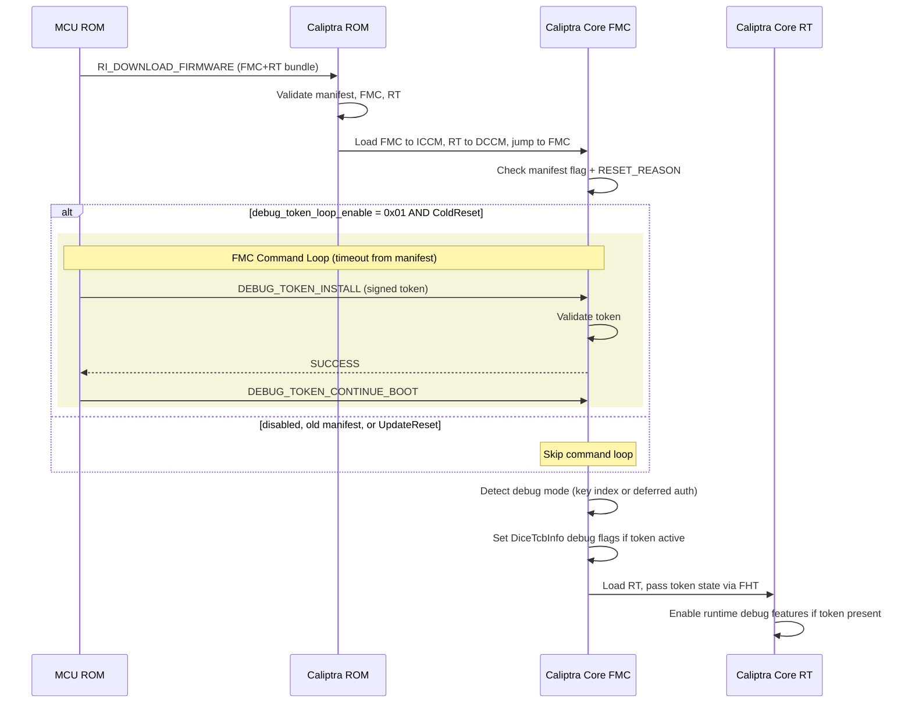
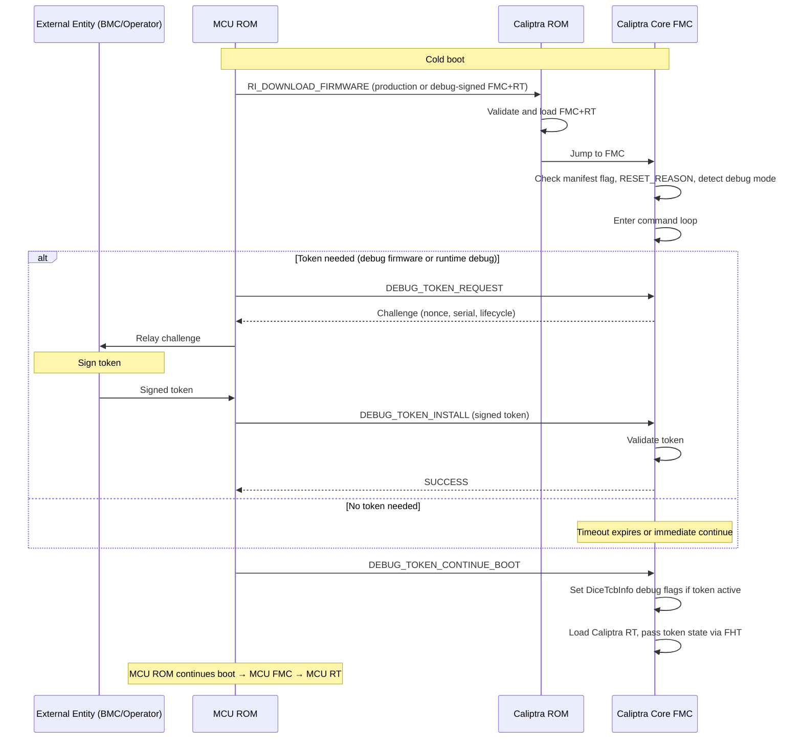
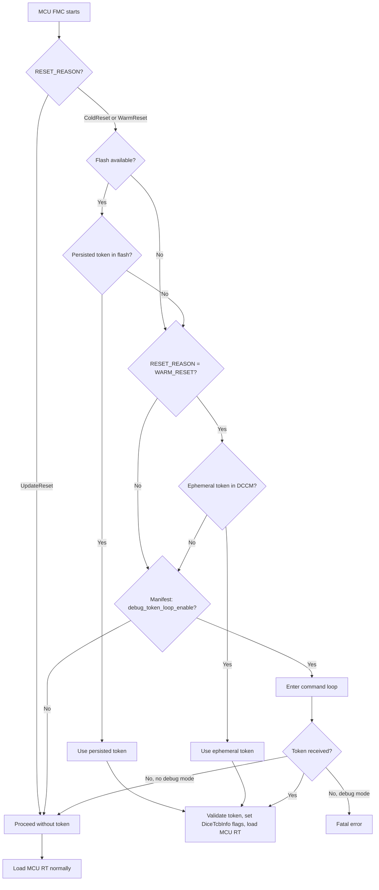
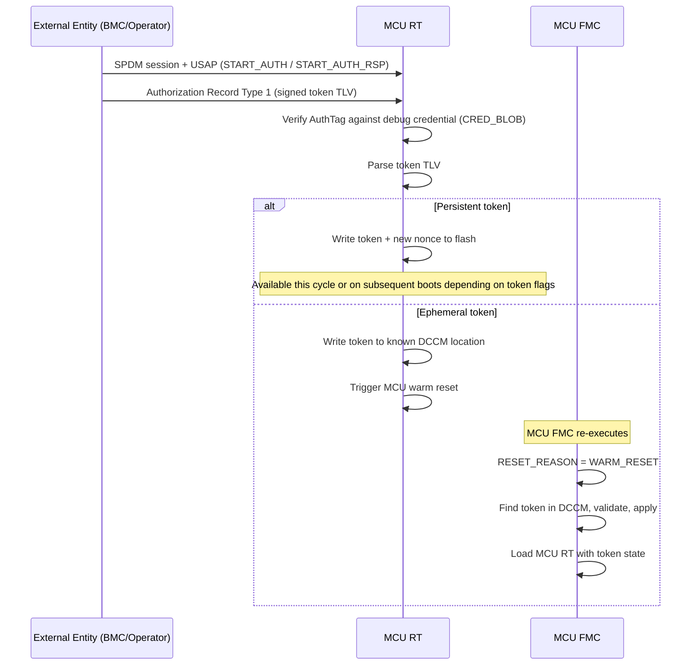

# Debug Token Proposal for Caliptra

**Status**: Draft Proposal
**Version**: 0.2

## Table of Contents

1. [Overview](#1-overview)
2. [Motivation & Use Cases](#2-motivation--use-cases)
3. [Caliptra Core Architecture](#3-architecture-overview)
4. [Caliptra Subsystem (MCU) Architecture](#4-caliptra-subsystem-mcu-architecture)
5. [Authorization Model](#5-authorization-model)
6. [Token Structures (TLV)](#6-token-structures-tlv)
7. [Caliptra Core Mailbox Commands](#7-caliptra-core-mailbox-commands)
8. [Caliptra Subsystem VDM Commands](#8-caliptra-subsystem-vdm-commands)
9. [Error Codes](#9-error-codes)
10. [Requirements](#10-requirements)
11. [Open Items](#11-open-items)
12. [Potential Simplifications](#12-potential-simplifications)
13. [References](#13-references)

---

## 1. Overview

This document proposes a debug token mechanism for Caliptra devices that complements the existing **Production Auth Debug Unlock** (which handles hardware debug — JTAG/TAP/DFT access via ROM). This proposal focuses on capabilities that Production Auth Debug Unlock does not cover: **loading debug-signed firmware** and **enabling runtime debug knobs** in production-fused devices.

For the Caliptra Core, the design enables debug of the **runtime firmware (Caliptra Core RT)** and supports debug-signed firmware loading. While token parsing could be done in ROM, Caliptra Core FMC debugging is unlikely to be needed in practice, and handling tokens in **Caliptra Core FMC (First Mutable Code)** avoids ROM changes and reduces complexity. Caliptra Core FMC is therefore the firmware stage that parses and enforces debug tokens during boot.

For Caliptra Core, debug tokens are **per-boot** — a fresh token must be delivered to Caliptra Core FMC via mailbox on every boot. This keeps the design simple and avoids persistent storage dependencies. The Caliptra Subsystem supports both persistent (flash) and ephemeral (DCCM) tokens (see [Section 4](#4-caliptra-subsystem-mcu-architecture)).

This proposal uses TLV-based structures for all token data. For the Caliptra Subsystem, **DSP0289 USAP** (SPDM Authorization) provides the authorization framework — tokens are delivered as Authorization Record payloads over SPDM sessions. For Caliptra Core, a simpler mailbox command interface is used, with MCU ROM relaying tokens to Caliptra Core FMC via the Caliptra mailbox (see [Section 5](#5-authorization-model)).

---

## 2. Motivation & Use Cases

Production-fused Caliptra devices enforce hardware debug lockout by default. Debug tokens provide a cryptographically authenticated mechanism to selectively re-enable debug capabilities without permanently compromising device security.

### 2.1 Use Case Table

| Token Type | Use Case |
|---|---|
| Debug Firmware | Allow Caliptra Core FMC to load debug-signed Caliptra Core RT firmware |
| Runtime Debug | Enable debug knobs, interfaces, and verbosity in Caliptra Core RT or MCU RT firmware at runtime |

> **Note**: Hardware debug unlock (JTAG/TAP/DFT access) is handled by the existing **Production Auth Debug Unlock** mechanism in ROM and is out of scope for this proposal.

---

## 3. Architecture Overview

### 3.1 Boot Flow with Debug Tokens

This section describes the Caliptra Core boot flow from ROM through Caliptra Core FMC to Caliptra Core RT, and where debug tokens fit in.

#### ROM Stage (no changes)

Caliptra ROM executes on cold boot. It validates the firmware manifest (signatures, digests, SVN) and loads Caliptra Core FMC into ICCM and Caliptra Core RT into DCCM. ROM validates **both** Caliptra Core FMC and Caliptra Core RT — Caliptra Core FMC does not re-validate Caliptra Core RT. ROM then jumps to Caliptra Core FMC.

ROM has no concept of debug tokens. It validates the firmware bundle against the vendor/owner keys in fuses, regardless of whether the firmware is a production or debug build. This raises a question: how does the system load debug-signed firmware through ROM, and how does Caliptra Core FMC know it received a debug build?

**Option A: Designated debug key index (no ROM change)**
- The vendor designates one of the existing vendor key indices (e.g., `vendor_ecc_pub_key_idx = 3`) as the debug signing key. Debug firmware builds are signed with this key.
- ROM validates the manifest and Caliptra Core FMC+RT images against this key as usual — ROM has no concept of "debug" vs. "production" keys. All keys in fuses are equally valid to ROM.
- After ROM passes control, Caliptra Core FMC reads `vendor_ecc_pub_key_idx` from the manifest and checks whether it matches the designated debug key index. This is how Caliptra Core FMC detects debug mode.

**Option B: Deferred RT authentication flag in manifest (ROM change)**
- A flag in the firmware manifest (e.g., in `OwnerSignedData.reserved`) tells ROM to skip Caliptra Core RT image digest/signature verification. ROM still validates the manifest signature and Caliptra Core FMC image — Caliptra Core FMC is trusted code.
- ROM loads Caliptra Core RT into DCCM without verifying its digest or signature.
- Caliptra Core FMC sees the deferred auth flag and knows it must validate Caliptra Core RT itself using debug signing keys authorized by the debug token.

In both options, Caliptra Core FMC knows whether it is dealing with a debug build before it enters the command loop. This determines whether Caliptra Core FMC enforces a hard gate (debug firmware token required) or allows optional runtime debug tokens.

#### Caliptra Core FMC Stage (new: command loop)

After ROM jumps to Caliptra Core FMC, it checks two things before loading Caliptra Core RT:

1. **Manifest flag**: Does the firmware manifest contain `debug_token_loop_enable = 0x01`?
2. **Reset reason**: Is `CPTRA_RESET_REASON` = ColdReset?

If both are true, Caliptra Core FMC enters a **mailbox command loop** before loading Caliptra Core RT. If either is false (old manifest, flag disabled, or UpdateReset), Caliptra Core FMC skips the loop and loads Caliptra Core RT immediately — fully backward compatible.

Production manifests that want to support runtime debug (e.g., verbose logging) should ship with the loop enabled and a short timeout. This allows MCU ROM to inject a runtime debug token within the timeout window without requiring a new FW bundle.

#### Caliptra Core FMC Command Loop

Caliptra Core FMC accepts the following mailbox commands during the loop (see [Section 7](#7-caliptra-core-mailbox-commands) for details):

- `DEBUG_TOKEN_REQUEST` (`"DTIR"`) — return challenge data (nonce, serial, lifecycle). Modeled after DSP0289 `START_AUTH` / `START_AUTH_RSP`.
- `DEBUG_TOKEN_INSTALL` (`"DTII"`) — receive and validate a signed debug token (TLV with optional VendorSignature)
- `DEBUG_TOKEN_CONTINUE_BOOT` (`"DTIB"`) — exit the command loop and proceed to load Caliptra Core RT

Debug token support is advertised via a capability bit in the existing Caliptra `CAPABILITIES` (`"CAPS"`) command.

Caliptra Core FMC exits the loop when it receives `DEBUG_TOKEN_CONTINUE_BOOT` or the manifest-configured **timeout** expires.

#### Caliptra Core FMC Exit: Two Paths

On exiting the command loop, Caliptra Core FMC determines which path to take:

**Debug firmware path** — Caliptra Core FMC detects debug key index in manifest (Option A) or deferred Caliptra Core RT auth flag (Option B):
- Caliptra Core FMC **must** have a valid debug firmware token — otherwise fatal error. Debug code never runs without a token.
- Caliptra Core FMC sets debug flags in DiceTcbInfo and/or mutates the Caliptra Core RT FWID so verifiers can detect debug mode.
- Caliptra Core FMC loads the debug-signed Caliptra Core RT already in DCCM (placed there by ROM via `RI_DOWNLOAD_FIRMWARE`).

**Runtime debug path** — production key index (Option A) or no deferred auth flag (Option B):
- If a runtime debug token was received during the loop, Caliptra Core FMC passes the token state to Caliptra Core RT via boot parameters. Caliptra Core RT enables debug knobs/logging based on the `RuntimeDebugPolicy` (0xC002) bitmask.
- If no token was received (timeout expired), Caliptra Core FMC loads Caliptra Core RT normally — no change to boot behavior.

#### Caliptra Core RT Stage (no changes)

Caliptra Core RT receives token state from Caliptra Core FMC via boot parameters (e.g., Firmware Handoff Table). If runtime debug is active, Caliptra Core RT enables the corresponding debug features. Caliptra Core RT itself requires no modifications for debug token support.

### 3.2 Manifest Fields

These fields are placed in a reserved region of the firmware manifest (such as `OwnerSignedData.reserved`), ensuring they are authenticated as part of the signed manifest and backward compatible with older manifests where reserved bytes are zero.

| Field | Size | Description |
|---|---|---|
| `debug_token_loop_enable` | 1 byte | 0x00 = disabled (skip loop), 0x01 = enabled. Zero in old manifests (treated as disabled). |
| `debug_token_loop_timeout_ms` | 4 bytes | Timeout in milliseconds. FMC exits the command loop after this period if no `DEBUG_TOKEN_CONTINUE_BOOT` is received. |

### 3.3 Security Properties

#### Debug Tokens vs. Production Debug Unlock

Debug tokens handled by Caliptra Core FMC are for **firmware-level debug** (debug-signed Caliptra Core RT, runtime debug knobs) — not hardware debug (JTAG/TAP). Because Caliptra Core FMC runs after ROM has completed key derivation:

- Caliptra Core FMC does not erase UDS or field entropy (ROM has already used them).
- When a debug token is active, Caliptra Core FMC **directly sets debug flags in DiceTcbInfo** and/or **mutates the RT FWID measurement** in the RT Alias certificate that it generates. Caliptra Core FMC owns the DICE derivation for the RT layer (it does not use DPE for this). This makes debug mode visible to verifiers via standard FWID/DiceTcbInfo policy checks. Verifiers validate certificate chains, not pinned keys, so an explicit signal in the certificate metadata is required.
- No hardware debug interfaces are opened — that remains the domain of ROM's Production Auth Debug Unlock.

#### UpdateReset Restriction

Caliptra Core FMC **must not** accept debug tokens on FW Update Reset (`CPTRA_RESET_REASON` = UpdateReset). On UpdateReset, ICCM/DCCM contents are preserved and production Caliptra Core RT state (CDI, private keys) remains in the Key Vault. Loading debug firmware via UpdateReset would give debug code access to production secrets. Caliptra Core FMC checks the reset reason register and skips the command loop entirely on UpdateReset.

### 3.4 End-to-End Flow

The debug token lifecycle for Caliptra Core consists of four phases: **Request**, **Sign**, **Install**, and **Debug**. Since tokens are per-boot (ephemeral), there is no erase phase — to stop debug, the SoC Manager simply boots with production firmware on the next cold boot.

Because Caliptra Core is the RTM and cannot be independently reset, debug token installation requires a **full cold boot** (power cycle). The debug-signed firmware bundle (containing FMC+RT) is delivered to Caliptra ROM via `RI_DOWNLOAD_FIRMWARE` during cold boot. The debug token is delivered separately to FMC via the command loop.

- **Debug firmware token**: Requires debug-signed FW bundle. FMC detects debug mode (key index or deferred auth). Hard gate — no token means fatal error.
- **Runtime debug token**: Production FW. Enables debug knobs/logging in RT.
- Both token types use the same challenge-response flow: `DEBUG_TOKEN_REQUEST` → sign → `DEBUG_TOKEN_INSTALL`. All tokens require a fresh nonce.
- **No token**: Timeout expires or MCU ROM sends `DEBUG_TOKEN_CONTINUE_BOOT` immediately. FMC loads RT normally.

> **How MCU ROM relays to external entity**: MCU ROM has MCTP VDM over I3C. It receives DSP0289 messages from the external entity via MCTP VDM and translates them into Caliptra Core mailbox commands for Caliptra Core FMC (see [Section 5.1](#51-caliptra-core)). The relay path does not need to be secure since the end-to-end challenge-response protocol provides integrity.

> **Stopping debug**: Load a production firmware bundle whose manifest has `debug_token_loop_enable = 0x00` (or a shorter timeout). FMC skips the command loop and loads production RT immediately.

---

## 4. Caliptra Subsystem (MCU) Architecture

This section describes debug token support for the Caliptra Subsystem (MCU). The design introduces an **MCU FMC** stage with the same command loop pattern used for Caliptra Core. The MCU FMC is the enforcement point for MCU debug tokens, and operates identically regardless of whether the MCU boots from flash or via streaming boot — only the source of firmware and tokens differs.

### 4.1 MCU Boot Flow with Debug Tokens

#### MCU ROM Stage (no changes)

MCU ROM loads MCU firmware (from flash or via streaming boot) and jumps to MCU FMC. MCU ROM has no awareness of debug tokens.

As with Caliptra Core, how MCU ROM handles debug-signed MCU firmware depends on the option chosen:
- **Option A**: Designated debug key index. MCU ROM validates normally; MCU FMC detects debug mode via key index.
- **Option B**: Deferred RT auth flag in manifest. MCU ROM skips MCU RT verification; MCU FMC validates MCU RT itself.

#### MCU FMC Stage (new: command loop + token priority logic)

After MCU ROM jumps to MCU FMC, FMC determines whether a debug token is available before loading MCU RT. The following priority logic applies:

1. **Check reset reason**: If `RESET_REASON = UpdateReset`, skip all token processing — no flash check, no DCCM check, no command loop. Proceed to load MCU RT normally. (UpdateReset preserves production secrets; debug tokens must not be applied.)
2. **Check flash for persisted token** (if flash is available): If a valid persisted token is found, use it. Skip the command loop.
3. **Check DCCM for ephemeral token** (if `RESET_REASON = WARM_RESET`): If a valid token is found at the well-known DCCM location, use it. Skip the command loop.
4. **If both flash and DCCM tokens exist**: Use the flash (persisted) token. Log that the ephemeral DCCM token was ignored.
5. **Check manifest flag**: If `debug_token_loop_enable = 0x01`, enter the command loop.
6. **No token, no command loop**: Proceed to load MCU RT normally.

The command loop uses **DSP0289 USAP over an SPDM session** (carried via MCTP VDM over I3C, inherited from MCU ROM). The full authorization flow is described in [Section 5.2](#52-caliptra-subsystem-mcu). Two additional Caliptra-defined MCTP VDM commands (1-byte codes) are used alongside the DSP0289 messages (see [Section 8](#8-caliptra-subsystem-vdm-commands)):
- `DEBUG_TOKEN_QUERY` (0x0D) — report current token status
- DSP0289 `END_AUTH` — signals end of USAP session; MCU FMC exits the command loop and proceeds to load MCU RT

When a valid token is found (from any source), MCU FMC:
- Sets DiceTcbInfo debug flags and/or mutates MCU RT FWID in the MCU RT Alias certificate.
- If debug mode is detected (debug key index or deferred auth), requires a valid token or fatal error (hard gate).
- Loads MCU RT, passing token state via boot parameters.

#### MCU RT Stage

MCU RT receives token state from MCU FMC via boot parameters. If runtime debug is active, MCU RT enables the corresponding debug features.

Additionally, MCU RT supports **token installation and management** via SPDM sessions (see [Section 4.4](#44-token-installation-via-mcu-rt-spdm)).

### 4.2 MCU FMC Token Priority

> **Note**: UpdateReset skips all token processing — persistent and ephemeral tokens are not applied. If both a persisted flash token and an ephemeral DCCM token exist, the flash token takes priority. The ephemeral token is ignored and logged.

### 4.3 Debug Attestation via DPE

Unlike Caliptra Core FMC (which directly generates the RT Alias certificate and can set DiceTcbInfo flags in it), MCU FMC does not own its DICE chain. The MCU's DICE chain is managed by **Caliptra Core via DPE**. Therefore, MCU FMC must use DPE commands (via Caliptra Core mailbox) to signal debug mode in the attestation chain.

When a debug token is active, MCU FMC must:

1. **Set debug flags via DPE**: When calling `DeriveContext` to create the MCU RT context, MCU FMC includes debug flags in the TCI data. This ensures the DPE-generated certificates for the MCU RT layer carry DiceTcbInfo indicating debug mode.
2. **Stash measurements with debug indication**: When stashing MCU RT measurements (e.g., via `ExtendTci` or equivalent), MCU FMC must include the debug state so that the measurement chain reflects that debug firmware or debug knobs are active.

> **DPE extension needed**: The current DPE `DeriveContext` command does not have a debug flag. However, the DICE TcbInfo structure already defines a flags field (tag [7]) with `FLAG_BIT_DEBUG` (bit 3). Caliptra's ROM DICE layer already uses this flag based on lifecycle/debug lock status, but DPE's certificate generation currently skips encoding tag [7]. The required changes are: (a) add a debug flag to `DeriveContextFlags`, and (b) have DPE encode the flags field (tag [7]) in TcbInfo when generating certificates. This is tracked as an open item in [Section 11](#11-open-items).

### 4.4 Token Installation via MCU RT (SPDM)

When MCU RT is running, it has a full MCTP/SPDM stack and receives debug tokens via **DSP0289 USAP within an SPDM secure session** — the same protocol used by MCU FMC during cold boot (see [Section 5.2](#52-caliptra-subsystem-mcu)). This is the primary path for installing tokens when the system is operational. In-field debug of Caliptra Core is expected to be extremely rare; Caliptra Subsystem debug is more likely than Core but less likely than SoC FW debug. The MCU RT SPDM path covers Subsystem and SoC FW tokens only. Core tokens are delivered separately via the cold boot FMC command loop (see [Section 3](#3-architecture-overview)).

The token itself indicates whether it should be persisted or treated as ephemeral (via a persistence flag in the TLV structure).

**Token scope**: MCU RT can receive tokens for itself or for SoC firmware. The MCU/Subsystem is the Root of Trust for SoC firmware — how it coordinates debug capabilities with SoC FW is integration-specific.

### 4.5 Token Erase

Persistent tokens are erased via an MCU RT command. MCU FMC does not support erase (simplicity). Erase does not require SPDM authorization — erasing a debug token moves the device to a more secure state.

MCU RT erases by:
1. Removing the token from flash storage.
2. Optionally incrementing the device's ratchet counter to bulk-invalidate all previously signed tokens. This uses the Erase Token command's special value `0xFFFFFFFE` (see Erase Token command). Tokens with a ratchet value below the device counter are rejected with `TOKEN_RATCHET_CHECK_FAILED` (see [Section 9](#9-error-codes)). The ratchet TLV types (`VendorRatchet` 0x0010, `OemRatchet` 0x0011) are defined in [Section 6.7](#67-common-tlv-types-0x00010x00ff).

### 4.6 Firmware Update Interaction

When a debug token is installed (persistent or ephemeral), firmware update flows must account for the token:
- **Token present, FW update requested**: The FW update may proceed. The interaction between installed debug tokens and firmware updates is tracked as an open item in [Section 11](#11-open-items).
- **Debug-signed FW installed, token erased**: MCU FMC detects debug mode (key index) but no token — fatal error. A production FW update must be performed to restore normal boot.

### 4.7 Nonce Rules for Persistent Tokens

For persistent Subsystem tokens delivered via DSP0289 USAP, the RequesterNonce in `START_AUTH` shall be zero — persistent tokens do not require requester-side freshness. The ResponderNonce provides device binding. The install flow is:

1. MCU FMC (or MCU RT) generates a nonce and stores it in flash.
2. The nonce is returned as both the ChallengeNonce (0x0002) in the TLV response and the ResponderNonce in `START_AUTH_RSP` — these are the same value.
3. The signing service signs the token with RequesterNonce=0, the ResponderNonce, SequenceNumber, and the TLV payload per DSP0289 USAP AuthTag construction.
4. On install: the token's AuthTag is verified. On success, the token is persisted to flash alongside the ResponderNonce (already stored from step 1).

On subsequent boots, MCU FMC loads the persisted token and ResponderNonce from flash and **re-verifies the AuthTag** by reconstructing the AuthMsgBody (RequesterNonce=0, persisted ResponderNonce, SequenceNumber, TLV payload). Future token requests generate a fresh nonce on-demand.

> **Alternative**: Instead of persisting the ResponderNonce, the device may re-sign the validated token using a device-local key (e.g., a key derived similarly to the CRED_BLOB sealing key) before writing to flash. On subsequent boots, the device verifies this local signature instead of re-verifying the AuthTag. This avoids persisting nonce material at the cost of an additional signing operation at install time.

**Session lifetime for persistent tokens**: Since the ResponderNonce is stored in flash before the challenge is sent (step 1), the SPDM session does not need to stay alive for the entire signing flow. If the session drops, the BMC can establish a new session and the device returns the same stored nonce in `START_AUTH_RSP` (rather than generating a fresh one). This allows the signing service to operate offline — the token can be delivered in a later session. Once a token is installed, the stored nonce is consumed and future requests generate a fresh nonce.

**Threat note**: A persisted token in flash is vulnerable to physical attacks (an attacker with flash access could extract and replay the token). This is an accepted tradeoff for the convenience of rapid iterative debugging without re-signing on every boot. The token signer's policy determines whether persistent tokens are acceptable for a given deployment.

> **Deployment rationale**: Persistent tokens prioritize usability during iterative field debug. In production deployments, the debug cycle typically involves repeated reboots (firmware crashes, RMA diagnostics, silicon bring-up) where re-requesting a signed token on every boot would bottleneck the workflow. The one-time nonce verification at install provides cryptographic freshness for token issuance, while allowing the validated token to be reused across subsequent boots without external interaction. This pattern has been validated in large-scale production environments where thousands of devices undergo concurrent debug triage, each cycling through many firmware iterations and reboots per debug session. The signing service's token type policy controls whether persistent tokens are offered for a given device class, so deployments requiring per-boot freshness can restrict issuance to ephemeral tokens without any device-side changes.

**Ephemeral tokens**: Delivered via MCU RT (SPDM). The nonce is fresh — generated at the start of the USAP session. The SPDM session must remain alive through the full flow (START_AUTH → challenge → signing service → Authorization Record delivery). If the session drops, the nonces are lost and the flow must restart. No flash persistence occurs. Ephemeral tokens in DCCM survive across MCU warm resets — this is intentional. The lifetime of an ephemeral token is cold reset to cold reset; it remains valid across warm reset cycles within the same cold boot session.

### 4.8 Comparison: Core vs. Subsystem

| Aspect | Caliptra Core | Caliptra Subsystem (MCU) |
|---|---|---|
| Authorization protocol | None (mailbox + TLV) | DSP0289 USAP over SPDM session |
| Debug key source | Debug public key in manifest | Debug credential in CRED_BLOB |
| FMC command loop | Yes (mailbox commands) | Yes (DSP0289 over MCTP VDM) |
| Token persistence | No (ephemeral only) | Yes (flash) or No (ephemeral via DCCM) |
| Token delivery (RT not up) | MCU ROM relays to Core FMC (MCTP VDM → mailbox) | MCU FMC applies locally via USAP |
| Token delivery (RT up) | N/A for Core | MCU RT via USAP in SPDM session |
| Erase | N/A (per-boot) | MCU RT command |
| Nonce exchange | `DEBUG_TOKEN_REQUEST` (mailbox) | `START_AUTH` / `START_AUTH_RSP` (DSP0289) |
| DiceTcbInfo debug flags | Set directly by FMC in RT Alias cert | Set via DPE commands to Caliptra Core |

---

## 5. Authorization Model

### 5.1 Caliptra Core

Caliptra Core has no knowledge of DSP0289, SPDM, or MCTP. Authorization is handled entirely via the Caliptra Core mailbox command interface.

The firmware manifest carries a **debug public key** (or its hash). Core has no access to the CRED_BLOB or the DSP0289 credential hierarchy.

The token delivered to Caliptra Core FMC is a **TLV structure with VendorSignature (0x000B)**. Caliptra Core FMC verifies VendorSignature using the same signature scheme as Caliptra secure boot (e.g., ECDSA-P384), against the debug public key from the manifest. Core has no concept of DSP0289 or Authorization Records — MCU ROM extracts the TLV from the external entity's Authorization Record before forwarding it.

Core tokens are delivered by **MCU ROM** during the Caliptra Core FMC command loop. The external entity speaks DSP0289 messages over MCTP VDM (without an SPDM session). MCU ROM translates between the external DSP0289 messages and Caliptra Core mailbox commands:

- External `START_AUTH` → MCU ROM → `DEBUG_TOKEN_REQUEST` on Core mailbox
- Core FMC nonce response → MCU ROM → `START_AUTH_RSP` on MCTP VDM
- External Authorization Record Type 1 → MCU ROM extracts the `MsgToAuthPayload` field (which is the TLV token with VendorSignature) → `DEBUG_TOKEN_INSTALL` on Core mailbox

> **Note**: The Core path uses DSP0289 message formats without an SPDM session. This is a profile relaxation — the token's VendorSignature and challenge nonce provide end-to-end integrity without requiring a secure channel. See [Section 12.1](#121-sessionless-dsp0289-at-mcu-fmc) for the same rationale applied to MCU FMC.

### 5.2 Caliptra Subsystem (MCU)

The Subsystem uses **DSP0289 USAP** (User-Specific Authorization Process) for debug token authorization. The external entity (BMC/operator tool) is the SPDM Requester. MCU FMC or MCU RT is the SPDM Responder and Authorization Target.

The debug signing credential is a dedicated credential ID in the DSP0289 credential hierarchy, provisioned via the existing **CRED_BLOB** mechanism (HMAC-SHA-512 sealed blobs in SPI flash, key derived from LDevID CDI — see caliptra-mcu-sw PR #906).

**MCU FMC** (cold boot, MCU RT not yet up):

MCU ROM already has MCTP VDM over I3C. MCU FMC inherits this capability and implements an SPDM responder (reusing the existing `spdm-lib` crate from MCU RT). DSP0289 USAP runs within an SPDM secure session. The flow:

1. **SPDM session establishment**: BMC initiates session with MCU FMC (version, capabilities, algorithms, key exchange).
2. **DSP0289 discovery**: `GET_AUTH_VERSION` → `SELECT_AUTH_VERSION` → `GET_AUTH_CAPABILITIES` within the session.
3. **USAP nonce exchange**: `START_AUTH` (CredentialID, RequesterNonce) → `START_AUTH_RSP` (ResponderNonce). The operator's nonce and MCU FMC's nonce together bind the token to this session.
4. **Token delivery**: Operator sends signed token as Authorization Record Type 1 (AuthTag + TLV payload) within the SPDM session. MCU FMC verifies the AuthTag against the debug credential from CRED_BLOB.
5. **Session teardown and continue boot**: `END_AUTH` → `END_AUTH_RSP`. MCU FMC exits the command loop and proceeds to load MCU RT.

**MCU RT** (system operational):

Full USAP within an SPDM secure session, same protocol as MCU FMC. MCU RT can only receive Subsystem tokens. MCU RT stores persistent tokens to flash or ephemeral tokens to DCCM (see [Section 4.4](#44-token-installation-via-mcu-rt-spdm)).

### 5.3 Token Delivery Paths

Core and Subsystem tokens use separate delivery paths at different points in the boot sequence:

| Target | Delivery Point | Path | Protocol |
|---|---|---|---|
| Caliptra Core | Caliptra Core FMC command loop (early boot) | MCU ROM translates between external entity and Caliptra Core FMC | DSP0289 messages over MCTP VDM (external, no SPDM session) → Core mailbox commands (Core side) |
| Subsystem (RT not up) | MCU FMC command loop (after Core boot) | External entity → MCU FMC directly | DSP0289 USAP over SPDM session (MCTP VDM) |
| Subsystem (RT up) | MCU RT (system operational) | External entity → MCU RT directly | DSP0289 USAP over SPDM session |

A **token target** TLV field (0xC003) in the token structure identifies the intended target (`0x01` = Core, `0x02` = Subsystem). The token target is inside the signed TLV payload, ensuring it cannot be tampered with. The signing server sets this field; the external entity and MCU ROM do not need to interpret it — Core FMC and MCU FMC each validate that received tokens match their expected target.

### 5.4 Device Binding

The challenge nonce is the primary device-binding mechanism. The nonce is cryptographically unique and by itself binds the token to a specific device.

- **Caliptra Core**: FMC generates a fresh nonce via TRNG on each boot. Tokens are per-boot. The nonce is returned via `DEBUG_TOKEN_REQUEST` mailbox command. MCU ROM relays the challenge to the external entity.
- **Caliptra Subsystem**: Nonce exchange via DSP0289 `START_AUTH` / `START_AUTH_RSP`. For persistent tokens, the nonce is persisted to flash alongside the token. On subsequent boots, the token signature is re-verified but the nonce is not regenerated (see [Section 4.7](#47-nonce-rules-for-persistent-tokens)).

The token may also carry the device serial number (ECID) for additional identification, but the nonce alone is sufficient for binding.

### 5.5 Credential Provisioning

| Target | Debug Key Source | Provisioning |
|---|---|---|
| Caliptra Core | Debug public key (or hash) in firmware manifest | Embedded at firmware signing time. Core has no access to CRED_BLOB. |
| Caliptra Subsystem | Dedicated debug credential ID in CRED_BLOB | Provisioned via the DSP0289 credential hierarchy (caliptra-mcu-sw PR #906). New credential ID with debug-specific privileges in the PolicyEngine. |

### 5.6 Signed Challenge

The DSP0289 `START_AUTH_RSP` exchange returns the device's challenge nonce. For device binding purposes, the nonce alone is sufficient (see [Section 5.4](#54-device-binding)). However, the device MAY additionally sign the challenge response using a device-unique key. The signed challenge covers the nonce, device serial number, and lifecycle state. The device's certificate chain (rooted in a vendor or platform CA via the DICE hierarchy) accompanies the signed response, allowing the signing service to verify the signature and authenticate the device identity without relying on the operator to assert these fields.

A signed challenge gives the signing service verified inputs for its token issuance policy:

- **Serial number**: The signing service can identify the specific device and apply per-device or per-fleet policies (e.g., restricting token issuance to a known set of devices, determining the approval requirements for issuance, or tracking which devices have been issued tokens for audit).
- **Lifecycle state**: The signing service can condition token issuance on the reported lifecycle state, for example refusing to issue persistent tokens for devices in a production or manufacturing lifecycle or restricting debug scope based on fuse state.
- **Device identity**: The certificate chain ties the challenge to a specific device in the DICE attestation hierarchy, providing a non-forgeable record of which device requested the token.

In deployments where the signing service operates at scale (silicon bring-up, RMA triage, fleet diagnostics), these verified inputs allow the signing service to make policy decisions with minimal operator involvement, reducing the latency of token issuance without weakening the trust model.

This mechanism is not mandated by the device-side protocol. The device provides the capability, and the signing service's policy determines whether to require it. Deployments that do not need independent device verification can use the unsigned `START_AUTH_RSP` nonce directly. The TLV type space includes CertificateChain (0x0013) to support signed challenge payloads when this capability is used.

---

## 6. Token Structures (TLV)

### 6.1 Design Goals

The TLV format was chosen for debug token structures to satisfy the following goals:

- **Interoperability**: The TLV type space is globally coordinated so that a platform containing both Caliptra devices and other vendor devices (e.g., GPUs, NICs, switches) can use the same signing infrastructure and tooling. The DeviceType field (0x0001) in every token unambiguously identifies the target device class. A single parser handles tokens for all device types.
- **Extensibility**: The TLV format is self-describing — each entry carries its own type and length, and parsers skip unknown types. New device-specific fields can be added without modifying the core format or requiring client code updates.
- **Transport independence**: The same TLV structures work over MCTP VDM, SPDM, and file-based transfers.
- **Unified signing service**: One signing infrastructure handles tokens for all device types on a platform.

### 6.2 Fixed Header

Every TLV structure begins with a 32-byte fixed header:

| Field | Size (bytes) | Description |
|---|---|---|
| Identifier | 4 | `0x544C5631` — ASCII `"TLV1"`, stored as byte array `[0x54, 0x4C, 0x56, 0x31]` |
| Version | 4 | `xxxx.yyyy` format: 2 bytes major, 2 bytes minor, little-endian. Version 1.0 = `[0x01, 0x00, 0x00, 0x00]` |
| Size | 4 | Total length of the TLV payload excluding the header (in bytes) |
| Reserved | 20 | Reserved for future use; must be zero |

### 6.3 TLV Entry Format

Each TLV entry following the fixed header has this layout:

| Field | Size (bytes) | Description |
|---|---|---|
| Type | 2 | Type identifier (little-endian) |
| Length | 2 | Length of the Value field in bytes (little-endian) |
| Value | variable | Data field of variable size |

### 6.4 TLV Encoding Rules

#### Byte Order (Endianness)

All TLV Value fields are treated as byte arrays. However, for TLVs where the Value represents structured data (e.g., integers, version numbers, or compound fields), the byte order for interpreting multi-byte numeric values shall be **little-endian**. This ensures consistent parsing across platforms.

For example:
- A 16-bit integer value of `0x0001` shall be encoded as `[0x01, 0x00]`.
- A version field `1.0` (Major=1, Minor=0) shall be represented as `[0x01, 0x00, 0x00, 0x00]`.

#### TLV Entry Ordering

No specific ordering is enforced for TLV entries, with the exception that signature TLV entries (VendorSignature 0x000B, OemSignature 0x000C) shall be the **last** entries when present, so the signature covers all preceding TLV data. VendorSignature (0x000B) is present in Caliptra Core tokens only. Caliptra Subsystem tokens do not include VendorSignature — the DSP0289 Authorization Record AuthTag is the sole signature.

### 6.5 Type ID Space

The 16-bit type ID space is partitioned to enable interoperability across all device types on a platform:

| Range | Assignment | Description |
|---|---|---|
| `0x0001`–`0x00FF` | **Common Types** | Shared across ALL device types (Caliptra and other vendors). These types have identical semantics regardless of device. |
| `0x0100`–`0x3FFF` | Reserved Common | Reserved for future common type allocation |
| `0x4000`–`0x47FF` | **Reserved** | Allocated for other vendor device types. **Do not use for Caliptra.** |
| `0x4800`–`0xBFFF` | Reserved | Reserved for future device type allocation |
| `0xC000`–`0xC0FF` | **Caliptra** | Device-specific types for Caliptra devices |
| `0xC100`–`0xFEFF` | Future Caliptra | Reserved for future Caliptra device type ranges |
| `0xFF00`–`0xFFFF` | Special Reserved | Reserved; must not be used |

> **Interoperability note**: The `0x4000`–`0x47FF` range is reserved for other vendor device types that may coexist on the same platform. The Caliptra range (`0xC000`–`0xC0FF`) is positioned far from this range to avoid any possibility of collision, even in the event of future range expansions.

### 6.6 FieldClass and Consumer Enums

#### FieldClass Enums

| Enum | Description |
|---|---|
| TokenMetadata | Fields describing the token itself such as its type, configurations, validity constraints |
| DeviceInfo | Fields that describe the identity or runtime state of the device itself, including static/fused properties (e.g., Serial Number) and dynamic properties (e.g., FirmwareVersion, AgentVersion) |
| AuthenticationData | Fields that support verification or trust establishment including nonces and certificate chains |
| StatusInfo | Fields indicating the current processing, install, or handling status of a token or command |
| ErrorInfo | Fields specifically used to report error codes or failure reasons |
| SecurityState | Fields that influence or gate debug token validity based on the device's secure state |
| PayloadData | Fields containing operational data the device consumes at runtime |

#### Consumer Enums

| Enum | Description |
|---|---|
| SigningService | The backend system that receives token requests and issues signed tokens. |
| SigningClient | The client or SoC Manager-side tool that prepares and submits token request files to the signing service. |
| Device | The target hardware device that receives the token. |
| PlatformController | The SoC Manager or platform controller that may handle token install/query flows or status interpretation. |
| Agent | Any in-band application or runtime client (e.g., flash utility, token validator) that parses tokens or constructs requests. |

### 6.7 Common TLV Types (0x0001–0x00FF)

These types are shared across all device types. Parsers for any device class must understand these types.

| Type ID | Name | Description | Data Type | FieldClass | Consumer |
|---|---|---|---|---|---|
| 0x0001 | DeviceType | Device type identifier. **Enum values**: 0x01–0x09 = reserved (other vendor device types), **0x80 = Caliptra** | uint16 | DeviceInfo | SigningService, SigningClient |
| 0x0002 | ChallengeNonce | Nonce data generated by device | byte array | AuthenticationData | SigningService, Device |
| 0x0003 | DeviceSerialNumber | Unique serial number of the device | byte array | DeviceInfo | SigningService, PlatformController, Agent, Device |
| 0x0004 | DeviceSerialNumberArray | List of device serial numbers (multi-device token) | byte array | DeviceInfo | SigningService, Device, PlatformController, Agent |
| 0x0005 | FirmwareVersion | Firmware version requesting the token | ASCII string / byte array | DeviceInfo | Device |
| 0x0006 | AgentVersion | Token-to-device firmware lifecycle management version. **TBD**: Applicability to Caliptra to be determined. | uint | DeviceInfo | SigningService, Device |
| 0x0007 | LifecycleState | Device lifecycle state | bitfield | SecurityState | SigningService, SigningClient, Device |
| 0x0008 | TokenIdentifier | Unique token identifier (magic number) | ASCII string / byte array | TokenMetadata | SigningService, Device |
| 0x0009 | TokenType | Type of token | enum | TokenMetadata | SigningService, SigningClient, Device |
| 0x000A | TokenConfig | Token-specific attributes | bitfield | TokenMetadata | SigningService, Device |
| 0x000B | VendorSignature | Signature over all preceding TLV entries (must be last entry). Used for Caliptra Core tokens only: same signature scheme as Caliptra secure boot (e.g., ECDSA-P384), verified against the debug public key from the manifest. Caliptra Subsystem tokens do not include VendorSignature — the DSP0289 Authorization Record AuthTag is the sole signature for Subsystem tokens. | byte array | AuthenticationData | SigningService, Device |
| 0x000C | OemSignature | Owner/OEM signature over TLV data | byte array | AuthenticationData | Device |
| 0x000D | InstallStatus | Whether a debug token is currently installed on the device. Values: 0 = not installed, 1 = installed | enum | StatusInfo | PlatformController, Agent, Device |
| 0x000E | ProcessingStatus | Token processing status set by the endpoint. Values: 0 = not processed, 1 = processed | enum | StatusInfo | PlatformController, Agent, Device |
| 0x000F | SkuInformation | Production SKU or Debug SKU. Values: 0x1 = Debug, 0x2 = Prod | enum | DeviceInfo | SigningService, Device |
| 0x0010 | VendorRatchet | Vendor ratchet value for anti-replay | uint | SecurityState | SigningService, Device |
| 0x0011 | OemRatchet | Owner/OEM ratchet value | uint | SecurityState | Device |
| 0x0012 | ValidityCounter | Counter decremented upon each token application | uint | TokenMetadata | Device |
| 0x0013 | CertificateChain | Certificate chain for the signing authority | byte array | AuthenticationData | SigningService, Device, PlatformController, Agent |
| 0x0014 | MeasurementTranscript | Transcript for measurement (e.g., SPDM measurement data) | byte array | AuthenticationData | SigningService, Device, PlatformController, Agent |
| 0x0015 | DeviceId | Hardware-fused identifier assigned during manufacturing | uint | DeviceInfo | SigningService, Device |
| 0x0016 | TokenTypeSubtypeList | List of installed debug token type and subtype pairs | array of struct | TokenMetadata | PlatformController, Agent, Device |
| 0x0017 | Payload | Payload data in the token | byte array | PayloadData | SigningService, Device |
| 0x0018 | LegacyToken | Legacy token payload (backward compatibility). **TBD**: Applicability to Caliptra to be determined. | byte array | PayloadData | SigningClient, Agent, Device |

### 6.8 Caliptra TLV Types (0xC000–0xC0FF)

These types are specific to Caliptra devices and are only meaningful when `DeviceType = 0x80 (Caliptra)`.

> **Note**: Types 0xC000–0xC002 are illustrative examples of Caliptra-specific policy fields. The same information may alternatively be expressed using common types (e.g., TokenType 0x0009 and TokenTypeSubtypeList 0x0016 for debug policies, LifecycleState 0x0007 for fuse state). These type IDs are reserved for Caliptra but their final form may change based on whether the common types are sufficient.

| Type ID | Name | Description | Data Type | FieldClass | Consumer |
|---|---|---|---|---|---|
| 0xC000 | FirmwareDebugPolicy | Bitmask controlling which firmware components are permitted to run with debug signing. Each bit corresponds to a specific firmware component. | uint32 | SecurityState | SigningService, Device |
| 0xC001 | CaliptraFuseState | Hash of the device's fuse configuration at token request time. Used by the signing service to validate device identity and state. | byte array (32) | SecurityState | SigningService, Device |
| 0xC002 | RuntimeDebugPolicy | Bitmask controlling which runtime debug knobs and interfaces are enabled by the token. | uint32 | SecurityState | SigningService, Device |
| 0xC003 | TokenTarget | Authorization target for this token. `0x01` = Caliptra Core, `0x02` = Caliptra Subsystem (MCU). Each target validates that received tokens match the expected value. See [Section 5.3](#53-token-delivery-paths). | uint8 | Routing | SigningService, Device |

### 6.9 Example Structures

#### Challenge Response Structure

Returned by Caliptra Core FMC in response to Request Token (0x04):

| | Fixed Header (32 bytes) | |
|---|---|---|
| **Type** | **Length (bytes)** | **Value** |
| 0x0001 (DeviceType) | 2 | 0x80 (Caliptra) |
| 0x0002 (ChallengeNonce) | 32 | \<random nonce from Caliptra TRNG\> |
| 0x0003 (DeviceSerialNumber) | 16 | \<device ECID\> |
| 0x0005 (FirmwareVersion) | 4 | \<current firmware version\> |
| 0x0006 (AgentVersion) | 2 | \<agent version\> |
| 0x0007 (LifecycleState) | 4 | \<set of device lifecycle fuses\> |
| 0x0010 (VendorRatchet) | 4 | \<current ratchet counter\> |
| 0x0011 (OemRatchet) | 4 | \<current OEM ratchet counter\> |

#### Token Main Structure

The signed token delivered to the device for installation:

| | Fixed Header (32 bytes) | |
|---|---|---|
| **Type** | **Length (bytes)** | **Value** |
| 0x0008 (TokenIdentifier) | 4 | "CDTI" (Caliptra Debug Token Install) |
| 0x0002 (ChallengeNonce) | 32 | \<nonce from challenge response\> |
| 0x0003 (DeviceSerialNumber) | 16 | \<target device serial number\> |
| 0x0005 (FirmwareVersion) | 4 | \<firmware version\> |
| 0x0006 (AgentVersion) | 2 | \<agent version\> |
| 0x0007 (LifecycleState) | 4 | \<expected lifecycle state\> |
| 0x0016 (TokenTypeSubtypeList) | 8\*N | \<list of [Type\|Subtype] pairs\> |
| 0x000A (TokenConfig) | 2 | \<token configuration flags\> |
| 0xC000 (FirmwareDebugPolicy) | 4 | \<firmware component debug signing bitmask\> |
| 0xC002 (RuntimeDebugPolicy) | 4 | \<runtime debug knob bitmask\> |
| 0x0010 (VendorRatchet) | 4 | \<minimum ratchet value\> |
| 0x0017 (Payload) | L0 | \<optional payload data\> |

> For Caliptra Core tokens, this TLV includes VendorSignature (0x000B) as the sole signature. For Caliptra Subsystem tokens, this TLV does not include VendorSignature — it is wrapped in a DSP0289 Authorization Record Type 1 whose AuthTag is the sole signature. The ChallengeNonce (0x0002) is covered by the signature in both cases, binding the token to the device's challenge.

### 6.10 Interoperability Note

The `DeviceType` field (0x0001) is present in every challenge response and token structure. This allows disambiguation even if type IDs were to overlap across device-specific ranges — a parser that encounters an unknown device-specific TLV can use DeviceType to determine whether it should be processed or skipped.

Future tooling could leverage this to support a single unified parser for all device types on a platform, routing device-specific TLVs to the appropriate handler based on the DeviceType value. For the initial implementation, maintaining well-separated type ID ranges (0x4000–0x47FF reserved for other vendors, 0xC000–0xC0FF for Caliptra) provides collision-free operation without requiring such tooling.

---

## 7. Caliptra Core Mailbox Commands

### 7.1 Overview

The commands in this section are **Caliptra Core mailbox commands** — used by MCU ROM to interact with Caliptra Core FMC during the debug token command loop. MCU ROM translates between external DSP0289 messages (over MCTP VDM) and these mailbox commands (see [Section 5.1](#51-caliptra-core)). The Caliptra Subsystem (MCU) path uses **DSP0289 authorization messages** over SPDM VDM instead (see [Section 5.2](#52-caliptra-subsystem-mcu)).

Commands follow Caliptra mailbox conventions:
- **Command IDs** are 32-bit FourCC codes per Caliptra convention
- **Request header**: `MailboxReqHeader` with `chksum: u32`
- **Response header**: `MailboxRespHeader` with `chksum: u32` and `fips_status: u32`
- **Unknown commands** return `RUNTIME_UNIMPLEMENTED_COMMAND`

**Extensibility**: TLV-based responses are forward-compatible — new TLV types are skipped by old parsers. For breaking changes to fixed-format commands, new FourCC command IDs are introduced per Caliptra convention. Debug token support is advertised via a capability bit in the existing Caliptra `CAPABILITIES` command (`"CAPS"`).

**DSP0289 alignment**: Command parameters are modeled after DSP0289 messages where applicable. MCU ROM performs the translation between DSP0289 `START_AUTH` / `START_AUTH_RSP` / Authorization Records and these mailbox commands.

### 7.2 Command Summary

| FourCC | Command ID | Name | DSP0289 Equivalent |
|---|---|---|---|
| `"DTIR"` | 0x44544952 | DEBUG_TOKEN_REQUEST | `START_AUTH` / `START_AUTH_RSP` (nonce exchange) |
| `"DTII"` | 0x44544949 | DEBUG_TOKEN_INSTALL | Authorization Record Type 1 (token delivery) |
| `"DTIB"` | 0x44544942 | DEBUG_TOKEN_CONTINUE_BOOT | No equivalent (Caliptra-specific) |

### 7.3 DEBUG_TOKEN_REQUEST (`"DTIR"`)

Requests challenge data from Caliptra Core FMC. Modeled after DSP0289 `START_AUTH` / `START_AUTH_RSP`. MCU ROM translates: external `START_AUTH` (CredentialID, RequesterNonce) → this mailbox command → response → external `START_AUTH_RSP` (ResponderNonce).

#### Request Data

| Field | Offset | Type | Description |
|---|---|---|---|
| chksum | 0 | u32 | Checksum per Caliptra convention |
| credential_id | 4 | u16 | Credential ID from DSP0289 `START_AUTH` (relayed by MCU ROM) |
| requester_nonce | 6 | u8[32] | Requester nonce from DSP0289 `START_AUTH` (relayed by MCU ROM) |

#### Response Data

| Field | Offset | Type | Description |
|---|---|---|---|
| chksum | 0 | u32 | Checksum |
| fips_status | 4 | u32 | FIPS status |
| data | 8 | variable (TLV) | Challenge response TLV structure (see [Section 6.9](#69-example-structures)) |

The response TLV structure contains at minimum:
- `0x0001` DeviceType (= 0x80)
- `0x0002` ChallengeNonce (from Caliptra Core FMC TRNG — maps to ResponderNonce in `START_AUTH_RSP`)
- `0x0003` DeviceSerialNumber
- `0x0005` FirmwareVersion
- `0x0007` LifecycleState
- `0x0010` VendorRatchet

The TLV response is extensible — new fields can be added without changing the command format.

### 7.4 DEBUG_TOKEN_INSTALL (`"DTII"`)

Delivers a signed debug token. The payload is the **TLV token with VendorSignature (0x000B)**. MCU ROM extracts the TLV from the DSP0289 Authorization Record received from the external entity and forwards it via this mailbox command. Caliptra Core FMC verifies VendorSignature against the debug public key from the manifest.

Token sizes may exceed mailbox buffer limits. The SoC Manager queries the maximum chunk size via `CAPABILITIES` and splits the payload if needed.

#### Request Data

| Field | Offset | Type | Description |
|---|---|---|---|
| chksum | 0 | u32 | Checksum per Caliptra convention |
| chunk_offset | 4 | u32 | Absolute byte offset of this chunk within the full token payload |
| chunk_length | 8 | u32 | Length of the current chunk data in bytes |
| length_remaining | 12 | u32 | Bytes remaining after this chunk. 0 in the last chunk. |
| data | 16 | u8[] | Chunk data. Complete payload is the TLV token (with VendorSignature 0x000B). |

#### Response Data

| Field | Offset | Type | Description |
|---|---|---|---|
| chksum | 0 | u32 | Checksum |
| fips_status | 4 | u32 | FIPS status |
| completion_code | 8 | u32 | On final chunk: SUCCESS or error code (see [Section 9](#9-error-codes)). On intermediate chunks: acknowledgment. |

### 7.5 DEBUG_TOKEN_CONTINUE_BOOT (`"DTIB"`)

Signals Caliptra Core FMC to exit the command loop and proceed to load Caliptra Core RT. Caliptra-specific (no DSP0289 equivalent).

#### Request Data

| Field | Offset | Type | Description |
|---|---|---|---|
| chksum | 0 | u32 | Checksum per Caliptra convention |

#### Response Data

| Field | Offset | Type | Description |
|---|---|---|---|
| chksum | 0 | u32 | Checksum |
| fips_status | 4 | u32 | FIPS status |
| completion_code | 8 | u32 | SUCCESS or error code. If Caliptra Core FMC has detected debug mode and no valid token is installed, returns fatal error. |

---

## 8. Caliptra Subsystem VDM Commands

### 8.1 Overview

These commands are Caliptra-defined MCTP VDM commands for the Subsystem (MCU) path. They use 1-byte command codes per the existing Caliptra MCTP VDM convention (Vendor ID 0x1414, message type 0x7E), continuing the sequence after existing commands (0x01-0x0B). Token installation for Subsystem uses DSP0289 USAP (see [Section 5.2](#52-caliptra-subsystem-mcu)); these commands cover operations not covered by DSP0289.

| Command Code | Name | Description |
|---|---|---|
| 0x0C | DEBUG_TOKEN_ERASE | Erase persistent tokens from flash |
| 0x0D | DEBUG_TOKEN_QUERY | Query token installation status |

> **Note**: Existing commands 0x0A (Request Debug Unlock) and 0x0B (Authorize Debug Unlock Token) are for Production Auth Debug Unlock (hardware debug) and are unrelated to firmware debug tokens.

### 8.2 DEBUG_TOKEN_ERASE (Command Code 0x0C)

Erases persistent debug tokens from flash. Sent to MCU RT via MCTP VDM. Does not require SPDM authorization — erasing a debug token moves the device to a more secure state.

#### Request Data

| Field | Offset | Type | Description |
|---|---|---|---|
| token_type | 0 | u32 | Token type to erase. Special values: `0xFFFFFFFF` = erase all installed tokens. `0xFFFFFFFE` = erase all installed tokens and increment the ratchet counter. |

#### Response Data

| Field | Type | Description |
|---|---|---|
| Completion Code | u32 | SUCCESS, TOKEN_NOT_INSTALLED (0x100F), TOKEN_ERASE_REJECTED (0x1011), or TOKEN_STORAGE_ERROR (0x1006). |

### 8.3 DEBUG_TOKEN_QUERY (Command Code 0x0D)

Queries current token installation and processing status. Sent to MCU FMC (during command loop) or MCU RT (when operational) via MCTP VDM.

#### Request Data

No request data.

#### Response Data

| Field | Offset | Type | Description |
|---|---|---|---|
| Completion Code | 0 | u32 | SUCCESS or error code |
| Data | 4 | variable (TLV) | TLV structure containing status information |

The TLV data in the response includes:

| Type | Length | Value |
|---|---|---|
| 0x000D (InstallStatus) | 1 | 0: Token not installed, 1: Token is installed |
| 0x0016 (TokenTypeSubtypeList) | 8\*N bytes | [Type0\|Subtype0], [Type1\|Subtype1], ... [TypeN\|SubtypeN] |
| 0x000E (ProcessingStatus) | 1 | 0: Token not processed, 1: Token processed |

---

## 9. Error Codes

Error codes are returned in the response data field when a token operation fails. The range `0x1000` to `0x107F` is reserved exclusively for debug token errors, ensuring consistency and traceability across platforms.

| Value | Name | Description |
|---|---|---|
| 0x1000 | TOKEN_INTERNAL_ERROR | An unexpected internal failure occurred while processing the token request |
| 0x1001 | TOKEN_INVALID_FORMAT | Token structure is invalid or malformed |
| 0x1002 | TOKEN_SIGNATURE_VERIFICATION_FAILED | Token cryptographic signature verification failed. Token may be corrupted or signed with a different key |
| 0x1003 | TOKEN_INVALID_NONCE | Nonce mismatch. Token nonce does not match the device nonce or nonce has already been consumed |
| 0x1004 | TOKEN_INVALID_LIFECYCLE_STATE | Device lifecycle state does not match the requested token. Device state may have transitioned after the token was requested |
| 0x1005 | TOKEN_UNSUPPORTED_TYPE | Token type or subtype is not supported on this device or firmware version |
| 0x1007 | TOKEN_RATCHET_CHECK_FAILED | Token ratchet value is less than the device ratchet counter. Token has been revoked |
| 0x1009 | TOKEN_FEATURE_DISABLED | Token feature is disabled. Tokens cannot be installed or processed |
| 0x100A | TOKEN_FEATURE_DISABLED_BY_POLICY | Token feature disabled by runtime device security policy restrictions such as confidential compute mode or device security lockdown |
| 0x100B | TOKEN_FW_VERSION_MISMATCH | The firmware version in the requested token does not match the active firmware version on the device |
| 0x100C | TOKEN_INVALID_SERIAL_NUMBER | Serial number mismatch. Token is bound to a different device |
| 0x100E | TOKEN_ALREADY_INSTALLED | A debug token is already installed for this boot session |
| 0x1010 | TOKEN_HASH_VERIFICATION_FAILED | Token payload hash verification failed. Token may be corrupted |
| 0x1006 | TOKEN_STORAGE_ERROR | Flash storage operation failed during token install or erase. Subsystem only. |
| 0x100F | TOKEN_NOT_INSTALLED | No debug token currently installed. Returned on erase when no token exists. Subsystem only. |
| 0x1011 | TOKEN_ERASE_REJECTED | Token erase rejected (e.g., device does not have a production image to fall back to). Subsystem only. |

> **Note**: Error codes 0x1006, 0x100F, and 0x1011 apply to the Caliptra Subsystem only (persistent tokens and erase flows). Error codes 0x1008 (duplicate of 0x1000) and 0x100D (vendor-specific device identifier check) are intentionally omitted.

---

## 10. Requirements

### 10.1 Caliptra Core ROM Requirements

| Requirement ID | Requirement Title | Description | Type |
|---|---|---|---|
| ROM-01 | No Changes (Option A) | ROM requires no modifications. ROM validates the FW bundle against the vendor key index in the manifest as it does today. ROM has no concept of debug vs. production keys. | Architectural |
| ROM-02 | Deferred RT Auth (Option B) | If the manifest contains a "defer RT authentication" flag, ROM shall skip RT image digest/signature verification and load RT into DCCM unverified. ROM shall still validate the manifest signature and FMC image. FMC becomes responsible for RT validation. | Functional |

### 10.2 Caliptra Core FMC Requirements

| Requirement ID | Requirement Title | Description | Type |
|---|---|---|---|
| FMC-01 | Command Loop | Caliptra Core FMC shall implement a mailbox command polling loop after initialization, accepting `DEBUG_TOKEN_REQUEST` (`"DTIR"`), `DEBUG_TOKEN_INSTALL` (`"DTII"`), and `DEBUG_TOKEN_CONTINUE_BOOT` (`"DTIB"`) commands before proceeding to load Caliptra Core RT. | Functional |
| FMC-02 | Manifest-Gated Activation | Caliptra Core FMC shall enter the command loop only when the firmware manifest contains `debug_token_loop_enable = 0x01`. Old manifests without this field shall be treated as disabled, ensuring backward compatibility. | Functional |
| FMC-03 | Command Loop Timeout | Caliptra Core FMC shall exit the command loop after the manifest-configured timeout if no `DEBUG_TOKEN_CONTINUE_BOOT` is received. On timeout: if debug mode is detected, fatal error; if not, proceed to load Caliptra Core RT normally. | Functional |
| FMC-04 | ColdReset Only | Caliptra Core FMC shall only enter the command loop on ColdReset (`CPTRA_RESET_REASON`). On UpdateReset, the loop is skipped regardless of manifest flag — production secrets in Key Vault must not be exposed to debug firmware. | Security |
| FMC-05 | Token Validation | Caliptra Core FMC shall validate debug tokens: TLV structure integrity, VendorSignature (0x000B) against the debug public key from the manifest, nonce, serial number, lifecycle state, TokenTarget (0xC003) = Core (0x01), and ratchet value. | Functional |
| FMC-06 | Debug Attestation Signal | When a debug token is active, Caliptra Core FMC shall set debug flags in DiceTcbInfo and/or mutate the Caliptra Core RT FWID measurement in the RT Alias certificate, so that verifiers can detect debug mode via standard certificate policy checks. | Security |
| FMC-07 | Fresh Nonce Per Boot | Caliptra Core FMC shall generate a fresh challenge nonce via TRNG on each boot. Nonce state is not persisted. | Functional |
| FMC-08 | Ephemeral Tokens | Caliptra Core debug tokens are valid for the current boot only. Token state is not persisted across resets. | Architectural |
| FMC-09 | Debug Key Detection (Option A) | Caliptra Core FMC shall check `vendor_ecc_pub_key_idx` from the manifest against the designated debug key index. If matched, Caliptra Core FMC requires a valid debug token or refuses to load Caliptra Core RT. | Functional |
| FMC-10 | RT Validation (Option B) | If Caliptra Core ROM deferred Caliptra Core RT authentication, Caliptra Core FMC shall validate the Caliptra Core RT image using debug signing keys authorized by the debug token before loading Caliptra Core RT. | Functional |
| FMC-11 | Hard Gate | If Caliptra Core FMC detects debug mode (via either option), it shall not load Caliptra Core RT without a valid debug token. Timeout without token results in fatal error, not fallback to normal boot. | Security |
| FMC-12 | CAPABILITIES Bit | Caliptra Core FMC shall advertise debug token support via a capability bit in the existing Caliptra `CAPABILITIES` (`"CAPS"`) command response. | Functional |
| FMC-13 | Token State to RT | Caliptra Core FMC shall pass validated token state (token type, policies) to Caliptra Core RT via boot parameters (e.g., Firmware Handoff Table). | Functional |

### 10.3 Caliptra Core RT Requirements

| Requirement ID | Requirement Title | Description | Type |
|---|---|---|---|
| RT-01 | No Changes | Caliptra Core RT requires no modifications for debug token support. Caliptra Core RT receives token state from Caliptra Core FMC via boot parameters and operates normally. | Architectural |

### 10.4 MCU ROM Requirements

| Requirement ID | Requirement Title | Description | Type |
|---|---|---|---|
| MCUROM-01 | DSP0289 Translation | MCU ROM shall receive DSP0289 messages (`START_AUTH`, `START_AUTH_RSP`, Authorization Records) from the external entity via MCTP VDM and translate them into Caliptra Core mailbox commands (`DEBUG_TOKEN_REQUEST` `"DTIR"`, `DEBUG_TOKEN_INSTALL` `"DTII"`). | Functional |
| MCUROM-02 | Continue Boot | MCU ROM shall send `DEBUG_TOKEN_CONTINUE_BOOT` (`"DTIB"`) to Caliptra Core FMC after token installation is complete (or immediately if no debug token is needed). | Functional |
| MCUROM-03 | TLV Extraction | MCU ROM shall extract the TLV payload from the DSP0289 Authorization Record received from the external entity and forward it as the payload of `DEBUG_TOKEN_INSTALL`. | Functional |

### 10.5 MCU RT Requirements

| Requirement ID | Requirement Title | Description | Type |
|---|---|---|---|
| MCURT-01 | Token Installation (USAP) | MCU RT shall support debug token installation via DSP0289 USAP within an SPDM session for Subsystem tokens. | Functional |
| MCURT-02 | Persistent Storage | MCU RT shall write persistent tokens to flash (with new nonce) and ephemeral tokens to a known DCCM location. | Functional |
| MCURT-03 | Token Erase | MCU RT shall support erasing persistent tokens from flash. Erase does not require SPDM authorization. | Functional |

### 10.6 MCU FMC Requirements

| Requirement ID | Requirement Title | Description | Type |
|---|---|---|---|
| MCUFMC-01 | SPDM Responder | MCU FMC shall implement an SPDM responder (reusing MCU RT's `spdm-lib` crate) sufficient for session establishment and VDM. | Functional |
| MCUFMC-02 | DSP0289 USAP | MCU FMC shall implement DSP0289 USAP within an SPDM session for debug token authorization. | Functional |
| MCUFMC-03 | MCTP VDM | MCU FMC shall inherit MCTP VDM capability from MCU ROM (I3C transport) and expose SPDM VDM as an MCTP message type. | Functional |
| MCUFMC-04 | CRED_BLOB Access | MCU FMC shall read the debug credential from CRED_BLOB in SPI flash to verify token AuthTag signatures. | Functional |
| MCUFMC-05 | Token Target Validation | MCU FMC shall validate that received tokens have TokenTarget (0xC003) = Subsystem (0x02). Core-targeted tokens (0x01) are not handled by MCU FMC — they are delivered by MCU ROM to Core FMC during Core's command loop. | Functional |
| MCUFMC-06 | Command Loop | MCU FMC shall enter a command loop (gated by manifest flag + reset reason) accepting DSP0289 authorization messages. `END_AUTH` signals MCU FMC to exit the loop and proceed to load MCU RT. | Functional |
| MCUFMC-07 | Token Priority | MCU FMC shall check for tokens in order: flash (persisted) → DCCM (ephemeral, warm reset only) → command loop (manifest flag). Flash token takes priority if multiple exist. | Functional |
| MCUFMC-08 | Debug Attestation via DPE | When a debug token is active, MCU FMC shall use DPE commands (via Caliptra Core mailbox) to set debug flags in the MCU DICE chain (DiceTcbInfo FLAG_BIT_DEBUG). | Security |
| MCUFMC-09 | UpdateReset Restriction | MCU FMC shall not enter the command loop on UpdateReset. | Security |
| MCUFMC-10 | Hard Gate | If MCU FMC detects debug mode (via key index or deferred auth), it shall not load MCU RT without a valid debug token. | Security |

---

## 11. Open Items

| Item | Description | Affected Sections |
|---|---|---|
| DPE debug flag extension | DPE `DeriveContext` needs a new `FLAG_BIT_DEBUG` in `DeriveContextFlags`. DPE certificate generation must encode the DICE TcbInfo flags field (tag [7]) — currently skipped. `FLAG_BIT_DEBUG` (bit 3) is already defined in the DICE constants but unused by DPE. | 4.3, 8, 11 |
| Debug credential ID assignment | Assign a specific DSP0289 credential ID for debug token authorization and define the associated privilege bits in the PolicyEngine. Coordinate with the existing credential hierarchy (Recovery=0, Vendor=1, Owner=2, Tenant=3). | 5.5 |
| FW update flow interaction | Detailed interaction between debug tokens and PLDM/OCP firmware update flows. How token validity is affected by FW updates, and how debug-signed FW is delivered via update mechanisms. | 4.6 |
| Caliptra Core FMC DiceTcbInfo fields | Specify exact DiceTcbInfo fields and FWID mutation strategy for Caliptra Core FMC when debug token is active. | 3.3, 7, 11 |
| MCU FMC DPE measurement format | Define the TCI data format MCU FMC uses when stashing MCU RT measurements with debug indication via DPE. | 4.3, 8 |
| Persistent token flash storage format | Define the on-flash layout for persisted tokens and nonces. Consider reusing CRED_BLOB sealed storage pattern. | 4.7, 8 |

---

## 12. Potential Simplifications

The following relaxations can reduce implementation scope without fundamentally changing the architecture.

### 12.1 Sessionless DSP0289 at MCU FMC

If the SPDM responder code budget in MCU FMC is a concern, DSP0289 authorization messages can be carried over MCTP VDM without an SPDM session. The security properties are preserved: the AuthTag signature on each authorization message provides per-message authentication, and the `START_AUTH` / `START_AUTH_RSP` nonce exchange provides freshness. The SPDM session adds channel encryption (confidentiality) and channel binding, but neither is strictly required for debug token authorization — the token content is not secret, and the nonce + AuthTag prevent replay and forgery. This is a profile relaxation of DSP0289, not a protocol change.

### 12.2 Defer Caliptra Core Debug Token Support

Caliptra Core debug token support (Section 3) can be deferred entirely. In-field debug of Caliptra Core firmware is expected to be extremely rare. The Subsystem (MCU) debug token path (Section 4) covers the more common use cases. Core debug support can be added later without architectural changes — the mailbox command interface and TLV format are already defined.

### 12.3 Require MCU RT for Token Delivery

For the case where MCU RT does not come up (preventing USAP token delivery), the system can fall back to streaming boot or flash recovery to restore a working MCU firmware image. Once MCU RT is operational, debug tokens can be delivered via the standard USAP path. This eliminates the need for MCU FMC to handle DSP0289 commands directly, at the cost of requiring a working MCU RT before debug tokens can be installed.

---

## 13. References

| Document | Reference |
|---|---|
| Caliptra Hardware Specification | OCP Caliptra Hardware Specification |
| MCTP Base Specification | DMTF DSP0236 — Management Component Transport Protocol (MCTP) Base Specification |
| SPDM Specification | DMTF DSP0274 — Security Protocol and Data Model (SPDM) Specification |
| SPDM Authorization | DMTF DSP0289 — SPDM Authorization |
| caliptra-mcu-sw PR #906 | SPDM Authorization credential hierarchy implementation |
| caliptra-mcu-sw PR #875 | Rate limiting and authorization gating for token operations |
| OCP Caliptra Hardware Specification | Open Compute Project — Caliptra Root of Trust for Measurement |
