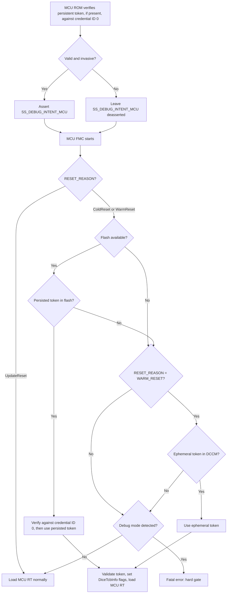
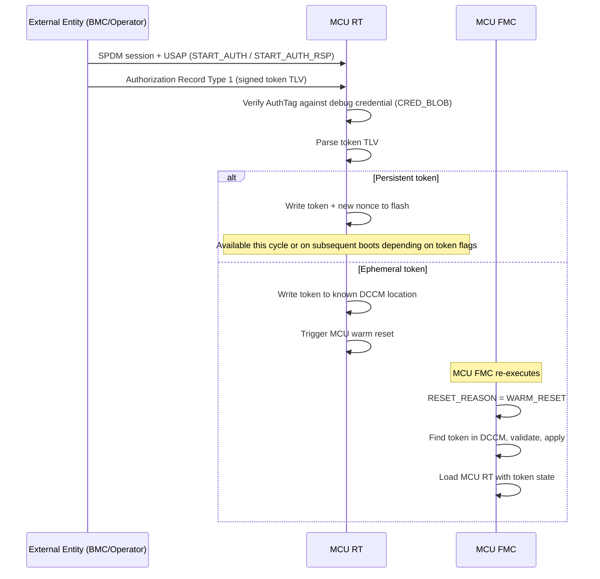

# Debug Token Proposal for the Caliptra Subsystem (MCU)

**Status**: Draft Proposal
**Version**: 0.5

## Table of Contents

1. [Overview](#1-overview)
2. [Motivation & Use Cases](#2-motivation--use-cases)
3. [Caliptra Subsystem (MCU) Architecture](#3-caliptra-subsystem-mcu-architecture)
4. [Authorization Model](#4-authorization-model)
5. [Token Structures (TLV)](#5-token-structures-tlv)
6. [Caliptra Subsystem VDM Commands](#6-caliptra-subsystem-vdm-commands)
7. [Error Codes](#7-error-codes)
8. [Requirements](#8-requirements)
9. [Open Items](#9-open-items)
10. [References](#10-references)

---

## 1. Overview

This document proposes a debug token mechanism for the **Caliptra Subsystem (MCU)** that complements the existing **Production Auth Debug Unlock** (which handles hardware debug — JTAG/TAP/DFT access via ROM). This proposal focuses on capabilities that Production Auth Debug Unlock does not cover: **loading debug-signed firmware** and **enabling runtime debug knobs** in production-fused devices.

This proposal is scoped to the Caliptra Subsystem (MCU) debug token path. Caliptra Core debug token support is out of scope for this document; extending the mechanism to Caliptra Core, if needed, should be addressed by a separate proposal.

The Caliptra Subsystem supports both persistent (flash) and ephemeral (DCCM) tokens (see [Section 3](#3-caliptra-subsystem-mcu-architecture)).

This proposal uses TLV-based structures for all token data. **DSP0289 USAP** (SPDM Authorization) provides the authorization framework: tokens are delivered as Authorization Record payloads over SPDM sessions (see [Section 4](#4-authorization-model)).

For Subsystem integrations with no upstream device able to drive the physical `SS_DEBUG_INTENT` strap — a BMC, for example — immutable **MCU ROM** shall assert `SS_DEBUG_INTENT_MCU` on cryptographic authorization: only after verifying a persisted debug token whose authenticated policy requests **invasive** debug. An absent, invalid, or non-invasive token shall leave `SS_DEBUG_INTENT_MCU` deasserted. Authorization for a persistent Subsystem token uses a **two-stage model**:

1. **Install-time authorization**: DSP0289 AuthZ, using the `CRED_BLOB` credential hierarchy, authorizes writing the token to flash.
2. **Boot-time authorization**: on every cold boot, MCU ROM independently re-verifies the persisted token against **credential ID 0**, the OTP/fuse-rooted credential, before deciding whether to assert `SS_DEBUG_INTENT_MCU`. This verification shall not depend on `CRED_BLOB` or UDS/CDI-derived keys: the decision is made before Caliptra Core is released from reset and before UDS/CDI derivation occurs, so those keys are not yet available, and `CRED_BLOB` is a mutable, updateable flash credential unsuitable as an immutable boot authority. See [Section 4.4](#44-credential-provisioning).

---

## 2. Motivation & Use Cases

Production-fused Caliptra devices enforce hardware debug lockout by default. Debug tokens provide a cryptographically authenticated mechanism to selectively re-enable debug capabilities without permanently compromising device security.

### 2.1 Use Case Table

| Token Type | Use Case | Classification |
|---|---|---|
| Debug Firmware | Load debug-signed MCU RT firmware, or authorize debug-signed SoC firmware | Always invasive: loading debug-signed firmware replaces production code, so it cannot be classified non-invasive (see [Section 5.8](#58-caliptra-tlv-types-0xc000-0xc0ff)) |
| Runtime Debug | Enable debug knobs, interfaces, and verbosity in MCU RT or SoC firmware at runtime | Invasive or non-invasive, per the device capability policy (see [Section 5.8](#58-caliptra-tlv-types-0xc000-0xc0ff)) |

A token classified invasive causes MCU ROM to assert `SS_DEBUG_INTENT_MCU`, withholding or zeroizing UDS/CDI-derived secrets before Caliptra Core is released from reset (see [Section 3.1](#31-mcu-boot-flow-with-debug-tokens)). Because Caliptra Core has no debug token support in this proposal, the effect of an invasive Subsystem token on Caliptra Core's own operation (with its secrets withheld) is not addressed here; see [Section 9](#9-open-items).

> **Note**: Hardware debug unlock (JTAG/TAP/DFT access) is handled by the existing **Production Auth Debug Unlock** mechanism in ROM and is out of scope for this proposal.

---

## 3. Caliptra Subsystem (MCU) Architecture

This section describes debug token support for the Caliptra Subsystem (MCU): boot flow, token priority, attestation, installation, erase, and nonce handling. The flow operates identically regardless of whether the MCU boots from flash or via streaming boot; only the source of firmware and tokens differs.

### 3.1 MCU Boot Flow with Debug Tokens

#### MCU ROM Stage (persistent-token verification and debug-intent decision)

Before releasing Caliptra Core from reset and before completing `SS_CONFIG_DONE_STICKY`, MCU ROM shall evaluate the persistent Subsystem token in flash, if present:

1. Verify the token's signature against **credential ID 0** (the OTP/fuse-rooted credential — see [Section 4.4](#44-credential-provisioning)). This verification is independent of the DSP0289 install-time authorization performed when the token was written to flash, and shall not depend on `CRED_BLOB` or UDS/CDI-derived keys: the decision is made before Caliptra Core is released from reset and before UDS/CDI derivation occurs, so those keys are not yet available, and `CRED_BLOB` is a mutable, updateable flash credential unsuitable as an immutable boot authority.
2. Classify the token's requested capabilities as invasive or non-invasive per [Section 5.8](#58-caliptra-tlv-types-0xc000-0xc0ff).
3. Assert the write-once `SS_DEBUG_INTENT_MCU` bit if and only if the token passes verification and its effective policy is invasive. An absent, invalid, or non-invasive token shall leave the bit deasserted.

MCU ROM shall repeat this evaluation on every cold boot, since `SS_DEBUG_INTENT_MCU` is cleared only on cold reset, and shall complete it before production Caliptra Core secrets are made available to prevent debug firmware from gaining access to them. For a Subsystem integration with no upstream device able to drive the physical `SS_DEBUG_INTENT` strap, this register is the sole mechanism for asserting debug intent. Where a physical strap is also exposed for separate lab or hardware-debug flows, it remains governed by the platform's own physical-access policy and does not substitute for token authorization.

MCU ROM then loads MCU firmware (from flash or via streaming boot) and jumps to MCU FMC. Independent of the persistent-token decision above, how MCU ROM handles debug-signed MCU firmware depends on the option chosen:
- **Option A**: Designated debug key index. MCU ROM validates normally; MCU FMC detects debug mode via key index.
- **Option B**: Deferred RT auth flag in manifest. MCU ROM skips MCU RT verification; MCU FMC validates MCU RT itself.

#### MCU FMC Stage (token priority logic)

After MCU ROM jumps to MCU FMC, FMC determines whether a debug token is available before loading MCU RT. To transition from a production to a debug state, the device must first reach a good, fully booted production state: MCU RT is the only component that can write a token (see [Section 3.4](#34-token-installation-via-mcu-rt-spdm)), so any token was necessarily installed during an earlier boot in which MCU RT was already running, and takes effect starting from the next boot. MCU FMC itself never accepts a live token delivery; it only consumes a token already staged in flash or DCCM. The following priority logic applies:

1. **Check reset reason**: If `RESET_REASON = UpdateReset`, skip all token processing: no flash check, no DCCM check. Proceed to load MCU RT normally. (UpdateReset preserves production secrets; debug tokens must not be applied.)
2. **Check flash for persisted token** (if flash is available): If a persisted token is found, FMC independently verifies its VendorSignature against credential ID 0, using the same logic as MCU ROM (see [Section 3.7](#37-nonce-rules-for-persistent-tokens)), before using it.
3. **Check DCCM for ephemeral token** (if `RESET_REASON = WARM_RESET`): If a valid token is found at the well-known DCCM location, use it.
4. **If both flash and DCCM tokens exist**: Use the flash (persisted) token. Log that the ephemeral DCCM token was ignored.
5. **No token found**: If debug mode is detected (debug key index or deferred auth), fatal error (hard gate). Otherwise, proceed to load MCU RT normally.

When a valid **non-invasive** token is found (from flash or DCCM), MCU FMC:
- Sets DiceTcbInfo debug flags and/or mutates MCU RT FWID in the MCU RT Alias certificate (see [Section 3.3](#33-debug-attestation-via-dpe)).
- If debug mode is detected (debug key index or deferred auth), a non-invasive token cannot satisfy the hard gate, since loading debug-signed firmware is always invasive (see [Section 5.8](#58-caliptra-tlv-types-0xc000-0xc0ff)): fatal error unless a valid invasive token is also present.
- Otherwise, applies the token's `RuntimeDebugPolicy` capabilities and loads MCU RT, passing token state via boot parameters.

When the selected token is **invasive**, `SS_DEBUG_INTENT_MCU` was already asserted by MCU ROM before MCU FMC started, and UDS/CDI-derived key material is withheld/zeroized; MCU FMC shall not attempt the DiceTcbInfo/FWID signaling above (see [Section 3.3](#33-debug-attestation-via-dpe)). MCU FMC still enforces the hard gate and loads MCU RT, passing the token state via boot parameters.

#### MCU RT Stage

MCU RT receives token state from MCU FMC via boot parameters. If runtime debug is active, MCU RT enables the corresponding debug features.

Additionally, MCU RT supports **token installation and management** via SPDM sessions (see [Section 3.4](#34-token-installation-via-mcu-rt-spdm)).

### 3.2 MCU FMC Token Priority

```mermaid
graph TD
    R[MCU ROM verifies persistent token, if present, against credential ID 0] --> Q{Valid and invasive?}
    Q -->|Yes| S[Assert SS_DEBUG_INTENT_MCU]
    Q -->|No| T[Leave SS_DEBUG_INTENT_MCU deasserted]
    S --> A[MCU FMC starts]
    T --> A
    A --> B{RESET_REASON?}
    B -->|UpdateReset| N[Load MCU RT normally]
    B -->|ColdReset or WarmReset| C{Flash available?}
    C -->|Yes| D{Persisted token in flash?}
    C -->|No| E
    D -->|Yes| K[Verify against credential ID 0, then use persisted token]
    D -->|No| E{RESET_REASON = WARM_RESET?}
    E -->|Yes| F{Ephemeral token in DCCM?}
    E -->|No| J
    F -->|Yes| G[Use ephemeral token]
    F -->|No| J{Debug mode detected?}
    K --> V[Validate token, set DiceTcbInfo flags, load MCU RT]
    G --> V
    J -->|Yes| M[Fatal error: hard gate]
    J -->|No| N
```

> **Note**: UpdateReset skips all token processing: persistent and ephemeral tokens are not applied. If both a persisted flash token and an ephemeral DCCM token exist, the flash token takes priority. The ephemeral token is ignored and logged.

### 3.3 Debug Attestation via DPE

MCU FMC does not own its DICE chain; the MCU's DICE chain is managed by **Caliptra Core via DPE**. MCU FMC must use DPE commands (via Caliptra Core mailbox) to signal debug mode in the attestation chain.

When a **non-invasive** debug token is active, MCU FMC must:

1. **Set debug flags via DPE**: When calling `DeriveContext` to create the MCU RT context, MCU FMC includes debug flags in the TCI data. This ensures the DPE-generated certificates for the MCU RT layer carry DiceTcbInfo indicating debug mode.
2. **Stash measurements with debug indication**: When stashing MCU RT measurements (e.g., via `ExtendTci` or equivalent), MCU FMC must include the debug state so that the measurement chain reflects that debug firmware or debug knobs are active.

This mechanism requires DPE's own DICE chain (UDS/CDI-rooted, via Caliptra Core) to be available. When the selected token is **invasive**, `SS_DEBUG_INTENT_MCU` is asserted and UDS-derived secrets are withheld/zeroized before Caliptra Core is released from reset, so DPE has no production-rooted key material to sign with; MCU FMC shall not attempt the flag-setting mechanism above. Section 9 tracks the replacement, if any, for production-rooted attestation on an invasive boot as an open item.

> **DPE extension needed**: The current DPE `DeriveContext` command does not have a debug flag. However, the DICE TcbInfo structure already defines a flags field (tag [7]) with `FLAG_BIT_DEBUG` (bit 3). Caliptra's ROM DICE layer already uses this flag based on lifecycle/debug lock status, but DPE's certificate generation currently skips encoding tag [7]. The required changes are: (a) add a debug flag to `DeriveContextFlags`, and (b) have DPE encode the flags field (tag [7]) in TcbInfo when generating certificates. This is tracked as an open item in [Section 9](#9-open-items).

### 3.4 Token Installation via MCU RT (SPDM)

When MCU RT is running, it has a full MCTP/SPDM stack and receives debug tokens via **DSP0289 USAP within an SPDM secure session** (see [Section 4.1](#41-caliptra-subsystem-mcu-authorization)). MCU RT is the sole channel for delivering a new token to the device: MCU FMC never accepts a live token delivery (see [Section 3.1](#31-mcu-boot-flow-with-debug-tokens)), so a device must reach a good, fully booted production state (MCU RT operational) before any transition to a debug state can be initiated.

```mermaid
sequenceDiagram
    participant Ext as External Entity (BMC/Operator)
    participant MCU_RT as MCU RT
    participant FMC as MCU FMC

    Ext->>MCU_RT: SPDM session + USAP (START_AUTH / START_AUTH_RSP)
    Ext->>MCU_RT: Authorization Record Type 1 (signed token TLV)
    MCU_RT->>MCU_RT: Verify AuthTag against debug credential (CRED_BLOB)
    MCU_RT->>MCU_RT: Parse token TLV

    alt Persistent token
        MCU_RT->>MCU_RT: Write token + new nonce to flash
        Note over MCU_RT: Available this cycle or on subsequent boots depending on token flags
    else Ephemeral token
        MCU_RT->>MCU_RT: Write token to known DCCM location
        MCU_RT->>MCU_RT: Trigger MCU warm reset
        Note over FMC: MCU FMC re-executes
        FMC->>FMC: RESET_REASON = WARM_RESET
        FMC->>FMC: Find token in DCCM, validate, apply
        FMC->>FMC: Load MCU RT with token state
    end
```

The token itself indicates whether it should be persisted or treated as ephemeral (via a persistence flag in the TLV structure).

**Token scope**: MCU RT can receive tokens for itself or for SoC firmware.

### 3.5 Token Erase

Persistent tokens are erased via an MCU RT command. MCU FMC does not support erase (simplicity). Erase does not require SPDM authorization: erasing a debug token moves the device to a more secure state.

MCU RT erases by:
1. Removing the token from flash storage.
2. Optionally incrementing the device's ratchet counter to bulk-invalidate all previously signed tokens. This uses the Erase Token command's special value `0xFFFFFFFE` (see Erase Token command). Tokens with a ratchet value below the device counter are rejected with `TOKEN_RATCHET_CHECK_FAILED` (see [Section 7](#7-error-codes)). The ratchet TLV types (`VendorRatchet` 0x0010, `OemRatchet` 0x0011) are defined in [Section 5.7](#57-common-tlv-types-0x00010x00ff).

Erasing the persisted token does not deassert an already-latched `SS_DEBUG_INTENT_MCU`: the bit is write-once and cleared only on cold reset (see [Section 3.1](#31-mcu-boot-flow-with-debug-tokens)). Erase prevents the invasive policy from being reasserted on the *next* cold boot; it does not affect the current boot session. A device shall complete a cold reset after erasing an invasive token before it can be considered to have returned to a non-invasive (production) debug state.

### 3.6 Firmware Update Interaction

When a debug token is installed (persistent or ephemeral), firmware update flows must account for the token:
- **Token present, FW update requested**: The FW update may proceed. The interaction between installed debug tokens and firmware updates is tracked as an open item in [Section 9](#9-open-items).
- **Debug-signed FW installed, token erased**: MCU FMC detects debug mode (key index) but no token: fatal error. A production FW update must be performed to restore normal boot.

### 3.7 Nonce Rules for Persistent Tokens

For persistent Subsystem tokens delivered via DSP0289 USAP, the RequesterNonce in `START_AUTH` shall be zero: persistent tokens do not require requester-side freshness. The ResponderNonce provides device binding at install time. The install flow is:

1. MCU FMC (or MCU RT) generates a nonce and stores it in flash.
2. The nonce is returned as both the ChallengeNonce (0x0002) in the TLV response and the ResponderNonce in `START_AUTH_RSP`: these are the same value.
3. The signing service signs the token with RequesterNonce=0, the ResponderNonce, SequenceNumber, and the TLV payload per DSP0289 USAP AuthTag construction, and additionally signs the canonical TLV (which includes ChallengeNonce) with VendorSignature (0x000B), verifiable under credential ID 0.
4. On install: MCU RT first verifies the request's `ResponderNonce`/AuthTag against the currently stored, not-yet-consumed nonce (rejecting a mismatch or an already-consumed nonce with `TOKEN_INVALID_NONCE`, 0x1003), then verifies the outer AuthTag against the install-time `CRED_BLOB` credential. On success, the complete token, including VendorSignature, is persisted to flash, and MCU RT immediately invalidates the just-consumed nonce by generating and storing a fresh nonce in its place. This fresh nonce is not tied to any signed token until a future install request uses it, so an already-signed Authorization Record from this install cannot be replayed in a later SPDM session (a new one) to reinstall or re-trigger installation: its embedded nonce no longer matches the device's current stored value.

On each subsequent cold boot, MCU ROM re-verifies VendorSignature against credential ID 0 (see [Section 3.1](#31-mcu-boot-flow-with-debug-tokens)) to decide `SS_DEBUG_INTENT_MCU`. MCU FMC independently performs the same check, VendorSignature against credential ID 0, before applying the token's capabilities: it does not rely on a handoff from MCU ROM, and it no longer reconstructs the AuthTag/AuthMsgBody or depends on `CRED_BLOB` for this purpose. This boot-time re-verification is unaffected by nonce invalidation: it checks the signature over the already-persisted token, not the (now-stale) install-time nonce record, so the installed token remains valid and reusable across every subsequent boot exactly as intended for a persistent token. Because ChallengeNonce/ResponderNonce are covered by VendorSignature, this single check (performed independently by both ROM and FMC) re-validates authenticity and device binding on every boot without needing a secure ROM-to-FMC handoff channel.

**Session lifetime for persistent tokens**: Since the ResponderNonce is stored in flash before the challenge is sent (step 1), the SPDM session does not need to stay alive for the entire signing flow. If the session drops *before* install completes, the BMC can establish a new session and the device returns the same stored nonce in `START_AUTH_RSP` (rather than generating a fresh one), since that nonce has not yet been consumed. This allows the signing service to operate offline: the token can be delivered in a later session. Once install succeeds, the stored nonce is immediately invalidated (step 4) and a fresh nonce is generated for any future install request; a resend of the just-used, already-signed Authorization Record in a new SPDM session is rejected, even though establishing that new session succeeds at the transport layer. Establishing an SPDM session by itself provides no anti-replay guarantee for the application-layer token; nonce consumption on successful install is what does.

**Threat note**: Nonce consumption on install (above) prevents replaying a captured Authorization Record through the DSP0289 install protocol. It does not protect against a physical attacker who extracts the entire flash region (token, nonce, and any invalidation state together) before erase and writes it back afterward, bypassing the install protocol entirely: nothing in this same rewritable flash region can be rollback-resistant against an attacker who can restore the whole region wholesale. This is an accepted tradeoff for the convenience of rapid iterative debugging without re-signing on every boot. The token signer's policy determines whether persistent tokens are acceptable for a given deployment.

> **Deployment rationale**: Persistent tokens prioritize usability during iterative field debug. In production deployments, the debug cycle typically involves repeated reboots (firmware crashes, RMA diagnostics, silicon bring-up) where re-requesting a signed token on every boot would bottleneck the workflow. The one-time nonce verification at install provides cryptographic freshness for token issuance, while allowing the validated token to be reused across subsequent boots without external interaction. This pattern has been validated in large-scale production environments where thousands of devices undergo concurrent debug triage, each cycling through many firmware iterations and reboots per debug session. The signing service's token type policy controls whether persistent tokens are offered for a given device class, so deployments requiring per-boot freshness can restrict issuance to ephemeral tokens without any device-side changes.

**Ephemeral tokens**: Delivered via MCU RT (SPDM). The nonce is fresh, generated at the start of the USAP session. The SPDM session must remain alive through the full flow (START_AUTH → challenge → signing service → Authorization Record delivery). If the session drops, the nonces are lost and the flow must restart. No flash persistence occurs. Ephemeral tokens in DCCM survive across MCU warm resets: this is intentional. The lifetime of an ephemeral token is cold reset to cold reset; it remains valid across warm reset cycles within the same cold boot session.

---

## 4. Authorization Model

### 4.1 Caliptra Subsystem (MCU) Authorization

The Subsystem uses **DSP0289 USAP** (User-Specific Authorization Process) for debug token authorization. The external entity (BMC/operator tool) is the SPDM Requester. MCU RT is the SPDM Responder and Authorization Target: it is the only component that accepts a live token delivery. MCU FMC never implements an SPDM responder or DSP0289 USAP; it only consumes tokens already staged in flash or DCCM by a prior MCU RT session (see [Section 3.1](#31-mcu-boot-flow-with-debug-tokens)).

The debug signing credential used for install-time and ephemeral authorization is a dedicated credential ID in the DSP0289 credential hierarchy, provisioned via the existing **CRED_BLOB** mechanism (HMAC-SHA-512 sealed blobs in SPI flash, key derived from LDevID CDI: see caliptra-mcu-sw PR #906). Boot-time authorization of a persistent token's invasive classification instead uses **credential ID 0** (see [Section 4.4](#44-credential-provisioning)), independently checked by both MCU ROM and MCU FMC.

**MCU RT** (system operational):

Full USAP within an SPDM secure session. MCU RT stores persistent tokens to flash or ephemeral tokens to DCCM (see [Section 3.4](#34-token-installation-via-mcu-rt-spdm)).

### 4.2 Token Delivery Paths

All Subsystem tokens are delivered by the external entity (BMC/operator tool) directly to MCU RT, via DSP0289 USAP over an SPDM session, once MCU RT is operational (see [Section 3.4](#34-token-installation-via-mcu-rt-spdm)). This is the only delivery path; there is no delivery point before MCU RT boots.

### 4.3 Device Binding

The challenge nonce is the primary device-binding mechanism. The nonce is cryptographically unique and by itself binds the token to a specific device.

Nonce exchange uses DSP0289 `START_AUTH` / `START_AUTH_RSP`. For persistent tokens, the nonce is persisted to flash alongside the token. On subsequent boots, the token signature is re-verified but the nonce is not regenerated (see [Section 3.7](#37-nonce-rules-for-persistent-tokens)).

The token may also carry the device serial number (ECID) for additional identification, but the nonce alone is sufficient for binding.

### 4.4 Credential Provisioning

| Purpose | Debug Key Source | Provisioning |
|---|---|---|
| Install-time and ephemeral authorization | Dedicated debug credential ID in CRED_BLOB | Provisioned via the DSP0289 credential hierarchy (caliptra-mcu-sw PR #906). Authorizes writing a token to flash. |
| Boot-time invasive-debug authorization | **Credential ID 0**: the existing OTP/fuse-rooted credential (caliptra-mcu-sw PR #906) | No new credential ID is introduced. ID 0's existing privilege set is extended with an `AuthorizeInvasiveDebugPrivilege`, alongside its existing use. MCU ROM and MCU FMC each independently re-verify the persisted token against this credential on every cold boot, independent of the install-time `CRED_BLOB` authorization, before deciding whether to assert `SS_DEBUG_INTENT_MCU` (MCU ROM) or apply the token's capabilities (MCU FMC). Flash-backed (`CRED_BLOB`) credentials remain the higher-numbered, updateable credentials and are never sufficient for this boot-time decision. |

A persisted token that requests an invasive capability shall carry a signature verifiable under credential ID 0 (fuse-rooted, optionally chaining to a key in an MCU boot manifest already authenticated under that same fuse root). MCU ROM shall not accept a `CRED_BLOB` credential for this check: the decision is made before Caliptra Core is released from reset and before UDS/CDI-derived keys are available, and `CRED_BLOB` is a mutable, updateable flash credential unsuitable as an immutable boot authority.

### 4.5 Signed Challenge

The DSP0289 `START_AUTH_RSP` exchange returns the device's challenge nonce. For device binding purposes, the nonce alone is sufficient (see [Section 4.3](#43-device-binding)). However, the device MAY additionally sign the challenge response using a device-unique key. The signed challenge covers the nonce, device serial number, and lifecycle state. The device's certificate chain (rooted in a vendor or platform CA via the DICE hierarchy) accompanies the signed response, allowing the signing service to verify the signature and authenticate the device identity without relying on the operator to assert these fields.

A signed challenge gives the signing service verified inputs for its token issuance policy:

- **Serial number**: The signing service can identify the specific device and apply per-device or per-fleet policies (e.g., restricting token issuance to a known set of devices, determining the approval requirements for issuance, or tracking which devices have been issued tokens for audit).
- **Lifecycle state**: The signing service can condition token issuance on the reported lifecycle state, for example refusing to issue persistent tokens for devices in a production or manufacturing lifecycle or restricting debug scope based on fuse state.
- **Device identity**: The certificate chain ties the challenge to a specific device in the DICE attestation hierarchy, providing a non-forgeable record of which device requested the token.

In deployments where the signing service operates at scale (silicon bring-up, RMA triage, fleet diagnostics), these verified inputs allow the signing service to make policy decisions with minimal operator involvement, reducing the latency of token issuance without weakening the trust model.

This mechanism is not mandated by the device-side protocol. The device provides the capability, and the signing service's policy determines whether to require it. Deployments that do not need independent device verification can use the unsigned `START_AUTH_RSP` nonce directly. The TLV type space includes CertificateChain (0x0013) to support signed challenge payloads when this capability is used.

---

## 5. Token Structures (TLV)

### 5.1 Design Goals

The TLV format was chosen for debug token structures to satisfy the following goals:

- **Interoperability**: The TLV type space is globally coordinated so that a platform containing both Caliptra devices and other vendor devices (e.g., GPUs, NICs, switches) can use the same signing infrastructure and tooling. The DeviceType field (0x0001) in every token unambiguously identifies the target device class. A single parser handles tokens for all device types.
- **Extensibility**: The TLV format is self-describing: each entry carries its own type and length, and parsers skip unknown types. New device-specific fields can be added without modifying the core format or requiring client code updates.
- **Transport independence**: The same TLV structures work over MCTP VDM, SPDM, and file-based transfers.
- **Unified signing service**: One signing infrastructure handles tokens for all device types on a platform.

### 5.2 Fixed Header

Every TLV structure begins with a 32-byte fixed header:

| Field | Size (bytes) | Description |
|---|---|---|
| Identifier | 4 | `0x544C5631` (ASCII `"TLV1"`), stored as byte array `[0x54, 0x4C, 0x56, 0x31]` |
| Version | 4 | `xxxx.yyyy` format: 2 bytes major, 2 bytes minor, little-endian. Version 1.0 = `[0x01, 0x00, 0x00, 0x00]` |
| Size | 4 | Total length of the TLV payload excluding the header (in bytes) |
| Reserved | 20 | Reserved for future use; must be zero |

### 5.3 TLV Entry Format

Each TLV entry following the fixed header has this layout:

| Field | Size (bytes) | Description |
|---|---|---|
| Type | 2 | Type identifier (little-endian) |
| Length | 2 | Length of the Value field in bytes (little-endian) |
| Value | variable | Data field of variable size |

### 5.4 TLV Encoding Rules

#### Byte Order (Endianness)

All TLV Value fields are treated as byte arrays. However, for TLVs where the Value represents structured data (e.g., integers, version numbers, or compound fields), the byte order for interpreting multi-byte numeric values shall be **little-endian**. This ensures consistent parsing across platforms.

For example:
- A 16-bit integer value of `0x0001` shall be encoded as `[0x01, 0x00]`.
- A version field `1.0` (Major=1, Minor=0) shall be represented as `[0x01, 0x00, 0x00, 0x00]`.

#### TLV Entry Ordering

No specific ordering is enforced for TLV entries, with the exception that signature TLV entries (VendorSignature 0x000B, OemSignature 0x000C) shall be the **last** entries when present, so the signature covers all preceding TLV data. A persistent token includes VendorSignature: MCU ROM and MCU FMC each independently verify it at every cold boot against the credential identified by credential ID 0 (see [Section 4.4](#44-credential-provisioning)), independent of the DSP0289 Authorization Record's outer AuthTag used at install time. An ephemeral token omits VendorSignature; the DSP0289 Authorization Record AuthTag is its sole signature.

### 5.5 Type ID Space

The 16-bit type ID space is partitioned to enable interoperability across all device types on a platform:

| Range | Assignment | Description |
|---|---|---|
| `0x0001`–`0x00FF` | **Common Types** | Shared across ALL device types (Caliptra and other vendors). These types have identical semantics regardless of device. |
| `0x0100`–`0x3FFF` | Reserved Common | Reserved for future common type allocation |
| `0x4000`–`0x47FF` | **Reserved** | Allocated for other vendor device types. **Do not use for Caliptra.** |
| `0x4800`–`0xBFFF` | Reserved | Reserved for future device type allocation |
| `0xC000`–`0xC0FF` | **Caliptra** | Device-specific types for Caliptra devices |
| `0xC100`–`0xFEFF` | Future Caliptra | Reserved for future Caliptra device type ranges |
| `0xFF00`–`0xFFFF` | Special Reserved | Reserved; must not be used |

> **Interoperability note**: The `0x4000`–`0x47FF` range is reserved for other vendor device types that may coexist on the same platform. The Caliptra range (`0xC000`–`0xC0FF`) is positioned far from this range to avoid any possibility of collision, even in the event of future range expansions.

### 5.6 FieldClass and Consumer Enums

#### FieldClass Enums

| Enum | Description |
|---|---|
| TokenMetadata | Fields describing the token itself such as its type, configurations, validity constraints |
| DeviceInfo | Fields that describe the identity or runtime state of the device itself, including static/fused properties (e.g., Serial Number) and dynamic properties (e.g., FirmwareVersion, AgentVersion) |
| AuthenticationData | Fields that support verification or trust establishment including nonces and certificate chains |
| StatusInfo | Fields indicating the current processing, install, or handling status of a token or command |
| ErrorInfo | Fields specifically used to report error codes or failure reasons |
| SecurityState | Fields that influence or gate debug token validity based on the device's secure state |
| PayloadData | Fields containing operational data the device consumes at runtime |

#### Consumer Enums

| Enum | Description |
|---|---|
| SigningService | The backend system that receives token requests and issues signed tokens. |
| SigningClient | The client or SoC Manager-side tool that prepares and submits token request files to the signing service. |
| Device | The target hardware device that receives the token. |
| PlatformController | The SoC Manager or platform controller that may handle token install/query flows or status interpretation. |
| Agent | Any in-band application or runtime client (e.g., flash utility, token validator) that parses tokens or constructs requests. |

### 5.7 Common TLV Types (0x0001–0x00FF)

These types are shared across all device types. Parsers for any device class must understand these types.

| Type ID | Name | Description | Data Type | FieldClass | Consumer |
|---|---|---|---|---|---|
| 0x0001 | DeviceType | Device type identifier. **Enum values**: 0x01–0x09 = reserved (other vendor device types), **0x80 = Caliptra** | uint16 | DeviceInfo | SigningService, SigningClient |
| 0x0002 | ChallengeNonce | Nonce data generated by device | byte array | AuthenticationData | SigningService, Device |
| 0x0003 | DeviceSerialNumber | Unique serial number of the device | byte array | DeviceInfo | SigningService, PlatformController, Agent, Device |
| 0x0004 | DeviceSerialNumberArray | List of device serial numbers (multi-device token) | byte array | DeviceInfo | SigningService, Device, PlatformController, Agent |
| 0x0005 | FirmwareVersion | Firmware version requesting the token | ASCII string / byte array | DeviceInfo | Device |
| 0x0006 | AgentVersion | Token-to-device firmware lifecycle management version. **TBD**: Applicability to Caliptra to be determined. | uint | DeviceInfo | SigningService, Device |
| 0x0007 | LifecycleState | Device lifecycle state | bitfield | SecurityState | SigningService, SigningClient, Device |
| 0x0008 | TokenIdentifier | Unique token identifier (magic number) | ASCII string / byte array | TokenMetadata | SigningService, Device |
| 0x0009 | TokenType | Type of token | enum | TokenMetadata | SigningService, SigningClient, Device |
| 0x000A | TokenConfig | Token-specific attributes. Bit 0 = Persistent (see [Section 3.4](#34-token-installation-via-mcu-rt-spdm)); bit 1 = `InvasiveDebugRequested` (see [Section 5.8](#58-caliptra-tlv-types-0xc000-0xc0ff)); remaining bits reserved, must be zero. | bitfield | TokenMetadata | SigningService, Device |
| 0x000B | VendorSignature | Signature over all preceding TLV entries (must be last entry). Required for a persistent token: verified independently by MCU ROM and MCU FMC at every cold boot against the credential identified by credential ID 0 (see [Section 4.4](#44-credential-provisioning)), independent of the DSP0289 Authorization Record's outer AuthTag used at install time. Omitted for an ephemeral token, whose sole signature is the DSP0289 Authorization Record AuthTag. | byte array | AuthenticationData | SigningService, Device |
| 0x000C | OemSignature | Owner/OEM signature over TLV data | byte array | AuthenticationData | Device |
| 0x000D | InstallStatus | Whether a debug token is currently installed on the device. Values: 0 = not installed, 1 = installed | enum | StatusInfo | PlatformController, Agent, Device |
| 0x000E | ProcessingStatus | Token processing status set by the endpoint. Values: 0 = not processed, 1 = processed | enum | StatusInfo | PlatformController, Agent, Device |
| 0x000F | SkuInformation | Production SKU or Debug SKU. Values: 0x1 = Debug, 0x2 = Prod | enum | DeviceInfo | SigningService, Device |
| 0x0010 | VendorRatchet | Vendor ratchet value for anti-replay | uint | SecurityState | SigningService, Device |
| 0x0011 | OemRatchet | Owner/OEM ratchet value | uint | SecurityState | Device |
| 0x0012 | ValidityCounter | Counter decremented upon each token application | uint | TokenMetadata | Device |
| 0x0013 | CertificateChain | Certificate chain for the signing authority | byte array | AuthenticationData | SigningService, Device, PlatformController, Agent |
| 0x0014 | MeasurementTranscript | Transcript for measurement (e.g., SPDM measurement data) | byte array | AuthenticationData | SigningService, Device, PlatformController, Agent |
| 0x0015 | DeviceId | Hardware-fused identifier assigned during manufacturing | uint | DeviceInfo | SigningService, Device |
| 0x0016 | TokenTypeSubtypeList | List of installed debug token type and subtype pairs | array of struct | TokenMetadata | PlatformController, Agent, Device |
| 0x0017 | Payload | Payload data in the token | byte array | PayloadData | SigningService, Device |
| 0x0018 | LegacyToken | Legacy token payload (backward compatibility). **TBD**: Applicability to Caliptra to be determined. | byte array | PayloadData | SigningClient, Agent, Device |

### 5.8 Caliptra TLV Types (0xC000–0xC0FF)

These types are specific to Caliptra devices and are only meaningful when `DeviceType = 0x80 (Caliptra)`.

> **Note**: Types 0xC000–0xC002 are illustrative examples of Caliptra-specific policy fields. The same information may alternatively be expressed using common types (e.g., TokenType 0x0009 and TokenTypeSubtypeList 0x0016 for debug policies, LifecycleState 0x0007 for fuse state). These type IDs are reserved for Caliptra but their final form may change based on whether the common types are sufficient.

| Type ID | Name | Description | Data Type | FieldClass | Consumer |
|---|---|---|---|---|---|
| 0xC000 | FirmwareDebugPolicy | Bitmask controlling which firmware components are permitted to run with debug signing. Each bit corresponds to a specific firmware component. Always classified invasive when non-zero (see [Invasive vs. Non-Invasive Classification](#invasive-vs-non-invasive-classification), below). | uint32 | SecurityState | SigningService, Device |
| 0xC001 | CaliptraFuseState | Hash of the device's fuse configuration at token request time. Used by the signing service to validate device identity and state. | byte array (32) | SecurityState | SigningService, Device |
| 0xC002 | RuntimeDebugPolicy | Bitmask controlling which runtime debug knobs and interfaces are enabled by the token. | uint32 | SecurityState | SigningService, Device |
| 0xC003 | TokenTarget | Authorization target for this token. `0x02` = Caliptra Subsystem (MCU). `0x01` is reserved (previously Caliptra Core; out of scope for this proposal). MCU FMC/RT validates that a received token's target equals Subsystem before applying it. | uint8 | Routing | SigningService, Device |

#### Invasive vs. Non-Invasive Classification

`TokenConfig` (0x000A) carries an `InvasiveDebugRequested` bit, in addition to its existing `Persistent` bit. The device — not an unauthenticated token label — determines the effective policy:

- `FirmwareDebugPolicy` (0xC000) is **always invasive** whenever non-zero: loading a debug-signed firmware component replaces production code, so it can never be classified non-invasive, regardless of device capability policy. A token requesting `FirmwareDebugPolicy` shall also set `InvasiveDebugRequested`; MCU ROM and MCU FMC/RT shall reject a token that sets a non-zero `FirmwareDebugPolicy` without `InvasiveDebugRequested`.
- `RuntimeDebugPolicy` (0xC002) capabilities are classified invasive or non-invasive per the device's capability policy, reflected by `InvasiveDebugRequested`.
- An ephemeral/live token shall never set `InvasiveDebugRequested` and shall never request `FirmwareDebugPolicy`; MCU ROM and MCU FMC/RT shall reject an ephemeral token that does either. All invasive tokens are persistent: no non-persistent token can request invasive debug or debug-signed firmware, since the pre-secret decision window (MCU ROM, before Caliptra Core is released from reset) has already passed by the time an ephemeral/live token can be delivered. An ephemeral token can therefore only ever carry `RuntimeDebugPolicy` capabilities the device classifies non-invasive.
- A non-invasive persistent token never causes `SS_DEBUG_INTENT_MCU` to be asserted.

Normative rule: `assert_ss_debug_intent_mcu = persistent_token_valid AND InvasiveDebugRequested`. Since `InvasiveDebugRequested` is only ever valid on a persistent token, this is equivalent to: an ephemeral token can never assert `SS_DEBUG_INTENT_MCU`. `InvasiveDebugRequested` is itself mandatory whenever `FirmwareDebugPolicy != 0`.

### 5.9 Example Structures

#### Challenge Response Structure

Returned within the DSP0289 `START_AUTH_RSP` exchange (see [Section 3.7](#37-nonce-rules-for-persistent-tokens)):

| | Fixed Header (32 bytes) | |
|---|---|---|
| **Type** | **Length (bytes)** | **Value** |
| 0x0001 (DeviceType) | 2 | 0x80 (Caliptra) |
| 0x0002 (ChallengeNonce) | 32 | \<random nonce from Caliptra TRNG\> |
| 0x0003 (DeviceSerialNumber) | 16 | \<device ECID\> |
| 0x0005 (FirmwareVersion) | 4 | \<current firmware version\> |
| 0x0006 (AgentVersion) | 2 | \<agent version\> |
| 0x0007 (LifecycleState) | 4 | \<set of device lifecycle fuses\> |
| 0x0010 (VendorRatchet) | 4 | \<current ratchet counter\> |
| 0x0011 (OemRatchet) | 4 | \<current OEM ratchet counter\> |

#### Token Main Structure

The signed token delivered to the device for installation:

| | Fixed Header (32 bytes) | |
|---|---|---|
| **Type** | **Length (bytes)** | **Value** |
| 0x0008 (TokenIdentifier) | 4 | "CDTI" (Caliptra Debug Token Install) |
| 0x0002 (ChallengeNonce) | 32 | \<nonce from challenge response\> |
| 0x0003 (DeviceSerialNumber) | 16 | \<target device serial number\> |
| 0x0005 (FirmwareVersion) | 4 | \<firmware version\> |
| 0x0006 (AgentVersion) | 2 | \<agent version\> |
| 0x0007 (LifecycleState) | 4 | \<expected lifecycle state\> |
| 0x0016 (TokenTypeSubtypeList) | 8\*N | \<list of [Type\|Subtype] pairs\> |
| 0x000A (TokenConfig) | 2 | \<token configuration flags\> |
| 0xC000 (FirmwareDebugPolicy) | 4 | \<firmware component debug signing bitmask\> |
| 0xC002 (RuntimeDebugPolicy) | 4 | \<runtime debug knob bitmask\> |
| 0x0010 (VendorRatchet) | 4 | \<minimum ratchet value\> |
| 0x0017 (Payload) | L0 | \<optional payload data\> |

> A persistent token includes VendorSignature (0x000B) as the final entry, verified independently by MCU ROM and MCU FMC at boot against credential ID 0. An ephemeral token omits VendorSignature and relies on the DSP0289 Authorization Record AuthTag as its sole signature. ChallengeNonce (0x0002) is covered by the signature whenever VendorSignature is present.

### 5.10 Interoperability Note

The `DeviceType` field (0x0001) is present in every challenge response and token structure. This allows disambiguation even if type IDs were to overlap across device-specific ranges: a parser that encounters an unknown device-specific TLV can use DeviceType to determine whether it should be processed or skipped.

Future tooling could leverage this to support a single unified parser for all device types on a platform, routing device-specific TLVs to the appropriate handler based on the DeviceType value. For the initial implementation, maintaining well-separated type ID ranges (0x4000–0x47FF reserved for other vendors, 0xC000–0xC0FF for Caliptra) provides collision-free operation without requiring such tooling.

---

## 6. Caliptra Subsystem VDM Commands

### 6.1 Overview

These commands are Caliptra-defined MCTP VDM commands for the Subsystem (MCU) path. They use 1-byte command codes per the existing Caliptra MCTP VDM convention (Vendor ID 0x1414, message type 0x7E), continuing the sequence after existing commands (0x01-0x0B). Token installation for Subsystem uses DSP0289 USAP (see [Section 4.1](#41-caliptra-subsystem-mcu-authorization)); these commands cover operations not covered by DSP0289.

| Command Code | Name | Description |
|---|---|---|
| 0x0C | DEBUG_TOKEN_ERASE | Erase persistent tokens from flash |
| 0x0D | DEBUG_TOKEN_QUERY | Query token installation status |

> **Note**: Existing commands 0x0A (Request Debug Unlock) and 0x0B (Authorize Debug Unlock Token) are for Production Auth Debug Unlock (hardware debug) and are unrelated to firmware debug tokens.

### 6.2 DEBUG_TOKEN_ERASE (Command Code 0x0C)

Erases persistent debug tokens from flash. Sent to MCU RT via MCTP VDM. Does not require SPDM authorization: erasing a debug token moves the device to a more secure state.

#### Request Data

| Field | Offset | Type | Description |
|---|---|---|---|
| token_type | 0 | u32 | Token type to erase. Special values: `0xFFFFFFFF` = erase all installed tokens. `0xFFFFFFFE` = erase all installed tokens and increment the ratchet counter. |

#### Response Data

| Field | Type | Description |
|---|---|---|
| Completion Code | u32 | SUCCESS, TOKEN_NOT_INSTALLED (0x100F), TOKEN_ERASE_REJECTED (0x1011), or TOKEN_STORAGE_ERROR (0x1006). |

### 6.3 DEBUG_TOKEN_QUERY (Command Code 0x0D)

Queries current token installation and processing status. Sent to MCU RT (when operational) via MCTP VDM.

#### Request Data

No request data.

#### Response Data

| Field | Offset | Type | Description |
|---|---|---|---|
| Completion Code | 0 | u32 | SUCCESS or error code |
| Data | 4 | variable (TLV) | TLV structure containing status information |

The TLV data in the response includes:

| Type | Length | Value |
|---|---|---|
| 0x000D (InstallStatus) | 1 | 0: Token not installed, 1: Token is installed |
| 0x0016 (TokenTypeSubtypeList) | 8\*N bytes | [Type0\|Subtype0], [Type1\|Subtype1], ... [TypeN\|SubtypeN] |
| 0x000E (ProcessingStatus) | 1 | 0: Token not processed, 1: Token processed |

---

## 7. Error Codes

Error codes are returned in the response data field when a token operation fails. The range `0x1000` to `0x107F` is reserved exclusively for debug token errors, ensuring consistency and traceability across platforms.

| Value | Name | Description |
|---|---|---|
| 0x1000 | TOKEN_INTERNAL_ERROR | An unexpected internal failure occurred while processing the token request |
| 0x1001 | TOKEN_INVALID_FORMAT | Token structure is invalid or malformed |
| 0x1002 | TOKEN_SIGNATURE_VERIFICATION_FAILED | Token cryptographic signature verification failed. Token may be corrupted or signed with a different key |
| 0x1003 | TOKEN_INVALID_NONCE | Nonce mismatch. Token nonce does not match the device nonce or nonce has already been consumed |
| 0x1004 | TOKEN_INVALID_LIFECYCLE_STATE | Device lifecycle state does not match the requested token. Device state may have transitioned after the token was requested |
| 0x1005 | TOKEN_UNSUPPORTED_TYPE | Token type or subtype is not supported on this device or firmware version |
| 0x1007 | TOKEN_RATCHET_CHECK_FAILED | Token ratchet value is less than the device ratchet counter. Token has been revoked |
| 0x1009 | TOKEN_FEATURE_DISABLED | Token feature is disabled. Tokens cannot be installed or processed |
| 0x100A | TOKEN_FEATURE_DISABLED_BY_POLICY | Token feature disabled by runtime device security policy restrictions such as confidential compute mode or device security lockdown |
| 0x100B | TOKEN_FW_VERSION_MISMATCH | The firmware version in the requested token does not match the active firmware version on the device |
| 0x100C | TOKEN_INVALID_SERIAL_NUMBER | Serial number mismatch. Token is bound to a different device |
| 0x100E | TOKEN_ALREADY_INSTALLED | A debug token is already installed for this boot session |
| 0x1010 | TOKEN_HASH_VERIFICATION_FAILED | Token payload hash verification failed. Token may be corrupted |
| 0x1006 | TOKEN_STORAGE_ERROR | Flash storage operation failed during token install or erase |
| 0x100F | TOKEN_NOT_INSTALLED | No debug token currently installed. Returned on erase when no token exists |
| 0x1011 | TOKEN_ERASE_REJECTED | Token erase rejected (e.g., device does not have a production image to fall back to) |
| 0x1012 | TOKEN_INVASIVE_REQUIRES_PERSISTENT | `InvasiveDebugRequested` was set on an ephemeral/live token. Invasive debug can only be requested by a persistent token, since the decision window (MCU ROM, before Caliptra Core is released from reset) has already closed by the time an ephemeral token can be delivered |

> **Note**: Error codes 0x1006, 0x100F, and 0x1011 apply to persistent-token and erase flows only. Error codes 0x1008 (duplicate of 0x1000) and 0x100D (vendor-specific device identifier check) are intentionally omitted.

---

## 8. Requirements

### 8.1 MCU ROM Requirements

| Requirement ID | Requirement Title | Description | Type |
|---|---|---|---|
| MCUROM-01 | Boot-Time Token Re-Verification | On every cold boot, before `SS_CONFIG_DONE_STICKY` and before releasing Caliptra Core, MCU ROM shall re-verify the persisted Subsystem token's signature against credential ID 0. This check is independent of the install-time DSP0289/`CRED_BLOB` authorization and shall not depend on `CRED_BLOB` or UDS/CDI-derived keys. | Security |
| MCUROM-02 | Invasive Classification | MCU ROM shall classify the token's requested capabilities as invasive or non-invasive using `TokenConfig`'s `InvasiveDebugRequested` bit (see [Section 5.8](#58-caliptra-tlv-types-0xc000-0xc0ff)). | Security |
| MCUROM-03 | Authorized Intent Assertion | MCU ROM shall assert the write-once `SS_DEBUG_INTENT_MCU` bit only when the persisted token passes boot-time verification (MCUROM-01) and its effective classification is invasive (MCUROM-02). Token presence or install-time authorization alone shall not assert intent. | Security |

### 8.2 MCU RT Requirements

| Requirement ID | Requirement Title | Description | Type |
|---|---|---|---|
| MCURT-01 | Token Installation (USAP) | MCU RT shall support debug token installation via DSP0289 USAP within an SPDM session for Subsystem tokens. | Functional |
| MCURT-02 | Persistent Storage | MCU RT shall write persistent tokens to flash (with new nonce) and ephemeral tokens to a known DCCM location. | Functional |
| MCURT-03 | Token Erase | MCU RT shall support erasing persistent tokens from flash. Erase does not require SPDM authorization. | Functional |
| MCURT-04 | Erase Does Not Deassert Latched Intent | MCU RT shall not represent token erase as clearing an already-latched `SS_DEBUG_INTENT_MCU`. The bit remains asserted for the current boot session; a cold reset is required before the device can be considered to have returned to a non-invasive debug state. | Security |
| MCURT-05 | Reject Invasive Ephemeral Token | MCU RT shall reject with `TOKEN_INVASIVE_REQUIRES_PERSISTENT` (0x1012) any ephemeral/live token that sets `InvasiveDebugRequested`. Invasive debug shall only be requested by a persistent token. | Security |
| MCURT-06 | Nonce Consumption on Install | For a persistent token, MCU RT shall verify the install request's `ResponderNonce`/AuthTag against the currently stored, not-yet-consumed nonce, rejecting a mismatch or an already-consumed nonce with `TOKEN_INVALID_NONCE` (0x1003). On successful install, MCU RT shall immediately generate and store a fresh nonce, invalidating the just-consumed one, so that a resend of the same already-signed Authorization Record in a subsequent SPDM session is rejected. Establishing a new SPDM session shall not by itself be treated as sufficient anti-replay protection for the token content. | Security |

### 8.3 MCU FMC Requirements

| Requirement ID | Requirement Title | Description | Type |
|---|---|---|---|
| MCUFMC-01 | Token Target Validation | MCU FMC shall validate that a received token has TokenTarget (0xC003) = Subsystem (0x02). Any other value shall be rejected. | Functional |
| MCUFMC-02 | Token Priority | MCU FMC shall check for tokens in order: flash (persisted) → DCCM (ephemeral, warm reset only). Flash token takes priority if both exist. | Functional |
| MCUFMC-03 | Debug Attestation via DPE | When a **non-invasive** debug token is active, MCU FMC shall use DPE commands (via Caliptra Core mailbox) to set debug flags in the MCU DICE chain (DiceTcbInfo FLAG_BIT_DEBUG). This requirement does not apply when `SS_DEBUG_INTENT_MCU` is asserted (invasive token), since DPE's underlying UDS/CDI-rooted key material is withheld/zeroized; see [Section 3.3](#33-debug-attestation-via-dpe). | Security |
| MCUFMC-04 | UpdateReset Restriction | MCU FMC shall not process or apply any token (flash or DCCM) on UpdateReset. | Security |
| MCUFMC-05 | Hard Gate | If MCU FMC detects debug mode (via key index or deferred auth), it shall not load MCU RT without a valid, **invasive** debug token (see [Section 5.8](#58-caliptra-tlv-types-0xc000-0xc0ff)). A valid non-invasive token shall not satisfy this gate. | Security |
| MCUFMC-06 | Independent Persisted-Token Verification | MCU FMC shall independently verify a persisted token's VendorSignature against credential ID 0, using the same verification logic as MCU ROM (MCUROM-01), before applying its capabilities. MCU FMC shall not rely solely on a handoff of MCU ROM's verification result, and shall not reconstruct the AuthTag/AuthMsgBody or use `CRED_BLOB` for this check. | Security |

---

## 9. Open Items

| Item | Description | Affected Sections |
|---|---|---|
| DPE debug flag extension | DPE `DeriveContext` needs a new `FLAG_BIT_DEBUG` in `DeriveContextFlags`. DPE certificate generation must encode the DICE TcbInfo flags field (tag [7]): currently skipped. `FLAG_BIT_DEBUG` (bit 3) is already defined in the DICE constants but unused by DPE. | 3.3, 6, 9 |
| Invasive-boot attestation replacement | When `SS_DEBUG_INTENT_MCU` is asserted, MCU FMC's DPE-based attestation signaling is unavailable, since production UDS/CDI-derived key material is withheld/zeroized before Caliptra ROM runs. Define what (if anything) an invasive boot presents to verifiers instead: e.g., a separate non-production-rooted debug identity, or an explicit "no attestation" signal. | 3.3 |
| Credential ID 0 privilege extension | Define the `AuthorizeInvasiveDebugPrivilege` bit added to credential ID 0's existing privilege set in the PolicyEngine, and confirm it does not conflict with ID 0's existing (recovery) use, per PR #906. No new credential ID is introduced. | 4.4 |
| FW update flow interaction | Detailed interaction between debug tokens and PLDM/OCP firmware update flows. How token validity is affected by FW updates, and how debug-signed FW is delivered via update mechanisms. | 3.6 |
| MCU FMC DPE measurement format | Define the TCI data format MCU FMC uses when stashing MCU RT measurements with debug indication via DPE. | 3.3, 6 |
| Persistent token flash storage format | Define the on-flash layout for persisted tokens and nonces. Consider reusing CRED_BLOB sealed storage pattern. | 3.7, 6 |
| Recovery when MCU RT has never booted | MCU RT is the only channel that can write a token (see [Section 3.1](#31-mcu-boot-flow-with-debug-tokens)); a device must reach a good, fully booted production state before any transition to a debug state. If MCU RT itself cannot come up (e.g., a bug in a brand-new firmware build during silicon bring-up), there is no channel defined by this proposal to bootstrap a debug session. This is treated as an off-nominal manufacturing/bring-up scenario, expected to be handled by other tooling (e.g., streaming boot, flash recovery, JTAG) outside the scope of this proposal, not by the token mechanism itself. | 3.1, 3.4 |

---

## 10. References

| Document | Reference |
|---|---|
| Caliptra Hardware Specification | OCP Caliptra Hardware Specification |
| MCTP Base Specification | DMTF DSP0236: Management Component Transport Protocol (MCTP) Base Specification |
| SPDM Specification | DMTF DSP0274: Security Protocol and Data Model (SPDM) Specification |
| SPDM Authorization | DMTF DSP0289: SPDM Authorization |
| caliptra-mcu-sw PR #906 | SPDM Authorization credential hierarchy implementation |
| caliptra-mcu-sw PR #875 | Rate limiting and authorization gating for token operations |
| OCP Caliptra Hardware Specification | Open Compute Project: Caliptra Root of Trust for Measurement |
