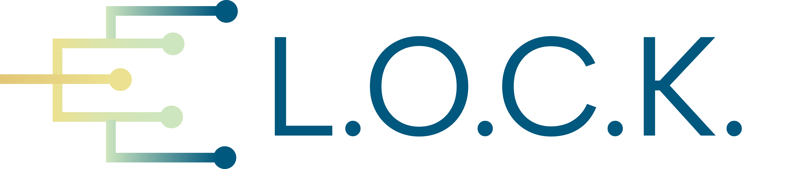
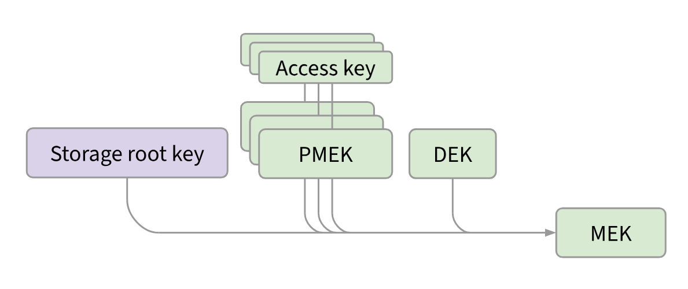
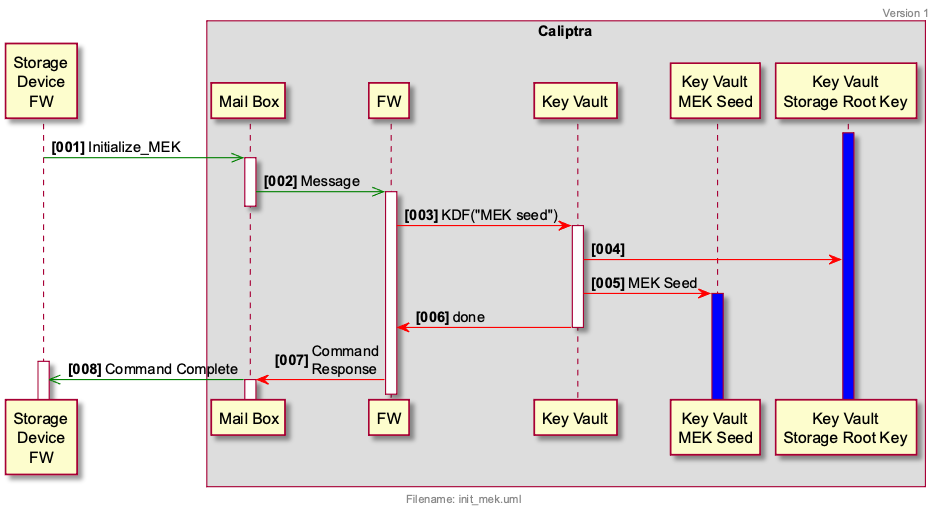
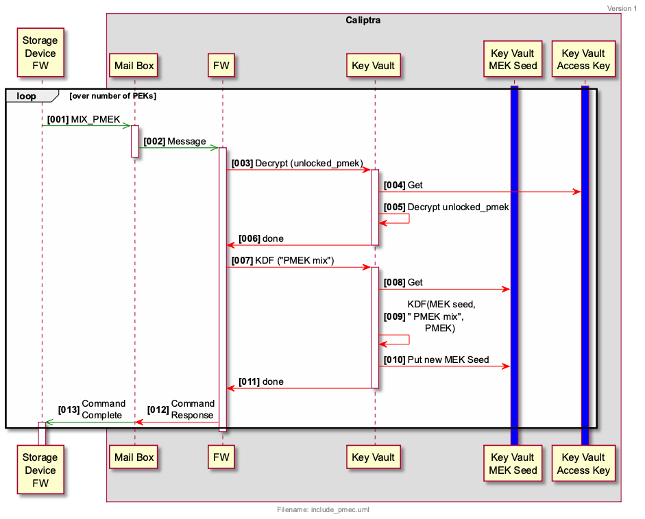
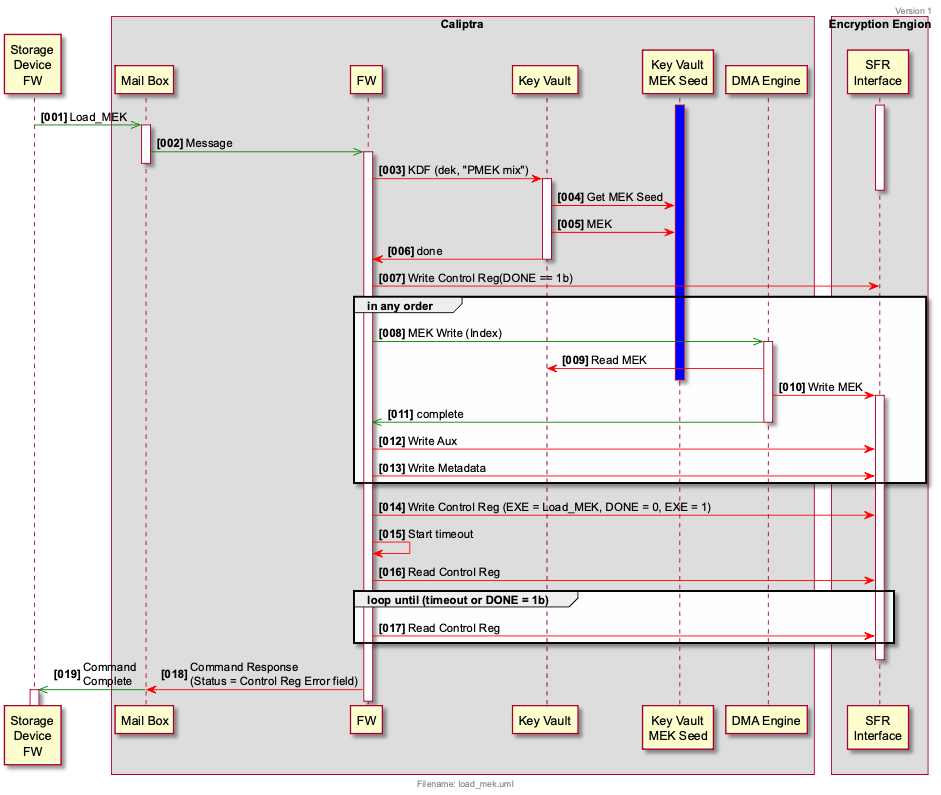
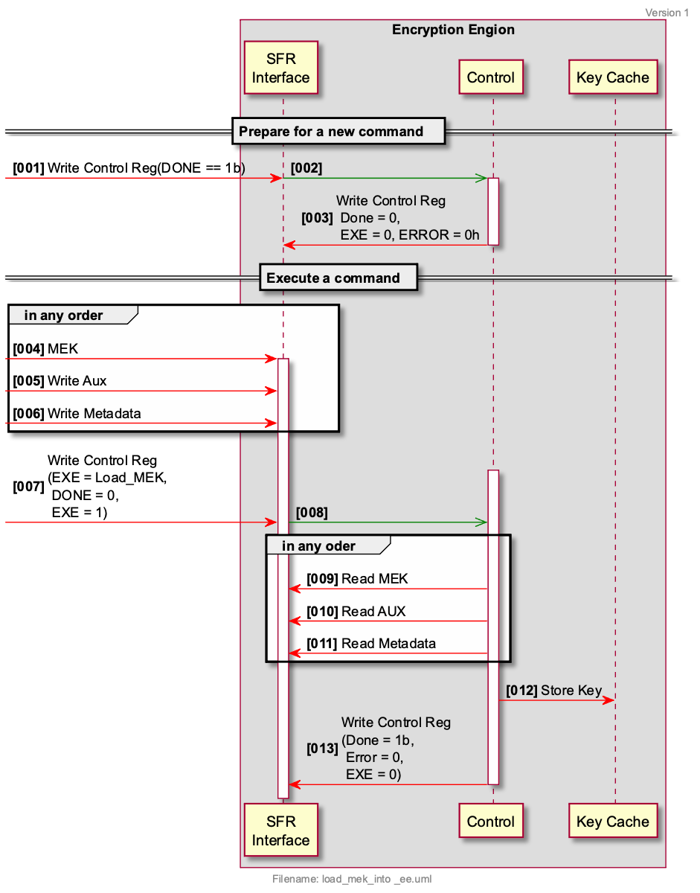

# OCP L.O.C.K.

OCP L.O.C.K. (Layered Open-source Cryptographic Key management) is a feature set conditionally compiled into Caliptra, which provides secure key management for data-at-rest protection in self-encrypting storage devices.

## Contributors

Andrés Lagar-Cavilla (Google) 
Amber Huffman (Google)
Charles Kuzman (Google) 
Jeff Andersen (Google)
Chris Sabol (Google)
Srini Narayanamurthy (Google)
Lee Prewitt (Microsoft)
Michael Norris (Microsoft)
Eric Eilertson (Microsoft)
Bryan Kelly (Microsoft)
Anjana Parthasarathy (Microsoft)
Ben Keen (Microsoft)
Jisoo Kim (Samsung)
Gwangbae Chio (Samsung)
Eric Hibbard (Samsung)
Mike Allison (Samsung)
Mike Allison (Solidigm)
Scott Shadley (Solidigm)
Gamil Cain (Solidigm)
Festus Hategekimana (Solidigm)
John Geldman (Kioxia)
Fred Knight (Kioxia)
Paul Suhler (Kioxia)
James Borden (Kioxia)

## Background

OCP L.O.C.K is being defined to improve drive security. The life of a storage device in a datacenter is that the device leaves the supplier, a customer writes user data to the device, and then the device is decommissioned. Customer data is not allowed to leave the data center. There needs to be a high confidence that the storage device leaving the datacenter is erased. The simplest cloud service provider (CSP) policy to ensure this level of security is to destroy the drive. This produces significant e-waste and prevents any re-use/recycling. Other policies may exist that leverage drive capabilities (e.g., Sanitize), but CSPs require high confidence that these capabilities are securely implemented. 

OCP L.O.C.K. is addressing these issues by:

- Preventing leakage of media keys via firmware vulnerabilities or side channels;
- Binding media keys to a set of securely-provisioned access keys; and
- Enabling attestable “hard” purge via erasure of fuse secrets.

## Overview

Self-encrypting drives (SEDs) store data encrypted to media encryption keys (MEKs). SEDs include the following building blocks:

- The storage media that holds data at rest.
- A hardware cryptographic engine that performs line-rate encryption and decryption of data as it enters and exits the drive.
- A controller that manages the lifecycle of MEKs.

MEKs may be bound to user credentials, which the host must provide to the drive in order for the associated data to be readable. A given MEK may be bound to one or more credentials. This model is captured in the TCG Opal [specification](https://trustedcomputinggroup.org/resource/storage-work-group-storage-security-subsystem-class-opal/).

MEKs, or other keys from which MEKs are derived, may be injected into the drive and tagged with address range metadata, such that subsequent I/Os which target that address range will be encrypted to that injected MEK. This model is captured in the TCG Key Per I/O (KPIO) [specification](https://trustedcomputinggroup.org/resource/tcg-storage-security-subsystem-class-ssc-key-per-i-o/).

MEKs may be securely erased, to effectively erase all data which was encrypted to the MEK. To erase an MEK, it is sufficient for the controller to erase the MEK itself or a key from which it was derived.

In an SED that takes Caliptra with L.O.C.K. features enabled, Caliptra will act as a Key Management Block (KMB). The KMB will be the only entity that can read MEKs and program them into the SED's cryptographic engine. The KMB will expose services to controller firmware which will allow the controller to transparently manage each MEK's lifecycle, without being able to access the raw MEK itself.

## Threat model

The protected asset is the user data stored at rest on the drive. The adversary profile extends up to nation-states in terms of capabilities.

Adversary capabilities include:

- Interception of a storage device in the supply chain.
- Theft of a storage device from a data center.
- Destructively inspecting a stolen device.
- Running arbitrary firmware on a stolen device.
  - This includes attacks where vendor firmware signing keys have been compromised.
- Attempting to glitch execution of code running on general-purpose cores.
- Stealing debug core dumps or UART/serial logs from a device while it is operating in a data center, and later stealing the device.
- Gaining access to any class secrets, global secrets, or symmetric secrets shared between the device and an external entity.
- Executing code within a virtual machine on a multi-tenant host offered by the cloud service provider which manages an attached storage device.
- Accessing all device design documents, code, and RTL.

Given the above adversary profile, the following are a list of vulnerabilities that L.O.C.K. is designed to mitigate.

- Keys managed by storage controller firmware are compromised due to implementation bugs or side channels.
- Keys erased by storage controller firmware are recoverable via invasive techniques.
- MEKs are not fully bound to user credentials due to implementation bugs.
- MEKs are bound to user credentials which are compromised by a vulnerable host.
- Cryptographic erasure was not performed properly due to a buggy host.

## Goals

The goal of OCP L.O.C.K. is to define a KMB that:

- Isolates storage keys to a trusted hardware block
- Binds storage keys to a given set of externally-supplied access keys
- Provides replay-resistant transport security for these access keys
- Allows access key injection into KMB without trusting the host
- Is able to be used in conjunction with the storage device to support TCG Opal and Key Per I/O

## Architecture

In L.O.C.K., Caliptra as the KMB is the only entity that can derive the MEKs which protect user data. The KMB derives MEKs using the following keys:

- A controller-supplied data encryption key (DEK). The DEK is the mechanism by which the controller enforces privilege separation between user credentials under TCG Opal, as well as the mechanism used to model injected MEKs under KPIO.

- A KMB-supplied storage root key, derived from secrets held in device fuses that are only accessible by the KMB. The storage root key may be rotated a small number of times, providing assurance that a nation-state cannot recover key material used by the drive prior to the storage root key rotation.

- Zero or more partial MEKs (PMEKs), each of which is a cryptographically-strong value, encrypted to an externally-supplied access key. PMEKs enable multi-party authorization flows: the access key for each PMEK used to derive an MEK must be provided to the drive before the MEK can be used. Access keys are protected in transit using asymmetric encryption. This enables use-cases where the access key is served to the drive from a remote entity, without having to trust the host to which the drive is attached.

The DEK and storage root key do not require any changes to the host APIs for TCG Opal or KPIO.

Additional host APIs are required to fully model storage root key rotation, PMEKs, and injectable host entropy. Such APIs are currently beyond the scope of the present document.

### MEK derivation

When controller firmware wishes to program an MEK to the hardware cryptographic engine, it performs the following steps:

1. Instruct KMB to initialize its MEK seed buffer.
  - KMB initializes the buffer using a value derived from the storage root key.
2. Provide zero or more PMEKs to the KMB.
  - KMB extends the MEK seed buffer using each given PMEK.
3. Provide a DEK to the KMB.
  - KMB derives the MEK using the given DEK and the contents of the MEK seed buffer.
4. Provide MEK metadata to KMB, such as the MEK's associated namespace and logical block address range.
  - KMB programs the derived MEK and its metadata to the hardware cryptographic engine.

#### Sequence to initialize the MEK seed

#### Sequence to mix a PMEK into the MEK seed

#### Sequence to load an MEK

#### Sequence to load Encryption Engine with Key Cache from SFR interface

#### Legacy MEK derivation for TCG Opal

The controller can maintain a DEK that represents a given user's media encryption key. That DEK can be encrypted at rest by the user's C\_PIN.

When deriving the user's MEK, the controller can pass zero PMEKs in step 2, and the user's decrypted DEK in step 3.

#### Legacy MEK derivation for Key Per I/O

MEKs injected with Key Per I/O will be considered as DEKs under L.O.C.K.

When deriving the associated MEK, the controller can pss zero PMEKs in step 2, and the injected DEK in step 3.

### Hardware cryptographic engine interface

OCP L.O.C.K. defines a standard interface for sharing MEKs and control messages from KMB to vendor-implemented hardware cryptographic engines.

TODO: provide a pointer to the interface definition.

### PMEK lifecycle

#### PMEK generation

Controller firmware may request that KMB generate a random PMEK, bound to a given access key. KMB performs the following steps:

1. Unwrap the given PMEK access key. See [below](#transport-encryption-for-pmek-access-keys) for details on access key transport security.
2. Randomly generate a PMEK.
3. Derive a PMEK encryption key from the storage root key and the decrypted access key.
4. Encrypt the PMEK to the PMEK encryption key.
5. Return the encrypted PMEK to the controller firmware.

Controller firmware may then store the encrypted PMEK in persistent storage.

#### PMEK unlock

Encrypted PMEKs stored at rest in persistent storage are considered "locked", and must be unlocked before they can be used to derive MEKs. Unlocked PMEKs are also encrypted when handled by controller firmware. Unlocked PMEKs do not survive across device reset.

To unlock a PMEK, KMB performs the following steps:

1. Unwrap the given PMEK access key.
2. Derive the PMEK decryption key from the storage root key and the decrypted access key.
3. Decrypt the PMEK using the PMEK decryption key.
4. Encrypt the PMEK using an ephemeral export key that is randomly initialized on startup and lost on reset.
5. Return the re-encrypted "unlocked" PMEK to the controller firmware.

Controller firmware may then stash the encrypted unlocked PMEK in volatile storage, and later provide it to the KMB when deriving an MEK, as described [above](#mek-derivation).

#### PMEK access key rotation

The access key to which a PMEK is bound may be rotated. The user must prove that they have knowledge of both the old and new access key before a rotation is allowed. KMB performs the following steps:

1. Unwrap the given old and new access keys.
2. Derive the old PMEK decryption key from the storage root key and the decrypted old access key.
3. Derive the new PMEK decryption key from the storage root key and the decrypted new access key.
4. Decrypt the PMEK using the old PMEK decryption key.
5. Encrypt the PMEK using the new PMEK decryption key.
6. Return the re-encrypted PMEK to the controller firmware.

Controller firmware then erases the old encrypted PMEK and stores the new encrypted PMEK in persistent storage.

### Transport encryption for PMEK access keys

In L.O.C.K., the KMB maintains a set of key-encapsulation-mechanism (KEM) keypairs, one per algorithm that L.O.C.K. supports. Each KEM public key is endorsed with a certificate that is generated by Caliptra and signed by Caliptra's DICE identity. KEM keypairs are randomly generated on KMB startup, may be periodically rotated, and are lost when the drive resets.

When a user wishes to unlock a PMEK (which is required prior to deriving any MEKs bound to that PMEK), the user performs the following steps:

1. Obtain the KEM public key and certificate from the storage device.
2. Validate the KEM certificate and attached DICE certificate chain.
3. Run `Encaps` and encrypt their access key to the resulting shared key.
4. Transmit the KEM ciphertext and encrypted access key to the storage device.

Upon receipt, KMB will perform the following steps:

1. Run `Decaps` and decrypt the user's access key with the resulting shared secret.
2. Derive the PMEK encryption key using the storage root key and the decrypted access key.
3. Perform PMEK generation, unlock, or rotation actions detailed [above](#pmek-lifecycle).

Upon drive reset, the KEMs are regenerated, and any access keys for PMEKs that had been unlocked prior to the reset will need to be re-provisioned.

#### Access key rotation flows

As noted [above](#pmek-access-key-rotation), during access key rotation the user must prove knowledge of both the old and new access keys. This is accomplished using a slight variation on the encaps-decaps flow. When a new access key is provided to KMB during a rotation, the new access key is double-encrypted: first to the old access key, and then to the shared secret obtained from the `Encaps` operation.

The KMB then performs a double decryption when unwrapping the new access key, proving that the provisioner of the new access key also knows the old access key.

#### Algorithm support

L.O.C.K. will support the following KEM algorithms:

- P384 ECDH
- Hybridized ML-KEM with P384 ECDH

### Storage root key rotation

As the storage root key is held in fuses, it can only be rotated a limited number of times.

This section will be fleshed out with additional details as they become available.

### Reporting of erasure state

A key use-case around cryptographic erasure of user data is confirmation that erasure occurred. This allows third parties to verify cleanliness state, and mitigates risk of bugs in host software that drives cryptographic erasure.

L.O.C.K. will enable reporting of whether a drive is clean following a storage root key rotation.

This section will be fleshed out with additional details as they become available.

### Externally-injected entropy

The KMB relies on randomness to generate PMEKs and KEM keypairs. Storage devices feature their own source of randomness. For end users that prefer not to solely trust device-level randomness sources, KMB allows the host to sample entropy from its own randomness source and inject it into the KMB. Injected randomness is used to permute DRBG state that is held in volatile memory within the KMB.

Note: this does not invalidate any requirements around integration of entropy sources with Caliptra.

### Cryptography helper commands

It is anticipated that controller firmware will perform its own vendor-specific cryptographic operations outside of the KMB boundary. To allow those operations to leverage FIPS-validated cryptographic implementations within Caliptra, Caliptra will support helper mailbox commands that expose the following raw primitive cryptographic operations:

- Get random bytes, using a DRBG as defined in NIST [SP 800-90A](https://csrc.nist.gov/pubs/sp/800/90/a/r1/final)
- Perform AES-256-GCM encryption or decryption, as defined in NIST [SP 800-38D](https://csrc.nist.gov/pubs/sp/800/38/d/final)
- Perform HMAC-384-KDF key derivation, as defined in NIST [SP 800-108](https://csrc.nist.gov/pubs/sp/800/108/r1/upd1/final)