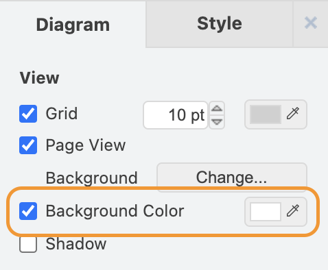

<p align="center">
  
</p>

## Specification Website

A version of the specification tracking the latest content in the `main` branch can be found at https://chipsalliance.github.io/Caliptra/ocp-lock/specification/HEAD/

## Specification source

The specification source is available in [lock_spec.ocp](./lock_spec.ocp).

## Building the specification

To view a rendered version of the specification, clone the [ocp-spec-tools](https://github.com/opencomputeproject/ocp-spec-tools) repository, and then run:

```sh
$ path/to/ocp-spec-tools/docker-pull.sh
$ path/to/ocp-spec-tools/docker-run.sh --pdf lock_spec.pdf lock_spec.ocp
```

## Maintaining the specification

### Editing diagrams

Many diagrams in the specification are generated using draw.io. These can be edited with the [Draw.io Integration](https://marketplace.visualstudio.com/items?itemName=hediet.vscode-drawio) Visual Studio Code extension.

When creating new diagrams, be sure to enable a white background. Otherwise, the diagram will not be legible to viewers with dark mode enabled.

<p align="center">
  
</p>
