

  

**
OCP Layered Open-Source Cryptographic Key-management (L.O.C.K.)
**

**
NVMe™ Key Management Block
**

**
Revision 0.85
**

**
Version 0.85
**

**
Date: April 2025
**

**Contributors**

<table>
<tr><td>Google</td><td>Microsoft</td><td>Samsung</td><td>Solidigm</td><td>Kioxia</td></tr>
<tr style="vertical-align: top;">
    <td><table>
      <tr><td>Andrés Lagar-Cavilla</td></tr>
      <tr><td>Amber Huffman</td></tr>
      <tr><td>Charles Kuzman</td></tr>
      <tr><td>Chris Sabol</td></tr>
      <tr><td>Jeff Andersen</td></tr>
      <tr><td>Srini Narayanamurthy</td></tr>
    </table></td>
    <td><table>
        <tr><td>Anjana Parthasarathy</td></tr>
        <tr><td>Ben Keen</td></tr>
        <tr><td>Bharat Pillilli</td></tr>
        <tr><td>Bryan Kelly</td></tr>
        <tr><td>Christopher Swenson</td></tr>
        <tr><td>Eric Eilertson</td></tr>
        <tr><td>Lee Prewitt</td></tr>
        <tr><td>Michael Norris</td></tr>
    </table></td>
    <td><table>
        <tr><td>Eric Hibbard</td></tr>
        <tr><td>Gwangbae Choi</td></tr>
        <tr><td>Jisoo Kim</td></tr>
        <tr><td>Mike Allison</td></tr>
    </table></td>
    <td><table>
        <tr><td>Festus Hategekimana</td></tr>
        <tr><td>Gamil Cain</td></tr>
        <tr><td>Scott Shadley</td></tr>
    </table></td>
    <td><table>
        <tr><td>Fred Knight</td></tr>
        <tr><td>James Borden</td></tr>
        <tr><td>John Geldman</td></tr>
        <tr><td>Paul Suhler</td></tr>
    </table></td></tr>
</table>

**Revision Table**

| Date           | Revision # | Description |
| :------------- | :--------- | :---------- |
| September 2024 | 0.5        | Initial proposal draft based on work from the list of contributors |
| March 2025     | 0.8        | Update APIs, UML Sequence diagrams, and racheting with fuses |
| April 2025     | 0.85       | Address feedback from 0.8 |

**License**

**Open Web Foundation (OWF) CLA**

Contributions to this Specification are made under the terms and conditions set forth in Open Web Foundation Modified Contributor License Agreement ("OWF CLA 1.0") ("Contribution License") by:

**Google, Microsoft, Samsung, Solidigm, Kioxia**

Usage of this Specification is governed by the terms and conditions set forth in **Open Web Foundation Modified Final Specification Agreement ("OWFa 1.0") ("Specification License")**.

You can review the applicable OWFa1.0 Specification License(s) referenced above by the contributors to this Specification on the OCP website at. For actual executed copies of either agreement, please contact OCP directly.

**Notes:**
1) The above license does not apply to the Appendix or Appendices. The information in the Appendix or Appendices is for reference only and non-normative in nature.

NOTWITHSTANDING THE FOREGOING LICENSES, THIS SPECIFICATION IS PROVIDED BY OCP "AS IS" AND OCP EXPRESSLY DISCLAIMS ANY WARRANTIES (EXPRESS, IMPLIED, OR OTHERWISE), INCLUDING IMPLIED WARRANTIES OF MERCHANTABILITY, NON-INFRINGEMENT, FITNESS FOR A PARTICULAR PURPOSE, OR TITLE, RELATED TO THE SPECIFICATION. NOTICE IS HEREBY GIVEN, THAT OTHER RIGHTS NOT GRANTED AS SET FORTH ABOVE, INCLUDING WITHOUT LIMITATION, RIGHTS OF THIRD PARTIES WHO DID NOT EXECUTE THE ABOVE LICENSES, MAY BE IMPLICATED BY THE IMPLEMENTATION OF OR COMPLIANCE WITH THIS SPECIFICATION. OCP IS NOT RESPONSIBLE FOR IDENTIFYING RIGHTS FOR WHICH A LICENSE MAY BE REQUIRED IN ORDER TO IMPLEMENT THIS SPECIFICATION. THE ENTIRE RISK AS TO IMPLEMENTING OR OTHERWISE USING THE SPECIFICATION IS ASSUMED BY YOU. IN NO EVENT WILL OCP BE LIABLE TO YOU FOR ANY MONETARY DAMAGES WITH RESPECT TO ANY CLAIMS RELATED TO, OR ARISING OUT OF YOUR USE OF THIS SPECIFICATION, INCLUDING BUT NOT LIMITED TO ANY LIABILITY FOR LOST PROFITS OR ANY CONSEQUENTIAL, INCIDENTAL, INDIRECT, SPECIAL OR PUNITIVE DAMAGES OF ANY CHARACTER FROM ANY CAUSES OF ACTION OF ANY KIND WITH RESPECT TO THIS SPECIFICATION, WHETHER BASED ON BREACH OF CONTRACT, TORT (INCLUDING NEGLIGENCE), OR OTHERWISE, AND EVEN IF OCP HAS BEEN ADVISED OF THE POSSIBILITY OF SUCH DAMAGE.

**Compliance with OCP Tenets**

Please describe how this Specification complies to the following OCP tenets. Compliance is required for at least three of the four tenets. The ideals behind open sourcing stipulate that everyone benefits when we share and work together. Any open source project is designed to promote sharing of design elements with peers and to help them understand and adopt those contributions. There is no purpose in sharing if all parties aren't aligned with that philosophy. The IC will look beyond the contribution for evidence that the contributor is aligned with this philosophy. The contributor actions, past and present, are evidence of alignment and conviction to all the tenets.

**Openness**

OCP L.O.C.K. source for RTL and firmware will be licensed using the Apache 2.0 license. The specific mechanics and hosting of the code are work in progress due to CHIPS alliance timelines. Future versions of this spec will point to the relevant resources.

**Efficiency**

OCP L.O.C.K. is used to generate and load keys for use of encrypting user data prior to storing data at rest and decrypting stored user data at rest when read. So, it cannot yield a measurable impact on system efficiency.

**Impact**

OCP L.O.C.K. enables consistency and transparency to a foundational area of security of media encryption keys such that no firmware in the device ever has access to a media encryption key. Furthermore, no decrypted media encryption key exists in the device when power is removed from the device.

**Scale**

OCP L.O.C.K. is a committed intercept for Cloud silicon for Google and Microsoft. This scale covers both a significant portion of the Cloud market in hyperscale and enterprise.

**Sustainability**

The goal of OCP L.O.C.K. is to eliminate the need to destroy storage devices (e.g., SSDs) in the Cloud market by providing a mechanism that increases the confidence that a media encryption key within the device is deleted in a crypto-erase. This enables repurposing the device and or components on the device at end of use or end of life. Given the size of the Cloud market this provides a significant reduction of e-waste.

  

[[toc]]

# Introduction

OCP L.O.C.K. (Layered Open-source Cryptographic Key management) is a feature set conditionally compiled into Caliptra Subsystem 2.1+, which provides secure key management for Data-At-Rest protection in self-encrypting storage devices.

OCP L.O.C.K. was originally created as part of the Open Compute Project (OCP). The major revisions of the OCP L.O.C.K. specifications are published as part of Caliptra at OCP, as OCP L.O.C.K. is an extension to Caliptra. The evolving source code and documentation for Caliptra are in the repository within the CHIPS Alliance Project, a Series of LF Projects, LLC.

OCP L.O.C.K. may be integrated within a variety of self-encrypting storage devices, and is not restricted exclusively to NVMe.

# Background

In the life of a storage device in a datacenter, the device leaves the supplier, a customer writes user data to the device, and then the device is decommissioned. Customer data is not allowed to leave the data center. The cloud service provider (CSP) needs high confidence that the storage device leaving the datacenter is secure. The current default CSP policy to ensure this level of security is to destroy the drive. Other policies may exist that leverage drive capabilities (e.g., Purge), but are not generally deemed inherently trustworthy by these CSPs[[1]]. This produces significant e-waste and inhibits any re-use/recycling.

Self-encrypting drives (SEDs) store data encrypted at rest to media encryption keys (MEKs). SEDs include the following building blocks:

- The storage media that holds data at rest.
- An encryption engine which performs line-rate encryption and decryption of data as it enters and exits the drive.
- A controller which exposes host-side APIs for managing the lifecycle of MEKs.

MEKs may be bound to user credentials, which the host must provide to the drive in order for the associated data to be readable. A given MEK may be bound to one or more credentials. This model is captured in the TCG Opal[[2]] specification.

MEKs may be securely purged, to effectively purge all data which was encrypted to the MEK. To purge an MEK, it is sufficient for the controller to purge all copies of it, or a key with which it was protected.

# Threat model

The protected asset is the user data stored at rest on the drive. The adversary profile extends up to nation-states in terms of capabilities.

Adversary capabilities include:

- Interception of a storage device in the supply chain.
- Theft of a storage device from a data center.
- Destructively inspecting a stolen device.
- Running arbitrary firmware on a stolen device.
  - This includes attacks where vendor firmware signing keys have been compromised.
- Attempting to glitch execution of code running on general-purpose cores.
- Stealing debug core dumps or UART/serial logs from a device while it is operating in a data center, and later stealing the device.
- Gaining access to any class secrets, global secrets, or symmetric secrets shared between the device and an external entity.
- Executing code within a virtual machine on a multi-tenant host offered by the cloud service provider which manages an attached storage device.
- Accessing all device design documents, code, and RTL.

Given the above adversary profile, the following are a list of vulnerabilities that OCP L.O.C.K. is designed to mitigate.

- MEKs managed by storage controller firmware are compromised due to implementation bugs or side channels.
- MEKs purged by storage controller firmware are recoverable via invasive techniques.
- MEKs are not fully bound to user credentials due to implementation bugs.
- MEKs are bound to user credentials which are compromised by a vulnerable host.
- Cryptographic erasure was not performed properly due to a buggy host.

# OCP L.O.C.K. goals

OCP L.O.C.K. is being defined to improve drive security. In an SED that takes Caliptra with OCP L.O.C.K. features enabled, Caliptra will act as a Key Management Block (KMB). The KMB will be the only entity that can read MEKs and program them into the SED's cryptographic engine. The KMB will expose services to controller firmware which will allow the controller to transparently manage each MEK's lifecycle, without being able to access the raw MEK itself.

The OCP L.O.C.K. KMB satisfies the following properties:

- Prevents leakage of media keys via firmware vulnerabilities or side channels, by isolating MEKs to a trusted hardware block.
- Binds MEKs to a given set of externally-supplied access keys, provisioned with replay-resistant transport security such that they can be injected without trusting the host.
- Uses epoch keys for attestable epoch-based cryptographic purge.
- Is able to be used in conjunction with the Opal or Key Per I/O[[3]] storage device specifications.

## Non-goals

The following areas are out of scope for this project.

- Compliance with IEEE 1619 2025 requirements around key scope, i.e. restricting a given MEK to only encrypt a maximum of 244 128-bit blocks. Controller firmware will be responsible for enforcing this.
- Compliance with Common Criteria requirement FCS_CKM.1.1(c)[[4]] when supporting derived MEKs. Key Per I/O calls for DEKs to be injected into the device. To support OCP L.O.C.K.'s goals around enabling cryptographic purge, before the injected DEK is used to encrypt user data, it is first conditioned with an on-device secret that can be securely zeroized. FCS_CKM.1.1(c) currently does not allow injected keys to be thus conditioned and therefore does not allow for cryptographic purge under the Key Per I/O model. A storage device that integates OCP L.O.C.K. and aims to be compliant with this Common Criteria requirement may not support Key Per I/O.
- Authorization for CEK/DEK/MEK rotation, or binding a given MEK to a particular locking range. The controller firmware is responsible for these.

## Integration verification

A product which integrates OCP L.O.C.K. will be expected to undergo an OCP S.A.F.E. review, to ensure that the controller firmware correctly invokes OCP L.O.C.K. services.

# Architecture

The following figure shows the basic high-level blocks of OCP L.O.C.K.

  

*
Figure 1: OCP L.O.C.K. high level blocks
*

OCP L.O.C.K.'s KMB protects MEKs using the following keys:

- A controller-supplied data encryption key (DEK). The DEK is the mechanism by which the controller enforces privilege separation between user credentials under TCG Opal, as well as the mechanism used to model injected MEKs under Key Per I/O.

- A controller-supplied epoch key (CEK), provided by the controller firmware when loading each MEK. The CEK can be zeroized to perform a cryptographic purge. The controller firmware is responsible for managing and rotating this key, and for ensuring that MEKs are not loaded while the CEK is zeroized.

- A KMB-managed fuse epoch key (FEK), derived from secrets held in device fuses that are only accessible by the KMB. The FEK may be zeroized and regenerated a small number of times, providing assurance that an advanced adversary cannot recover key material that had been in use by the drive prior to the FEK zeroization. KMB does not allow MEKs to be loaded while the FEK is zeroized. KMB can report whether the FEK is zeroized and therefore whether the drive is clean.

- Zero or more partial MEKs (PMEKs), each of which is a cryptographically-strong value randomly generated by KMB, encrypted at rest using a key derived from the FEK as well as an externally-supplied access key. The access key is never stored persistently within the device. PMEKs enable multi-party authorization flows: the access key for each PMEK to which an MEK is bound must be provided to the drive before the MEK can be loaded. Access keys are protected in transit using HPKE[[5]] keypairs. This enables use-cases where the access key is served to the drive from a remote entity, without having to trust the host to which the drive is attached. To bind a given locking range to multiple external authorities, the controller can generate multiple PMEKs and use them to load the locking range's MEK. PMEK access keys may be held at rest in a remote key management service. An MEK may be bound to zero PMEKs, which allows for legacy Opal or Key Per I/O flows.

The keys listed here are used together to derive an MEK secret. The MEK secret is used in one of two flows:

- **MEK encryption** - the controller obtains a random MEK from KMB, encrypted by the MEK secret, and can load the encrypted MEK into the encryption engine later via KMB. This supports Opal use-cases.
  - In this flow, the DEK may be encrypted by a user's Opal C_PIN. Legacy controller firmware logic which decrypts MEKs can be repurposed to produce the DEK.
- **MEK derivation** - the controller instructs KMB to load the MEK secret into the encryption engine as a derived MEK. This supports Key Per I/O use-cases.
  - In this flow, the DEK may be the imported key associated with a Key Per I/O key tag.

MEKs are never visible to controller firmware. Controller firmware instructs KMB to load MEKs into the key cache of the encryption engine, using standard interfaces described in the [Interfaces](#interfaces) section. Each MEK has associated vendor-defined metadata, to identify for example the namespace and LBA range to be encrypted by the MEK.

All MEKs are removed from the encryption engine on a power cycle or during zeroization of the storage device.

All keys randomly generated by KMB are generated using a DRBG seeded by Caliptra's TRNG. The DRBG may be reseeded using entropy provided by the host.

## Host APIs

The DEK can be modeled using existing TCG Opal or Key Per I/O host APIs.

Rotation of the FEK and CEK, management of PMEKs and PMEK access keys, and injection of host entropy, require additional host APIs beyond those available in TCG Opal or Key Per I/O. Such APIs are beyond the scope of the present document.

## Key hierarchy

  

*
Figure 2: OCP L.O.C.K. key hierarchy
*

## PMEKs

PMEKs are the mechanism by which KMB enforces multi-party authorization as a precondition to loading an MEK. PMEKs exist in one of two states: locked or ready. In both these states the PMEK is encrypted to a key known only to Caliptra.

- A locked PMEK's encryption key is derived from the FEK as well as an externally-supplied access key. The locked PMEK is held at rest by controller firmware.
- A ready PMEK's encryption key is a volatile key held within Caliptra which is generated at startup and lost on cold reset. Ready PMEKs are held in controller firmware memory.

The externally-supplied access key is encrypted in transit using an HPKE public key held by Caliptra. The "ready" state allows the HPKE keypair to be rotated after the access key has been provisioned to the storage device, without removing the ability for Caliptra to decrypt the PMEK when later loading an MEK bound to that PMEK.

For each PMEK to which a given MEK is bound, the host is expected to invoke a command to supply the PMEK's encrypted access key. Upon receipt the controller firmware passes that encrypted access key to Caliptra, along with the locked PMEK, to produce the ready PMEK which is cached in controller memory. This is done prior to the controller firmware actually loading the MEK, and is performed once for each PMEK to which a given MEK is bound.

### Transport encryption for PMEK access keys

KMB maintains a set of HPKE keypairs, one per HPKE algorithm that KMB supports. Each HPKE public key is endorsed with a certificate that is generated by Caliptra and signed by Caliptra's DICE identity. HPKE keypairs are randomly generated on KMB startup, and mapped to unique handles. Keypairs may be periodically rotated and are lost when the drive resets. Controller firmware is responsible for enumerating the available HPKE public keys and exposing them to the user via a host interface.

When a user wishes to generate or ready a PMEK (which is required prior to loading any MEKs bound to that PMEK), the user performs the following steps:

1. Select the HPKE public key and obtain its certificate from the storage device.
2. Validate the HPKE certificate and attached DICE certificate chain.
3. Encrypt their access key to the HPKE public key.
4. Transmit the encrypted access key to the storage device.

Upon receipt, KMB will unwrap the access key and proceed to generate or ready the PMEK.

Upon drive reset, the HPKE keypairs are regenerated, and any access keys for PMEKs that had been made ready prior to the reset will need to be re-provisioned in order to transition those PMEKs to a ready state again.

#### Algorithm support

KMB supports the following HPKE algorithms:

- P-384 ECDH
- Hybridized ML-KEM-1024 with P-384 ECDH

The following two diagrams illustrate the detailed cryptographic operations involved in unwrapping the access key using each of these algorithms. Subsequent diagrams elide these details and represent the operation as "HPKE unwrap".

#### PMEK access key unwrap (ECDH)

  

*
Figure 3: PMEK access key unwrap with ECDH
*

#### PMEK access key unwrap (Hybrid ML-KEM + ECDH)

The only difference here from the above flow is how the HPKE Shared Secret is derived. Operations which produce an AES key and IV from that shared secret are identical to the prior flow, and are omitted here for brevity.

  

*
Figure 4: PMEK access key unwrap with hybrid ML-KEM + ECDH
*

### PMEK lifecycle

PMEKs can be generated, made ready, and have their access keys rotated.

#### PMEK generation

Controller firmware may request that KMB generate a PMEK, bound to a given access key. KMB performs the following steps:

1. Unwrap the given PMEK access key.
2. Randomly generate a PMEK.
3. Derive a PMEK encryption key from the FEK and the decrypted access key.
4. Encrypt the PMEK to the PMEK encryption key.
5. Return the encrypted PMEK to the controller firmware.

Controller firmware may then store the encrypted PMEK in persistent storage.

  

*
Figure 5: PMEK generation
*

#### PMEK readying

Encrypted PMEKs stored at rest in persistent storage are considered "locked", and must be made ready before they can be used to load an MEK. Ready PMEKs are also encrypted when handled by controller firmware. Ready PMEKs do not survive across device reset.

To ready a PMEK, KMB performs the following steps:

1. Unwrap the given PMEK access key using the HPKE keypair held within Caliptra.
2. Derive the PMEK encryption key from the FEK and the decrypted access key.
3. Decrypt the PMEK using the PMEK encryption key.
4. Encrypt the PMEK using the Ready PMEK Encryption Key.
5. Return the re-encrypted "ready" PMEK to the controller firmware.

Controller firmware may then stash the encrypted ready PMEK in volatile storage, and later provide it to the KMB when loading an MEK, as described [below](#meks).

To mitigate against cryptographic attacks on the HPKE keypair that rely on repeated invocations of this command, this command is rate-limited.

  

*
Figure 6: PMEK readying
*

#### PMEK access key rotation

The access key to which a PMEK is bound may be rotated. The user must prove that they have knowledge of both the old and new access key before a rotation is allowed. This is accomplished using a slight variation on the usual access key import flow. When a new access key is provided to KMB during a rotation, the new access key is double-encrypted: first to the old access key, and then to the HPKE public key. KMB performs the following steps:

1. Unwrap the given old access key and encrypted new access key.
2. Decrypt the new access key using the old access key.
3. Derive the old PMEK encryption key from the FEK and the decrypted old access key.
4. Derive the new PMEK encryption key from the FEK and the decrypted new access key.
5. Decrypt the PMEK using the old PMEK encryption key.
6. Encrypt the PMEK using the new PMEK encryption key.
7. Return the re-encrypted PMEK to the controller firmware.

Controller firmware then zeroizes the old encrypted PMEK and stores the new encrypted PMEK in persistent storage.

  

*
Figure 7: PMEK access key rotation
*

## MEKs

KMB can encrypt randomly-generated MEKs, or compute derived MEKs.

### Encrypting and decrypting a randomly-generated MEK

  

*
Figure 8: MEK encryption and decryption
*

### Deriving an MEK

  

*
Figure 9: MEK derivation
*

### MEK secret derivation

This diagram provides additional details on how the CEK, DEK, and FEK are mixed together to produce the MEK secret, which then either encrypts/decrypts a random MEK or is used to compute a derived MEK.

  

*
Figure 10: MEK secret derivation
*

## FEKs and CEKs

KMB supports a pair of epoch keys: the FEK and CEK. Both must be available, i.e. non-zeroized, in order for MEKs to be loaded.

- The **FEK** is derived from secrets held in Caliptra's fuse block, and is never visible outside of Caliptra. If the FEK is zeroized, KMB does not allow MEKs to be loaded.
- The **CEK** is managed by controller firmware, and may be stored in flash. If the CEK is zeroized, controller firmware is responsible for enforcing that MEKs are not loaded.

Zeroizing either the FEK or CEK is equivalent to performing a cryptographic purge. FEK zeroization is effectively a "hard" purge, as it is highly difficult to recover secrets from a zeroized fuse bank.

The FEK is derived from a series of N 256-bit ratchet secrets present in a fuse bank, dubbed R0..RN-1, where N is between 4 and 16 inclusive. These ratchet secrets have the following properties:

- Can individually transition from all-zeroes → randomized → all-ones. RX is only randomized once RX-1 has transitioned to all-ones.
- Programmable via the Caliptra fuse controller.
- Only readable by Caliptra Core, via fuse registers.
  - Internally, the fuse registers will be treated like the DICE UDS, in that their contents can only be deposited into Key Vault slots, without direct visibility by Caliptra firmware.

Caliptra features a [Stable Identity](https://github.com/chipsalliance/caliptra-sw/blob/main-2.x/rom/dev/README.md#derivation-of-the-key-ladder-for-stable-identity) Key (SIK), which is a non-ratchetable secret derived from the DICE UDS, the current value of the field entropy fuse bank, as well as the current lifecycle and debug states. The SIK can be used to protect long-lived data. Caliptra's Stable Identity feature is implemented in terms of a key ladder, with different keys for different firmware SVNs, with the property that firmware whose SVN is X can only obtain Stable Identity keys bound to major versions less than or equal to X. The SIK used by KMB is the key ladder secret bound to SVN 0, ensuring that firmware of any SVN can wield it.

The FEK is derived from the SIK, along with the currently-active ratchet secret. In normal cases, if the currently-active ratchet secret is unprogrammed or zeroized, the FEK is disabled and no MEKs are allowed to be loaded. KMB exposes a command that allows the owner to permanently opt into an operating mode where the FEK is derived solely from the SIK. In this mode, data written to the storage device can no longer be purged via FEK zeroization.

To satisfy FIPS 140 zeroization requirements once the FEK can no longer be zeroized, the FIPS boundary will need to include CEK zeroization functionality in the storage controller firmware.

  

*
Figure 11: FEK derivation
*

### FEK lifecycle

A device out of manufacturing is required to have programmed the first FEK. KMB exposes the following commands to manage the FEK lifecycle:

| Command              | Description |
| :------------------- | :---------- |
| PROGAM_NEXT_FEK      | Programs a random ratchet secret into the next slot. Upon success, if the CEK is programmed, MEKs may be loaded. |
| ZEROIZE_CURRENT_FEK  | Sets the current ratchet secret fuses to all-ones. May be re-attempted if an error caused the active fuse bank to be left in an invalid state. Upon success, MEKs may not be loaded. |
| ENABLE_PERMANENT_FEK | Enables a mode where the FEK is derived solely from SIK. May be re-attempted if an error caused the active fuse bank to be left in an invalid state. Upon success, if the CEK is programmed, MEKs may be loaded. |

If an error causes the active fuse bank to be left in an invalid state, MEKs may not be loaded. If this state persists, the device is unusable.

  

*
Figure 12: FEK & CEK state machine with four ratchet slots
*

### CEK lifecycle

Controller firmware is responsible for enforcing that CEK programming and zeroization follows the state machine above. Specifically:

- The CEK may only be programmed once the FEK is available.
- The FEK may only be zeroized once the CEK is zeroized.

## Random key generation via DRBG

KMB is able to generate multiple kinds of random keys:

- KEMs: used for access key transport encryption
- PMEKs: used for MEK protection.
- MEKs: used for user data protection.

A host is able to inject external entropy into KMB where it is held in internal volatile memory. Subsequent keys are randomly generated using both KMB's TRNG and the host's entropy.

  

*
Figure 13: DRBG usage
*

## Boot-time initialization

At initial boot, KMB performs the following steps:

- Firmware determines whether an FEK is available, based on the fuse configuration. If an FEK is unavailable, KMB enters a mode where MEKs are not allowed to be loaded.
- Firmware initializes random HPKE keypairs for each supported algorithm, and maps them to unique handles.

# Interfaces

OCP L.O.C.K. defines two interfaces:

- The **encryption engine interface** is exposed from the vendor-implemented encryption engine to KMB, and defines a standard mechanism for programming MEKs and control messages.
- The **mailbox interface** is exposed from KMB to storage controller firmware, and enables the controller to manage MEKs and associated keys.

## KMB → encryption engine interface

This section defines the interface between the Key Management Block (KMB) and an encryption engine. An encryption engine is used to encrypt/decrypt user data and its design and implementation are vendor specific. MEKs are generated or derived within KMB and used by the encryption engine to encrypt and decrypt user data. This interface is used to load MEKs from KMB to the encryption engine or to cause the encryption engine to unload (i.e., remove) loaded MEKs. The MEKs transferred between the KMB and the encryption engine shall not be accessible by the controller firmware.

### Overview

The encryption engine uses a stored MEK to encrypt and decrypt user data. For the purposes of this specification, the entity within the encryption engine used to store the MEKs is called the key cache. Each encryption and decryption of user data is coupled to a specific MEK which is stored in the key cache bound to a unique identifier, called metadata. Each (metadata, MEK) pair is also associated with additional information, called aux, which is used neither as MEK nor an identifier, but has some additional information about the pair. Therefore, the key cache as an entity which stores (metadata, aux, MEK) tuples.

In order to achieve the security goals for KMB, KMB is limited to be the unique component which loads an (metadata, aux, MEK) tuple into the key cache and unloads a tuple within the device, so that MEKs can only be exposed to KMB and the encryption engine. Controller firmware arbitrates all operations in the KMB to encryption engine interface, therefore controller firmware is responsible for managing which MEK is loaded in the key cache. Controller firmware has full control on metadata and optional aux. Figure 14 is an illustration of the KMB to encryption engine interface that shows:

- The tuple for loading an MEK
- The metadata for unloading an MEK
- An example of a key cache within the encryption engine

  

*
Figure 14: KMB to Encryption SFR Interface
*

### Special Function Registers

KMB uses Special Function Registers (SFRs) to communicate with the encryption engine as shown in Table 1 and each of the following subsections which describe the registers.

| Register                   | Address        | Byte Size | Description |
| :------------------------- | :------------- | :-------- | :---------- |
| Control                    | SFR_BASE + 0h  | 4h        | Register to handle commands |
| Metadata (METD)            | SFR_BASE + 10h | 14h       | Register to provide metadata |
| Auxiliary Data (AUX)       | SFR_BASE + 30h | 20h       | Register to provide auxiliary values |
| Media Encryption Key (MEK) | SFR_BASE + 50h | 40h       | Register to provide MEK |

*
Table 1: KMB to encryption engine SFRs
*

SFR_BASE is an address that is configured within KMB. The integrator should make sure that KMB can access these SFRs through these addresses.

#### Control register

Table 2 defines the Control register used to sequence the execution of a command and obtain the status of that command.

| Bits  | Type | Reset | Description |
| :---- | :--- | :---- | :---------- |
| 31    | RO   | 0h    | **Ready (RDY):** After an NVM Subsystem Reset, this bit is set to 1b, then the encryption engine is ready to execute commands. If this bit is set to 0b, then the encryption engine is not ready to execute commands. |
| 30:20 | RO   | 0h    | Reserved |
| 19:16 | RO   | 0h    | **Error (ERR):** If the DONE bit is set to 1b by the encryption engine, then this field is set to a non-zero value to indicate the encryption engine detected an error during the execution the command specified by the CMD field. The definition of a non-zero value is vendor specific. Encryption engine error codes are surfaced back to controller firmware.<table><tr><td><b>Value</b></td><td><b>Description</b></td></tr><tr><td>0h</td><td>Command Successful</td></tr><tr><td>1h to 3h</td><td>Reserved</td></tr><tr><td>4h to Fh</td><td>Vendor Specific</td></tr></table> If the DONE bit is set to 1b by the encryption engine and this field is set to 0h, then the encryption engine is indicating a successful execution of a command specified by the CMD field. If the DONE bit is set to 1b by KMB, then the field is set to 0000b. |
| 15:6  | RO   | 0h    | Reserved |
| 5:2   | RW   | 0h    | **Command (CMD):** This field specifies the command to execute or the command associated with the reported status. <table><tr><tr><b>Value</b></tr><tr><b>Description</b></tr></tr><tr><td>0h</td><td>Reserved</td></tr><tr><td>1h</td><td><b>Load MEK:</b> Load the key specified by the AUX field and MEK register into the encryption engine as specified by the <b>METD</b> field.</td></tr><tr><td>2h</td><td><b>Unload MEK:</b> Unload the MEK from the encryption engine as specified by the <b>METD</b> field.</td></tr><tr><td>3h</td><td><b>Zeroize:</b> Unload all of the MEKs from the encryption engine (i.e., zeroize the encryption engine MEKs).</td></tr><tr><td>4h to Fh</td><td>Reserved</td></tr></table> |
| 1     | RW   | 0b    | **Done (DN):** This bit indicates the completion of a command by the encryption engine. If this bit is set to 1b by the encryption engine, then the encryption engine has completed the command specified by the CMD field. If the EXE bit is set to 1b and this bit is set to 1b, then the encryption engine has completed executing the command specified by the CMD field and the ERR field indicates the status of the execution of that command. A write of the value 1b to this bit shall cause the encryption engine to:<ul><li>set this bit to 0b;</li><li>set the EXE bit to 0b; and</li><li>set the ERR field to 0000b.</li></ul> |
| 0     | RW   | 0b    | **Execute (EXE):** A write of the value 1b to this bit specifies that the encryption engine is to execute the command specified by the CMD field. If the DONE bit is set to 1 by KMB, then the bit is set to 0b. |

*
Table 2: Offset SFR_Base + 0h: CTRL – Control
*

From the KMB, the Control register is the register to write a command and receive its execution result. From its counterpart, the encryption engine, the Control register is used to receive a command and write its execution result.

The expected change flow of the Control register to handle a command is as follows:

1. If **RDY** is set to 1b, then KMB writes **CMD** and **EXE**
    1. **CMD:** either 1h, 2h or 3h
    2. **EXE:** 1b
2. The encryption engine writes** **ERR** and **DN**
    1. **ERR:** either 0b or a non-zero value depending on the execution result
    2. **DN:** 1b
3. The KMB writes **DN**
    1. **DN:** 1b
4. The encryption engine writes **CMD**, **ERR**, **DN** and **EXE**
    1. **CMD:** 0h
    2. **ERR:** 0h
    3. **DN:** 0b
    4. **EXE:** 0b

The KMB therefore interacts with the Control register as follows in the normal circumstance:

1. The KMB writes **CMD** and **EXE**
    1. **CMD:** either 1h, 2h or 3h
    2. **EXE:** 1b
2. The KMB waits **DN** to be 1
3. The KMB writes **DN**
    1. **DN:** 1b
4. The KMB waits **DN** to be 0

Since the Control register is in fact a part of the encryption engine whose implementation can be unique to each vendor, behaviors of the Control register with the unexpected flow are left for vendors. For example, a vendor who wants robustness might integrate a write-lock into the Control register in order to prevent two almost simultaneous writes on EXE bit.

#### Metadata register

Table 3 defines the Metadata register.

| Bytes | Type  | Reset | Description |
| :---- | :---- | :---- | :---------- |
| 19:00 | RW    | 0h    | **Metadata (METD):** This field specifies metadata that is vendor specific and specifies the entry in the encryption engine for the MEK. |

*
Table 3: Offset SFR_Base + 10h: METD – Metadata
*

The KMB and the encryption engine must be the only components which have access to MEKs. Each MEK is associated with a unique identifier, which may be visible to other components, in order for the MEK to be used for any key-related operations including data I/O. The **METD** field is used as such an identifier.

Instead of generating a random and unique identifier within the KMB while loading an MEK, the KMB takes an **METD** value as input from the controller firmware and write to the **METD** register without any modification for the sake of the following reasons:

1. A vendor does not need to implement an additional algorithm to map between identifiers in its own system and in the KMB
2. A vendor-unique key-retrieval algorithm can easily be leveraged into a **METD**-generation algorithm

In order to reduce ambiguity, two examples of the **METD** field will be given: Logical Block Addressing (LBA) range-based metadata; and key-tag based metadata.

When an SSD stores data with address-based encryption, an MEK can be uniquely identified by a (LBA range, Namespace ID) pair. Then, the (LBA range, Namespace ID) pair can be leveraged into **METD** as on Figure 15.

  

*
Figure 15: LBA range based metadata format
*

Address-based encryption is not however the only encryption mechanism in SSDs. For example, in TCG Key Per I/O, an MEK is selected by a key tag, which does not map to an address. Figure 16 shows an example of **METD** in such cases.

  

*
Figure 16: Key tag based metadata format
*

The above examples are not the only possible values of **METD**. Vendors are encouraged to design and use their own **METD** if it fits better to their system.

#### Auxiliary Data register

Table 4 defines the Auxiliary Data register.

*
Table 4: Offset SFR_Base + 20h: AUX – Auxiliary Data
*

| Bytes | Type | Reset | Description |
| :---- | :--- | :---- | :---------- |
| 31:00 | RW   |  0h   | **Auxiliary Data (AUX):** This field specifies auxiliary data associated to the MEK. |

The **AUX** field supports vendor-specific features on MEKs. The KMB itself only supports fundamental functionalities in order to minimize attack surfaces on MEKs. Moreover, vendors are free to design and implement their own MEK-related functionality within the encryption engine, as long as that functionality cannot be used to exfiltrate MEKs. In order to support these functionalities, some data may be associated and stored with an MEK, and the **AUX** field facilitates this association.

When the controller firmware instructs the KMB to load an MEK, the controller firmware is expected to provide an **AUX** value. Similar to the **METD** field, the KMB will write the **AUX** value into the Auxiliary Data register without any modification.

One simple use case of the **AUX** field is to store an offset of initialization vector or nonce. It can also be used in a more complicated use case. Here is an example. Suppose that there exists a vendor who wants to design a system which supports several modes of operation through the encryption engine while using the KMB. Then, a structure of **AUX** value as on Figure 17 can be used.

  

*
Figure 17: Auxiliary data format example
*

When the controller firmware instructs KMB to load an MEK, the controller firmware can use the **AUX** value to specify which mode of operation should be used and which value should be used as an initialization vector or a nonce with the generated MEK.

#### Media Encryption Key register

Table 5 defines the Media Encryption Key register.

*
Table 5: Offset SFR_Base + 40h: MEK – Media Encryption Key
*

| Bytes | Type | Reset | Description |
| :---- | :--- | :---- | :---------- |
| 63:00 | WO   | 0h    | **Media encryption key:** This field specifies a 512-bit encryption key. |

The encryption engine is free to interpret the provided key in a vendor-defined manner. One sample interpretation for AES-XTS-512 is presented in Figure 18.

  

*
Figure 18: MEK format example for AES-XTS-512
*

If an algorithm used by the encryption engine does not require 512 bits of key material, the encryption engine is free to disregard unused bits.

As a part of Caliptra, loaded MEKs are only ever present in the Key Vault, so that they can be protected against any firmware-level attacks. KMB will write MEKs into the MEK using the DMA engine. Given an index and a destination identifier, the DMA engine will copy the key value stored in the given key vault slot to the destination address to which the DMA engine translates the destination identifier.

### AES-XTS key validation requirements

FIPS 140-3 IG section C.I[[6]] states that in AES-XTS, the key is "parsed as the concatenation of two AES keys, denoted by *Key_1* and *Key_2*, that are 128 [or 256] bits long... The module **shall** check explicitly that *Key_1* ≠ *Key_2*, regardless of how *Key_1* and *Key_2* are obtained."

The encryption engine will be responsible for performing this check when in AES-XTS mode.

### KMB command sequence

Figure 19 shows a sample command execution. This is an expected sequence when the controller firmware instructs the KMB to load an MEK. The internal behavior of the encryption engine is one of several possible mechanisms, and can be different per vendor.

  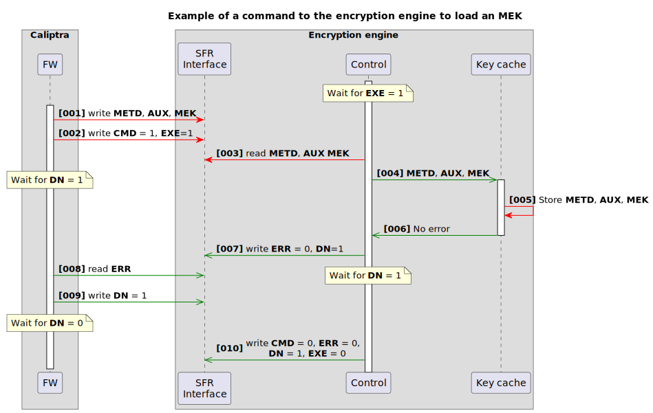

*
Figure 19: Command execution example for loading an MEK
*

## Controller → KMB interface

This section provides the mailbox commands exposed by Caliptra as part of OCP L.O.C.K.

Each of these commands returns a `fips_status` field. This provides an indicator of whether KMB is operating in FIPS mode. The values for this field are as follows:

| Value       | Description |
| :---------- | :---------- |
| 0h          | FIPS mode enabled. |
| 1h to FFFFh | Reserved. |

### GET_STATUS

Exposes a command that allows controller firmware to determine if the encryption engine is ready to process commands as well vendor-defined drive crypto engine status data.

Command Code: 0x4753_5441 ("GSTA")

Table: GET_STATUS input arguments

| Name  | Type  | Description |
| :---- | :---- | :---------- |
|chksum | u32   | Checksum over other input arguments, computed by the caller. Little endian. |

Table: GET_STATUS output arguments

| Name         | Type    | Description |
| :----------- | :------ | :---------- |
| chksum       | u32     | Checksum over other output arguments, computed by Caliptra. Little endian. |
| fips_status  | u32     | Indicates if the command is FIPS approved or an error. |
| engine_ready | u32     | Ready status of the storage device crypto engine. OCP L.O.C.K. defines the low range (0h-FFFFh), vendor defines the high range (10000h-FFFFFFFFh). <ul><li>Byte 0 Bit 0: 1 = Ready 0 = Not ready</li></ul> |
| reserved     | u32\[4\]  | Reserved. |

### GET_ALGORITHMS

Exposes a command that allows controller firmware to determine the types of algorithms supported by KMB for endorsement, KEM, PMEK, and access key generation. 

Command Code: 0x4743_4150 ("GCAP")

Table: GET_ALGORITHMS input arguments

| Name     | Type    | Description |
| :------- | :------ | :---------- |
| chksum   | u32     | Checksum over other input arguments, computed by the caller. Little endian. |

Table: GET_ALGORITHMS output arguments

| Name                   | Type   | Description |
| :--------------------- | :----- | :---------- |
| chksum                 | u32    | Checksum over other output arguments, computed by Caliptra. Little endian. |
| fips_status            | u32    | Indicates if the command is FIPS approved or an error. |
| endorsement_algorithms | u32    | Identifies the supported endorsement algorithms:<ul><li>Byte 0 bit 0: ecdsa_secp384r1_sha384[[7]]</li><li>Byte 0 bit 1: ml-dsa-87[[8]]</li></ul> |
| hpke_algorithms        | u32    | Identifies the supported HPKE algorithms:<ul><li>Byte 0 bit 0: kem_id = 0x0011, aead_id = 0x0002, kdf_id = 0x0002[[5]]</li><li>Byte 0 bit 1: bit 1: kem_id = 0x0a25, aead_id = 0x0002, kdf_id = 0x0002[[9]]</li></ul> |
| pmek_algorithms        | u32    | Indicates the size of PMEKs:<ul><li>Byte 0 bit 0: 256 bits</li></ul> |
| access_key_algorithm   | u32    | Indicates the size of access keys:<ul><li>Byte 0 bit 0: 256 bits, with a 128-bit truncated SHA384 ID</li></ul> |
| reserved               | u32\[4\] | Reserved. |

### CLEAR_KEY_CACHE

This command unloads all MEKs in the encryption engine and deletes all keys in KMB.

Command Code: 0x4353_4543 ("CSEC")?????

Table: CLEAR_KEY_CACHE input arguments

| Name        | Type | Description |
| :---------- | :--- | :---------- |
| chksum      | u32  | Checksum over other input arguments, computed by the caller. Little endian. |
| rdy_timeout | u32  | Timeout in ms for encryption engine to become ready for a new command. |
| cmd_timeout | u32  | Timeout in ms for command to crypto engine to complete. |
| reserved    | u32  | Reserved. |

Table: CLEAR_KEY_CACHE output arguments

| Name        | Type    | Description |
| :---------- | :------ | :---------- |
| chksum      | u32     | Checksum over other output arguments, computed by Caliptra. Little endian. |
| fips_status | u32     | Indicates if the command is FIPS approved or an error. |
| reserved    | u32     | Reserved. |

### ENDORSE_ENCAPSULATION_PUB_KEY

This command generates a signed certificate for the specified KEM using the specified endorsement algorithm.

Command Code: 0x4E45_505B ("EEPK")

Table: ENDORSE_ENCAPSULATION_PUB_KEY input arguments

| Name                  | Type   | Description |
| :-------------------- | :----- | :---------- |
| chksum                | u32    | Checksum over other input arguments, computed by the caller. Little endian. |
| kem_handle            | u32    | Handle for KEM keypair held in KMB memory. |
| endorsement_algorithm | u32    | Endorsement algorithm identifier. If 0h, then just return public key. |
| reserved              | u32    | Reserved. |

Table: ENDORSE_ENCAPSULATION_PUB_KEY output arguments

| Name            | Type                | Description |
| :-------------- | :------------------ | :---------- |
| chksum          | u32                 | Checksum over other output arguments, computed by Caliptra. Little endian. |
| fips_status     | u32                 | Indicates if the command is FIPS approved or an error. |
| pub_key_len     | u32                 | Length of HPKE public key (`Npk` in RFC 9180). |
| endorsement_len | u32                 | Length of endorsement data. Zero if `endorsement_algorithm` is 0h. |
| reserved        | u32                 | Reserved. |
| pub_key         | u8[pub_key_len]     | HPKE public key. |
| endorsement     | u8[endorsement_len] | DER-encoded X.509 certificate. |

### ROTATE_ENCAPSULATION_KEY

This command rotates the KEM keypair indicated by the specified handle and stores the new KEM keypair in volatile memory within KMB.

Command Code: 0x5245_4E4B ("RENK")

Table: ROTATE_ENCAPSULATION_KEY input arguments

| Name       | Type | Description |
| :--------- | :--- | :---------- |
| chksum     | u32  | Checksum over other input arguments, computed by the caller. Little endian. |
| kem_handle | u32  | Handle for old KEM keypair held in KMB memory. |
| reserved   | u32  | Reserved. |

Table: ROTATE_ENCAPSULATION_KEY output arguments

| Name       | Type | Description |
| :--------- | :--- | :---------- |
| chksum     | u32  | Checksum over other output arguments, computed by Caliptra. Little endian. |
| fips_status| u32  | Indicates if the command is FIPS approved or an error. |
| kem_handle | u32  | Handle for new KEM keypair held in KMB memory. |
| reserved   | u32  | Reserved. |

### GENERATE_PMEK

This command unwraps the specified access key, generates a random PMEK, then uses the FEK and access key to encrypt the PMEK which is returned for the Storage Controller to persistently store.

Command Code: 0x4750_4D4B ("GPMK")

Table: GENERATE_PMEK input arguments

| Name               | Type             | Description |
| :----------------- | :--------------- | :---------- |
| chksum             | u32              | Checksum over other input arguments, computed by the caller. Little endian. |
| pmek_algorithm     | u32              | Indicates the size of PMEKs. Only one bit shall be reported: <ul><li>Byte 0 bit 0: 256 bits</li></ul> |
| info_len           | u16              | Length of the info argument. |
| info               | u8[info_len]     | Info argument to use with HPKE unwrap. |
| reserved           | u32              | Reserved. |
| wrapped_access_key | WrappedAccessKey | KEM-wrapped access key: <ul><li>access_key_algorithm</li><li>kem_handle</li><li>kem_algorithm</li><li>kem_ciphertext</li><li>encrypted_access_key</li></ul> |

Table: GENERATE_PMEK output arguments

| Name               | Type          | Description |
| :----------------- | :------------ | :---------- |
| chksum             | u32           | Checksum over other output arguments, computed by Caliptra. Little endian. |
| fips_status        | u32           | Indicates if the command is FIPS approved or an error. |
| reserved           | u32           | Reserved. |
| new_encrypted_pmek | EncryptedPmek | PMEK encrypted to access_key_2. |

### REWRAP_PMEK

This command unwraps access_key_1 and enc_access_key_2. Then access_key_1 is used to decrypt enc_access_key_2. The specified PMEK is decrypted using KDF(FEK, "PMEK", access_key_1). A new PMEK is encrypted with the output of KDF(FEK, "PMEK", access_key_2). The new encrypted PMEK is returned.

The Storage Controller stores the returned new encrypted PMEK. The Storage Controller may attempt to do a trial decryption the new PMEK without an error before deleting the old PMEK. Controller firmware zeroizes the old encrypted PMEK.

Command Code: 0x5245_5750 ("REWP")

Table: REWRAP_PMEK input arguments

| Name                     | Type                   | Description |
| :----------------------- | :--------------------- | :---------- |
| chksum                   | u32                    | Checksum over other input arguments, computed by the caller. Little endian. |
| reserved                 | u32                    | Reserved. |
| info_len                 | u16                    | Length of the info argument. |
| info                     | u8[info_len]           | Info argument to use with HPKE unwrap. |
| wrapped_access_key_1     | WrappedAccessKey       | KEM-wrapped access key: <ul><li>access_key_algorithm</li><li>kem_handle</li><li>kem_algorithm</li><li>kem_ciphertext</li><li>encrypted_access_key</li></ul> |
| wrapped_enc_access_key_2 | DoubleWrappedAccessKey | KEM-wrapped (access_key_2 encrypted to access_key_1). |

Table: REWRAP_PMEK output arguments

| Name               | Type          | Description |
| :----------------- | :------------ | :---------- |
| chksum             | u32           | Checksum over other output arguments, computed by Caliptra. Little endian. |
| fips_status        | u32           | Indicates if the command is FIPS approved or an error. |
| reserved           | u32           | Reserved. |
| new_encrypted_pmek | EncryptedPmek | PMEK encrypted to access_key_2. |

### READY_PMEK

This command unwraps wrapped_access_key. Then the unwrapped access_key is used to decrypt locked_pmek using KDF(FEK, "PMEK", access_key). A "ready" PMEK is encrypted with the Ready PMEK Encryption Key. The encrypted ready PMEK is returned.

Command Code: 0x5250_4D4B ("RPMK")

Table: READY_PMEK input arguments

| Name               | Type             | Description |
| :----------------- | :--------------- | :---------- |
| chksum             | u32              | Checksum over other input arguments, computed by the caller. Little endian. |
| reserved           | u32              | Reserved. |
| info_len           | u16              | Length of the info argument. |
| info               | u8[info_len]     | Info argument to use with HPKE unwrap. |
| wrapped_access_key | WrappedAccessKey | KEM-wrapped access key: <ul><li>access_key_algorithm</li><li>kem_handle</li><li>kem_algorithm</li><li>kem_ciphertext</li><li>encrypted_access_key</li></ul> |
| locked_pmek        | EncryptedPmek    | PMEK encrypted to the FEK and access key. |

Table: READY_PMEK output arguments

| Name        | Type          | Description |
| :---------- | :------------ | :---------- |
| chksum      | u32           | Checksum over other output arguments, computed by Caliptra. Little endian. |
| fips_status | u32           | Indicates if the command is FIPS approved or an error. |
| reserved    | u32           | Reserved. |
| ready_pmek  | EncryptedPmek | PMEK encrypted to the Ready PMEK Encryption Key. |

### MIX_PMEK

This command initializes the MEK secret seed if not already initialized or if `initialize` is set to 1, decrypts the specified PMEK with the with the Ready PMEK Encryption Key, and then updates the MEK secret seed in KMB by performing a KDF with the MEK secret seed and the decrypted PMEK.

When generating an MEK, one or more MIX_PMEK commands are processed to modify the MEK secret seed.

Command Code: 0x4D50_4D4B ("MPMK")

Table: MIX_PMEK input arguments

| Name       | Type          | Description |
| :--------- | :------------ | :---------- |
| chksum     | u32           | Checksum over other input arguments, computed by the caller. Little endian. |
| initialize | u32           | If set to 1, the MEK secret seed is initialized before the given PMEK is mixed. All other values reserved. Little-endian. |
| reserved   | u32           | Reserved. |
| ready_pmek | EncryptedPmek | PMEK encrypted to the Ready PMEK Encryption Key. |

Table: MIX_PMEK output arguments

| Name         | Type | Description |
| :----------- | :--- | :---------- |
| chksum       | u32  | Checksum over other output arguments, computed by Caliptra. Little endian. |
| fips_status  | u32  | Indicates if the command is FIPS approved or an error. |
| reserved     | u32  | Reserved. |

### GENERATE_MEK

This command generates a random 512-bit MEK and encrypts it using the MEK encryption key, which is derived from the FEK, the MEK secret seed, and the given CEK and DEK.

The DEK may be a value decrypted by a user-provided C_PIN in Opal.

When generating an MEK, the MEK secret seed is initialized if no PMEK has previously been mixed into the MEK secret seed.

Command Code: 0x474D_454B ("GMEK")

Table: GENERATE_MEK input arguments

| Name         | Type   | Description |
| :----------- | :----- | :---------- |
| chksum       | u32    | Checksum over other input arguments, computed by the caller. Little endian. |
| cek          | u8[32] | "Controller epoch key". May be rotated by the controller as part of a cryptographic purge. |
| dek          | u8[32] | "Data encryption key". May be a value decrypted by a user-provided C_PIN in Opal. |
| reserved     | u32    | Reserved. |

Table: GENERATE_MEK output arguments

| Name          | Type         | Description |
| :------------ | :----------- | :---------- |
| chksum        | u32          | Checksum over other output arguments, computed by Caliptra. Little endian. |
| fips_status   | u32          | Indicates if the command is FIPS approved or an error. |
| reserved      | u32          | Reserved. |
| encrypted_mek | EncryptedMek | MEK encrypted to the derived MEK encryption key. |

### LOAD_MEK

This command decrypts the given encrypted 512-bit MEK using the MEK encryption key, which is derived from the FEK, the MEK secret seed, and the given CEK and DEK.

The DEK may be a value decrypted by a user-provided C_PIN in Opal.

When decrypting an MEK, the MEK secret seed is initialized if no PMEK has previously been mixed into the MEK secret seed.

The decrypted MEK, specified metadata, and aux_metadata are loaded into the encryption engine key cache. The metadata is specific to the storage controller and specifies the information to the encryption engine on where within the key cache the MEK is loaded.

Command Code: 0x4C4D_454B ("LMEK")

Table: LOAD_MEK input arguments

| Name          | Type         | Description |
| :------------ | :----------- | :---------- |
| chksum        | u32          | Checksum over other input arguments, computed by the caller. Little endian. |
| cek           | u8[32]       | "Controller epoch key". May be rotated by the controller as part of a cryptographic purge. |
| dek           | u8[32]       | "Data encryption key". May be a C_PIN-protected secret in Opal. |
| metadata      | u8[20]       | Metadata for MEK to load into the drive crypto engine (i.e. NSID + LBA range). |
| aux_metadata  | u8[32]       | Auxiliary metadata for the MEK (optional; i.e. operation mode). |
| reserved      | u32          | Reserved. |
| encrypted_mek | EncryptedMek | MEK encrypted to the derived MEK encryption key. |
| rdy_timeout   | u32          | Timeout in ms for encryption engine to become ready for a new command. |
| cmd_timeout   | u32          | Timeout in ms for command to crypto engine to complete. |

Table: LOAD_MEK output arguments

| Name         | Type | Description |
| :----------- | :--- | :---------- |
| chksum       | u32  | Checksum over other output arguments, computed by Caliptra. Little endian. |
| fips_status  | u32  | Indicates if the command is FIPS approved or an error. |
| reserved     | u32  | Reserved. |

### DERIVE_MEK

This command derives an MEK using the FEK, the MEK secret seed, and the given CEK and DEK.

The DEK may be a per-MEK value in Key Per I/O. It is 512-bits to support AES-XTS-512.

When deriving an MEK, the MEK secret seed is initialized if no PMEK has previously been mixed into the MEK secret seed.

The derived MEK, specified metadata, and aux_metadata are loaded into the encryption engine key cache. The metadata is specific to the storage controller and specifies the information to the encryption engine on where within the key cache the MEK is loaded.

Command Code: 0x444D_454B ("DMEK")

Table: DERIVE_MEK input arguments

| Name          | Type   | Description |
| :------------ | :----- | :---------- |
| chksum        | u32    | Checksum over other input arguments, computed by the caller. Little endian. |
| cek           | u8[32] | "Controller epoch key". May be rotated by the controller as part of a cryptographic purge. |
| dek           | u8[64] | "Data encryption key". May be a per-MEK value in Key Per I/O. |
| metadata      | u8[20] | Metadata for MEK to load into the drive crypto engine (i.e. NSID + LBA range). |
| aux_metadata  | u8[32] | Auxiliary metadata for the MEK (optional; i.e. operation mode). |
| reserved      | u32    | Reserved. |
| rdy_timeout   | u32    | Timeout in ms for encryption engine to become ready for a new command. |
| cmd_timeout   | u32    | Timeout in ms for command to crypto engine to complete. |

Table: DERIVE_MEK output arguments

| Name         | Type | Description |
| :----------- | :--- | :---------- |
| chksum       | u32  | Checksum over other output arguments, computed by Caliptra. Little endian. |
| fips_status  | u32  | Indicates if the command is FIPS approved or an error. |
| reserved     | u32  | Reserved. |

### UNLOAD_MEK

This command causes the MEK associated to the specified metadata to be unloaded for the key cache of the encryption engine. The metadata is specific to the storage controller and specifies the information to the encryption engine on where within the key cache, the MEK is loaded.

Command Code: 0x554D_454B ("UMEK")

Table: UNLOAD_MEK input arguments

| Name         | Type   | Description |
| :----------- | :----- | :---------- |
| chksum       | u32    | Checksum over other input arguments, computed by the caller. Little endian. |
| metadata     | u8[20] | Metadata for MEK to unload from the drive crypto engine (i.e. NSID + LBA range). |
| reserved     | u32    | Reserved. |
| rdy_timeout  | u32    | Timeout in ms for encryption engine to become ready for a new command. |
| cmd_timeout  | u32    | Timeout in ms for command to crypto engine to complete. |

Table: UNLOAD_MEK output arguments

| Name         | Type | Description |
| :----------- | :--- | :---------- |
| chksum       | u32  | Checksum over other output arguments, computed by Caliptra. Little endian. |
| fips_status  | u32  | Indicates if the command is FIPS approved or an error. |
| reserved     | u32  | Reserved. |

### ENUMERATE_KEM_HANDLES

This command returns a list of all currently-active KEM handles for resources held by KMB.

Command Code: 0x4548_444C ("EHDL")

Table: ENUMERATE_KEM_HANDLES input arguments

| Name     | Type | Description |
| :------- | :--- | :---------- |
| chksum   | u32  | Checksum over other input arguments, computed by the caller. Little endian. |
| reserved | u32  | Reserved. |

Table: ENUMERATE_KEM_HANDLES output arguments

| Name             | Type         | Description |
| :--------------- | :----------- | :---------- |
| chksum           | u32          | Checksum over other output arguments, computed by Caliptra. Little endian. |
| fips_status      | u32          | Indicates if the command is FIPS approved or an error. |
| kem_handle_count | u32          | Number of KEM handles (N). |
| reserved         | u32          | Reserved. |
| kem_handles      | KemHandle[N] | List of (KEM handle value, KEM algorithm) tuples. |

### ZEROIZE_CURRENT_FEK

This command programs all un-programmed bits in the current FEK slot, so all bits are programmed. May re-attempt a previously-failed zeroize operation.

Command Code: 0x5A43_464B ("ZCFK")

Table: ZEROIZE_CURRENT_FEK input arguments

| Name     | Type | Description |
| :------- | :--- | :---------- |
| chksum   | u32  | Checksum over other input arguments, computed by the caller. Little endian. |
| fek_slot | u32  | Current FEK slot to zeroize. |
| reserved | u32  | Reserved. |

Table: ZEROIZE_CURRENT_FEK output arguments

| Name        | Type | Description |
| :---------- | :--- | :---------- |
| chksum      | u32  | Checksum over other output arguments, computed by Caliptra. Little endian. |
| fips_status | u32  | Indicates if the command is FIPS approved or an error. |
| reserved    | u32  | Reserved. |

### PROGRAM_NEXT_FEK

This command generates a random key and programs it into the next-available FEK slot.

Command Code: 504E_464B ("PNFK")

Table: PROGRAM_NEXT_FEK input arguments

| Name     | Type | Description |
| :------- | :--- | :---------- |
| chksum   | u32  | Checksum over other input arguments, computed by the caller. Little endian. |
| fek_slot | u32  | Next FEK slot to program. |
| reserved | u32  | Reserved. |

Table: PROGRAM_NEXT_FEK output arguments

| Name        | Type | Description |
| :---------- | :--- | :---------- |
| chksum      | u32  | Checksum over other output arguments, computed by Caliptra. Little endian. |
| fips_status | u32  | Indicates if the command is FIPS approved or an error. |
| reserved    | u32  | Reserved. |

### ENABLE_PERMANENT_FEK

This command enables a state where the FEK is derived from non-ratchetable secrets. The command is only allowed once all FEK fuse slots are programmed and zeroized.

Command Code: 4550_464B ("EPFK")

Table: ENABLE_PERMANENT_FEK input arguments

| Name     | Type | Description |
| :------- | :--- | :---------- |
| chksum   | u32  | Checksum over other input arguments, computed by the caller. Little endian. |
| reserved | u32  | Reserved. |

Table: ENABLE_PERMANENT_FEK output arguments

| Name        | Type | Description |
| :---------- | :--- | :---------- |
| chksum      | u32  | Checksum over other output arguments, computed by Caliptra. Little endian. |
| fips_status | u32  | Indicates if the command is FIPS approved or an error. |
| reserved    | u32  | Reserved. |

### REPORT_EPOCH_KEY_STATE

This command reports the state of the epoch keys. The controller indicates the state of the CEK, while Caliptra senses the internal state of the FEK.

Command Code: 5245_4B53 ("REKS")

Table: REPORT_EPOCH_KEY_STATE input arguments

| Name      | Type   | Description |
| :-------- | :----- | :---------- |
| chksum    | u32    | Checksum over other input arguments, computed by the caller. Little endian. |
| cek_state | u16    | CEK state:<table><tr><td><b>Value</b></td><td><b>Description</b></td></tr><tr><td>0h</td><td>ZEROIZED</td></tr><tr><td>1h</td><td>PROGRAMMED</td></tr><tr><td>2h to FFFFh</td><td>Reserved</td></tr></table> |
| nonce     | u8[16] | Freshness nonce |
| reserved  | u32    | Reserved. |

Table: REPORT_EPOCH_KEY_STATE output arguments

| Name            | Type        | Description |
| :-------------- | :---------- | :---------- |
| chksum          | u32         | Checksum over other output arguments, computed by Caliptra. Little endian. |
| fips_status     | u32         | Indicates if the command is FIPS approved or an error. |
| total_fek_slots | u16         | Total number of FEK slots. |
| active_fek_slot | u16         | Currently-active FEK slot. |
| fek_state       | u16         | State of the currently-active FEK:<table><tr><td><b>Value</b></td><td><b>Description</b></td></tr><tr><td>0h</td><td>EMPTY (Not able to load MEKs)</td></tr><tr><td>1h</td><td>ZEROIZED (Not to load MEKs)</td></tr><tr><td>2h</td><td>INVALID (Not to load MEKs)</td></tr><tr><td>3h</td><td>PROGRAMMED (Able to load MEKs)</td></tr><tr><td>4h</td><td>PERMANENT (Able to load MEKs)</td></tr><tr><td>5h to FFFFh</td><td>Reserved</td></tr></table> |
| next_action     | u16         | A bit field representation of the next actions that can be taken on the epoch keys:<table><tr><td><b>Value</b></td><td><b>Description</b></td></tr><tr><td>0h</td><td>PROGRAM_NEXT_CEK</td></tr><tr><td>1h</td><td>ZEROIZE_CURRENT_CEK</td></tr><tr><td>2h</td><td>PROGRAM_NEXT_FEK</td></tr><tr><td>3h</td><td>ZEROIZE_CURRENT_FEK</td></tr><tr><td>4h</td><td>ENABLE_PERMANENT_FEK</td></tr><tr><td>5h to FFFFh</td><td>Reserved</td></tr></table> |
| eat_len         | u16         | Total length of the IETF EAT. |
| reserved        | u32         | Reserved. |
| eat             | u8[eat_len] | CBOR-encoded and signed IETF EAT. See [Appendix A](#appendix-a-eat-format-for-attesting-to-the-epoch-key-state) for the format. |

### Fault handling

A KMB mailbox command can fail to complete in the following ways:

- An ill-formed command
- Encryption engine timeout
- Encryption engine reported error

In all of these cases, the error is reported in the command returned status.

Depending on the type of fault, controller firmware may resubmit the mailbox command.

Each mailbox command that causes a command to execute on the encryption engine includes a timeout value is specified by the command. Caliptra aborts the command executing on the encryption engine if the encryption engine does not complete the command within the specified timeout and reports a LOCK_ENGINE_TIMEOUT result code.

Table 6 defines the additional Caliptra result codes that may be returned by KMB.

| Name                   | Value                | Description |
| :--------------------- | :------------------- | :---------- |
| LOCK_ENGINE_TIMEOUT    | 0x4C45_544F ("LETO") | Timeout occurred when communicating with the drive crypto engine to execute a command | 
| LOCK_ENGINE_CODE + u16 | 0x4443_xxxx ("ECxx") | Vendor-specific error code in the low 16 bits |
| LOCK_BAD_ALGORITHM     | 0x4C42_414C ("LBAL") | Unsupported algorithm, or algorithm does not match the given handle |
| LOCK_BAD_HANDLE        | 0x4C42_4841 ("LBHA") | Unknown handle |
| LOCK_NO_HANDLES        | 0x4C4E_4841 ("LNHA") | Too many extant handles exist |
| LOCK_KEM_DECAPSULATION | 0x4C4B_4445 ("LKDE") | Error during KEM decapsulation |
| LOCK_ACCESS_KEY_UNWRAP | 0x4C41_4B55 ("LAKU") | Error during access key decryption |
| LOCK_PMEK_DECRYPT      | 0x4C50_4445 ("LPDE") | Error during PMEK decryption |
| LOCK_MEK_DECRYPT       | 0x4C4D_4445 ("LMDE") | Error during MEK decryption |
| LOCK_FEK_INVALID_SLOT  | 0x4C46_4953 ("LFIS") | Incorrect FEK slot when programming or zeroizing |

*
Table 6: KMB mailbox command result codes
*

#### Fatal errors

This section will be fleshed out with additional details as they become available.

#### Non-fatal errors

This section will be fleshed out with additional details as they become available.

# Terminology

The following acronyms and abbreviations are used throughout this document.

| Abbreviation | Description |
| :----------- | :---------- |
| AES          | Advanced Encryption Standard |
| CSP          | Cloud Service Provider |
| CEK          | Controller Epoch Key |
| DEK          | Data Encryption Key |
| DICE         | Device Identifier Composition Engine |
| DRBG         | Deterministic Random Bit Generator |
| ECDH         | Elliptic-curve Diffie–Hellman |
| ECDSA        | Elliptic Curve Digital Signature Algorithm |
| FEK          | Fuse Epoch Key |
| HKDF         | HMAC-based key derivation function |
| HMAC         | Hash-Based Message Authentication Code |
| IETF EAT     | IETF Entity Attestation Token |
| KDF          | Key Derivation Function |
| KEM          | Key Encapsulation Mechanism |
| KMB          | Key Management Block |
| L.O.C.K.     | Layered Open-Source Cryptographic Key-management |
| MEK          | Media Encryption Key |
| ML-KEM       | Module-Lattice-Based Key-Encapsulation Mechanism |
| NIST         | National Institute of Standards and Technology |
| OCP          | Open Compute Project |
| PMEK         | Partial Media Encryption Key |
| RTL          | Register Transfer Level |
| SED          | Self-encrypting drive |
| SIK          | Stable Identity Key |
| SSD          | Solid-state drive |
| UART         | Universal asynchronous receiver-transmitter |
| XTS          | XEX-based tweaked-codebook mode with ciphertext stealing |

# Appendix A: EAT format for attesting to the epoch key state

This section will be fleshed out with additional details as they become available.

# Appendix B: Sequence diagrams

## Sequence to obtain the current status of KMB

  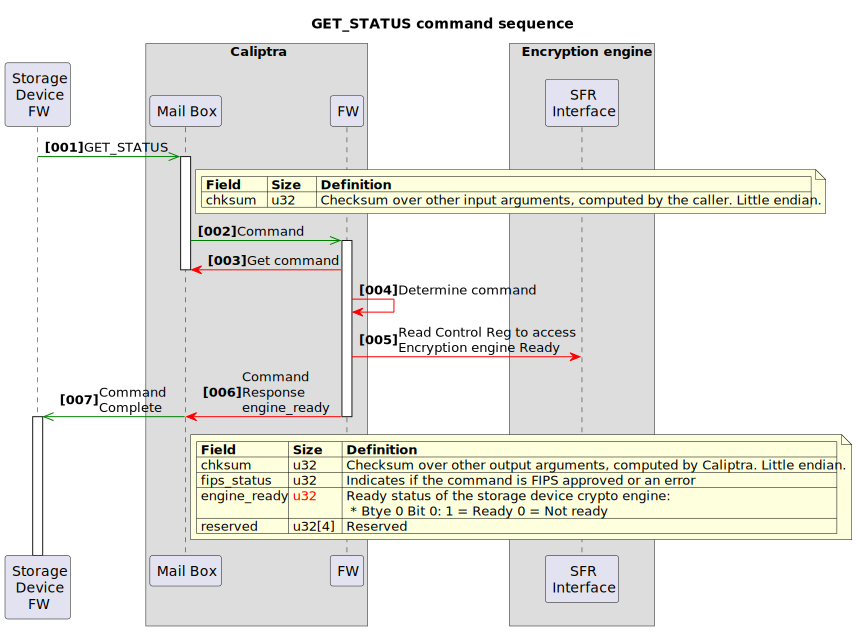

## Sequence to obtain the supported algorithms

  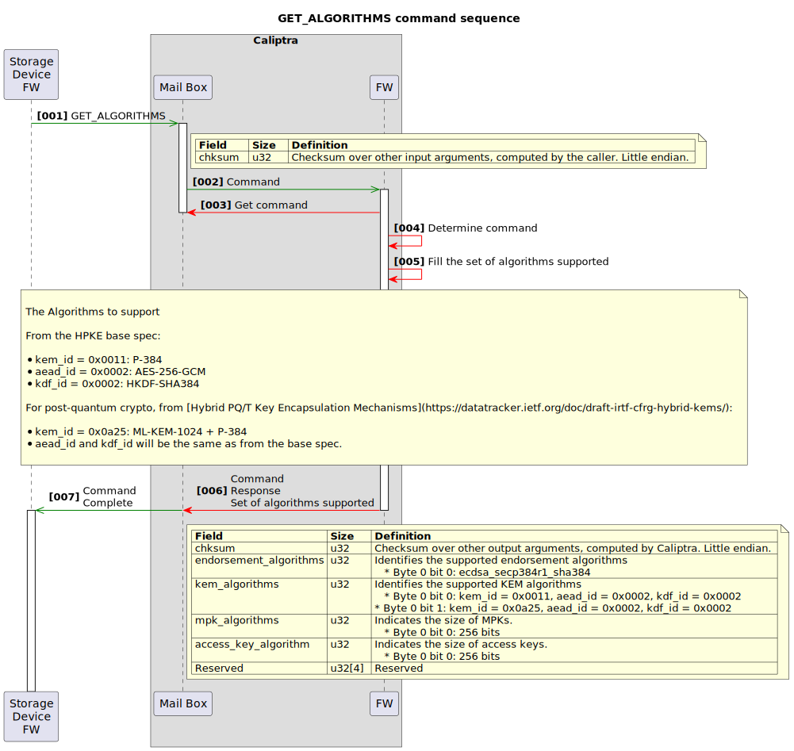

## Sequence to endorse an HPKE public key

  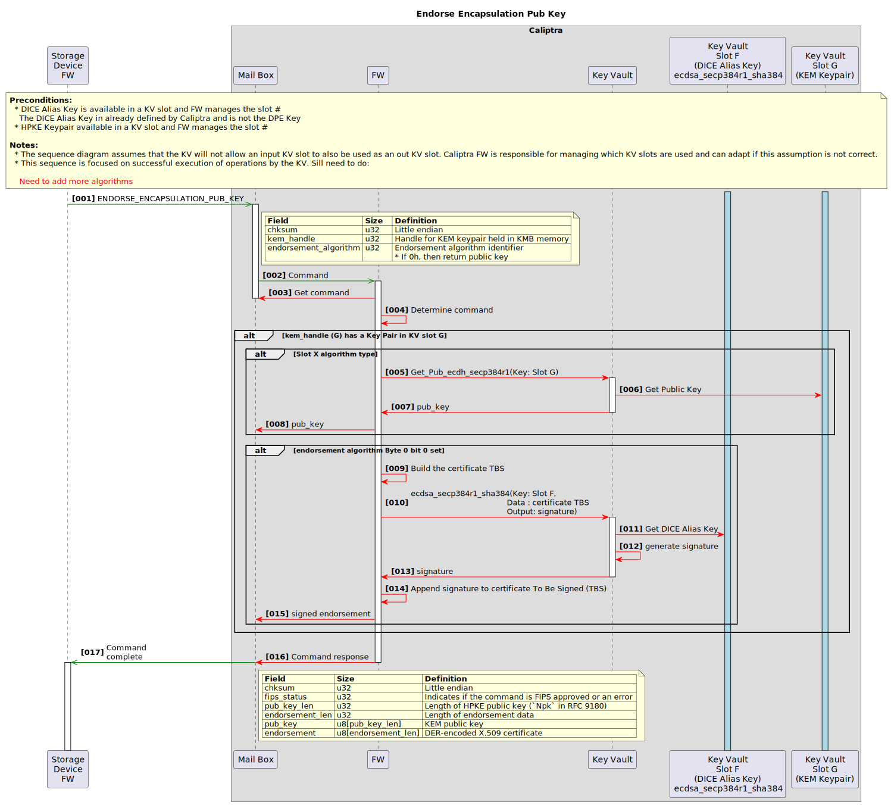

## Sequence to rotate an HPKE keypair

  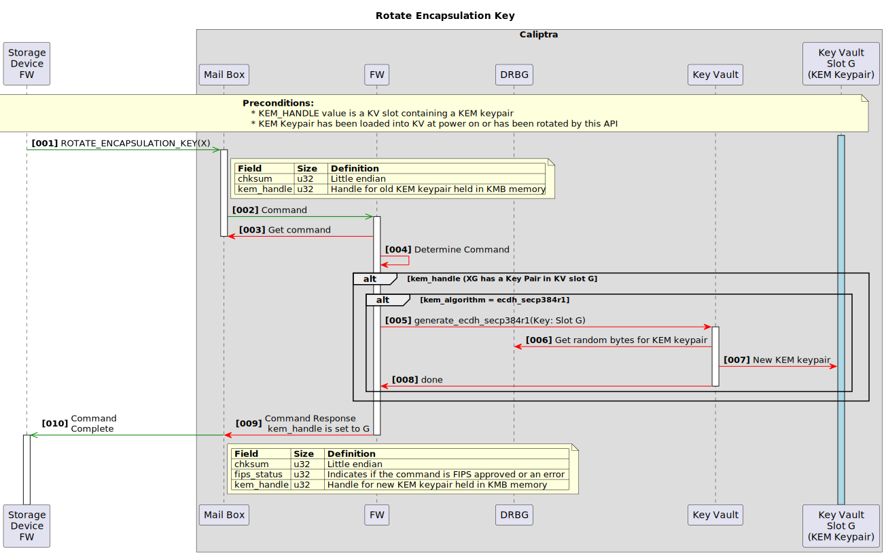

## Sequence to generate a PMEK

  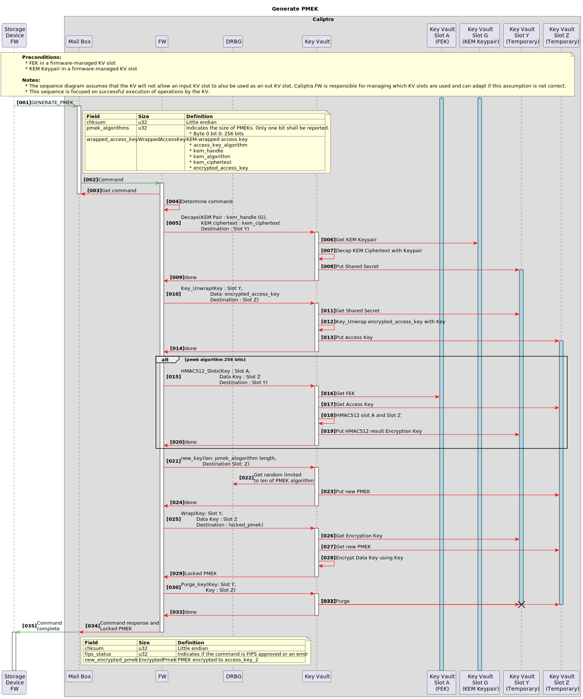

## Sequence to ready a PMEK

  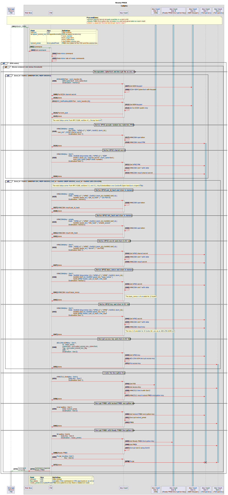

## Sequence to rotate the access key of a PMEK

  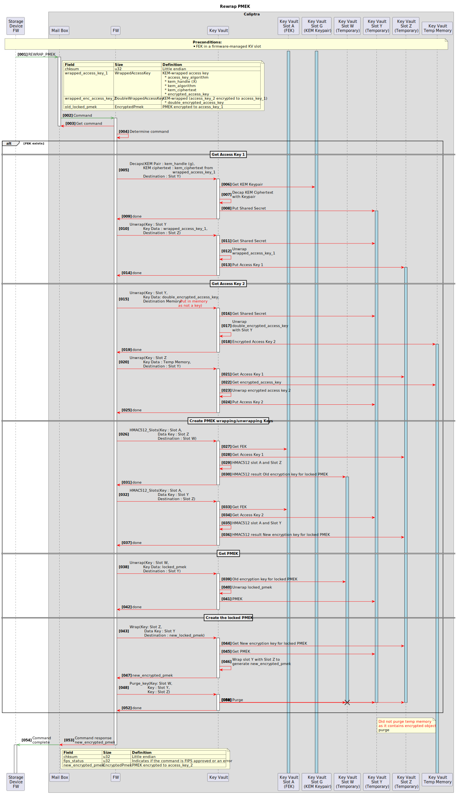

## Sequence to mix a PMEK into the MEK secret seed

  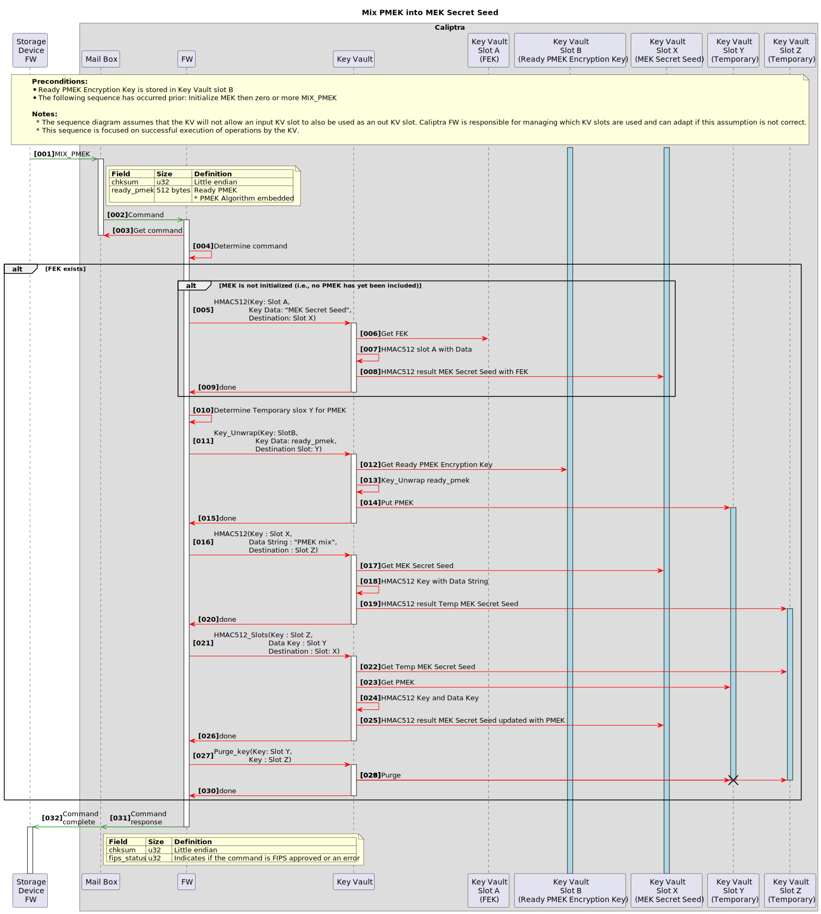

## Sequence to load an MEK

  

## Sequence to load MEK into the encryption engine key cache

  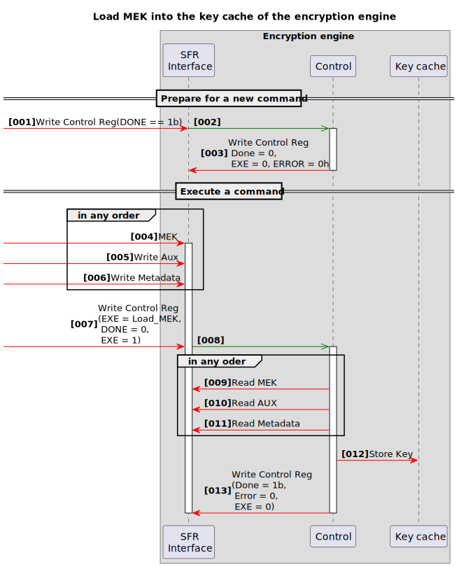

## Sequence to unload an MEK from the encryption engine key cache

  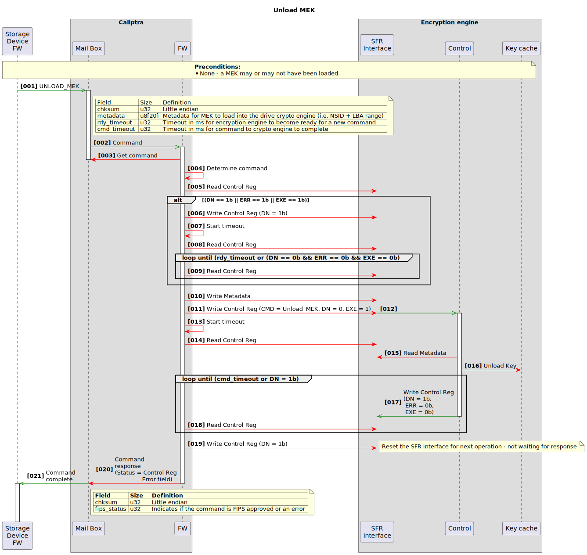

## Sequence to unload all MEKs (i.e., purge) from the encryption engine key cache

  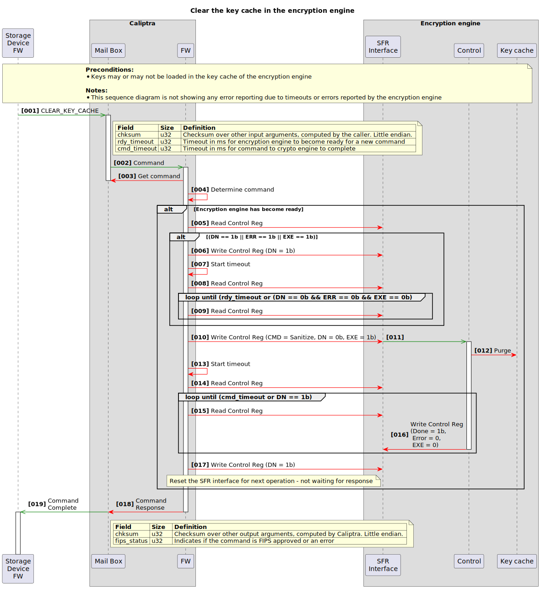

<!-- References -->

[1]: <https://www.cs.ru.nl/~cmeijer/publications/Self_Encrypting_Deception_Weaknesses_in_the_Encryption_of_Solid_State_Drives.pdf> "Self-encrypting deception: weaknesses in the encryption of solid state drives"
[2]: <https://trustedcomputinggroup.org/resource/storage-work-group-storage-security-subsystem-class-opal/> "TCG Opal"
[3]: <https://trustedcomputinggroup.org/resource/tcg-storage-security-subsystem-class-ssc-key-per-i-o/> "TCG Key Per I/O"
[4]: <https://www.commoncriteriaportal.org/files/ppfiles/CPP_FDE_EE_V2.0.pdf#page=25> "Collaborative Protection Profile for Full Drive Encryption - Encryption Engine, requirement FCS_CKM.1.1(c)"
[5]: <https://datatracker.ietf.org/doc/html/rfc9180> "RFC 9180: Hybrid Public Key Encryption"
[6]: <https://csrc.nist.gov/csrc/media/Projects/cryptographic-module-validation-program/documents/fips%20140-3/FIPS%20140-3%20IG.pdf#page=126> "FIPS 140-3 IG, section C.I"
[7]: <https://datatracker.ietf.org/doc/html/rfc8446> "RFC 8446: The Transport Layer Security (TLS) Protocol Version 1.3"
[8]: <https://datatracker.ietf.org/doc/html/draft-ietf-lamps-dilithium-certificates> "Internet X.509 Public Key Infrastructure: Algorithm Identifiers for ML-DSA"
[9]: <https://datatracker.ietf.org/doc/html/draft-irtf-cfrg-hybrid-kems> "Hybrid PQ/T Key Encapsulation Mechanisms"