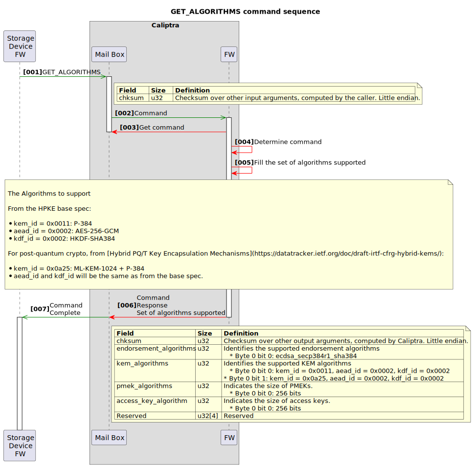

  

**
OCP Layered Open-Source Cryptographic Key-management (L.O.C.K.)
**

**
NVMe™ Key Management Block
**

**
Revision 0.8
**

**
Version 0.8
**

**
Date: April 2025
**

**Contributors**

<table>
<tr><td>Google</td><td>Microsoft</td><td>Samsung</td><td>Solidigm</td><td>Kioxia</td></tr>
<tr>
    <td>
        <ul>
            <li>Andrés Lagar-Cavilla</li>
            <li>Amber Huffman</li>
            <li>Charles Kuzman</li>
            <li>Jeff Andersen</li>
            <li>Chris Sabol</li>
            <li>Srini Narayanamurthy</li>
    </ul></td>
    <td>
        <ul>
            <li>Lee Prewitt</li>
            <li>Michael Norris</li>
            <li>Eric Eilertson</li>
            <li>Bryan Kelly</li>
            <li>Anjana Parthasarathy</li>
            <li>Ben Keen</li>
            <li>Bharat Pillilli</li>
    </ul></td>
    <td>
        <ul>
            <li>Jisoo Kim</li>
            <li>Gwangbae Choi</li>
            <li>Eric Hibbard</li>
            <li>Mike Allison</li>
    </ul></td>
    <td>
        <ul>
            <li>Scott Shadley</li>
            <li>Gamil Cain</li>
            <li>Festus Hategekimana</li>
    </ul></td>
    <td>
        <ul>
            <li>John Geldman</li>
            <li>Fred Knight</li>
            <li>Paul Suhler</li>
            <li>James Borden</li>
    </ul></td></tr>
</table>

**Revision Table**

| Date           | Revision # | Author              | Description |
| :------------- | :--------- | :------------------ | :---------- |
| September 2024 | 0.5        | Authoring Companies | Initial proposal draft based on work from the list of contributors |
| March 2025     | 0.8        | Authoring Companies | Updates that include updates APIs, UML Sequence diagrams, and racheting with fuses |

**License**

**Open Web Foundation (OWF) CLA**

Contributions to this Specification are made under the terms and conditions set forth in Open Web Foundation Modified Contributor License Agreement (“OWF CLA 1.0”) (“Contribution License”) by:

**Google, Microsoft, Samsung, Solidigm, Kioxia**

Usage of this Specification is governed by the terms and conditions set forth in **Open Web Foundation Modified Final Specification Agreement (“OWFa 1.0”) (“Specification License”)**.

You can review the applicable OWFa1.0 Specification License(s) referenced above by the contributors to this Specification on the OCP website at. For actual executed copies of either agreement, please contact OCP directly.

**Notes:**
1) The above license does not apply to the Appendix or Appendices. The information in the Appendix or Appendices is for reference only and non-normative in nature.

NOTWITHSTANDING THE FOREGOING LICENSES, THIS SPECIFICATION IS PROVIDED BY OCP "AS IS" AND OCP EXPRESSLY DISCLAIMS ANY WARRANTIES (EXPRESS, IMPLIED, OR OTHERWISE), INCLUDING IMPLIED WARRANTIES OF MERCHANTABILITY, NON-INFRINGEMENT, FITNESS FOR A PARTICULAR PURPOSE, OR TITLE, RELATED TO THE SPECIFICATION. NOTICE IS HEREBY GIVEN, THAT OTHER RIGHTS NOT GRANTED AS SET FORTH ABOVE, INCLUDING WITHOUT LIMITATION, RIGHTS OF THIRD PARTIES WHO DID NOT EXECUTE THE ABOVE LICENSES, MAY BE IMPLICATED BY THE IMPLEMENTATION OF OR COMPLIANCE WITH THIS SPECIFICATION. OCP IS NOT RESPONSIBLE FOR IDENTIFYING RIGHTS FOR WHICH A LICENSE MAY BE REQUIRED IN ORDER TO IMPLEMENT THIS SPECIFICATION. THE ENTIRE RISK AS TO IMPLEMENTING OR OTHERWISE USING THE SPECIFICATION IS ASSUMED BY YOU. IN NO EVENT WILL OCP BE LIABLE TO YOU FOR ANY MONETARY DAMAGES WITH RESPECT TO ANY CLAIMS RELATED TO, OR ARISING OUT OF YOUR USE OF THIS SPECIFICATION, INCLUDING BUT NOT LIMITED TO ANY LIABILITY FOR LOST PROFITS OR ANY CONSEQUENTIAL, INCIDENTAL, INDIRECT, SPECIAL OR PUNITIVE DAMAGES OF ANY CHARACTER FROM ANY CAUSES OF ACTION OF ANY KIND WITH RESPECT TO THIS SPECIFICATION, WHETHER BASED ON BREACH OF CONTRACT, TORT (INCLUDING NEGLIGENCE), OR OTHERWISE, AND EVEN IF OCP HAS BEEN ADVISED OF THE POSSIBILITY OF SUCH DAMAGE.

**Acknowledgements**

The Contributors of this Specification would like to acknowledge the following companies for their feedback:

**Compliance with OCP Tenets**

Please describe how this Specification complies to the following OCP tenets. Compliance is required for at least three of the four tenets. The ideals behind open sourcing stipulate that everyone benefits when we share and work together. Any open source project is designed to promote sharing of design elements with peers and to help them understand and adopt those contributions. There is no purpose in sharing if all parties aren't aligned with that philosophy. The IC will look beyond the contribution for evidence that the contributor is aligned with this philosophy. The contributor actions, past and present, are evidence of alignment and conviction to all the tenets.

**Openness**

OCP L.O.C.K. source for RTL and firmware will be licensed using the Apache 2.0 license. The specific mechanics and hosting of the code are work in progress due to CHIPS alliance timelines. Future versions of this spec will point to the relevant resources.

**Efficiency**

OCP L.O.C.K. is used to generate and load keys for use of encrypting user data prior to storing data at rest and decrypting stored user data at rest when read. So, it cannot yield a measurable impact on system efficiency.

**Impact**

OCP L.O.C.K. enables consistency and transparency to a foundational area of security of media encryption keys such that no firmware in the device ever has access to a media encryption key. Furthermore, no decrypted media encryption key exists in the device when power is removed from the device.

**Scale**

OCP L.O.C.K. is a committed intercept for Cloud silicon for Google and Microsoft. This scale covers both a significant portion of the Cloud market in hyperscale and enterprise.

**Sustainability**

The goal of OCP L.O.C.K. is to eliminate the need to destroy storage devices (e.g., SSDs) in the Cloud market by providing a mechanism that increases the confidence that a media encryption key within the device is deleted in a crypto-erase. This enables repurposing the device and or components on the device at end of use or end of life. Given the size of the Cloud market this provides a significant reduction of e-waste.

  

[[toc]]

# Introduction

OCP L.O.C.K. (Layered Open-source Cryptographic Key management) is a feature set conditionally compiled into Caliptra, which provides secure key management for Data-At-Rest protection in self-encrypting storage devices.

OCP L.O.C.K. was originally created as part of the Open Compute Project (OCP). The major revisions of the OCP L.O.C.K. specifications are published as part of Caliptra at OCP, as OCP L.O.C.K. is an extension to Caliptra. The evolving source code and documentation for Caliptra are in the repository within the CHIPS Alliance Project, a Series of LF Projects, LLC.

# Background

OCP L.O.C.K. is being defined to improve drive security. The life of a storage device in a datacenter is that the device leaves the supplier, a customer writes user data to the device, and then the device is decommissioned. The problem is that customer data is not allowed to leave the data center. There needs to be a high confidence that the storage device leaving the datacenter is secure. The current default cloud service provider (CSP) policy to ensure this level of security is to destroy the drive. Other policies may exist that leverage drive capabilities (e.g., Purge), but are not generally deemed inherently trustworthy by these CSPs[^1]. This produces significant e-waste and inhibits any re-use/recycling.

OCP L.O.C.K. is addressing these issues by:

* Preventing leakage of media keys via firmware vulnerabilities or side channels;
* Binding media keys to a set of securely-provisioned access keys; and
* Enabling attestable “hard” purge via erasure of fuse secrets.

## OCP L.O.C.K. goals

The goal of OCP L.O.C.K. is to define a Key Management Block (KMB) that:

- Isolates storage keys to a trusted hardware block
- Binds storage keys to a given set of externally-supplied access keys
- Provides replay-resistant transport security for these access keys such that they can be injected without trusting the host
- Uses a fuse epoch key (FEK) and controller epoch key (CEK) for hard cryptographic purge
- Is able to be used in conjunction with the Opal[^2] and Key Per I/O[^3] storage device specifications

# Overview

Self-encrypting drives (SEDs) store data encrypted to media encryption keys (MEKs). SEDs include the following building blocks:

- The storage media that holds data at rest.
- An Encryption Engine that performs line-rate encryption and decryption of data as it enters and exits the drive.
- A controller that manages the lifecycle of MEKs.

MEKs may be bound to user credentials, which the host must provide to the drive in order for the associated data to be readable. A given MEK may be bound to one or more credentials. This model is captured in the TCG Opal [specification](https://trustedcomputinggroup.org/resource/storage-work-group-storage-security-subsystem-class-opal/).

MEKs, or other keys from which MEKs are derived, may be injected into the drive and tagged with address range metadata, such that subsequent I/Os which target that address range will be encrypted to that injected MEK. This model is captured in the TCG Key Per I/O (KPIO) [specification](https://trustedcomputinggroup.org/resource/tcg-storage-security-subsystem-class-ssc-key-per-i-o/).

MEKs may be securely purged, to effectively purge all data which was encrypted to the MEK. To purge an MEK, it is sufficient for the controller to purge the MEK itself or a key from which it was derived.

In an SED that takes Caliptra with OCP L.O.C.K. features enabled, Caliptra will act as a Key Management Block (KMB). The KMB will be the only entity that can read MEKs and program them into the SED's cryptographic engine. The KMB will expose services to controller firmware which will allow the controller to transparently manage each MEK's lifecycle, without being able to access the raw MEK itself.

# Threat model

The protected asset is the user data stored at rest on the drive. The adversary profile extends up to nation-states in terms of capabilities.

Adversary capabilities include:

- Interception of a storage device in the supply chain.
- Theft of a storage device from a data center.
- Destructively inspecting a stolen device.
- Running arbitrary firmware on a stolen device.
  - This includes attacks where vendor firmware signing keys have been compromised.
- Attempting to glitch execution of code running on general-purpose cores.
- Stealing debug core dumps or UART/serial logs from a device while it is operating in a data center, and later stealing the device.
- Gaining access to any class secrets, global secrets, or symmetric secrets shared between the device and an external entity.
- Executing code within a virtual machine on a multi-tenant host offered by the cloud service provider which manages an attached storage device.
- Accessing all device design documents, code, and RTL.

Given the above adversary profile, the following are a list of vulnerabilities that L.O.C.K. is designed to mitigate.

- MEKs managed by storage controller firmware are compromised due to implementation bugs or side channels.
- MEKs purged by storage controller firmware are recoverable via invasive techniques.
- MEKs are not fully bound to user credentials due to implementation bugs.
- MEKs are bound to user credentials which are compromised by a vulnerable host.
- Cryptographic erasure was not performed properly due to a buggy host.

## Mitigation verification

A product which integrates OCP L.O.C.K. will be expected to undergo an OCP S.A.F.E. review, to ensure that the controller firmware correctly invokes OCP L.O.C.K. services.

# Architecture

The following figure shows the basic high-level blocks of OCP L.O.C.K.

*
Figure 1: OCP L.O.C.K. high level blocks
*

  

OCP L.O.C.K. defines a Key Management Block (KMB), which is the only entity that can derive the MEKs that protect user data and load them into the Key Cache of the Encryption Engine. The KMB derives MEKs using the following keys:

- A controller-supplied data encryption key (DEK). The DEK is the mechanism by which the controller enforces privilege separation between user credentials under TCG Opal, as well as the mechanism used to model injected MEKs under KPIO.

- A KMB-managed fuse epoch key (FEK), derived from secrets held in device fuses that are only accessible by the KMB. The FEK may be rotated a small number of times, providing assurance that an advanced adversary cannot recover key material that had been in use by the drive prior to the FEK rotation. KMB does not allow MEKs to be derived while the FEK is erased. KMB can report whether the FEK is erased and therefore whether the drive is clean.

- A controller epoch key (CEK), provided by the controller firmware when deriving each MEK. The controller firmware is responsible for managing and rotating this key. CEK rotation is a destructive operation.

- Zero or more partial MEKs (PMEKs), each of which is a cryptographically-strong value, encrypted to an externally-supplied access key. PMEKs enable multi-party authorization flows: the access key for each PMEK used to derive an MEK must be provided to the drive before the MEK can be used. Access keys are protected in transit using asymmetric encryption. This enables use-cases where the access key is served to the drive from a remote entity, without having to trust the host to which the drive is attached.

MEKs are never visible to any firmware. To load an MEK into the Key Cache of the Encryption Engine, storage controller firmware requests that the Key Management Block derive an MEK and then cause hardware to load the MEK into the Encryption Engine. Each MEK has associated vendor-defined metadata, to identify for example the namespace and LBA range to be encrypted by the MEK.

Each PMEK is encrypted at rest. The encryption key is derived from the FEK, as well as an externally-injected access key which is not stored persistently on the storage device. If there is more than one PMEK used to generate an MEK, then it requires multiple authorities to unlock a given range of user data. Access keys may be held at rest in a remote key management service.

Each MEK is bound for its lifetime to the FEK and CEK, the list of PMEKs, and the DEK. To generate an MEK, the access key for each PMEK must be provided. All MEKs are removed from the Encryption Engine on a power cycle or during zeroization on the storage device. 

The DEK may be derived from or decrypted by a user's C_PIN to support legacy Opal. Alternatively, the DEK may be the imported key associated with a Key Per I/O key tag. Legacy controller firmware logic which derives or decrypts MEKs can be repurposed to produce DEKs with L.O.C.K.

To protect PMEK access keys in transit, KMB generates [HPKE](https://datatracker.ietf.org/doc/rfc9180/) keypairs and stores them in internal volatile memory using a Key Encapsulation Mechanism (KEM) algorithm such as ECDH or ML-KEM/Kyber. KMB can issue endorsements of HPKE public keys allowing a Remote Key Management Services to ensure they only release access keys to authentic devices. PMEK access keys are encrypted in transit using these HPKE keypairs. Upon drive reset, the access key must be re-encrypted to a new HPKE keypair for its associated PMEK to be usable.

KMB can maintain multiple active HPKE keypairs. Nominally, one for each supported algorithm. KMB will automatically initialize an HPKE keypair for each supported algorithm and this may be done lazily. KMB will allow the controller to trigger HPKE keypair rotation. This can be done as part of zeroization.

KMB supports PMEK access key rotation where the storage controller must replace an old encrypted PMEK with a new encrypted PMEK. The end user must prove to KMB that they control both old and new access key. This is done by encrypting the new access key with the old access key. The new access key is therefore double-encrypted when provided to KMB with the old access key and with an ephemeral transport encryption key.

## Host APIs

The DEK does not require any changes to TCG Opal or KPIO host APIs.

Additional host APIs are required to fully model FEK and CEK rotation, binding MEKs to PMEKs, PMEK access keys, and injectable host entropy. Such APIs are beyond the scope of the present document.

## Interfaces

OCP L.O.C.K. provides two interfaces:

- The Encryption Engine interface is exposed from the vendor-implemented Encryption Engine to KMB, and defines a standard mechanism for programming MEKs and control messages.
- The mailbox interface is exposed from KMB to storage controller firmware, and enables the controller to manage MEKs.

## Key hierarchy

  

An MEK is derived from a storage root key, zero or more PMEKs, and a DEK. PMEKs exist in one of two states: locked or ready. In both these states the PMEK is encrypted to a key known only to Caliptra.

- A locked PMEK's encryption key is derived from the storage root key as well as an externally-supplied access key. The locked PMEK is held at rest by controller firmware.
- The Ready PMEK Encryption Key is a volatile key held within Caliptra which is generated at startup and lost on cold reset. Ready PMEKs are held in controller firmware memory.

The externally-supplied access key is encrypted in transit using an HPKE public key held by Caliptra. The "ready" state allows the HPKE keypair to be rotated after the access key has been provisioned to the storage device, without removing the ability for Caliptra to decrypt the PMEK when later deriving an MEK bound to that PMEK.

For each PMEK to which a given MEK is bound, the host is expected to invoke an API to supply the PMEK's encrypted access key. Upon receipt the controller firmware passes that encrypted access key to Caliptra, along with the locked PMEK, to produce the ready PMEK which is cached in controller memory. This may be done prior to the controller firmware actually deriving and programming the MEK.

When controller firmware wishes to program an MEK to the Encryption Engine, the controller firmware performs the following steps:

1. Provides zero or more ready PMEKs to the KMB.
  - KMB initializes the MEK seed buffer with the FEK and then extends that MEK seed buffer using each given ready PMEK.
2. Provide a CEK and DEK to the KMB.
  - KMB derives the MEK using the given CEK, DEK, and the contents of the MEK seed buffer.
3. Provide MEK metadata to KMB, such as the MEK's associated namespace and logical block address range.
  - KMB programs the derived MEK and its metadata to the Encryption Engine.

### Random key generation

KMB is able to generate two kinds of keys: KEMs (used for access key transport encryption) and PMEKs (used for MEK derivation). A host is able to inject external entropy into KMB where it is held in internal volatile memory. Subsequent keys are randomly generated using both KMB's TRNG and the host's entropy.

  

### MEK generate+load key hierarchy

  

### MEK encryption key derivation

  

## Transport encryption for PMEK access keys

In OCP L.O.C.K., the KMB maintains a set of HPKE keypairs, one per algorithm that OCP L.O.C.K. supports. Each HPKE public key is endorsed with a certificate that is generated by Caliptra and signed by Caliptra's DICE identity. HPKE keypairs are randomly generated on KMB startup, may be periodically rotated, and are lost when the drive resets.

When a user wishes to generate or ready a PMEK (which is required prior to deriving any MEKs bound to that PMEK), the user performs the following steps:

1. Obtain the HPKE public key and certificate from the storage device.
2. Validate the HPKE certificate and attached DICE certificate chain.
3. Encrypt their access key to the HPKE public key.
4. Transmit the encrypted access key to the storage device.

Upon receipt, KMB will perform the following steps:

1. Decrypt the user's access key using the HPKE private key.
2. Derive the PMEK encryption key using the storage root key and the decrypted access key.
3. Perform PMEK generation or ready actions detailed [below](#pmek-lifecycle).

Upon drive reset, the HPKE keypairs are regenerated, and any access keys for PMEKs that had been made ready prior to the reset will need to be re-provisioned in order to transition those PMEKs to a ready state again.

### PMEK access key unwrap hierarchy (P-384)

  

### PMEK access key unwrap hierarchy (Hybrid ML-KEM + P-384)

The only difference here from the above flow is how the HPKE Shared Secret is derived. Operations which produce an AES key and IV from that shared secret are identical to the prior flow, and are omitted here for brevity.

  

## PMEK lifecycle

PMEKs can be generated, made ready, and have their access keys rotated.

### PMEK generation

Controller firmware may request that KMB generate a PMEK, bound to a given access key. KMB performs the following steps:

1. Unwrap the given PMEK access key.
2. Randomly generate a PMEK.
3. Derive a PMEK encryption key from the storage root key and the decrypted access key.
4. Encrypt the PMEK to the PMEK encryption key.
5. Return the encrypted PMEK to the controller firmware.

Controller firmware may then store the encrypted PMEK in persistent storage.

#### PMEK generation key hierarchy

  

#### Sequence to generate a PMEK

  

### PMEK ready

Encrypted PMEKs stored at rest in persistent storage are considered "locked", and must be ready before they can be used to derive MEKs. Ready PMEKs are also encrypted when handled by controller firmware. Ready PMEKs do not survive across device reset.

To ready a PMEK, KMB performs the following steps:

1. Unwrap the given PMEK access key using the HPKE keypair held within Caliptra.
2. Derive the PMEK encryption key from the storage root key and the decrypted access key.
3. Decrypt the PMEK using the PMEK encryption key.
4. Encrypt the PMEK using the Ready PMEK Encryption Key.
5. Return the re-encrypted "ready" PMEK to the controller firmware.

Controller firmware may then stash the encrypted ready PMEK in volatile storage, and later provide it to the KMB when deriving an MEK, as described [above](#mek-derivation).

To mitigate against cryptographic attacks on the HPKE keypair that rely on repeated invocations of this command, this command is rate-limited.

#### PMEK ready key hierarchy

  

#### Sequence to ready a PMEK

  

### PMEK access key rotation

The access key to which a PMEK is bound may be rotated. The user must prove that they have knowledge of both the old and new access key before a rotation is allowed. This is accomplished using a slight variation on the usual access key import flow. When a new access key is provided to KMB during a rotation, the new access key is double-encrypted: first to the old access key, and then to the HPKE public key. KMB performs the following steps:

1. Unwrap the given old access key and encrypted new access key.
2. Decrypt the new access key using the old access key.
3. Derive the old PMEK encryption key from the FEK and the decrypted old access key.
4. Derive the new PMEK encryption key from the FEK and the decrypted new access key.
5. Decrypt the PMEK using the old PMEK encryption key.
6. Encrypt the PMEK using the new PMEK encryption key.
7. Return the re-encrypted PMEK to the controller firmware.

Controller firmware then erases the old encrypted PMEK and stores the new encrypted PMEK in persistent storage.

#### PMEK access key rotation hierarchy

  

#### Sequence to rotate the access key of a PMEK

  

### Sequence to endorse an HPKE public key

  

### Sequence to rotate an HPKE keypair

  

### Sequence to mix a PMEK into the MEK seed

  

### Sequence to load an MEK

  

### Sequence to load MEK into the Encryption Engine Key Cache

  

### Sequence to unload an MEK from the Encryption Engine Key Cache

  

### Sequence to unload all MEKs (i.e., purge) from the Encryption Engine Key Cache

  

### Legacy MEK derivation for TCG Opal

The controller is allowed to maintain a DEK that represents a given user's media encryption key. That DEK can be encrypted at rest by the user's C_PIN.

In [MEK derivation](#mek-derivation), when deriving the user's MEK, the controller can pass zero PMEKs in step 1, and the user's decrypted DEK in step 2.

### Legacy MEK derivation for Key Per I/O

MEKs injected with Key Per I/O will be considered as DEKs under OCP L.O.C.K.

In [MEK derivation](#mek-derivation), when deriving the associated MEK, the controller can pass zero PMEKs in step 1, and the injected DEK in step 2.

## Algorithm support

OCP L.O.C.K. supports the following KEM algorithms:

- P-384 ECDH
- Hybridized ML-KEM-1024 with P-384 ECDH

### Sequence to obtain the supported algorithms

  

## Status function

OCP L.O.C.K. has the following function to assist with determining the status.

### Sequence to obtain the current status of OCP L.O.C.K.

  

# Hardware

The following figure describes the OCP L.O.C.K. hardware.

Figure 8: KMB block diagram

This figure will be fleshed out with additional details as they become available.

## Memory requirements

This section will be fleshed out with additional details as they become available.

## Cryptography requirements

This section will be fleshed out with additional details as they become available.

## KMB-Encryption Engine interface

This section defines the interface between the Key Management Block (KMB) and an Encryption Engine. An Encryption Engine is used to encrypt/decrypt user data and its design and implementation are vendor specific. Media Encryption Keys (MEKs) are the keys which are generated within KMB and used by Encryption Engine to encrypt and decrypt user data. This interface is used to load MEKs from KMB to Encryption Engine or to cause the Encryption Engine to unload (i.e., remove) loaded MEKs. The MEKs transferred between the KMB and the Encryption Engine shall not be accessible by the controller firmware.

### Overview

The Encryption Engine uses a stored MEK to encrypt and decrypt user data. For the purposes of this specification, the entity within the Encryption Engine used to store the MEKs is called Key Cache. Each encryption and decryption of user data is coupled to a specific MEK which is stored in Key Cache bound to a unique identifier, called metadata. Each (metadata, MEK) pair is also associated with additional information, called aux, which is used neither as MEK nor an identifier, but has some additional information about the pair. Therefore, the Key Cache as an entity which stores (metadata, aux, MEK) tuples.

In order to achieve the security goals for KMB, KMB is limited to be the unique component which loads an (metadata, aux, MEK) tuple into the Key Cache and unloads a tuple within the device, so that MEKs can only be exposed to KMB and Encryption Engine. Controller firmware arbitrates all operations in the KMB to Encryption Engine interface, therefore controller firmware is responsible for managing which MEK is loaded in Key Cache. Controller firmware has full control on metadata and optional aux. Figure 9 is an illustration of the KMB to Encryption Engine interface that shows:

-    the tuple for loading an MEK;
-    the Metadata for unloading an MEK; and 
-    an example of a Key Cache within the Encryption Engine.

*
Figure 9: KMB to Encryption SFR Interface
*

  

KMB uses Special Function Registers (SFRs) to communicate with Encryption Engine which are described in the following sections.

### Special Function Registers (SFRs)

KMB uses Special Function Registers (SFRs) to communicate with Encryption Engine as shown in Table 1 and each of the following subsections describe the registers.

*
Table 1: KBM to Encryption Engine SFRs
*

| Register                   | Address        | Byte Size | Description |
| :------------------------- | :------------- | :-------- | :---------- |
| Control                    | SFR_BASE + 0h  | 4h        | Register to handle commands |
| Metadata                   | SFR_BASE + 10h | 14h       | Register to provide metadata |
| Auxiliary Data (AUX)       | SFR_BASE + 30h | 20h       | Register to provide auxiliary values |
| Media Encryption Key (MEK) | SFR_BASE + 50h | 40h       | Register to provide MEK |

SFR_BASE is an address that is configured on KMB. The integrator should make sure that KMB can access these SFRs through these addresses.

#### Control register

Figure 10 defines the Control register used to sequence the execution of a command and obtain the status of that command.

*
Figure 10: Offset SFR_Base + 0h: CTRL – Control
*

| Bits  | Type | Reset | Description |
| :---- | :--- | :---- | :---------- |
| 31    | RO   | 0h    | **Ready (RDY):** After an NVM Subsystem Reset, this bit is set to 1b, then the Encryption Engine is ready to execute commands. If this bit is set to 0b, then the Encryption Engine is not ready to execute commands. |
| 30:20 | RO   | 0h    | Reserved |
| 19:16 | RO   | 0h    | **Error (ERR):** If the DONE bit is set to 1b by the Encryption Engine, then this field is set to a non-zero value to indicate the Encryption Engine detected an error during the execution the command specified by the CMD field. The definition of a non-zero value is vendor specific. Encryption engine error codes are surfaced back to controller firmware.<table><tr><td><b>Value</b></td><td><b>Description</b></td></tr><tr><td>0h</td><td>Command Successful</td></tr><tr><td>1h to 3h</td><td>Reserved</td></tr><tr><td>4h to Fh</td><td>Vendor Specific</td></tr></table> If the DONE bit is set to 1b by the Encryption Engine and this field is set to 0h, then the Encryption Engine is indicating a successful execution of a command specified by the CMD field. If the DONE bit is set to 1b by KMB, then the field is set to 0000b. |
| 15:6  | RO   | 0h    | Reserved |
| 5:2   | RW   | 0h    | **Command (CMD):** This field specifies the command to execute or the command associated with the reported status. <table><tr><tr><b>Value</b></tr><tr><b>Description</b></tr></tr><tr><td>0h</td><td>Reserved</td></tr><tr><td>1h</td><td><b>Load MEK:</b> Load the key specified by the AUX field and MEK register into the Encryption Engine as specified by the <b>METD</b> field.</td></tr><tr><td>2h</td><td><b>Unload MEK:</b> Unload the MEK from the Encryption Engine as specified by the <b>METD</b> field.</td></tr><tr><td>3h</td><td><b>Zeroize:</b> Unload all of the MEKs from the Encryption Engine (i.e., zeroize the Encryption Engine MEKs).</td></tr><tr><td>4h to Fh</td><td>Reserved</td></tr></table> |
| 1     | RW   | 0b    | **Done (DN):** This bit indicates the completion of a command by the Encryption Engine. If this bit is set to 1b by the Encryption Engine, then the Encryption Engine has completed the command specified by the CMD field. If the EXE bit is set to 1b and this bit is set to 1b, then the Encryption Engine has completed executing the command specified by the CMD field and the ERR field indicates the status of the execution of that command. A write of the value 1b to this bit shall cause the Encryption Engine to:<ul><li>set this bit to 0b;</li><li>set the EXE bit to 0b; and</li><li>set the ERR field to 0000b.</li></ul> |
| 0     | RW   | 0b    | **Execute (EXE):** A write of the value 1b to this bit specifies that the Encryption Engine is to execute the command specified by the CMD field. If the DONE bit is set to 1 by KMB, then the bit is set to 0b. |

From the KMB, the Control register is the register to write a command and receive its execution result. From its counterpart, the Encryption Engine, the Control register is used to receive a command and write its execution result.

The expected change flow of the Control register to handle a command is as follows:

1. If **RDY** is set to 1b, then KMB writes **CMD** and **EXE**
    1. **CMD:** either 1h, 2h or 3h
    2. **EXE:** 1b
2. The Encryption Engine writes** **ERR** and **DN**
    1. **ERR:** either 0b or a non-zero value depending on the execution result
    2. **DN:** 1b
3. The KMB writes **DN**
    1. **DN:** 1b
4. The Encryption Engine writes **CMD**, **ERR**, **DN** and **EXE**
    1. **CMD:** 0h
    2. **ERR:** 0h
    3. **DN:** 0b
    4. **EXE:** 0b

The KMB therefore interacts with the Control register as follows in the normal circumstance:

1. The KMB writes **CMD** and **EXE**
    1. **CMD:** either 1h, 2h or 3h
    2. **EXE:** 1b
2. The KMB waits **DN** to be 1
3. The KMB writes **DN**
    1. **DN:** 1b
4. The KMB waits **DN** to be 0

Since the Control register is in fact a part of the Encryption Engine whose implementation can be unique to each vendor, behaviors of the Control register with the unexpected flow are left for vendors. For example, a vendor who wants robustness might integrate a write-lock into the Control register in order to prevent two almost simultaneous writes on EXE bit.

#### Metadata Register

Figure 11 defines the Metadata register.

*
Figure 11: Offset SFR_Base + 10h: METD – Metadata
*

| Bytes | Type  | Reset | Description |
| :---- | :---- | :---- | :---------- |
| 19:00 | RW    | 0h    | **Metadata (METD):** This field specifies metadata that is vendor specific and specifies the entry in the Encryption Engine for the Encryption Key. |

For the security goal of this project, the KMB and the Encryption Engine must be the only components which have access to MEKs. Each MEK must then be bound to a unique identifier, which can be accessible by other components, in order for an appropriate key to be used for any key-related operations including data I/O. In a L.O.C.K.-enabled system, the **METD** field is expected to be used as such identifier.

Instead of generating a random and unique identifier within the KMB while generating an MEK, the KMB takes an **METD** value as input from the controller firmware and write to the Metadata register without any modification for the sake of the following reasons:

1. A vendor does not need to implement an additional algorithm to map between identifiers in its own system and in the KMB
2. A vendor-unique key-retrieval algorithm can easily be leveraged into a **METD**-generation algorithm

In order to reduce ambiguity, two examples of the **METD** field will be given: Logical Block Addressing (LBA) range-based metadata; and key-tag based metadata.

When an SSD stores data with address-based encryption, an MEK can be uniquely identified by a (LBA range, Namespace ID) pair. Then, the (LBA range, Namespace ID) pair can be leveraged into **METD** as on Figure 12.

*
Figure 12: LBA Range Based Metadata Format
*

  

Address-based encryption is not however the only encryption mechanism in SSDs. For example, in TCG Key Per I/O, an MEK is selected by a key tag, which does not map to an address. Figure 13 shows an example of **METD** in such cases.

*
Figure 13: Key Tag Based Metadata Format
*

  

The above examples are not the only possible values of **METD**. Vendors are encouraged to design and use their own **METD** if it fits better to their system.

#### Auxiliary Data Register

Figure 14 defines the Auxiliary Data register.

*
Figure 14: Offset SFR_Base + 20h: AUX – Auxiliary Data
*

| Bytes | Type | Reset | Description |
| :---- | :--- | :---- | :---------- |
| 31:00 | RW   |  0h   | **Auxiliary Data (AUX):** This field specifies auxiliary data associated to the MEK. |

At first glance, the usage of **AUX** might not be straightforward. The intuition behind introducing the **AUX** field is to support vendor-specific features on MEKs. The KMB itself is only supporting fundamental functionalities in order to minimize attack surfaces on MEKs. Moreover, vendors are not restricted to design and implement their own MEK-related functionalities on the Encryption Engine unless they can be used to exfiltrate MEKs. In order to support these functionalities, some data may be associated and stored with an MEK and the **AUX** field is introduced to store such data with each MEK.

When the controller firmware instructs the KMB to generate a new MEK, the controller firmware is expected to provide an **AUX** value. Similar to the **METD** field, the KMB will write the **AUX** value into the Auxiliary Data register without any modification.

One simple use case of the **AUX** field is to store an offset of initialization vector or nonce. It can also be used in a more complicated use case. Here is an example. Suppose that there exists a vendor who wants to design a system which supports several modes of operation through the Encryption Engine while using the KMB. Then, a structure of **AUX** value as on Figure 15 can be used.

*
Figure 15: Auxiliary Data Format Example
*

  

When the controller firmware instructs KMB to generate an KMB, the controller firmware can use the **AUX** value to specify which mode of operation should be used and which value should be used as an initialization vector or a nonce with the generated MEK.

#### Media Encryption Key (MEK) register

Figure 16 defines the MEK register.

*
Figure 16: Offset SFR_Base + 40h: MEK – Media Encryption Key
*

| Bytes | Type | Reset | Description |
| :---- | :--- | :---- | :---------- |
| 31:00 |  WO  |   0h  | **Secret Encryption Key (SEK):** This field specifies a 256-bit Encryption Key |
| 63:32 |  WO  |   0h  | **Tweakable Key (TWK):** This is the 256-bit AES-XTS tweakable key. |

Since the AES-XTS is one of the most popular algorithms for data encryption, the MEK register is also designed with the key format of AES-XTS. The layout of the MEK register is however designed to help understanding the structure. The Encryption Engine is not restricted to only support the AES-XTS. The choice of encryption algorithm is solely dependent on vendors. When a vendor decides to use a different encryption algorithm, an MEK can be seen as a 64-byte random value rather than a (secret key, tweak key) pair and how to slice the 64-byte random value into an encryption key will be left to the vendor.

As a part of Caliptra, KMB protects MEKs as securely as any secret key in Caliptra. Within Caliptra, MEKs are only ever present in the Key Vault, so that they can be protected against any firmware-level attacks. When KMB needs to write an MEK into the MEK register, it will be accomplished by using the DMA engine. Given an index and a destination identifier, the DMA engine copies the key value stored in the key vault of given index to the destination address to which the DMA engine translates the destination identifier. 

### KMB command sequence

Figure 17 shows a sample command execution. This is an expected sequence when the controller firmware instructs the KMB to generate a new MEK. The internal behavior of the Encryption Engine is one of several possible mechanisms, and it can be different per vendor.

*
Figure 17: Command Execution Example
*

  

## FEK rotation

A storage device equipped with OCP L.O.C.K. will be able to perform a "hard" cryptographic purge, by rotating its FEK. The FEK is derived from a series of N 256-bit ratchet secrets present in a fuse bank, dubbed R0..RN-1. 4 ≤ N ≤ 16. These ratchet secrets have the following requirements:

- Each ratchet secret can individually transition from all-zeroes → randomized → all-ones. RX is only randomized once RX-1 has transitioned to all-ones.
- Programmable via the Caliptra fuse controller.
- Only readable by Caliptra Core, via fuse registers.
    - Internally, the fuse registers will be treated like the DICE UDS, in that their contents can only be deposited into Key Vault slots, without direct visibility by Caliptra firmware.

Caliptra features a [Stable Identity](https://github.com/chipsalliance/caliptra-sw/blob/main-2.x/rom/dev/README.md#derivation-of-the-key-ladder-for-stable-identity) Key (SIK), which is a non-ratchetable secret derived from the DICE UDS, the current value of the field entropy fuse bank, as well as the current lifecycle and debug states. The SIK can be used to protect long-lived data. Caliptra's Stable Identity feature is implemented in terms of a key ladder, with different keys for different firmware SVNs, with the property that firmware whose SVN is X can only obtain Stable Identity keys bound to major versions less than or equal to X. The SIK for OCP L.O.C.K. is the key ladder secret bound to SVN 0, ensuring that firmware of any SVN can wield it.

The FEK is derived from the SIK, along with the currently-active ratchet secret. In normal cases, if the currently-active ratchet secret is unprogrammed or erased, the FEK is disabled and no MEKs are allowed to be derived or programmed. There are two edge cases, where the FEK is derived solely from the SIK:

- When the device is fresh from the factory and no ratchet secrets have been programmed.
- When the device has programmed and erased all of its ratchet secrets, and the owner has opted into an operating mode where data written to the storage device can no longer be erased via FEK rotation.

To satisfy FIPS 140 zeroization requirements once the FEK can no longer be rotated, the FIPS boundary will need to include functionality in the storage controller firmware which maintains the CEK, which can be zeroed on-demand.

*
Figure 18: FEK+CEK rotation state machine with four ratchet slots
*

  

### FEK fuse programming

A device out of manufacturing is not required to have programmed an FEK; such a device behaves as existing devices do today where the SSD firmware manages the key. This is known as the EMPTY state. OCP L.O.C.K. supports a PROGAM_NEXT_FEK command to then program the initial FEK, which may be invoked during manufacturing. That FEK is then used to derive all MEKs. That FEK can be erased by using the ERASE_CURRENT_FEK command. Once that FEK is erased, no FEK exists in OCP L.O.C.K. and no MEKs will be generated by OCP L.O.C.K., until the PROGAM_NEXT_FEK command causes a new FEK to be programmed.

Once all of the N FEKs have been programmed and erased, and no FEK is available, the ENABLE_PERMANENT_FEK command can be used to permanently allow the device to behave as existing devices do today where the SSD firmware manages the key.

There can be errors programming or erasing a ratchet secret. If these errors occur, the ratchet secret can be attempted to be erased. If errors persist, then the device is in an unusable state.

The table below has an example flow where the number of FEKs available to be programmed (N) is 4:

| State transition            | active_slot | slot_state | next_action          | Description |
| :-------------------------- | :---------- | :--------- | :------------------- | :---------- |
| Factory                     | 0           | EMPTY      | PROGRAM_NEXT_FEK     | FEK is derived from the SIK. Caliptra reports a bit indicating that any data written cannot be purged via FEK rotation. |
| Program first entry         | 0           | PROGRAMMED | ERASE_CURRENT_FEK    | FEK is derived from the SIK and R0. |
| Erase first entry           | 0           | ERASED     | PROGRAM_NEXT_FEK     | FEK is disabled. No MEKs are allowed. |
| Program second entry        | 1           | PROGRAMMED | ERASE_CURRENT_FEK    | FEK is derived from the SIK and R1. |
| Fail to erase second entry  | 1           | INVALID    | ERASE_CURRENT_FEK    | FEK is disabled. No MEKs are allowed. |
| Erase second entry          | 1           | ERASED     | PROGRAM_NEXT_FEK     | FEK is disabled. No MEKs are allowed. |
| Fail to program third entry | 2           | INVALID    | ERASE_CURRENT_FEK    | FEK is disabled. No MEKs are allowed. |
| Erase third entry           | 2           | ERASED     | PROGRAM_NEXT_FEK     | FEK is disabled. No MEKs are allowed. |
| Program fourth entry        | 3           | PROGRAMMED | ERASE_CURRENT_FEK    | FEK is derived from the SIK and R3. |
| Erase fourth entry          | 3           | ERASED     | ENABLE_PERMANENT_FEK | FEK is disabled. No MEKs are allowed. |
| Enable permanent FEK        | 3           | PERMANENT  | NONE                 | FEK is derived from the SIK. Caliptra reports a bit indicating that any data written cannot be purged via FEK rotation. |

## Error reporting and handling

This section describes OCP L.O.C.K. error reporting and handling.

This section will be fleshed out with additional details as they become available.

### Fatal errors

This section will be fleshed out with additional details as they become available.

### Non-fatal errors

This section will be fleshed out with additional details as they become available.

# Runtime firmware environment

This section provides an extension to the runtime firmware environment defined for OCP Caliptra runtime firmware specification due to the support of OCP L.O.C.K.

## Boot and initialization

This section defines additional boot and initialization flows needed to support OCP L.O.C.K.

The Runtime Firmware main function SHALL cause the generation of the FEK and store this into the Key Vault. The FEK is generated from the FEK fuses.

The following sections define the additional Caliptra mailbox commands due to supporting OCP L.O.C.K.

## GET_STATUS

Exposes a command that allows the SoC to determine if the Encryption Engine is ready to process commands as well vendor-defined drive crypto engine status data. 

Command Code: 0x4753_5441 (“GSTA”)

Table: GET_STATUS input arguments

| Name  | Type  | Description |
| :---- | :---- | :---------- |
|chksum | u32   | Checksum over other input arguments, computed by the caller. Little endian. |

Table: GET_STATUS output arguments

| Name         | Type    | Description |
| :----------- | :------ | :---------- |
| chksum       | u32     | Checksum over other output arguments, computed by Caliptra. Little endian. |
| fips_status  | u32     | Indicates if the command is FIPS approved or an error |
| engine_ready | u32     | Ready status of the storage device crypto engine. OCP L.O.C.K. defines low range, vendor defines high range. <ul><li>Byte 0 Bit 0: 1 = Ready 0 = Not ready</li></ul> | Reserved |
| reserved     | u32[4]  | 

## GET_ALGORITHMS

Exposes a command that allows the SoC to determine the types of algorithms supported by KBM for endorsement, KEM, PMEK, and access key generation. 

Command Code: 0x4743_4150 (“GCAP”)

Table: GET_ALGORITHMS input arguments

| Name     | Type    | Description |
| :------- | :------ | :---------- |
| chksum   | u32     | Checksum over other input arguments, computed by the caller. Little endian. |

Table: GET_ALGORITHMS output arguments

| Name                   | Type   | Description |
| :--------------------- | :----- | :---------- |
| chksum                 | u32    | Checksum over other output arguments, computed by Caliptra. Little endian. |
| fips_status            | u32    | Indicates if the command is FIPS approved or an error |
| endorsement_algorithms | u32    | Identifies the supported endorsement algorithms:<ul><li>Byte 0 bit 0: ecdsa_secp384r1_sha384[^4]</li><li>Byte 0 bit 1: ml-dsa-87[^5]</li></ul> |
| hpke_algorithms        | u32    | Identifies the supported HPKE algorithms:<ul><li>Byte 0 bit 0: kem_id = 0x0011, aead_id = 0x0002, kdf_id = 0x0002[^6]</li><li>Byte 0 bit 1: bit 1: kem_id = 0x0a25, aead_id = 0x0002, kdf_id = 0x0002[^7]</li></ul> |
| pmek_algorithms        | u32    | Indicates the size of PMEKs:<ul><li>Byte 0 bit 0: 256 bits</li></ul> |
| access_key_algorithm   | u32    | Indicates the size of access keys:<ul><li>Byte 0 bit 0: 256 bits, with a 128-bit truncated SHA384 ID</li></ul> |
| reserved               | u32[4] | Reserved |

## CLEAR_KEY_CACHE

This command unloads all MEKs in the Encryption Engine and deletes all keys in KMB.

Command Code: 0x4353_4543 (“CSEC”)?????

Table: CLEAR_KEY_CACHE input arguments

| Name        | Type | Description |
| :---------- | :--- | :---------- |
| chksum      | u32  | Checksum over other input arguments, computed by the caller. Little endian. |
| rdy_timeout | u32  | Timeout in ms for encryption engine to become ready for a new command |
| cmd_timeout | u32  | Timeout in ms for command to crypto engine to complete |

Table: CLEAR_KEY_CACHE output arguments

| Name        | Type    | Description |
| :---------- | :------ | :---------- |
| chksum      | u32     | Checksum over other output arguments, computed by Caliptra. Little endian. |
| fips_status | u32     | Indicates if the command is FIPS approved or an error |

## ENDORSE_ENCAPSULATION_PUB_KEY

This command generates a signed certificate for the specified KEM using the specified endorsement algorithm.

Command Code: 0x4E45_505B (“EEPK”)

Table: ENDORSE_ENCAPSULATION_PUB_KEY input arguments

| Name                  | Type   | Description |
| :-------------------- | :----- | :---------- |
| chksum                | u32    | Checksum over other input arguments, computed by the caller. Little endian |
| kem_handle            | u32    | Handle for KEM keypair held in KMB memory|
| endorsement_algorithm | u32    | Endorsement algorithm identifier. If 0h, then return public key |

Table: ENDORSE_ENCAPSULATION_PUB_KEY output arguments

| Name            | Type                | Description |
| :-------------- | :------------------ | :---------- |
| chksum          | u32                 | Checksum over other output arguments, computed by Caliptra. Little endian |
| fips_status     | u32                 | Indicates if the command is FIPS approved or an error |
| pub_key_len     | u32                 | Length of HPKE public key (`Npk` in RFC 9180) |
| endorsement_len | u32                 | Length of endorsement data |
| pub_key         | u8[pub_key_len]     | HPKE public key |
| endorsement     | u8[endorsement_len] | DER-encoded X.509 certificate |

## ROTATE_ENCAPSULATION_KEY

This command rotates the KEM keypair indicated by the specified handle and stores the new KEM keypair in volatile memory within KMB.

Command Code: 0x5245_4E4B (“RENK”)

Table: ROTATE_ENCAPSULATION_KEY input arguments

| Name       | Type | Description |
| :--------- | :--- | :---------- |
| chksum     | u32  | Checksum over other input arguments, computed by the caller. Little endian. |
| kem_handle | u32  | Handle for old KEM keypair held in KMB memory. |

Table: ROTATE_ENCAPSULATION_KEY output arguments

| Name       | Type | Description |
| :--------- | :--- | :---------- |
| chksum     | u32  | Checksum over other output arguments, computed by Caliptra. Little endian |
| fips_status| u32  | Indicates if the command is FIPS approved or an error |
| kem_handle | u32  | Handle for new KEM keypair held in KMB memory |

## GENERATE_PMEK

This command unwraps the specified access key, generates a random PMEK, then uses the FEK and access key to encrypt the PMEK which is returned for the Storage Controller to persistently store.

Command Code: 0x5245_4E4B (“RENK”)

Table: GENERATE_PMEK input arguments

| Name               | Type             | Description |
| :----------------- | :--------------- | :---------- |
| chksum             | u32              | Checksum over other input arguments, computed by the caller. Little endian. |
| pmek_algorithm     | u32              | Indicates the size of PMEKs. Only one bit shall be reported: <ul><li>Byte 0 bit 0: 256 bits</li></ul> |
| wrapped_access_key | WrappedAccessKey | KEM-wrapped access key: <ul><li>access_key_algorithm</li><li>kem_handle</li><li>kem_algorithm</li><li>kem_ciphertext</li><li>encrypted_access_key</li></ul> |

Table: GENERATE_PMEK output arguments

| Name               | Type          | Description |
| :----------------- | :------------ | :---------- |
| chksum             | u32           | Checksum over other output arguments, computed by Caliptra. Little endian. |
| fips_status        | u32           | Indicates if the command is FIPS approved or an error |
| new_encrypted_pmek | EncryptedPmek | PMEK encrypted to access_key_2 |

## REWRAP_PMEK

This command unwraps access_key_1 and enc_access_key_2. Then access_key_1 is used to decrypt enc_access_key_2. The specified PMEK is decrypted using KDF(FEK, "PMEK", access_key_1). A new PMEK is encrypted with the output of KDF(FEK, "PMEK", access_key_2). The new encrypted PMEK is returned.

The Storage Controller stores the returned new encrypted PMEK. The Storage Controller may attempt to do a trial decryption the new PMEK without an error before deleting the old PMEK. Controller firmware erases the old encrypted PMEK.

Command Code: 0x5245_5750 (“REWP”)

Table: REWRAP_PMEK input arguments

| Name                     | Type                   | Description |
| :----------------------- | :--------------------- | :---------- |
| chksum                   | u32                    | Checksum over other input arguments, computed by the caller. Little endian. |
| wrapped_access_key_1     | WrappedAccessKey       | KEM-wrapped access key: <ul><li>access_key_algorithm</li><li>kem_handle</li><li>kem_algorithm</li><li>kem_ciphertext</li><li>encrypted_access_key</li></ul> |
| wrapped_enc_access_key_2 | DoubleWrappedAccessKey | KEM-wrapped (access_key_2 encrypted to access_key_1) |

Table: REWRAP_PMEK output arguments

| Name               | Type          | Description |
| :----------------- | :------------ | :---------- |
| chksum             | u32           | Checksum over other output arguments, computed by Caliptra. Little endian. |
| fips_status        | u32           | Indicates if the command is FIPS approved or an error |
| new_encrypted_pmek | EncryptedPmek | PMEK encrypted to access_key_2 |

## READY_PMEK

This command unwraps wrapped_access_key. Then the unwrapped access_key is used to decrypt locked_pmek using KDF(FEK, "PMEK", access_key). A "ready" PMEK is encrypted with the Ready PMEK Encryption Key. The encrypted ready PMEK is returned.

Command Code: 0x5250_4D4B (“RPMK”)

Table: READY_PMEK input arguments

| Name               | Type             | Description |
| :----------------- | :--------------- | :---------- |
| chksum             | u32              | Checksum over other input arguments, computed by the caller. Little endian. |
| wrapped_access_key | WrappedAccessKey | KEM-wrapped access key: <ul><li>access_key_algorithm</li><li>kem_handle</li><li>kem_algorithm</li><li>kem_ciphertext</li><li>encrypted_access_key</li></ul> |
| locked_pmek        | EncryptedPmek    | PMEK encrypted to the FEK and access key. |

Table: READY_PMEK output arguments

| Name        | Type          | Description |
| :---------- | :------------ | :---------- |
| chksum      | u32           | Checksum over other output arguments, computed by Caliptra. Little endian. |
| fips_status | u32           | Indicates if the command is FIPS approved or an error |
| ready_pmek  | EncryptedPmek | PMEK encrypted to the Ready PMEK Encryption Key |

## MIX_PMEK

This command initializes the MEK seed if not already initialized, decrypts the specified PMEK with the with the Ready PMEK Encryption Key, and then updates the MEK seed in KMB by performing a KDF with the MEK seed, the decrypted PMEK, and the string PMEK mix”.

When generating an MEK, one or more MIX_PMEK commands are processed to modify the MEK seed.

Command Code: 0x4D50_4D4B (“MPMK”)

Table: MIX_PMEK input arguments

| Name       | Type          | Description |
| :--------- | :------------ | :---------- |
| chksum     | u32           | Checksum over other input arguments, computed by the caller. Little endian. |
| ready_pmek | EncryptedPmek | PMEK encrypted to the Ready PMEK Encryption Key |

Table: MIX_PMEK output arguments

| Name         | Type | Description |
| :----------- | :--- | :---------- |
| chksum       | u32  | Checksum over other output arguments, computed by Caliptra. Little endian. |
| fips_status  | u32  | Indicates if the command is FIPS approved or an error |

## LOAD_MEK

This command causes the specified controller data encryption key to be combined with the MEK seed. The final MEK seed, specified metadata, and aux_metadata are loaded into the Encryption Engine Key Cache. The metadata is specific to the storage controller and specifies the information to the Encryption Engine on where within the Key Cache, the MEK is loaded.

The storage controller specified data encryption key may be a C_PIN-derived secret for Opal or a per-MEK value in KPIO.

The final MEK is generated by performing a KDF on the existing MEK seed in the KMB, the CEK, the DEK, and the string “MEK”.

When generating an MEK, the MEK seed is initialized if no PMEK has already been mixed into the MEK seed.

Command Code: 0x4C4D_454B (“LMEK”)

Table: LOAD_MEK input arguments

| Name         | Type   | Description |
| :----------- | :----- | :---------- |
| chksum       | u32    | Checksum over other input arguments, computed by the caller. Little endian. |
| metadata     | u8[20] | Metadata for MEK to load into the drive crypto engine (i.e. NSID + LBA range) |
| aux_metadata | u8[32] | Auxiliary metadata for the MEK (optional; i.e. operation mode) |
| cek          | u8[32] | "Controller epoch key". May be rotated by the controller as part of a cryptographic purge. |
| dek          | u8[32] | "Data encryption key". May be a C_PIN-derived secret in Opal or a per-MEK value in KPIO. |
| rdy_timeout  | u32    | Timeout in ms for encryption engine to become ready for a new command |
| cmd_timeout  | u32    | Timeout in ms for command to crypto engine to complete |

Table: LOAD_MEK output arguments

| Name         | Type | Description |
| :----------- | :--- | :---------- |
| chksum       | u32  | Checksum over other output arguments, computed by Caliptra. Little endian. |
| fips_status  | u32  | Indicates if the command is FIPS approved or an error |

## UNLOAD_MEK

This command causes the MEK associated to the specified metadata to be unloaded for the Key Cache of the Encryption Engine. The metadata is specific to the storage controller and specifies the information to the Encryption Engine on where within the Key Cache, the MEK is loaded.

Command Code: 0x554D_454B (“UMEK”)

Table: UNLOAD_MEK input arguments

| Name         | Type    | Description |
| :----------- | :------ | :---------- |
| chksum       | u32     | Checksum over other input arguments, computed by the caller. Little endian. |
| metadata     | u8[20]  | Metadata for MEK to unload from the drive crypto engine (i.e. NSID + LBA range) |
| rdy_timeout  | u32     | Timeout in ms for encryption engine to become ready for a new command |
| cmd_timeout  | u32     | Timeout in ms for command to crypto engine to complete |

Table: UNLOAD_MEK output arguments

| Name         | Type   | Description |
| :----------- | :----- | :---------- |
| chksum       | u32    | Checksum over other output arguments, computed by Caliptra. Little endian |
| fips_status  | u32    | Indicates if the command is FIPS approved or an error |

## ENUMERATE_KEM_HANDLES

This command returns a list of all currently-active KEM handles for resources held by KMB.

Command Code: 0x4548_444C (“EHDL”)

Table: ENUMERATE_KEM_HANDLES input arguments

| Name   | Type | Description |
| :----- | :--- | :---------- |
| chksum | u32  | Checksum over other input arguments, computed by the caller. Little endian. |

Table: ENUMERATE_KEM_HANDLES output arguments

| Name             | Type         | Description |
| :--------------- | :----------- | :---------- |
| chksum           | u32          | Checksum over other output arguments, computed by Caliptra. Little endian. |
| fips_status      | u32          | Indicates if the command is FIPS approved or an error |
| kem_handle_count | u32          | Number of KEM handles (N) |
| kem_handles      | KemHandle[N] | List of (KEM handle value, KEM algorithm) tuples |

## ERASE_CURRENT_FEK

This command programs all un-programmed bits in the current FEK slot, so all bits are programmed. May resume a previously-failed erase operation.

Command Code: 0x4543_464B (“ECFK”)

Table: ERASE_CURRENT_FEK input arguments

| Name   | Type | Description |
| :----- | :--- | :---------- |
| chksum | u32  | Checksum over other input arguments, computed by the caller. Little endian. |

Table: ERASE_CURRENT_FEK output arguments

| Name        | Type | Description |
| :---------- | :--- | :---------- |
| chksum      | u32  | Checksum over other output arguments, computed by Caliptra. Little endian. |
| fips_status | u32  | Indicates if the command is FIPS approved or an error |

## PROGRAM_NEXT_FEK

This command generates a random key and programs it into the next-available FEK slot.

Command Code: 504E_464B (“PNFK”)

Table: PROGRAM_NEXT_FEK input arguments

| Name   | Type | Description |
| :----- | :--- | :---------- |
| chksum | u32  | Checksum over other input arguments, computed by the caller. Little endian. |

Table: PROGRAM_NEXT_FEK output arguments

| Name        | Type | Description |
| :---------- | :--- | :---------- |
| chksum      | u32  | Checksum over other output arguments, computed by Caliptra. Little endian. |
| fips_status | u32  | Indicates if the command is FIPS approved or an error |

## ENABLE_PERMANENT_FEK

This command enables a state where the FEK is derived from non-ratchetable secrets. The command is only allowed once all FEK fuse slots are programmed and erased.

Command Code: 4550_464B (“EPFK”)

Table: ENABLE_PERMANENT_FEK input arguments

| Name   | Type | Description |
| :----- | :--- | :---------- |
| chksum | u32  | Checksum over other input arguments, computed by the caller. Little endian. |

Table: ENABLE_PERMANENT_FEK output arguments

| Name        | Type | Description |
| :---------- | :--- | :---------- |
| chksum      | u32  | Checksum over other output arguments, computed by Caliptra. Little endian. |
| fips_status | u32  | Indicates if the command is FIPS approved or an error |

## REPORT_EPOCH_KEY_STATE

This command reports the state of the epoch keys. The controller indicates the state of the CEK, while Caliptra senses the internal state of the FEK.

Command Code: 5245_4B53 (“REKS”)

Table: REPORT_ROOT_KEY_STATE input arguments

| Name      | Type   | Description |
| :-------- | :----- | :---------- |
| chksum    | u32    | Checksum over other input arguments, computed by the caller. Little endian. |
| cek_state | u16    | CEK state:<table><tr><td><b>Value</b></td><td><b>Description</b></td></tr><tr><td>0h</td><td>ERASED</td></tr><tr><td>1h</td><td>PROGRAMMED</td></tr><tr><td>2h to FFFFh</td><td>Reserved</td></tr></table> |
| nonce     | u8[16] | Freshness nonce |

Table: REPORT_ROOT_KEY_STATE output arguments

| Name            | Type        | Description |
| :-------------- | :---------- | :---------- |
| chksum          | u32         | Checksum over other output arguments, computed by Caliptra. Little endian. |
| fips_status     | u32         | Indicates if the command is FIPS approved or an error |
| total_fek_slots | u16         | Total number of FEK slots |
| active_fek_slot | u16         | Currently-active FEK slot |
| fek_slot_state  | u16         | State of the currently-active slot:<table><tr><td><b>Value</b></td><td><b>Description</b></td></tr><tr><td>0h</td><td>EMPTY (Able to load MEKs)</td></tr><tr><td>1h</td><td>PROGRAMMED (Able to load MEKs)</td></tr><tr><td>2h</td><td>ERASED (Not to load MEKs)</td></tr><tr><td>3h</td><td>INVALID (Not to load MEKs)</td></tr><tr><td>4h</td><td>PERMANENT (Able to load MEKs)</td></tr><tr><td>5h to FFFFh</td><td>Reserved</td></tr></table> |
| next_fek_action | u16         | Next action that can be taken on the active slot:<table><tr><td><b>Value</b></td><td><b>Description</b></td></tr><tr><td>0h</td><td>NONE</td></tr><tr><td>1h</td><td>PROGRAM</td></tr><tr><td>2h</td><td>ERASE</td></tr><tr><td>3h</td><td>ENABLE_PERMANENT_FEK</td></tr><tr><td>4h to FFFFh</td><td>Reserved</td></tr></table> |
| eat_len         | u16         | Total length of the IETF EAT |
| eat             | u8[eat_len] | CBOR-encoded and signed IETF EAT |

## Fault handling

A mailbox command can fail to complete in the following ways due to OCP L.O.C.K.:

-    An ill-formed command
-    Encryption Engine timeout
-    Encryption Engine reported error

In all of these cases, the error is reported in the command returned status.

Depending on the type of fault, the SoC may to resubmit the mailbox command.

Each mailbox command that causes a command to execute on the Encryption Engine includes a timeout value is specified by the command. Caliptra aborts the command executing on the Encryption Engine if the Encryption Engine does not complete the command within the specified timeout and reports a LOCK_ENGINE_TIMEOUT result code.

Table 2 defines the additional Caliptra result codes due to supporting OCP L.O.C.K.

*
Table 2: OCP L.O.C.K. mailbox command result codes
*

| Name                   |      Value               |   Description |
| :--------------------- | :----------------------- | :------------ |
| LOCK_ENGINE_TIMEOUT    | 0x4C45_544F (“LETO”)  | Timeout occurred when communicating with the drive crypto engine to execute a command | 
| LOCK_ENGINE_CODE + u16 | 0x4443_xxxx (“ECxx”)  | Vendor-specific error code in the low 16 bits |
| LOCK_BAD_ALGORITHM     | 0x4C42_414C (“LBAL”)  | Unsupported algorithm, or algorithm does not match the given handle |
| LOCK_BAD_HANDLE        | 0x4C42_4841 (“LBHA”)  | Unknown handle |
| LOCK_NO_HANDLES        | 0x 4C4E_4841 (“LNHA”) | Too many extant handles exist |
| LOCK_KEM_DECAPSULATION | 0x4C4B_4445 (“LKDE”)  | Error during KEM decapsulation |
| LOCK_ACCESS_KEY_UNWRAP | 0x4C41_4B55 (“LAKU”)  | Error during access key decryption |
| LOCK_PMEK_DECRYPT      | 0x4C50_4445 (“LPDE”)  | Error during PMEK decryption |

# Terminology

The following acronyms and abbreviations are used throughout this document.

| Abbreviation | Description |
| :----------- | :---------- |
| AES          | Advanced Encryption Standard |
| CSP          | Cloud Service Provider |
| CEK          | Controller Epoch Key |
| DEK          | Data Encryption Key |
| DICE         | Device Identifier Composition Engine |
| DRBG         | Deterministic Random Bit Generator |
| ECDH         | Elliptic-curve Diffie–Hellman |
| ECDSA        | Elliptic Curve Digital Signature Algorithm |
| FEK          | Fuse Epoch Key |
| HMAC         | Hash-Based Message Authentication Code |
| IETF EAT     | IETF Entity Attestation Token |
| KDF          | Key Derivation Function |
| KEM          | Key Encapsulation Mechanism |
| KMB          | Key Management Block |
| L.O.C.K.     | Layered Open-Source Cryptographic Key-management |
| MEK          | Media Encryption Key |
| ML-KEM       | Module-Lattice-Based Key-Encapsulation Mechanism |
| NIST         | National Institute of Standards and Technology |
| OCP          | Open Compute Project |
| PMEK         | Partial Media Encryption Key |
| RTL          | Register Transfer Level |
| SED          | Self-encrypting drive |
| SSD          | Solid-state drive |
| UART         | Universal asynchronous receiver-transmitter |
| XTS          | XEX-based tweaked-codebook mode with ciphertext stealing |

# Acknowledgements

The Caliptra Workgroup acknowledges the following individuals for their contributions to this specification:

Currently this list is identical to the list contributors.

 
# References
1. [Self-encrypting deception: weaknesses in the encryption of solid state drives](https://www.cs.ru.nl/~cmeijer/publications/Self_Encrypting_Deception_Weaknesses_in_the_Encryption_of_Solid_State_Drives.pdf) by Carlo Meijer and Bernard van Gastel
2. [TCG Opal](https://trustedcomputinggroup.org/resource/storage-work-group-storage-security-subsystem-class-opal/)
3. [TCG Key Per I/O](https://trustedcomputinggroup.org/resource/tcg-storage-security-subsystem-class-ssc-key-per-i-o/)
4. [RFC 8446: The Transport Layer Security (TLS) Protocol Version 1.3](https://datatracker.ietf.org/doc/html/rfc8446)
5. [Internet X.509 Public Key Infrastructure: Algorithm Identifiers for ML-DSA](https://datatracker.ietf.org/doc/draft-ietf-lamps-dilithium-certificates/)
6. [RFC 9180: Hybrid Public Key Encryption](https://www.rfc-editor.org/rfc/rfc9180.html)
7. [Hybrid PQ/T Key Encapsulation Mechanisms](https://datatracker.ietf.org/doc/draft-irtf-cfrg-hybrid-kems/)
