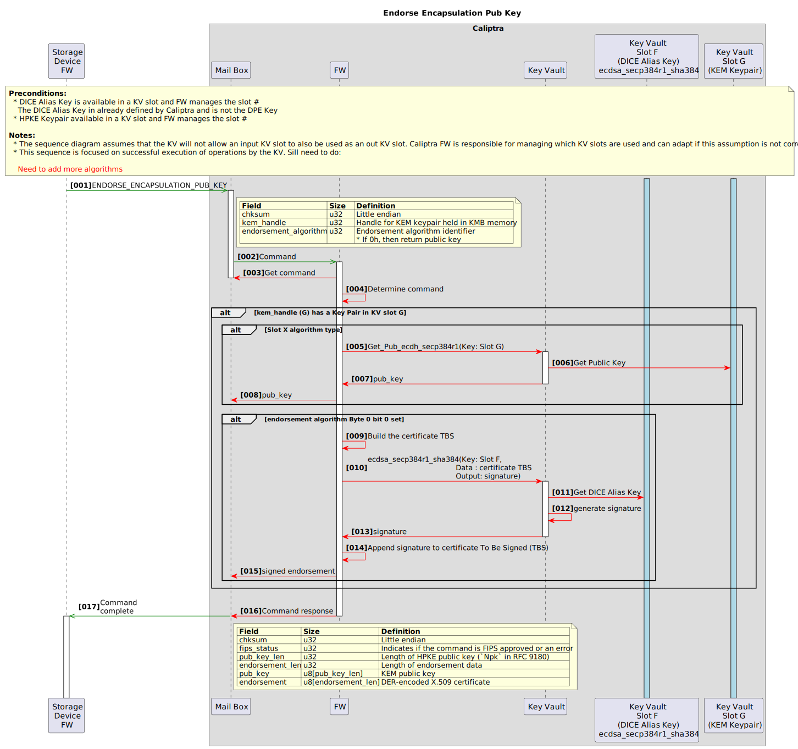

**
OCP Layered Open-Source Cryptographic Key-management (L.O.C.K.)
**

**
NVMe™ Key Management Block
**

**
Revision 0.8
**

**
Version 0.8
**

**Contributors**

<table>
<tr><th>Company</th><th>Individuals</th></tr>
<tr><td>Google</td><td>
		<ul>
			<li>Andrés Lagar-Cavilla</li>
			<li>Amber Huffman</li>
			<li>Charles Kuzman</li>
			<li>Jeff Andersen</li>
			<li>Chris Sabol</li>
			<li>Srini Narayanamurthy</li>
		</ul></td></tr>
<tr><td>Microsoft</td><td>
		<ul>
			<li>Lee Prewitt</li>
			<li>Michael Norris</li>
			<li>Eric Eilertson</li>
			<li>Bryan Kelly</li>
			<li>Anjana Parthasarathy</li>
			<li>Ben Keen</li>
			<li>Bharat Pillilli</li>
		</ul></td></tr>
<tr><td>Samsung</td><td>
		<ul>
			<li>Jisoo Kim</li>
			<li>Gwangbae Chio</li>
			<li>Eric Hibbard</li>
			<li>Mike Allison</li>
		</ul></td></tr>
<tr><td>Solidigm</td><td>
		<ul>
			<li>Scott Shadley</li>
			<li>Gamil Cain</li>
			<li>Festus Hategekimana</li>
		</ul></td></tr>
<tr><td>Kioxia</td><td>
		<ul>
			<li>John Geldman</li>
			<li>Fred Knight</li>
			<li>Paul Suhler</li>
			<li>James Borden</li>
		</ul></td></tr>
</table>

**Revision Table**

|     Date | Revision # | Author | Description |
| :--------------: | :---: | :-------------------: | :-----|
|  September 2024  |  0.5 |   Authoring Companies  | Initial proposal draft based on work from the list of contributors |
|    April 2025    |  0.8 |   Authoring Companies  | Updates that include updates APIs, UNL Sequence digrams, and rachetting with fuses |

**License**

**Open Web Foundation (OWF) CLA**

Contributions to this Specification are made under the terms and conditions set forth in Open Web Foundation Modified Contributor License Agreement (“OWF CLA 1.0”) (“Contribution License”) by:

**Google, Microsoft, Samsung, Solidigm, Kioxia**

Usage of this Specification is governed by the terms and conditions set forth in **Open Web Foundation Modified Final Specification Agreement (“OWFa 1.0”) (“Specification License”)**.

You can review the applicable OWFa1.0 Specification License(s) referenced above by the contributors to this Specification on the OCP website at. For actual executed copies of either agreement, please contact OCP directly.

**Notes:**
1) The above license does not apply to the Appendix or Appendices. The information in the Appendix or Appendices is for reference only and non-normative in nature.

NOTWITHSTANDING THE FOREGOING LICENSES, THIS SPECIFICATION IS PROVIDED BY OCP "AS IS" AND OCP EXPRESSLY DISCLAIMS ANY WARRANTIES (EXPRESS, IMPLIED, OR OTHERWISE), INCLUDING IMPLIED WARRANTIES OF MERCHANTABILITY, NON-INFRINGEMENT, FITNESS FOR A PARTICULAR PURPOSE, OR TITLE, RELATED TO THE SPECIFICATION. NOTICE IS HEREBY GIVEN, THAT OTHER RIGHTS NOT GRANTED AS SET FORTH ABOVE, INCLUDING WITHOUT LIMITATION, RIGHTS OF THIRD PARTIES WHO DID NOT EXECUTE THE ABOVE LICENSES, MAY BE IMPLICATED BY THE IMPLEMENTATION OF OR COMPLIANCE WITH THIS SPECIFICATION. OCP IS NOT RESPONSIBLE FOR IDENTIFYING RIGHTS FOR WHICH A LICENSE MAY BE REQUIRED IN ORDER TO IMPLEMENT THIS SPECIFICATION. THE ENTIRE RISK AS TO IMPLEMENTING OR OTHERWISE USING THE SPECIFICATION IS ASSUMED BY YOU. IN NO EVENT WILL OCP BE LIABLE TO YOU FOR ANY MONETARY DAMAGES WITH RESPECT TO ANY CLAIMS RELATED TO, OR ARISING OUT OF YOUR USE OF THIS SPECIFICATION, INCLUDING BUT NOT LIMITED TO ANY LIABILITY FOR LOST PROFITS OR ANY CONSEQUENTIAL, INCIDENTAL, INDIRECT, SPECIAL OR PUNITIVE DAMAGES OF ANY CHARACTER FROM ANY CAUSES OF ACTION OF ANY KIND WITH RESPECT TO THIS SPECIFICATION, WHETHER BASED ON BREACH OF CONTRACT, TORT (INCLUDING NEGLIGENCE), OR OTHERWISE, AND EVEN IF OCP HAS BEEN ADVISED OF THE POSSIBILITY OF SUCH DAMAGE.

**Acknowledgements**

The Contributors of this Specification would like to acknowledge the following companies for their feedback:

**Compliance with OCP Tenets**

Please describe how this Specification complies to the following OCP tenets. Compliance is required for at least three of the four tenets. The ideals behind open sourcing stipulate that everyone benefits when we share and work together. Any open source project is designed to promote sharing of design elements with peers and to help them understand and adopt those contributions. There is no purpose in sharing if all parties aren't aligned with that philosophy. The IC will look beyond the contribution for evidence that the contributor is aligned with this philosophy. The contributor actions, past and present, are evidence of alignment and conviction to all the tenets.

**Openness**

OCP L.O.C.K source for RTL and firmware will be licensed using the Apache 2.0 license. The specific mechanics and hosting of the code are work in progress due to CHIPS alliance timelines. Future versions of this spec will point to the relevant resources.

**Efficiency**

OCP  is used generate and load keys for use of encrypting user data prior to storing data at rest and decrypting stored user data at rest when read. So, it cannot yield a measurable impact on system efficiency.

**Impact**

OCP  enables consistency and transparency to a foundational area of security of media encryption keys such that no firmware in the device ever has access to a media encryption key. Furthermore, no decrypted media encryption key exists in the device when power is removed from the device.

**Scale**

OCP L.O.C.K. is a committed intercept for Cloud silicon for Google and Microsoft. This scale covers both a significant portion of the Cloud market in hyperscale and enterprise.

**Sustainability**

The goal of OCP L.O.C.K. is to eliminate the need to destroy storage devices (e.g., SSDs) in the Cloud market by providing a mechanism that increases the confidence that a media encryption key within the device is deleted in a crypto-erase. This enables repurposing the device and or components on the device at end of use or end of life. Given the size of the Cloud market this provides a significant reduction of e-waste.

[[toc]]

# Introduction

OCP L.O.C.K. (Layered Open-source Cryptographic Key management) is a feature set conditionally compiled into Caliptra, which provides secure key management for Data-At-Rest protection in self-encrypting storage devices.

OCP L.O.C.K. was originally created as part of the Open Compute Project (OCP). The major revisions of the OCP L.O.C.K. specifications are published as part of Caliptra at OCP as OCP L.O.C.K. is an optional extension to Caliptra. The evolving source code and documentation for Caliptra are in the repository within the CHIPS Alliance Project, a Series of LF Projects, LLC.

# Background

OCP L.O.C.K is being defined to improve drive security. The life of a storage device in a datacenter is that the device leaves the supplier, a customer writes user data to the device, and then the device is decommissioned. The problem is that customer data is not allowed to leave the data center. There needs to be a high confidence that and storage device leaving the datacenter is secure. The current default cloud service provider (CSP) policy to ensure this level of security is to destroy the drive. Other policies may exist that leverage drive capabilities (e.g., Sanitize), but are deemed insufficient by these CSPs[^1] . This produces significant e-waste and inhibits any re-use/recycling.

OCP L.O.C.K. is solving this security issue with data encryption by defining entropy used to create a media encryption key that is able to encrypt all data on the storage device. If that entropy is deleted, then the media encryption key is unable to be generated to decrypt the data on that storage device (i.e., no access to the plaintext behind the ciphertext). 

OCP L.O.C.K. is addressing these issues by:

* Preventing leakage of media keys via firmware vulnerabilities or side channels;
* Binding media keys to a set of securely-provisioned access keys; and
* Enabling attestable “hard” purge via erasure of fuse secrets.

## OCP L.O.C.K. Goals

The goal of OCP L.O.C.K. is to define a Key Management Block (KMB) that:

*	Isolates storage keys to a trusted hardware block
*	Binds storage keys to a given set of externally-supplied access keys
*	Provides replay-resistant transport security for these access keys
*	Allows access key injection into KMB without trusting the host
*	able to be used in conjunction with the storage device support Opal and Key per I/O

# Overview

Self-encrypting drives (SEDs) store data encrypted to media encryption keys (MEKs). SEDs include the following building blocks:

- The storage media that holds data at rest.
- A hardware cryptographic engine that performs line-rate encryption and decryption of data as it enters and exits the drive.
- A controller that manages the lifecycle of MEKs.

MEKs may be bound to user credentials, which the host must provide to the drive in order for the associated data to be readable. A given MEK may be bound to one or more credentials. This model is captured in the TCG Opal [specification](https://trustedcomputinggroup.org/resource/storage-work-group-storage-security-subsystem-class-opal/).

MEKs, or other keys from which MEKs are derived, may be injected into the drive and tagged with address range metadata, such that subsequent I/Os which target that address range will be encrypted to that injected MEK. This model is captured in the TCG Key Per I/O (KPIO) [specification](https://trustedcomputinggroup.org/resource/tcg-storage-security-subsystem-class-ssc-key-per-i-o/).

MEKs may be securely erased, to effectively erase all data which was encrypted to the MEK. To erase an MEK, it is sufficient for the controller to erase the MEK itself or a key from which it was derived.

In an SED that takes Caliptra with OCP L.O.C.K. features enabled, Caliptra will act as a Key Management Block (KMB). The KMB will be the only entity that can read MEKs and program them into the SED's cryptographic engine. The KMB will expose services to controller firmware which will allow the controller to transparently manage each MEK's lifecycle, without being able to access the raw MEK itself.

# Threat model

The protected asset is the user data stored at rest on the drive. The adversary profile extends up to nation-states in terms of capabilities.

Adversary capabilities include:

- Interception of a storage device in the supply chain.
- Theft of a storage device from a data center.
- Destructively inspecting a stolen device.
- Running arbitrary firmware on a stolen device.
  - This includes attacks where vendor firmware signing keys have been compromised.
- Attempting to glitch execution of code running on general-purpose cores.
- Stealing debug core dumps or UART/serial logs from a device while it is operating in a data center, and later stealing the device.
- Gaining access to any class secrets, global secrets, or symmetric secrets shared between the device and an external entity.
- Executing code within a virtual machine on a multi-tenant host offered by the cloud service provider which manages an attached storage device.
- Accessing all device design documents, code, and RTL.

Given the above adversary profile, the following are a list of vulnerabilities that L.O.C.K. is designed to mitigate.

- Keys managed by storage controller firmware are compromised due to implementation bugs or side channels.
- Keys erased by storage controller firmware are recoverable via invasive techniques.
- MEKs are not fully bound to user credentials due to implementation bugs.
- MEKs are bound to user credentials which are compromised by a vulnerable host.
- Cryptographic erasure was not performed properly due to a buggy host.

## Architecture

The following figure shows the basic high-level blocks of OCP L.O.C.K.

*
Figure 1: OCP L.O.C.K high level blocks
*

Caliptra that includes the optional OCP L.O.C.K. has a Key Management Block (KMB) that is the only entity that can derive the MEKs which protect user data and load the MEKs into the Key Cache of the Encryption Engine. The KMB derives MEKs using the following keys:

- A controller-supplied data encryption key (DEK). The DEK is the mechanism by which the controller enforces privilege separation between user credentials under TCG Opal, as well as the mechanism used to model injected MEKs under KPIO.

- A KMB-supplied storage root key, derived from secrets held in device fuses that are only accessible by the KMB. The storage root key may be rotated a small number of times, providing assurance that a nation-state cannot recover key material used by the drive prior to the storage root key rotation.

- Zero or more partial MEKs (PMEKs), each of which is a cryptographically-strong value, encrypted to an externally-supplied access key. PMEKs enable multi-party authorization flows: the access key for each PMEK used to derive an MEK must be provided to the drive before the MEK can be used. Access keys are protected in transit using asymmetric encryption. This enables use-cases where the access key is served to the drive from a remote entity, without having to trust the host to which the drive is attached.

The DEK and storage root key do not require any changes to the host APIs for TCG Opal or KPIO.

Additional host APIs (i.e., Remote Key Mnagement Services) are required to fully model storage root key rotation, PMEKs, and injectable host entropy. Such APIs are beyond the scope of the present document.

MEKs are never visible to any firmware. To load a MEK into the Key Cache of the Encryption Engine, Firmware interfaces to the Key Management Block to generate or retrieve a previously generated MEK that is created using thosekeys and then cause hardware to load the MEK into the Encryption Engine. Each MEK has associated metadata, to identify the namespace, LBA range, and how to load the MEK in the Encryption Engine.

The Remote Key Management Service is utilized by the host to allow the host access to information for the PMEKs. OPAL or Key per I/O are example Remote Key Management Services. Each PMEK is encrypted as rest using an externally-injected access key where that access key is not stored persistently on the storage device. If there is more than one PMEK used to generate a MEK, then it requires multiple authorities to unlock a given range of user data.

Each MEK is bound for its lifetime to the Storage Root Key, the list of PMEKs, and the DEK. To generate a MEK, the access key for each PMEK must be provided. All MEKs are removed from the Encryption Engine on a power cycle or during sanitization on the storage device. 

The DEK may be derived from or decrypted by a users C-pin to support legacy OPAL. The DEK may be the imported key associated with a Key per I/O key tag.
KMB generates Key Encapsulation Mechanism (KEM) keypairs and stores them in internal volatile memory using a KEM algorithm such as ECDH or MLKEM/Kyber. KMB can issue endorsements of KEM public keys allowing a Remote Key Management Services to ensure they only release access keys to authentic devices. PMEK access keys are encrypted in transit using these KEM keypairs. Upon drive reset, the access key must be re-encrypted to a new KEM for its associated PMEK to be usable.

KMB can maintain multiple active KEM keypairs. Nominally, one for each supported algorithm. KMB will automatically initialize a KEM for each supported algorithm and this may be done lazily. KMB will allow the controller to trigger KEM rotation. This can be done as part of zeroization.

KMB supports PMEK access key rotation where the storage controller must replace an old encrypted PMEK with a new encrypted PMEK. The end user must prove to KMB that they control both old and new access key. This is done by encrypting the new access key with the old access key. The new access key is therefore double-encrypted when provided to KMB with the old access key and with an ephemeral transport encryption key.

KMB is able to generate two kinds of keys: KEMs (used for access key transport encryption) and PMEKs (used for MEK derivation). A host is able to external inject entropy into KMB where it is held in internal volatile memory. Subsequent keys are randomly generated using both KMB's TRNG and the host's entropy as shown in figure 2.

*
Figure 2: KEM and PMEK Key Generation
*

### Interfaces

OCP L.O.C.K. provides two interfaces:

- The cryptographic engine interface is exposed from vendor-implemented hardware cryptographic engines to KMB, and defines a standard mechanism for programming MEKs and control messages.
- The mailbox interface is exposed from KMB to storage controller firmware, and enables the controller to manage MEKs.

### MEK derivation

When controller firmware wishes to program an MEK to the hardware cryptographic engine, the controller firmware performs the following steps:

1. Provides zero or more unlocked PMEKs to the KMB.
  - KMB initializes the MEK seed buffer with the System Root Key and then extends that MEK seed buffer using each given unlocked PMEK.
2. Provide a DEK to the KMB.
  - KMB derives the MEK using the given DEK and the contents of the MEK seed buffer.
3. Provide MEK metadata to KMB, such as the MEK's associated namespace and logical block address range.
  - KMB programs the derived MEK and its metadata to the hardware cryptographic engine.

#### Sequence to mix a PMEK into the MEK seed

#### Sequence to load an MEK

#### Sequence to load MEK into the Encryption Engine Key Cache

#### Sequence unload a MEK from the Encryption Engine Key Cache

#### Sequence unload all MEKs (i.e., purge) from the Encryption Engine Key Cache

#### Legacy MEK derivation for TCG Opal

The controller is allowed to maintain a DEK that represents a given user's media encryption key. That DEK can be encrypted at rest by the user's C\_PIN.

When deriving the user's MEK, the controller can pass zero PMEKs in step 2, and the user's decrypted DEK in step 3.

#### Legacy MEK derivation for Key Per I/O

MEKs injected with Key Per I/O will be considered as DEKs under OCP L.O.C.K.

When deriving the associated MEK, the controller can pss zero PMEKs in step 2, and the injected DEK in step 3.

### PMEK lifecycle

#### PMEK generation

Controller firmware may request that KMB generate a random PMEK, bound to a given access key. KMB performs the following steps:

1. Unwrap the given PMEK access key. See [below](#transport-encryption-for-pmek-access-keys) for details on access key transport security.
2. Randomly generate a PMEK.
3. Derive a PMEK encryption key from the storage root key and the decrypted access key.
4. Encrypt the PMEK to the PMEK encryption key.
5. Return the encrypted PMEK to the controller firmware.

Controller firmware may then store the encrypted PMEK in persistent storage.

##### Sequence to Generate a PMEK

#### PMEK unlock

Encrypted PMEKs stored at rest in persistent storage are considered "locked", and must be unlocked before they can be used to derive MEKs. Unlocked PMEKs are also encrypted when handled by controller firmware. Unlocked PMEKs do not survive across device reset.

To unlock a PMEK, KMB performs the following steps:

1. Unwrap the given PMEK access key.
2. Derive the PMEK decryption key from the storage root key and the decrypted access key.
3. Decrypt the PMEK using the PMEK decryption key.
4. Encrypt the PMEK using an ephemeral export key that is randomly initialized on startup and lost on reset.
5. Return the re-encrypted "unlocked" PMEK to the controller firmware.

Controller firmware may then stash the encrypted unlocked PMEK in volatile storage, and later provide it to the KMB when deriving an MEK, as described [above](#mek-derivation).

##### Sequence to Unlock a PMEK

#### PMEK access key rotation

The access key to which a PMEK is bound may be rotated. The user must prove that they have knowledge of both the old and new access key before a rotation is allowed. KMB performs the following steps:

1. Unwrap the given old and new access keys.
2. Derive the old PMEK decryption key from the storage root key and the decrypted old access key.
3. Derive the new PMEK decryption key from the storage root key and the decrypted new access key.
4. Decrypt the PMEK using the old PMEK decryption key.
5. Encrypt the PMEK using the new PMEK decryption key.
6. Return the re-encrypted PMEK to the controller firmware.

Controller firmware then erases the old encrypted PMEK and stores the new encrypted PMEK in persistent storage.

##### Sequence to Rotate Access Key to a PMEK

#### Transport encryption for PMEK access keys

In OCP L.O.C.K., the KMB maintains a set of key-encapsulation-mechanism (KEM) keypairs, one per algorithm that OCP L.O.C.K. supports. Each KEM public key is endorsed with a certificate that is generated by Caliptra and signed by Caliptra's DICE identity. KEM keypairs are randomly generated on KMB startup, may be periodically rotated, and are lost when the drive resets.

When a user wishes to unlock a PMEK (which is required prior to deriving any MEKs bound to that PMEK), the user performs the following steps:

1. Obtain the KEM public key and certificate from the storage device.
2. Validate the KEM certificate and attached DICE certificate chain.
3. Run `Encaps` and encrypt their access key to the resulting shared key.
4. Transmit the KEM ciphertext and encrypted access key to the storage device.

Upon receipt, KMB will perform the following steps:

1. Run `Decaps` and decrypt the user's access key with the resulting shared secret.
2. Derive the PMEK encryption key using the storage root key and the decrypted access key.
3. Perform PMEK generation, unlock, or rotation actions detailed [above](#pmek-lifecycle).

Upon drive reset, the KEMs are regenerated, and any access keys for PMEKs that had been unlocked prior to the reset will need to be re-provisioned.

##### Sequence to Endorse Encapsulation Public Key

#### Access key rotation flows

As noted [above](#pmek-access-key-rotation), during access key rotation the user must prove knowledge of both the old and new access keys. This is accomplished using a slight variation on the encaps-decaps flow. When a new access key is provided to KMB during a rotation, the new access key is double-encrypted: first to the old access key, and then to the shared secret obtained from the `Encaps` operation.

The KMB then performs a double decryption when unwrapping the new access key, proving that the provisioner of the new access key also knows the old access key.

##### Sequence to Rotate Encapsulation Key

#### Algorithm support

OCP L.O.C.K. will support the following KEM algorithms:

- P384 ECDH
- Hybridized ML-KEM with P384 ECDH

##### Sequence to obtain the supported Algorithms

### Helper Functions

OCP L.O.C.K. has the following helper function to assist with determining the supported capabilities and the status

- Get the current status

##### Sequence to obtain the current status of OCP L.O.C.K.

### Storage root key rotation

As the storage root key is held in fuses, it can only be rotated a limited number of times.

This section will be fleshed out with additional details as they become available.

### Reporting of erasure state

A key use-case around cryptographic erasure of user data is confirmation that erasure occurred. This allows third parties to verify cleanliness state, and mitigates risk of bugs in host software that drives cryptographic erasure.

OCP L.O.C.K. will enable reporting of whether a drive is clean following a storage root key rotation.

This section will be fleshed out with additional details as they become available.

### Externally-injected entropy

The KMB relies on randomness to generate PMEKs and KEM keypairs. Storage devices feature their own source of randomness. For end users that prefer not to solely trust device-level randomness sources, KMB allows the host to sample entropy from its own randomness source and inject it into the KMB. Injected randomness is used to permute DRBG state that is held in volatile memory within the KMB.

Note: this does not invalidate any requirements around integration of entropy sources with Caliptra.

### Cryptography helper commands

It is anticipated that controller firmware will perform its own vendor-specific cryptographic operations outside of the KMB boundary. To allow those operations to leverage FIPS-validated cryptographic implementations within Caliptra, Caliptra will support helper mailbox commands that expose the following raw primitive cryptographic operations:

- Get random bytes, using a DRBG as defined in NIST [SP 800-90A](https://csrc.nist.gov/pubs/sp/800/90/a/r1/final)
- Perform AES-256-GCM encryption or decryption, as defined in NIST [SP 800-38D](https://csrc.nist.gov/pubs/sp/800/38/d/final)
- Perform AES-256-KeyWrap encryption or decryption, as defined in NIST [SP 800-38F](https://csrc.nist.gov/pubs/sp/800/38/f/final)
- Perform HMAC-384-KDF key derivation, as defined in NIST [SP 800-108](https://csrc.nist.gov/pubs/sp/800/108/r1/upd1/final)

#### Sequence for Getting a Randon Number

# Hardware

The following figure describes the OCP L.O.C.K..

Figure 8: KMB block diagram

This figure will be fleshed out with additional details as they become available.

## Memory requirements:

This section will be fleshed out with additional details as they become available.

## Cryptography requirements

This section will be fleshed out with additional details as they become available.

## KMB-Encryption Engine Interface

This section defines the interface between the Key Management Block (KMB) and an Encryption Engine. An Encryption Engine is used to encrypt/decrypt user data and its design and implementation are vendor specific. Media Encryption Keys (MEKs) are the keys which are generated within KMB and used by Encryption Engine to encrypt and decrypt user data. This interface is used to load MEKs from KMB to Encryption Engine or to cause the Encryption Engine to unload (i.e., remove) loaded MEKs. The MEKs transferred between the KMB and the Encryption Engine shall not be accessible by the Controller Firmware.

### Overview

The Encryption Engine uses a stored MEKs to encryption and decryption use data. For the purposes of this specification, the entity within the Encryption Engine used to store the MEKs is called Key Cache. Each encryption and description of user data is coupled to a specific MEK which is stored in Key Cache bound to a unique identifier, called metadata. Each (metadata, MEK) pair is also associated with additional information, called aux, which is used neither as MEK nor an identifier, but has some additional information about the pair. Therefore, the Key Cache as an entity which stores (metadata, aux, MEK) tuples.

In order to achieve the security goals for KMB, KMB is limited to be the unique component which loads unload a (metadata, aux, MEK) tuple into the Key Cache and unloads a tuple within the device, so that MEKs can only be exposed to KMB and Encryption Engine. Controller Firmware arbitrates all operations in the KMB to Encryption Engine interface, therefore Controller FW is responsible for managing which MEK is loaded in Key Cache. Controller Firmware has full control on metadata and optional aux. Figure 9 is an illustration of the KMB to Encryption Engine interface that shows:

-	the tuple for loading a MEK;
-	the Metadata for unloading a MEK; and 
-	an example of a Key Cache within the Encryption Engine.

*
Figure 9: KMB to Encryption SFR Interface
*

KMB uses Special Function Registers (SFRs) to communicate with Encryption Engine which are descripts in the following sections.

#### Special Function Registers (SFRs)

KMB uses Special Function Registers (SFRs) to communicate with Encryption Engine as shown in Table 1 and each of the following subsections describe the registers.

*
Table 1: KBM to Encryption Engine SFRs
*

| Register | Address | 	Byte Size	| Description |
| :-------: | :------------: | :--: | :---------------------------|
| Control                    | SFR_BASE + 0h  | 4h   | Register to handle commands |
| Metadata                   | SFR_BASE + 10h | 14h  | Register to provide metadata |
| Auxiliary Data (AUX)       | SFR_BASE + 30h | 20h  | Register to provide auxiliary values |
| Media Encryption Key (MEK) | SFR_BASE + 50h | 40h  | Register to provide MEK |

SFR_BASE is an address that is configured on KMB. The integrator should make sure that KMB can access these SFRs through these addresses.

##### Control Register (Offset SFR_Base + 0h)

Figure 10 defines the Control register used to sequence the execution of a command and obtain the status of that command.

*
Figure 10: Offset SFR_Base + 0h: CTRL – Control
*

<table>
<tr><th>Bits<\th><th>Type</th><th>Reset<\th><th>Description</th></tr>
<tr><td>31</td><td>RO</td><td>0h</td><td><b>Ready (RDY):</b>b> After an NVM Subsystem Reset, this bit is set to 1b, then the Encryption Engine is ready to execute commands. If this bit is set to 0b, then the Encryption Engine is not ready to execute commands.</td></tr>
<tr><td>30:20</td><td>RO</td><td>0h</td><td>Reserved</td></tr>
<tr><td>19:16</td><td>RO</td><td>0h</td><td><b>Error (ERR):</b>> If the DONE bit is set to 1b by the Encryption Engine, then this field if set to a non-zero value to indicate the Encryption Engine detected an error during the execution the command specified by the CMD field. The definition of a non-zero value is vendor specific.

| Value    | Description |
| :--:     | :---------- |
| 0h       | Command Successful |
| 1h to 3h | Reserved |
| 4h to Fh | Vendor Specific |

If the DONE bit is set to 1b by the Encryption Engine and this field is set to 0h, then the Encryption Engine is indicating a successful execution of a command specified by the CMD field.\n
If the DONE bit is set to 1b by KMB, then the field is set to 0000b.</td></tr>
<tr><td>15:6</td><td>RO</td><td>0h</td><td>Reserved</td></tr>
<tr><td>2:5</td><td>RW</td><td>0h</td><td><b>Command (CMD):</b> This field specifies the command to execute or the command associated with the reported status.
  
| Value | Description |
| :-------: | :---- |
| 0h        | Reserved |
| 1h        | <b>Load MEK:</b> Load the key specified by the AUX field and MEK register into the Encryption Engine as specified by the METD field. |
| 2h        | <b>Unload MEK:</b> Unload the MEK from the Encryption Engine as specified by the METD field. |
| 3h        | <b>Sanitize:</b> Unload all of the MEKs from the Encryption Engine (i.e., Sanitize the Encryption Engine MEKs). |
| 4h to Fh  | Reserved |

</td></tr>
<tr><td>1</td><td>RW</td><td>0b</td><td>Done (DN): This bit indicates the completion of a command by the Encryption Engine.\n
If this bit is set to 1b by the Encryption Engine, then the Encryption Engine has completed the command specified by the CMD field.\n
If the EXE bit is set to 1b and this bit is set to 1b, then the Encryption Engine has completed executing the command specified by the CMD field and the ERR field indicates the status of the execution of that command.
A write of the value 1b to this bit shall cause the Encryption Engine to:
 - set this bit to 0b;
 - set the EXE bit to 0b; and
 - set the ERR field to 00b.
 </td></tr>
<tr><td>0</td><td>RW</td><td>0b</td><td><b>Execute (EXE):</b> A write of the value 1b to this bit specifies that the Encryption Engine is to execute the command specified by the CMD field.
If the DONE bit is set to 1 by KMB, then the bit is set to 0b.
</td></tr></table

From the KMB, the Controller register is the register to write a command and receive its execution result. From its counterpart, the Encryption Engine, the Controller register is used to receive a command and write its execution result.

The expected change flow of the Controller register to handle a command is as follows:

1. If <b>RDY</b> is set to 1b, then KMB writes <b>CMD</b> and <b>EXE</b>
    1. <b>CMD:</b> either 1h, 2h or 3h
    2. <b>EXE:</b> 1b
2. The Encryption Engine writes</b> <b>ERR</b> and <b>DN</b>
    1.<b>ERR:</b> either 0b or a non-zero value depending on the execution result
    2. <b>DN:</b> 1b
3. The KMB writes <b>DN</b>
    1. <b>DN:</b> 1b
4. The Encryption Engine writes <b>CMD</b>, <b>ERR</b>, <b>DN</b> and <b>EXE</b>
    1. <b>CMD:</b> 0h
    2. <b>ERR:</b> 0h
    3. <b>DN:</b> 0b
    4. <b>EXE:</b> 0b
  
The KMB therefore interacts with the Control register as follows in the normal circumstance:

1. The KMB writes <b>CMD</b> and <b>EXE</b>
    1. <b>CMD:</b> either 1h, 2h or 3h
    2. <b>EXE:</b> 1b
2.	The KMB waits <b>DN</b> to be 1
3.	The KMB writes <b>DN</b>
    1. <b>DN:</b> 1b
4.	The KMB waits <b>DN</b> to be 0

Since the Controller register is in fact a part of the Encryption Engine whose implementation can be unique by each vendor, behaviors of the Control register with the unexpected flow are left for vendors. For example, a vendor who wants robustness might integrate a write-lock into the Control register in order to prevent two almost simultaneous writes on EXE bit.

##### Metadata Register (Offset SFR_Base + 0h)

Figure 11 defines the Metadata register.

*
Figure 11: Offset SFR_Base + 10h: METD – Metadata
*

| Bytes | Type | Reset | Description |
| :---: | :---: | :---: | :--- |
| 19:00 | RW    | 0b    | <b>Metadata (METD):</b> This field specifies metadata that is vendor specific and specifies the entry in the Encryption Engine for the Encryption Key.|

For the security goal of this project, the KMB and the Encryption Engine supposed to be the only components which have access to MEKs. Each MEK must then be bound to a unique identifier, which can be accessible by other components, in order for an appropriate key to be used for any key-related operations including data I/O. In a LOCK-enabled system, the <b>METD</b> field is expected to be used as such identifier.

Instead of generating a random and unique identifier within the KMB while generating an MEK, the KMB takes an <b>METD</b> value as input from the Controller Firmware and write to the Metadata register without any modification for the sake of the following reasons:

1. A vendor does not need to implement an additional algorithm to map between identifiers in its own system and in the KMB
2. A vendor-unique key-retrieval algorithm can easily be leveraged into a <b>METD</b>-generation algorithm

In order to reduce ambiguity, two examples of <b>METD</b> field will be given: Logical Block Addressing (LBA) range-based metadata; and key-tag based metadata.

When an SSD stores data with address-based encryption, an MEK can be uniquely identified by a (LBA range, Namespace ID) pair. Then, the (LBA range, Namespace ID) pair can be leveraged into METD as on Figure 12.

*
Figure 12: LBA Range Based Metadata Format
*

Address-based encryption is not however the only encryption mechanism in SSDs. For example, in the TCG Key per I/O […], an MEK is selected by a key tag, which is hard to be mapped with an address. Figure 123 shows an example of <b>METD</b> in such cases.

*
Figure 13: Key Tag Based Metadata Format
*

The above examples are not the only possible values of <b>METD</b>. Vendors are encouraged to design and use their own <b>METD</b> if it fits better to their system.

##### Auxiliary Data Register (Offset SFR_Base + 0h)

Figure 14 defines the Auxiliary Data register.

*
Figure 14: Offset SFR_Base + 20h: AUX – Auxiliary Data
*

| Bytes | Type | Reset | Description |
| :---- | :--: | :---: | :---------: |
| 19:00 | RW   |  0h   | <b>Auxiliary Data (AUX):</b> This field specifies auxiliary data associated to the MEK. |

At first glance, the usage of <b>AUX</b> might not be straightforward. The intuition behind introducing the <b>AUX</b> field is to support vendor-specific features on MEKs. The KMB itself is only supporting fundamental functionalities in order to minimize attack surfaces on MEKs. Moreover, vendors are not restricted to design and implement their own MEK-related functionalities on the Encryption Engine unless they can be used to exfiltrate MEKs. In order to support these functionalities, some data may be associated and stored with an MEK and the <b>AUX</b> field is introduced to store such data with each MEK.

When the Controller Firmware requests the KMB to generate a new MEK, the Controller Firmware is expected to provide an <b>AUX</b> value. Similar to the <b>METD</b> field, the KMB will write the <b>AUX</b> value into the Auxiliary Data register without any modification.

One of simple use cases of <b>AUX</b> field is to store an offset of initialization vector or nonce. It can also be used in a more complicate use case. Here is an example. Suppose that there exists a vendor who wants to design a system which supports several mode of operations through the Encryption Engine while using the KMB. Then, a structure of <b>AUX</b> value as on Figure 15 can be used.

*
Figure 15: Auxiliary Data Format Example
*

When the Controller Firmware requests an MEK generation to the KMB, the Controller Firmware can use the <b>AUX</b> value to specify which mode of operation should be used and which value should be used as an initialization vector or a nonce with the generated MEK.

##### Media Encryption Key (MEK) Register (Offset SFR_Base + 50h)

Figure 16 defines the MEK register.

*
Figure 16: Offset SFR_Base + 40h: MEK – Media Encryption Key
*

| Bytes | Type | Reset | Description |
| :--:  | :--: | :--:  | :------ |
| 31:00 |  WO  |   0h  | <b>Secret Encryption Key (SEK):</b> This field specifies a 256-bit Encryption Key |
| 63:32 |  WO  |   0h  | <b>Tweakable Key (TWK):</b> This is the 256-bit AES-XTS tweakable key. |

Since the AES-XTS is one of the most popular algorithms for data encryption, the MEK register is also designed with the key format of AES-XTS. The layout of the MEK register is however designed to help understanding the structure. The Encryption Engine is not restricted to only support the AES-XTS. The choice of encryption algorithm is solely dependent on vendors. When a vendor decides to use a different encryption algorithm, an MEK can be seen as a 64-byte random value rather than a (secret key, tweak key) pair and how to slice the 64-byte random value into an encryption key will be left to the vendor.

As a part of Caliptra, KMB protects MEK as secure as any secret key in Caliptra. MEK is stored in the Caliptra Key Vault, so that it can be protected against any firmware-level attacks. When KMB needs to write an MEK into the MEK register, it will be accomplished by using the DMA engine. Given an index and a destination identifier, the DMA engine copies the key value stored in the key vault of given index to the destination address to which the DMA engine translates the destination identifier. 

### KMB Command Sequence

Figure 17 shows a sample command execution. This is an expected sequence when the Controller Firmware requests the KMB to generate a new MEK. The behavior of Encryption Engine can be seen as one of possible mechanisms, and it can be different by vendors.

*
Figure 17: Command Execution Example
*

### Encryption Engine Requirements

This section will be fleshed out with additional details as they become available.

## Storage Root Key Fuse requirements

A storage device equipped with OCP L.O.C.K. will be equipped with N 256-bit ratchet-secret fuse banks, dubbed R0..RN-1. 4 ≤ N ≤ 16. These ratchet secrets have the following requirements:

- Each ratchet secret can individually transition from all-zeroes → randomized → all-ones. RX is only randomized once RX-1 has transitioned to all-ones.
- Programmable via the Caliptra fuse controller.
	- Caliptra Core's fuse controller will not support individual zeroization of fuse banks.
	- Open: can we mirror UDS and have the values come from Caliptra, even if they're programmed external to UDS?
- Only readable by Caliptra Core, via fuse registers.
	- Internally, the fuse registers will be treated like the DICE UDS, in that their contents can only be deposited into Key Vault slots, without direct visibility by Caliptra firmware.
	- TBD on de-obfuscation.
-Caliptra Core firmware can detect which ratchet secrets are all-zeroes, randomized, or all-ones. This can be done by representing a counter in fuses, which maps to ratchet secret states. Controller firmware would be responsible for ensuring that the counter value corresponds with the ratchet secrets' current state. The counter values map to the following states:

| State  | Description |
| :----: | :---------- |
| 4i + 0 | Ri has begun being programmed with randomness, but is not yet considered randomized. |
| 4i + 1 | Ri has been randomized. |
| 4i + 2 | Ri has begun being programmed to all-ones, and is no longer considered randomized. |
| 4i + 3 | Ri has been programmed to all-ones. |

This scheme allows ratchet state transitions to be resilient in the face of unexpected power loss. A power loss during randomization will burn the ratchet being randomized.

The counter is readable by Caliptra Core firmware and controller firmware.

Open: add popcnt for checking the controller firmware's work after the fact.

### Lifecycle Transitions

The device will go through the following state transitions over its lifespan:

1. At the factory, R0..RN-1 are all-zero.
	1. Caliptra derives a storage root key from a non-ratchetable secret derived from the DICE UDS + field entropy.
	2. Caliptra allows MEKs to be programmed to the storage encryption engine, derived from the storage root key.
	3. Caliptra firmware reports a bit indicating that it is operating in a state where any data written cannot be ratchet-erased.
2. The storage controller programs R0 with randomness.
	1. Caliptra detects that R0 is randomized, and derives its OCP L.O.C.K. storage root key from R0 and a non-ratchetable secret derived from DICE UDS + field entropy.
	2. Caliptra allows MEKs to be programmed to the storage encryption engine, derived from the storage root key.
3. The storage controller programs R0 to all-ones and resets.
	1. Upon next reset, Caliptra detects that there are no randomized ratchet secrets and does not derive a storage root key.
	2. Caliptra does not allow any MEKs to be programmed to the storage encryption engine.
4. The storage controller programs R1 to a random value and resets.
	1. Upon next reset, Caliptra detects that R1 is randomized, and derives its OCP L.O.C.K. storage root key from R1 and a non-ratchetable secret derived from the DICE UDS + field entropy.
	2. Caliptra allows MEKs to be programmed to the storage encryption engine, derived from the storage root key.
5. The storage controller programs R1 to all-ones and resets.
6. The storage controller programs R2 to a random value and resets.
7. The storage controller programs R2 to all-ones and resets.
8. The storage controller programs R3 to a random value and resets.
	1. See steps 2 and 3 for Caliptra's behavior in each state.
    
   ...

9. The storage controller programs RN-1 to all-ones and resets.
	1. Upon next reset, Caliptra detects that there are no randomized ratchet secrets, and no all-zeroes ratchet secrets.
	2. Caliptra derives a storage root key from a non-ratchetable secret derived from the DICE UDS + field entropy.
	3. Caliptra allows MEKs to be programmed to the storage encryption engine, derived from the storage root key.
	4. Caliptra firmware reports a bit indicating that it is operating in a perma-dirty state, where no future ratchets are possible.

### Storage Root Key Fuse programming

OCP L.O.C.K contains a fused block that contains the ability to program N number of Storage Root Keys one at a time. A device out of manufacturing does not program a System Root Key and the device behaves as existing devices do today where the SSD firmware manages the key. This is known as the EMPTY state. OCP L.O.C.K supports a PROGAM_NEXT_ROOT_KEY API to then program the initial System Root Key. That System Root Key is then used to dervice all MEKs. That System Root Key can be erased by using the ERASE_CURRENT_ROOT_KEY Api. Once that System Root Key is erased, no System Root Key exists in OCP L.O.C.K. and no MEKs can be generated by OCP L.O.C.K until the PROGAM_NEXT_ROOT_KEY API causes a new System Root Key to be programmed.

Once all of the N Storage Root Keys have been programmed and erased, no System Root Key exists in OCP L.O.C.K. and no MEKs can be generated by OCP L.O.C.K. The ENABLE_PERMA_DIRTY_STATE API can be used to perminetly allow the device to behaves as existing devices do today where the SSD firmware manages the key.

There can be errors programming a System Root Key and erasing a System Root Key. If these errors occur, the APIs can be use to retry the operation. If there still is an error, then the device is in an unusable state.

The diagram below has an example flow where the number of System Rook Keys available to be programmed is 3 (N=3):

| State transition | active_slot | slot_state | next_action |
| :--------------- | :---------: | :--------  | :---------- |
| Factory                                       | 0 | EMPTY                | PROGRAM |
| Program first entry                           | 0 | PROGRAMMED           | ERASE |
| Erase first entry (recoverable failure)    | 0 | PARTIALLY_ERASED     | ERASE |
| Erase first entry                             | 0 | ERASED               | PROGRAM  |
| Program next entry (recoverable failure)   | 1 | PARTIALLY_PROGRAMMED | PROGRAM |
| Program next entry (unrecoverable failure) | 1 | PARTIALLY_PROGRAMMED | ERASE |
| Erase failed entry                            | 1 | ERASED               | PROGRAM  |
| Program next entry                            | 2 | PROGRAMMED           | ERASE |
| Erase final entry                             | 2 | ERASED               | ENABLE_PERMA_DIRTY |
| Enable perma dirty                            | 2 | PERMA_DIRTY          | NONE |

## Error reporting and handling

This section describes OCP L.O.C.K error reporting and handling.

This section will be fleshed out with additional details as they become available.

### Fatal errors

This section will be fleshed out with additional details as they become available.

### Non-fatal errors

This section will be fleshed out with additional details as they become available.

# Runtime Firmware environment

This section provides an extension to the Runtime Firmware environment defined for OCP Caliptra Runtime Firmware specification due to the support of OCP L.O.C.K.

## Boot and initialization

The section defined additional boot and initialization needed to support OCP L.O.C.K.

The Runtime Firmware main function SHALL cause the generation of Storage Root Key and store this into volatile memory within KMB. The Storage Root key is generated from the Storage Root Key fuses.

## Fault handling

A mailbox command can fail to complete in the following ways due to OCP L.O.C.K.:

-	An ill-formed command
-	Encryption Engine timeout
-	Encryption Engine reported error
	
In all of these cases, the error is reported in the command returned status.

Depending on the type of fault, the SoC may to resubmit the mailbox command

For each Mailbox command that causes a command to execute on the Encryption Engine includes a timeout value is specified by the command. Caliptra aborts the command executing on the Encryption Engine if the Encryption Engine does not complete the command within the specified timeout and reports a LOCK_ENGINE_TIMEOUT result code.

Table 3 defines the additional Caliptra result codes due to supporting OCP L.O.C.K.

*
Table 3: OCP L.O.CK. mailbox command result codes
*

Table 2: OCP L.O.CK. mailbox command result codes

| Name                  |      Value    |   Description |
| :------------------:  | :-----------: | :--------------- |
|LOCK_ENGINE_TIMEOUT    | 0x4C45_544F (“LETO”)  | Timeout occurred when communicating with the drive crypto engine to execute a command | 
|LOCK_ENGINE_CODE + u16 | 0x4443_xxxx (“ECxx”)	 | Vendor-specific error code in the low 16 bits |
|LOCK_BAD_ALGORITHM     | 0x4C42_414C (“LBAL”)  | Unsupported algorithm, or algorithm does not match the given handle |
|LOCK_BAD_HANDLE        | 0x4C42_4841 (“LBHA”)  | Unknown handle |
|LOCK_NO_HANDLES        | 0x 4C4E_4841 (“LNHA”) | Too many extant handles exist |
|LOCK_KEM_DECAPSULATION | 0x4C4B_4445 (“LKDE”)  | Error during KEM decapsulation |
|LOCK_ACCESS_KEY_UNWRAP | 0x4C41_4B55 (“LAKU”)  | Error during access key decryption |
|LOCK_PMEK_DECRYPT      | 0x4C50_4445 (“LPDE”)  | Error during PMEK decryption |
|LOCK_DECRYPT_FAILED    | 0x4C44_4546 (“LDEF”)  | Error during raw AES GCM decryption |

The following sections define the additional Caliptra mailbox commands due to supporting OCP L.O.C.K.

### GET_STATUS

Exposes a command that allows the SoC to determine if the Encryption Engine is ready to process commands as well vendor-defined drive crypto engine status data. 

Command Code: 0x4753_5441 (“GSTA”)

Table: GET_STATUS input arguments

| Name | Type | Description |
| :---: | :---: | :--- |
|chksum | u32 | Checksum over other input arguments, computed by the caller. Little endian. |

Table: GET_STATUS output arguments

<table>
<tr><th>Name</th><th>Type</th><th>Description</th></tr>
<tr><td>chksum</td><td>u32</td><td>Checksum over other output arguments, computed by Caliptra. Little endian.</td></tr>                
<tr><td>fips_status</td><td>u32</td><td>Indicates if the command is FIPS approved or an error</td></tr>           

<tr><td>engine_ready</td><td>u32</td>
	<td>Ready status of the storage device crypto engine:
 		<ul>
			<li>LOCK defines low range, vendor defines high range</li>
   			<li>Byte 0:
				<ul>
					<li>Bit 0: 1 = Ready 0 = Not ready</li>
				</ul></td>
		</ul></td></tr>           
<tr><td>reserved</td><td>u32[4]</td><td>Reserved</td></tr>             
</table>

### GET_ALGORITHMS

Exposes a command that allows the SoC to determine the types of algorithms supported by KBM for endorsement, KEM, PMEK, and access key generation. 

Command Code: 0x4743_4150 (“GCAP”)

Table: GET_ALGORITHMS input arguments

| Name | Type | Description |
| :----------: | :-----: | :------- |
| chksum   | u32     | Checksum over other input arguments, computed by the caller. Little endian. |

Table: GET_ALGORITHMS output arguments

<table>
<tr><th>Name</th><th>Type</th><th>Description</th></tr>
<tr><td>chksum</td><td>u32</td><td>Checksum over other output arguments, computed by Caliptra. Little endian.</td></tr>                
<tr><td>endorsement_algorithms</td><td>u32</td>
	<td>Identifies the supported endorsement algorithms:
		<ul>
			<li>Byte 0
				<ul>
					<li>bit 0: ecdsa_secp384r1_sha384[^2]</li>
			</ul></li>
	</ul></td></tr>
<tr><td>kem_algorithms</td><td>u32</td>
	<td>Identifies the supported KEM algorithms:
		<ul>
			<li>Byte 0
				<ul>
					<li>bit 0: ecdh_secp384r1_aes256_gcm[^3]</li>
			</ul></li>
		</ul></td></tr> 
<tr><td>pmek_algorithms</td><td>u32</td>
	<td>Indicates the size of PMEKs:
		<ul>
			<li>Byte 0
				<ul>
					<li>bit 0: 256 bits</li>
			</ul></li>
		</ul></td></tr>
<tr><td>access_key_algorithm</td><td>u32</td>
	<td>Indicates the size of access keys:
		<ul>
			<li>Byte 0
				<ul>
					<li>bit 0: 256 bits, with a 128-bit truncated SHA384 ID</li>
			</ul></li>
		</ul></td></tr>
<tr><td>Reserved</td><td>u32[4]</td><td>Reserved</td></tr>
</table>

### CLEAR_KEY_CACHE

This command unloads all MEKs in the Encryption Engine and deletes all keys in KMB.

Command Code: 0x4353_4543 (“CSEC”)?????

Table: CLEAR_KEY_CACHE input arguments

| Name | Type | Description |
| :----------: | :-----: | :------- |
| chksum      | u32  | Checksum over other input arguments, computed by the caller. Little endian. |
| rdy_timeout | u32  | Timeout in ms for encryption engine to become ready for a new command |
| cmd_timeout | u32  | Timeout in ms for command to crypto engine to complete |

Table: CLEAR_KEY_CACHE output arguments

| Name | Type | Description |
| :----------: | :-----: | :------- |
| chksum      | u32     | Checksum over other output arguments, computed by Caliptra. Little endian. |
| fips_status | u32     | Indicates if the command is FIPS approved or an error |

### MIX_EXTERNAL_ENTROPY

This command mixes external entropy into a DRBG for subsequent KEM and PMEK generation.

Command Code: 0x4D45_454E (“MEEN”)

Table: MIX_EXTERNAL_ENTROPY input arguments

| Name | Type | Description |
| :----------: | :-----: | :------- |
| chksum   | u32     | Checksum over other input arguments, computed by the caller. Little endian |
| entropy  | u8[32]  | Additional entropy |

Table: MIX_EXTERNAL_ENTROPY output arguments

| Name | Type | Description |
| :----------: | :-----: | :------- |
| chksum      | u32     | Checksum over other output arguments, computed by Caliptra. Little endian |
| fips_status | u32     | Indicates if the command is FIPS approved or an error |

### ENDORSE_ENCAPSULATION_PUB_KEY

This command generates a signed certificate for the specified KEM using the specified endorsement algorithm.

Command Code: 0x4E45_505B (“EEPK”)

Table: ENDORSE_ENCAPSULATION_PUB_KEY input arguments

| Name | Type | Description |
| :----------: | :-----: | :------- |
| chksum                | u32    | Checksum over other input arguments, computed by the caller. Little endian |
| kem_handle            | u32    | Handle for KEM keypair held in KMB memory|
| endorsement_algorithm | u32    | Endorsement algorithm identifier. If 0h, then return public key |

Table: ENDORSE_ENCAPSULATION_PUB_KEY output arguments

| Name | Type | Description |
| :----------: | :-----: | :------- |
| chksum          | u32       | Checksum over other output arguments, computed by Caliptra. Little endian |
| fips_status     | u32       | Indicates if the command is FIPS approved or an error |
| pub_key         | KemPubKey | KEM public key |
| endorsement_len | u32       | Length of endorsement data (N) |
| endorsement     | u8[N]     | DER-encoded X.509 certificate (includes nonce as extension) |

### ROTATE_ENCAPSULATION_KEY

This command rotates the KEM keypair indicated by the specified handle and stores the new KEM keypair in volatile memory iwithin KMB.

Command Code: 0x5245_4E4B (“RENK”)

Table: ROTATE_ENCAPSULATION_KEY input arguments

| Name | Type | Description |
| :----------: | :-----: | :------- |
| chksum     | u32     | Checksum over other input arguments, computed by the caller. Little endian |
| kem_handle | u32     | Handle for old KEM keypair held in KMB memory|

Table: ROTATE_ENCAPSULATION_KEY output arguments

| Name | Type | Description |
| :----------: | :-----: | :------- |
| chksum     | u32     | Checksum over other output arguments, computed by Caliptra. Little endian |
| fips_status| u32     | Indicates if the command is FIPS approved or an error |
| kem_handle | u32     | Handle for new KEM keypair held in KMB memory |

### GENERATE_PMEK

This command unwraps the specified access key, generates a random PMEK, then uses the Storage Root Key and access key to encrypt the PMEK which is returned for the Storage Controller to persistently store.

Command Code: 0x5245_4E4B (“RENK”)

Table: GENERATE_PMEK input arguments

<table>
<tr><th>Name</th><th>Type</th><th>Description</th></tr>
<tr><td>chksum</td><td>u32</td><td>Checksum over other input arguments, computed by the caller. Little endian.</td></tr>                
<tr><td>pmek_algorithms</td><td>u32</td>
<td>Indicates the size of PMEKs. Only one bit shall be reported:
	<ul>
		<li>Byte 0
			<ul>
				<li>bit 0: 256 bits</li>
		</ul></li>
	</ul>
</td></tr>
<tr><td>wrapped_access_key</td><td>WrappedAccessKey</td>
<td>KEM-wrapped access key:
	<ul>
		<li>access_key_algorithm</li>
		<li>kem_handle</li>
		<li>kem_algorithm</li>
		<li>kem_ciphertext</li>
		<li>kem_ciphertext</li>
	</ul>
</td></tr></table>

Table: GENERATE_PMEK output arguments

| Name | Type | Description |
| :----------: | :-----: | :------- |
| chksum             | u32           | Checksum over other output arguments, computed by Caliptra. Little endian. |
| fips_status        | u32           | Indicates if the command is FIPS approved or an error |
| new_encrypted_pmek | EncryptedPmek | PMEK encrypted to access_key_2 |

### REWRAP_PMEK

This command Unwraps access_key_1 and enc_access_key_2. Then access_key_1 is used to decrypt enc_access_key_2. The specified PMEK is decrypted using KDF(Storage root key, "PMEK", access_key_1). A new PMEK is encrypted with the output of KDF(Storage root key, "PMEK", access_key_2). The new encrypted PMEK is returned.

The Storage Controller stores the returned new encrypted PMEK. The Storage Controller may attempt to do a decryption the new PMEK without an error before deleting old PMEK. Controller FW erases the old encrypted PMEK

Command Code: 0x5245_5750 (“REWP”)

Table: REWRAP_PMEK input arguments

<table>
<tr><th>Name</th><th>Type</th><th>Description</th></tr>
<tr><td>chksum</td><td>u32</td><td>Checksum over other input arguments, computed by the caller. Little endian.</td></tr>                
<tr><td>wrapped_access_key_1</td><td>WrappedAccessKey</td>
	<td>KEM-wrapped access key:
		<ul>
			<li>access_key_algorithm</li>
			<li>kem_handle (X)m</li>
			<li>kem_algorith</li>
			<li>kem_ciphertext</li>
			<li>encrypted_access_key</li>
		</ul></td></tr>
<tr><td>wrapped_enc_access_key_2</td><td>DoubleWrappedAccessKey</td>
	<td>KEM-wrapped (access_key_2 encrypted to access_key_1):
		<ul>
			<li>double_encrypted_access_key</li>
		</ul></td></tr>
<tr><td>old_locked_pmek</td><td>EncryptedPmek</td><td>PMEK encrypted to access_key_1</td></tr>
</table>

Table: REWRAP_PMEK output arguments

| Name | Type | Description |
| :----------: | :-----: | :------- |
| chksum             | u32           | Checksum over other output arguments, computed by Caliptra. Little endian. |
| fips_status        | u32           | Indicates if the command is FIPS approved or an error |
| new_encrypted_pmek | EncryptedPmek | PMEK encrypted to access_key_2 |

### UNLOCK_PMEK

This command Unwraps access_key_1 and enc_access_key_2. Then access_key_1 is used to decrypt enc_access_key_2. The specified PMEK is decrypted using KDF(Storage root key, "PMEK", access_key_1). A new PMEK is encrypted with the output of KDF(Storage root key, "PMEK", access_key_2). The new encrypted PMEK is returned.

The Storage Controller stores the returned new encrypted PMEK. The Storage Controller may attempt to do a decryption the new PMEK without an error before deleting old PMEK. Controller FW erases the old encrypted PMEK

Command Code: 0x5245_5750 (“REWP”)

Table: UNLOCK_PMEK input arguments

<table>
<tr><th>Name</th><th>Type</th><th>Description</th></tr>
<tr><td>chksum</td><td>u32</td><td>Checksum over other input arguments, computed by the caller. Little endian.</td></tr>                
<tr><td>wrapped_access_key</td><td>WrappedAccessKey</td>
	<td>KEM-wrapped access keyn:
		<ul>
			<li>kem_handle</li>
			<li>kem_algorithm</li>
			<li>kem_ciphertext</li>
			<li>encrypted_access_key</li>
		</ul></td></tr>
<tr><td>locked_pmek</td><td>EncryptedPmek</td><td>PMEK encrypted to storage root key and access key</td></tr>
</table>

Table: UNLOCK_PMEK output arguments

| Name | Type | Description |
| :----------: | :-----: | :------- |
| chksum        | u32           | Checksum over other output arguments, computed by Caliptra. Little endian. |
| fips_status   | u32           | Indicates if the command is FIPS approved or an error |
| unlocked_pmek | EncryptedPmek | PMEK encrypted to an export secret that is rotated  on reset |

### MIX_PMEK

This command initiailize the MEK seed if not already initialize, decrypts the specified PMEK with the with the ephemeral export secret and then updates the MEK seed in KMB by performing a KDF with the Meek seed, the decrypted PMEK, and the string “PMIX mix”.

When generating a MEK, one or more MIX_PMEK are subsequently processed to modify the MEK seed.

Command Code: 0x4D50_4D4B (“MPMK”)

Table: MIX_PMEK input arguments

<table>
<tr><th>Name</th><th>Type</th><th>Description</th></tr>
<tr><td>chksum</td><td>u32</td><td>Checksum over other input arguments, computed by the caller. Little endian.</td></tr>                
<tr><td>unlocked_pmek</td><td>512 bytes</td>
	<td>Unlocked encrypted PMEK:
		<ul>
			<li>PMEK Algorithm embeddede</li>
		</ul></td></tr>
</table>

Table: MIX_PMEK output arguments

| Name | Type | Description |
| :----------: | :-----: | :------- |
| chksum        | u32           | Checksum over other output arguments, computed by Caliptra. Little endian. |
| fips_status   | u32           | Indicates if the command is FIPS approved or an error |

### LOAD_MEK

This command causes the specified controller data encryption key to be combined with the MEK seed. The final MEK seed, specified metadata, and aux_metadata are loaded into the Encryption Engine Key Cache. The metadata is specific to the storage controller and specifies the information to the Encryption Engine on where within the Key Cache, the MEK is loaded.

The storage controller specified data encryption key may be a C-PIN-derived secret for Opal or a per-MEK value in KPIO.

The final MEK is generated by performing a KDF on the existing MEK seed in the KMB, the dek, and the string “MEK”.

When generating a MEK, if the MEK seed is initialized if no PMEK has already been inserted into the MEK seed.

Command Code: 0x4C4D_454B (“LMEK”)

Table: LOAD_MEK input arguments

<table>
<tr><th>Name</th><th>Type</th><th>Description</th></tr>
<tr><td>chksum</td><td>u32</td><td>Checksum over other input arguments, computed by the caller. Little endian.</td></tr>                
<tr><td>metadata</td><td>u8[20]</td><td>Metadata for MEK to load into the drive crypto engine (i.e. NSID + LBA range)</td></tr>           
<tr><td>aux_metadata</td><td>u8[32]</td><td>Auxiliary metadata for the MEK (optional; i.e. operation mode)</td></tr>                
<tr><td>rdy_timeout</td><td>u32</td><td>Timeout in ms for encryption engine to become ready for a new command</td></tr>                
<tr><td>cmd_timeout</td><td>u32</td><td>Checksum over other input arguments, computed by the caller. Little endian.</td></tr>             <tr><td>dek</td><td>u8[32]</td>
	<td>Controller-supplied "data encryption key:
		<ul>
			<li>May be a C_PIN-derived secret in Opal or a per-MEK value in KPIO</li>
		</ul></td></tr>
</table>

Table: LOAD_MEK output arguments

| Name | Type | Description |
| :----------: | :-----: | :------- |
| chksum        | u32           | Checksum over other output arguments, computed by Caliptra. Little endian. |
| fips_status   | u32           | Indicates if the command is FIPS approved or an error |

### UNLOAD_MEK

This command causes the MEK associated to the specified metadata to be unloaded for the Key Cache of the Encryption Engine. The metadata is specific to the storage controller and specifies the information to the Encryption Engine on where within the Key Cache, the MEK is loaded.

Command Code: 0x554D_454B (“UMEK”)

Table: UNLOAD _MEK input arguments

| Name | Type | Description |
| :----------: | :-----: | :------- |
| chksum     | u32     | Checksum over other input arguments, computed by the caller. Little endian. |
| metadata     | u8[20] | Metadata for MEK to load into the drive crypto engine (i.e. NSID + LBA range) |
| rdy_timeout  | u32   | Timeout in ms for encryption engine to become ready for a new command |
| cmd_timeout  | u32   | Timeout in ms for command to crypto engine to complete |

Table: UNLOAD _MEK output arguments

| Name | Type | Description |
| :----------: | :-----: | :------- |
| chksum        | u32           | Checksum over other output arguments, computed by Caliptra. Little endian |
| fips_status   | u32           | Indicates if the command is FIPS approved or an error |

### ENUMERATE_KEM_HANDLES

This command returns a list of all currently-active KEM handles for resources held by KMB.

Command Code: 0x4548_444C (“EHDL”)

Table: ENUMERATE_KEM_HANDLES input arguments

| Name | Type | Description |
| :----------: | :-----: | :------- |
| chksum     | u32     | Checksum over other input arguments, computed by the caller. Little endian. |

Table: ENUMERATE_KEM_HANDLES output arguments

| Name | Type | Description |
| :----------: | :-----: | :------- |
| chksum        | u32           | Checksum over other output arguments, computed by Caliptra. Little endian. |
| fips_status   | u32           | Indicates if the command is FIPS approved or an error |
| kem_handle_count | u32          | Number of KEM handles (N) |
| kem_handles      | KEMHandle[N] | List of (KEM handle value, KEM algorithm) tuples |

### ERASE_CURRENT_ROOT_KEY

This command program all un-programmed bits in the current root key slot, so all bits are programmed. May resume a previously-failed erase operation.

Command Code: 0x4543_524B (“ECRK”)

Table: ERASE_CURRENT_ROOT_KEY input arguments

| Name | Type | Description |
| :----------: | :-----: | :------- |
| chksum     | u32     | Checksum over other input arguments, computed by the caller. Little endian. |

Table: ERASE_CURRENT_ROOT_KEY output arguments

| Name | Type | Description |
| :----------: | :-----: | :------- |
| chksum        | u32           | Checksum over other output arguments, computed by Caliptra. Little endian. |
| fips_status   | u32           | Indicates if the command is FIPS approved or an error |

### PROGRAM_NEXT_ROOT_KEY

This command generates a random key and program it into the next-available root key slot. May resume a previously-failed program operation, if HW supports that.

Command Code: 504E_524B (“PNRK”)

Table: PROGRAM_NEXT_ROOT_KEY input arguments

| Name | Type | Description |
| :----------: | :-----: | :------- |
| chksum     | u32     | Checksum over other input arguments, computed by the caller. Little endian. |

Table: PROGRAM_NEXT_ROOT_KEY output arguments

| Name | Type | Description |
| :----------: | :-----: | :------- |
| chksum        | u32           | Checksum over other output arguments, computed by Caliptra. Little endian. |
| fips_status   | u32           | Indicates if the command is FIPS approved or an error |

### ENABLE_PERMA_DIRTY_STATE

This command enables a perma-dirty state where I/O is permitted, but no root key slots are left to program.

Command Code: 4550_4443 (“EPDS”)

Table: ENABLE_PERMA_DIRTY_STATE input arguments

| Name | Type | Description |
| :----------: | :-----: | :------- |
| chksum     | u32     | Checksum over other input arguments, computed by the caller. Little endian. |

Table: ENABLE_PERMA_DIRTY_STATE output arguments

| Name | Type | Description |
| :----------: | :-----: | :------- |
| chksum        | u32           | Checksum over other output arguments, computed by Caliptra. Little endian. |
| fips_status   | u32           | Indicates if the command is FIPS approved or an error |

### REPORT_ROOT_KEY_STATE

This command reports the state tof the System Rook Key.

Command Code: 5252_4B53 (“RRKS”)

Table: REPORT_ROOT_KEY_STATE input arguments

| Name | Type | Description |
| :----------: | :-----: | :------- |
| chksum     | u32     | Checksum over other input arguments, computed by the caller. Little endian. |
| nonce      | u8[16]  | Freshness nonce |

Table: REPORT_ROOT_KEY_STATE output arguments

<table>
<tr><th>Name</th><th>Type</th><th>Description</th></tr>
<tr><td>chksum</td><td>u32</td><td>Checksum over other output arguments, computed by Caliptra. Little endian.</td></tr>                
<tr><td>fips_status</td><td>u32</td><td>Indicates if the command is FIPS approved or an error</td></tr>           
<tr><td>total_slots</td><td>u16</td><td>Total number of root-key slots</td></tr>
<tr><td>active_slot</td><td>u16</td><td>Currently-active root-key slots</td></tr>
<tr><td>slot_state</td><td>SlotState (u16)</td>
	<td>State of the currently-active slot

| Value | Description |
| :--:  | :---- |
| 0h    | EMPTY (Able to load MEKs) |
| 1h    | PARTIALLY_PROGRAMMED (Not to load MEKs) |
| 2h    | PROGRAMMED (Able to load MEKs)  |
| 3h    | PARTIALLY_ERASED (Not to load MEKs)  |
| 4h    | ERASED (Not to load MEKs)  |
| 5h    | PERMA_DIRTY_STATE (Able to load MEKs) |
| 6h to FFFFh | Reserved |

</td></tr>
<tr><td>next_action</td><td>NextAction (u16)</td>
	<td>Next action that can be taken on the active slot

| Value | Description |
| :--:  | :---- |
| 0h    | NONE |
| 1h    | PROGRAM  |
| 2h    | ERASE   |
| 3h    | ENABLE_PERMA_DIRTY_STATE |
| 4h to FFFFh | Reserved |
</td></tr>
<tr><td>eat_len</td><td>u16</td><td>Total length of the IETF EAT</td></tr>
<tr><td>eat</td><td>u8[eat_len]</td><td>CBOR-encoded and signed IETF EATs</td></tr>
</table>

### GET_RANDOM

This command returns a random number in the specified number of bytes.

Command Code: 0x4752_414E (“GRAN”)

Table: GET_RANDOM input arguments

| Name | Type | Description |
| :----------: | :-----: | :------- |
| chksum   | u32     | Checksum over other input arguments, computed by the caller. Little endian. |
| len      | u32     | Size, in bytes, of random number requested |

Table: GET_RANDOM output arguments

| Name | Type | Description |
| :----------: | :-----: | :------- |
| chksum        | u32     | Checksum over other output arguments, computed by Caliptra. Little endian |
| fips_status   | u32     | Indicates if the command is FIPS approved or an error |
| len           | u32     | Size (N), in bytes, of the random number when N shall equal len |
| random_number | u8[N]   | Random number |

### RAW_DECRYPT_AES256_GCM

This command decrypts the specified ciphertext and returns the plaintext.

Command Code: 0x5244_4147 (“RDAG”)

Table: RAW_DECRYPT_AES256_GCM input arguments

| Name | Type | Description |
| :----------: | :-----: | :------- |
| chksum         | u32    | Checksum over other input arguments, computed by the caller. Little endian. |
| len            | u32    | Number of bytes to be returned with a random number |
| key            | u8[32] | AES 256 key |
| iv             | u8[12] | IV |
| tag            | u8[16] | Integrity tag |
| ciphertext_len | u32    | Number of bytes of ciphertext to decrypt (N) |
| ciphertext     | u8[N)] | Encrypted data |

Table: RAW_DECRYPT_AES256_GCM output arguments

| Name | Type | Description |
| :----------: | :-----: | :------- |
| chksum        | u32     | Checksum over other output arguments, computed by Caliptra. Little endian. |
| fips_status   | u32     | Indicates if the command is FIPS approved or an error |
| plaintext_len | u32      | Number of bytes returned in the plaintext (M) |
| plaintext     | u8[M]   | Bytes of the decrypted ciphertext |

### RAW_KDF_HMAC384

his command returns a derived key form the specified key, label, and context.

Command Code: 0x524B_484D (“RKHM”)

Table: RAW_KDF_HMAC384 input arguments

| Name | Type | Description |
| :----------: | :-----: | :------- |
| chksum      | u32    | Checksum over other input arguments, computed by the caller. Little endian. |
| key         | u8[48] | Input key |
| label_len   | u32    | Number of bytes in the label (N) |
| context_len | u32    | Number of bytes in the context (N) |
| label       | u8[N]  | Label |
| context     | u8(M)  | Context |

# Terminology

The following acronyms and abbreviations are used throughout this document.

| Abbreviation | Description |
| :----------: | :---------- |
| AES      | Advanced Encryption Standard |
| CSP      | Cloud Service Provider |
| DEK      | Data Encryption Key |
| DICE     | Device Identifier Composition Engine |
| DRBG     | Deterministic Random Bit Generator |
| ECDH     | Elliptic-curve Diffie–Hellman |
| ECDSA    | Elliptic Curve Digital Signature Algorithm |
| HMAC     | Hash-Based Message Authentication Codes |
| KDF      | Key Derivation Function |
| KEM      | Key Encapsulation Mechanism |
| KMB      | Key Management Block |
| L.O.C.K. | Layered Open-Source Cryptographic Key-management |
| MEK      | Media Encryption Key |
| ML-KEM   | Module-Lattice-Based Key-Encapsulation Mechanism |
| NIST     | National Institute of Standards and Technology |
| OCP      | Open Compute Project |
| PMEK     | Partial Media Encryption Key |
| RTL      | Register Transfer Level |
| SED      | Self-encrypting drive |
| SSD      | Solid-state drive |
| UART     | Universal asynchronous receiver-transmitter |
| XTS      | XEX-based tweaked-codebook mode with ciphertext stealing |

# Acknowledgements

The Caliptra Workgroup acknowledges the following individuals for their contributions to this specification.

<table>
<tr><th>Company</th><th>Individuals</th></tr>
<tr><td>Google</td><td>
		<ul>
			<li>Andrés Lagar-Cavilla</li>
			<li>Amber Huffman</li>
			<li>Charles Kuzman</li>
			<li>Jeff Andersen</li>
			<li>Chris Sabol</li>
			<li>Srini Narayanamurthy</li>
		</ul></td></tr>
<tr><td>Microsoft</td><td>
		<ul>
			<li>Lee Prewitt</li>
			<li>Michael Norris</li>
			<li>Eric Eilertson</li>
			<li>Bryan Kelly</li>
			<li>Anjana Parthasarathy</li>
			<li>Ben Keen</li>
			<li>Bharat Pillilli</li>
		</ul></td></tr>
<tr><td>Samsung</td><td>
		<ul>
			<li>Jisoo Kim</li>
			<li>Gwangbae Chio</li>
			<li>Eric Hibbard</li>
			<li>Mike Allison</li>
		</ul></td></tr>
<tr><td>Solidigm</td><td>
		<ul>
			<li>Scott Shadley</li>
			<li>Gamil Cain</li>
			<li>Festus Hategekimana</li>
		</ul></td></tr>
<tr><td>Kioxia</td><td>
		<ul>
			<li>John Geldman</li>
			<li>Fred Knight</li>
			<li>Paul Suhler</li>
			<li>James Borden</li>
		</ul></td></tr>
</table>
 
# References
1. Refer to the [Self-encrypting deception: weaknesses in the encryption of solid state drives](https://www.cs.ru.nl/~cmeijer/publications/Self_Encrypting_Deception_Weaknesses_in_the_Encryption_of_Solid_State_Drives.pdf) by Carlo Meijer and Bernard van Gastel
2. Refer to the [RFC 8446](https://datatracker.ietf.org/doc/html/rfc8446)
3. Refer to the [?????](https://datatracker.ietf.org/doc/html/rfc8446) 
