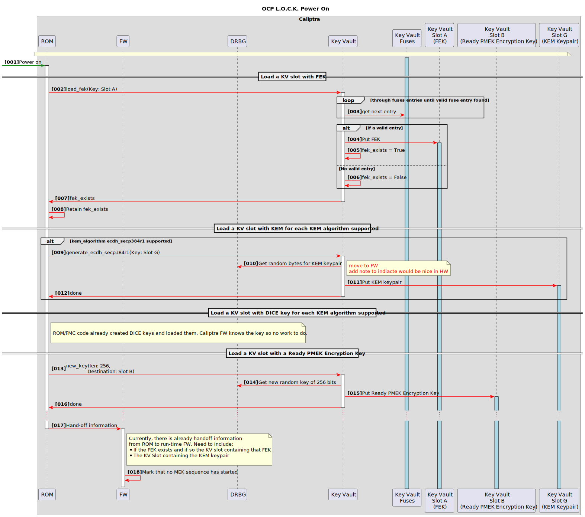
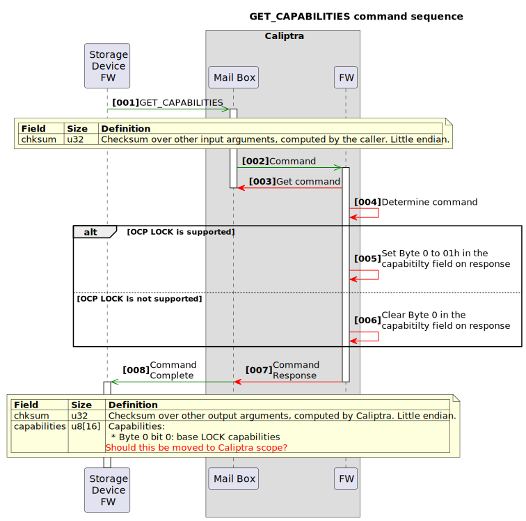
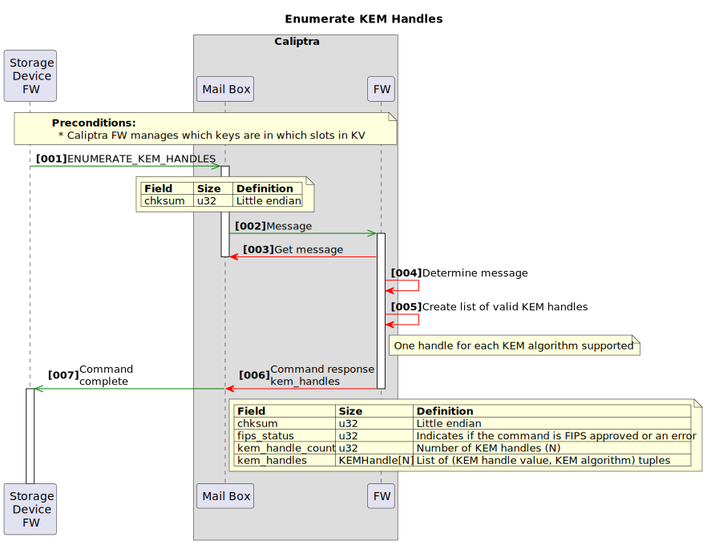

# Diagrams

The following diagrams illustrate the OCP L.O.C.K. commands.

To regenerate SVG files, download [PlantUML](https://plantuml.com/download) and run:

```
$ java -jar path/to/plant_uml.jar  -tsvg *.uml
```

## Power on




([UML source](./power_on.uml))

## Get status


([UML source](./get_status.uml))

## Get capabilities




([UML source](./get_capabilities.uml))

## Get algorithms


([UML source](./get_algorithms.uml))

## Enumerate KEM handles




([UML source](./enumerate_kem_handles.uml))

## Endorse encapsulation pub key


([UML source](./endorse_encapsulation_pub_key.uml))

## Generate PMEK


([UML source](./generate_pmek.uml))

## Unlock PMEK


([UML source](./unlock_pmek.uml))

## Rewrap PMEK


([UML source](./rewrap_pmek.uml))

## Include PMEK


([UML source](./include_pmek.uml))

## Load MEK


([UML source](./load_mek.uml))

## Receive MEK from Caliptra


([UML source](./load_mek_into_ee.uml))

## Unload MEK


([UML source](./unload_mek.uml))

## Clear key cache


([UML source](./clear_key_cache.uml))

## Rotate Encapsulation Key


([UML source](./rotate_encapsulation_key.uml))

## Mix external entropy


([UML source](./mix_external_entropy.uml))
