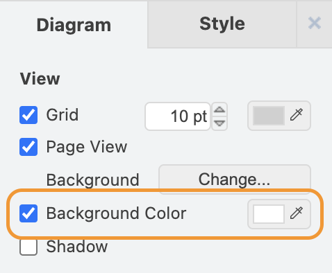

# Documentation build instructions

## Edit diagrams

Many diagrams in the specification are generated using draw.io. These can be edited with the [Draw.io Integration](https://marketplace.visualstudio.com/items?itemName=hediet.vscode-drawio) Visual Studio Code extension.

When creating new diagrams, be sure to enable a white background. Otherwise, the diagram will not be legible to viewers with dark mode enabled.

<p align="center">
  
</p>

## Render UML

To generate SVG files from the UML diagrams, download [PlantUML](https://plantuml.com/download) and run:

```
$ java -jar path/to/plant_uml.jar -Ddoc_gen-=1 -tsvg diagrams/*.uml
```

## Render Markdown

To render the specification in HTML or PDF, use the [Markdown PDF](https://marketplace.visualstudio.com/items?itemName=yzane.markdown-pdf) Visual Studio Code extension.

The table of contents requires [this](./extension.js.patch) patch. To apply it, first [locate](https://code.visualstudio.com/api/working-with-extensions/publishing-extension#your-extension-folder) the extension folder, and then run:

```
patch -b path/to/yzane.markdown-pdf/extension.js path/to/doc-build/extension.js.patch
```

Once the patch has been applied, reload Visual Studio Code for the change to take effect, by either restarting the program or opening the command pallette and executing the "Developer: Reload Window" command.